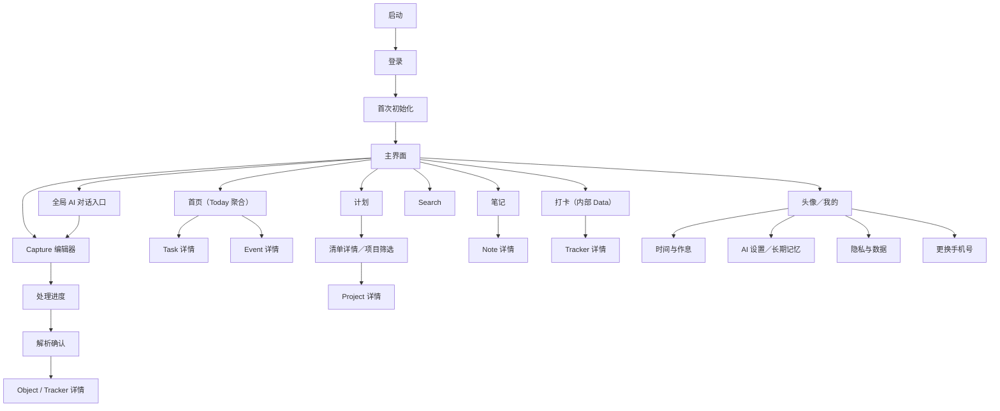
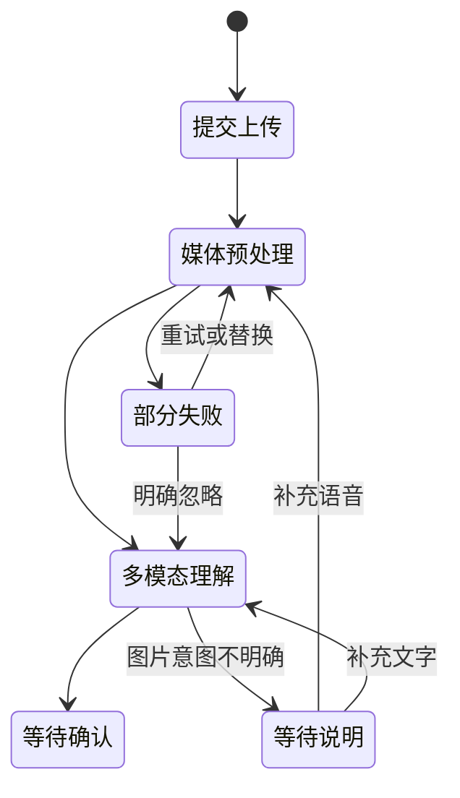

# 产品设计说明

## 0. 文档信息

| 项目 | 内容 |
|---|---|
| 文档类型 | 产品设计与交互说明 |
| 需求依据 | `功能规格说明.md` |
| 目标平台 | iOS / Android 手机端 |
| 目标读者 | 产品、交互、视觉、客户端、服务端、AI、测试 |
| 当前状态 | 评审稿 |
| 更新日期 | 2026-08-19 |

本文定义页面结构、操作路径、组件状态、反馈方式和视觉规则。功能规格决定“系统必须做什么”，本文决定“用户如何看到并完成这些功能”。出现冲突时，以功能规格中的业务规则为准，并同步修订本文。

---

# 1. 设计目标与原则

## 1.1 核心体验目标

用户不需要先判断信息属于日历、任务、项目、笔记还是数据，只需要通过 `＋` 提交内容，系统完成：

```text
输入 → 理解 → 确认 → 进入管理系统 → 执行与复盘
```

设计必须让用户始终清楚四件事：

1. 我刚刚提交了什么。
2. AI 理解成了什么。
3. 哪些是确定事实，哪些是不确定信息或 AI 建议。
4. 点击保存后，系统具体会创建或修改什么。

## 1.2 设计原则

### 输入优先

- `＋ Capture` 是全局最强操作，任何一级页面一键可达。
- 输入页不要求先选 Task、Event、Project 等类型。
- 文字、语音、图片共用一个编辑器，不拆成多个孤立入口。
- 需要 AI 理解的通用 Task、Event、Project、Note 和 Record 创建必须经过 Capture 理解与确认，不能用隐藏上下文强制 AI 类型。用户明确选择“新建任务”时，可以进入字段全部可见的确定性 Task 表单；从 TaskList 或“随时可做”进入时只预选可见上下文，用户仍可修改。其他确定性专用场景也可以使用专用表单，例如“新建行程”固定创建 `project_kind=trip` 的 Project；手工与 AI 两条路径都必须由用户主动确认。
- 每个新增用户功能在设计时必须同时定义对应的 AI 能力和入口，优先嵌入用户正在操作的页面，不额外堆叠说明卡。写入类能力统一展示可编辑候选或 Proposal，确认后再执行正式 Command；手工路径仍须完整可用。

### 管理优先于聊天

- AI 是嵌入式能力，不以聊天窗口作为主要产品形态。
- AI 输出优先呈现为可编辑字段、候选 Object、建议和来源。
- 自然语言搜索允许问答，但回答必须回到实际 Object 或 Record。

### 确定与推断分开

- 用户明确输入、媒体提取结果和 AI 建议使用不同标签。
- 冲突与低置信度字段在保存前解决。
- AI 不静默创建、覆盖或安排高影响内容。
- 未确认内容只存在于 Capture 临时处理流程和“最近输入”，不进入 Today、计划、笔记、数据、Project 聚合或搜索。
- 没有日期的明确任务可以作为正式 Task 保存；“随时可做”是无日期任务的智能清单，不表示内容仍待确认。

### 每屏一个主要决定

- 页面只突出一个主操作。
- 次要操作进入菜单、底部操作面板或详情页。
- 不在一个页面同时堆叠大量解释、设置和编辑入口。
- 列表页以“标题、异常状态、唯一下一步”为默认信息密度；来源证据、规则解释和次要操作按需进入详情或更多菜单。
- 默认不使用说明型副标题；标题、状态或控件已经表达含义时直接省略。只有影响当前决策、异常处理、数据用途或安全后果的信息才显示说明。

### 结果可撤销、来源可追溯

- 批量保存后立即提供撤销。
- AI 创建或更新的字段可以定位到文字、录音或图片来源。
- 删除、忽略和覆盖必须说明影响范围。

### 日常使用要安静

- Today 聚焦真正需要关注的内容，不展示无关统计。
- AI Brief 最多 3 条，没有有效建议时不凑数。
- 通知按明确触发条件发送，不使用营销式紧迫文案。

---

# 2. 信息架构

## 2.1 一级导航

登录后底部固定四个一级入口，中央放置全局新增操作：

| 导航 | 核心任务 | 默认内容 |
|---|---|---|
| 首页 | 决定现在和今天做什么 | 生活场景快捷入口、Today Tasks、Daily Brief |
| 计划 | 管理行动和时间 | Task、Event；TaskList 与 Project 作为组织维度 |
| 笔记 | 保存和整理信息 | Note、图片、附件、标签和 Project 关联 |
| 打卡 | 完成日常记录并查看变化 | 今日待打卡、Tracker、Record、趋势和 Data Summary |

全局能力：

- `＋ 新增`：位于底栏视觉中心并高于导航面，打开统一 Capture 编辑器；它是主操作而不是第五个一级页面。
- 底栏与中央新增按钮使用同一套克制的玻璃材质：iOS 26+ 使用系统原生玻璃效果，Android、Web 与旧版 iOS 使用高不透明度浅色降级；开启“降低透明度”时切换为实色。玻璃效果不得降低图标、标签和主操作的对比度，也不得遮挡页面末尾内容。
- Project：从计划的清单详情中按状态筛选；轻点具体 Project 筛选任务，长按进入详情。它是聚合 Task、Event、Note 和 Record 的跨内容归属容器，不与待办、日程内容类型平级，也不在计划首屏常驻。
- 我的：只从“首页”左上角小头像进入，不占底栏；直接收纳使用习惯、AI、隐私和账号，不再通过“全部设置”增加中转层。Review 统一从首页“复盘”场景进入，不在“我的”重复展示。
- 页面顶部不常驻放大镜和铃铛；搜索随各模块筛选面板出现，产品内提醒在有内容时使用轻量入口。
- 底栏面向用户的名称全部使用中文；“打卡”的内部路由与领域名继续使用稳定的 `data`、Data、Tracker 和 Record，英文名只保留在代码、契约和内部文档映射中。

## 2.2 页面树



## 2.3 导航规则

- 一级导航之间保留各自滚动位置和筛选状态。
- 用户从计划切换到其他一级页面后，再回到计划时进入计划首页；今天、明天、已完成、随时可做和具体清单等页内临时视图不跨一级页面保留。打开任务详情、日历、Capture 等二级流程后原路返回时，计划页位置与进入前状态仍然保留。
- 从通知、搜索或来源链接打开详情页时，返回操作回到原入口。
- Capture 提交后即使用户离开，处理仍继续；`＋ 新增 → 最近输入`、全局 AI 对话入口和必要的产品内通知显示最新状态。
- 未确认的 Capture 不占用正式 Object 详情路径。
- Today、计划、笔记、数据、Project 聚合和搜索只展示已经确认保存的正式内容。
- 所有详情页支持系统返回手势；有未保存编辑时先确认是否放弃。

---

# 3. 全局交互模型

## 3.1 页面层级

| 层级 | 用途 | 呈现方式 |
|---|---|---|
| 一级页 | 日常浏览与主任务 | 底部导航 |
| 二级页 | Object、Tracker、Review、搜索 | 全屏压栈 |
| 编辑页 | 创建或修改结构化内容 | 全屏压栈，顶部取消／保存 |
| 快捷决策 | 延期、改状态、选择 Project | 底部操作面板 |
| 高风险确认 | 删除账号、永久删除、忽略失败输入 | 模态确认框 |
| 即时反馈 | 保存、撤销、轻量错误 | 底部 Snackbar |

## 3.2 主操作规则

- 一个页面最多一个实心主按钮。
- 页面主按钮固定在内容底部时，必须避开系统安全区和键盘。
- 长表单中主按钮可固定在底部；按钮上方使用渐隐遮罩提示仍可滚动。
- 破坏性操作使用红色文字或红色按钮，并与主操作保持足够距离。
- 禁用按钮旁必须有可理解原因，不能只降低透明度。

## 3.2.1 全局 AI 待答入口

AI 主动向用户提问时，采用“有事才出现”的独立悬浮入口：使用约 56×56 的暖色叠页管家形象，由杏橙前页、日光黄后页和一对清晰的大眼睛组成，以错位纸页表达“接收并整理事务”。形象保持透明背景，不增加绿色圆底、星芒、对勾、嘴或四肢；右上角使用红色数量角标，与中央纯色 `＋` 明确区分。角标只显示尚未处理的待答、处理完成或待确认总数，超过 9 显示 `9+`；入口初始位于底栏右上方，可在安全区内拖动，松手后以 200ms 缓出动画吸附到最近的左／右边缘。同一 App 会话内保存停靠侧与相对高度，页面切换或尺寸变化后仍保持可见；移动阈值为 8dp，拖动结束不能误触打开对话。无待答、处理或待确认事项时整个入口消失。中央 `＋` 只负责新增，不显示红点、数字或 AI 状态。形象不使用宠物设定、持续呼吸动画或自动展开气泡。

点击后使用聊天式底部面板，形成一条可继续的对话流：

1. 顶部只显示“AI 管家”和当前状态；不把标题写成警告或营销提醒。
2. 对话区先显示用户原始输入的最小摘要，再显示 AI 的具体问题，不回显完整隐私内容。
3. AI 消息下优先给出 2～3 个快捷答案；底部保留文字输入、图片入口、语音按钮和发送按钮。图片入口按需提供拍照和相册，选中后在输入框上方显示可删除预览，最多 9 张。
4. 关闭面板等同于稍后回复，问题仍跨页面保留；从对话面板发送的图片继续进入统一 Capture 处理和确认，不在 Assistant Turn 中复制媒体协议或直接写正式内容。
5. 回答以右侧用户消息追加；处理中在左侧显示输入状态，完成后追加结构化结果消息，唯一主操作是“查看并确认”。
6. 最终仍进入 Capture Confirmation；AI 的回答合并结果不能直接写入正式模块。

多个问题按阻塞程度和时间排序，每次只在对话中处理一个；数量只在对话面板内部展示，不挂到中央 `＋`。Capture 编辑器自身已是输入面，因此将同一问题显示为“AI 等你补充”的最近输入条目，不再叠加悬浮球。

入口必须具有包含当前状态的完整无障碍名称，快捷答案和语音结果通过 `aria-live` 宣告；悬浮球不能遮挡最后一项内容，滚动容器需增加等量底部安全空间。

## 3.2.2 通用 Assistant 对话消息

- 用户消息按纯文本展示，不解释其中的 Markdown 标记，避免用户输入意外改变气泡结构。
- Assistant 最终消息使用受限 Markdown 渲染，只开放段落、粗体、斜体、列表、标题、引用、代码和 HTTPS 链接；标题缩放到对话正文层级，不在窄面板中制造文档式大标题。
- 原始 HTML 不参与渲染，远程图片不自动加载，表格不在消息气泡中展开；图片仅显示替代说明，复杂结构化结果使用产品组件承载。
- 流式生成阶段优先保证文字稳定可读，按纯文本展示；消息完成并从服务端读取后再启用 Markdown，避免未闭合标记造成布局闪烁。
- Action Proposal、来源和确认动作继续使用独立结构化组件，不能编码进 Markdown 文本绕过确认流程。

## 3.2.3 通用 Assistant 对话连续性

- 从全局入口打开时默认恢复用户所在时区“今天”最近使用的对话；恢复查询完成前显示轻量加载状态，不能先出现空卡片再突然跳入历史消息。
- 今天尚未说过话时显示引导型空状态，但不创建空 Thread；发送第一条消息后才建立当天对话。
- 顶部提供符合现有图标按钮规范的“新对话”操作。点击后立即进入干净输入状态，只有用户实际发送时才以 `force_new=true` 创建 Thread；回复生成期间禁用该操作。
- 用户从历史列表进入时展示指定 Thread，不被“今天的对话”自动替换；该 Thread 当天收到新用户消息后，下一次从全局入口打开应恢复它。
- 历史列表保留全部非空 Thread。每天一个对话只是默认连续性策略，不是禁止用户按主题拆分对话。

## 3.3 Object 卡片

统一 Object 卡片包含：

1. 类型图标和类型名称。
2. 标题。
3. 最重要的时间或状态信息。
4. 所属 Project（存在时）。
5. 风险、冲突、低置信度或来源提示。
6. 与当前场景相关的最多 2 个快捷操作。

卡片不展示所有字段。点击卡片进入详情；长按不承载唯一功能，避免可发现性差。

## 3.4 AI 内容标识

| 内容来源 | 标签 | 视觉处理 |
|---|---|---|
| 用户明确输入 | 用户输入 | 默认文本，不额外着色 |
| 图片或语音提取 | 已提取 | 中性描边标签，可查看来源 |
| AI 建议 | AI 建议 | 绿色浅底标签，必须有简短原因 |
| 低置信度 | 请确认 | 黄色浅底和警示图标 |
| 输入冲突 | 有冲突 | 红橙浅底，保存前必须处理 |

颜色不能是唯一信息；标签必须同时包含文字或图标。

## 3.5 时间表达

- 相对时间只用于提示，例如“还有 28 分钟”。
- 可编辑字段和确认页同时显示绝对日期，例如“8 月 18 日 周二 15:00”。
- 只有日期的截止日显示“8 月 18 日截止”，不显示虚构的 `23:59`。
- 全天 Event 显示“全天”；多日 Event 显示完整日期范围。
- 跨时区 Event 在详情中显示事件时区和本地换算时间。

## 3.6 反馈时长

| 操作 | 反馈 |
|---|---|
| 普通保存 | 立即更新界面，并显示 2～3 秒成功提示 |
| Capture 批量保存 | 显示结果摘要和 10 秒撤销入口 |
| 预计超过 1 秒 | 显示明确阶段，不使用只有转圈的空白页 |
| 预计超过 10 秒 | 允许离开页面，说明后台继续处理 |
| 失败 | 保留用户输入，指出失败对象和恢复动作 |

---

# 4. 视觉设计系统

## 4.1 视觉方向

整体风格是“安静、可信、清晰的个人事务台”，避免聊天机器人、复杂企业后台和娱乐化 AI 视觉。

- 大面积使用白色背景、浅灰输入面和清晰留白，以清新的薄荷绿色建立操作识别。
- 信息密度以手机单手操作为准，不用桌面表格硬塞字段。
- AI 元素只在需要解释来源、待答问题或建议时出现；全局 AI 待答入口和对话头像统一使用暖色叠页管家资产，其余 AI 标签和面板继续沿用品牌绿的纯色轻量表达。
- 层级主要依靠字号、间距和分组，不依赖重阴影。
- 分区标题依靠稳定字号、字重和间距建立节奏；同一页面只允许 1～2 个重点面板。
- 连续同类内容使用一个成组列表和浅分隔线，不把每条信息做成独立大卡片。
- AI 建议沿用品牌绿的浅色层级，不额外引入独立的“AI 专属皮肤”。

## 4.2 色彩 Token

以下为首版基准色，客户端只使用语义 Token，不在页面中直接写颜色值。

### 唯一品牌主题

| Token | 色值 | 用途 |
|---|---|---|
| `canvas` | `#FFFFFF` | 页面背景 |
| `surface` | `#FFFFFF` | 表单、卡片和浮层 |
| `surface_subtle` | `#F3F4F6` | 输入框、次级分组和禁用面 |
| `surface_green` | `#ECFBF3` | 今日进度、AI 建议和绿色重点面板 |
| `text_primary` | `#1A1D1C` | 主文本 |
| `text_secondary` | `#6B7280` | 辅助文本 |
| `text_tertiary` | `#9CA3AF` | 占位、计数和弱提示 |
| `border` | `#E5E7EB` | 分隔线和卡片描边 |
| `primary` | `#10B981` | 主按钮、选中态、进度和品牌图标 |
| `primary_strong` | `#047857` | 小字号绿色文字和需要 AA 对比度的操作文本 |
| `primary_soft` | `#ECFBF3` | 主色浅背景 |
| `primary_track` | `#DFF3E8` | 进度轨道和弱选中背景 |
| `ai_character_coral` | `#F47F63` | AI 叠页管家前页，仅用于角色资产 |
| `ai_character_yellow` | `#F6C954` | AI 叠页管家后页，仅用于角色资产 |
| `ai_character_ink` | `#3B302C` | AI 叠页管家五官与细节，仅用于角色资产 |
| `ai_soft` | `#ECFBF3` | AI 建议背景 |
| `info` | `#3B82F6` | 信息、工作类辅助标识 |
| `success` | `#10B981` | 完成与成功 |
| `warning` | `#F59E0B` | 低置信度和提醒 |
| `danger` | `#EF4444` | 冲突、删除、失败和未读角标 |

产品不提供深色模式或主题切换入口；系统深色偏好不改变 App 主题。这样可以保证品牌色、信息层级和跨端截图始终一致。

正文与背景对比度必须达到 WCAG AA；小号文字至少 4.5:1。最终色值以自动对比度测试结果为准，只允许微调，不改变语义角色。

## 4.3 字体与字号

### 字体家族

- 产品主字体使用 `Noto Sans SC`，延续当前设计稿的中文字面、字重和行高；不为标题额外引入展示字体。
- 状态栏、时间和连续数字可以使用 `Inter`，业务正文、按钮和表单仍使用 `Noto Sans SC`。
- iOS、Android 客户端均随 App 提供经裁剪的 `Noto Sans SC` 字重资源；字体加载失败时依次回退 `PingFang SC`、`Noto Sans CJK SC`、系统无衬线字体。
- Web 原型：`"Noto Sans SC", "PingFang SC", "Microsoft YaHei", system-ui, sans-serif`；纯数字区域可使用 `Inter`。

### 语义字号 Token

产品界面使用固定语义字号，不允许 Feature 自行增加 15、17、19、21、22 等临时字号。以下数值是 393pt 基准宽度下的设计基准；正式客户端映射为支持动态缩放的语义文本样式。

| Token | 字号 / 行高 | 字重 | 用途 |
|---|---:|---:|---|
| `text_page` | 28 / 40 | Bold 700 | 一级页左对齐大标题 |
| `text_detail` | 22 / 32 | Semibold 600 | 详情页内容标题 |
| `text_section` | 16 / 23 | Semibold 600 | 分区标题、设置分组标题 |
| `text_body` | 15 / 22 | Regular 400 或 Semibold 600 | 列表主标题、短正文；同一角色只用字重区分强调 |
| `text_label` | 14 / 20 | Medium 500 | 按钮、筛选、辅助操作 |
| `text_meta` | 13 / 19 | Regular 400 | 日期、归属、来源和次级说明 |
| `text_caption` | 10 / 14 | Medium 500 | 底部导航、紧凑状态；不得承载长句 |
| `text_metric` | 24 / 30 | Semibold 600 | 数据页关键数值，启用等宽数字 |
| `text_input` | 16 / 24 | Regular 400 | 输入框、长正文和需要持续阅读的内容 |

### 使用规则

- 字重只使用 Regular 400、Medium 500、Semibold 600；Bold 700 用于一级页标题和极少数关键结果，不在普通列表中使用。
- 页面层级优先通过 `28 → 22 → 16 → 15 → 13` 建立，不依靠同一层级相差 1px 的字号制造区别。
- 标题字距为 `-0.01em`～`-0.015em`，正文使用正常字距；中文不使用大幅负字距。
- 时间、金额、百分比和连续数值启用 `tabular-nums`，保证纵向比较时数字对齐。
- 输入框和阅读型正文不小于 16；11～13 只用于短标签与补充信息。
- 支持系统动态字号至至少 200%，不锁死文字容器高度；放大后允许标题和辅助信息换行。
- 小号文字与背景对比度至少 4.5:1，不以浅灰色代替字号层级。

## 4.4 间距、圆角和触控

- 基础间距单位为 4；常用间距为 8、12、16、24、32。
- 页面左右安全边距为 16；详情正文和长表单可使用 20～24。
- 顶部筛选栏与其后第一个分区标题之间保留 20 的垂直间距；筛选下划线不得与分区标题共用同一行或贴边显示。
- 常规卡片圆角 16，重点面板圆角 20，输入框和主按钮圆角 14；胶囊圆角只用于筛选、标签、状态和 56×56 的圆形悬浮按钮。
- 列表内容筛选统一使用公共 `FilterChip` 紧凑胶囊：视觉高度 34，未选中为浅灰底和次级文字，选中为浅绿底和深绿文字。一级页面页签继续使用下划线，连体选项继续使用分段控件；数量徽标、内容标签和业务状态不复用筛选胶囊。
- 普通主按钮统一为 52 高，紧凑按钮为 44 高；“开始运动”“开始专注”等高频场景启动操作可以使用 54 高，但不得在普通保存、确认操作中自行增加新高度。
- 最小触控区域为 44×44 pt/dp。
- 同类列表项共用一个 `surface` 容器并使用浅分隔线，不堆叠厚重卡片或“卡片套卡片”。
- 分段选择、滑杆、开关、日期时间等标准输入优先使用成熟的跨平台或平台原生组件，并由 `packages/ui` 适配品牌色、尺寸和无障碍语义；Feature 不自行复刻系统控件。

## 4.5 图标与动效

- App 内通用操作、一级导航和领域对象统一使用 `Hugeicons Free` 的 `Stroke Rounded` 图标，默认线宽为 1.8；运动模式也使用同一字形体系，不再额外混入其他图标库。
- 所有图标都由公共 `Icon` 语义适配层控制名称、可视尺寸、基线、粗细和语义色；Feature 不直接导入 Hugeicons，也不自行绘制或维护 SVG。底层图标的具体导出名不得进入业务数据或网络契约。
- 图标必须配合无障碍标签；不使用图标单独表达罕见动作。
- 页面切换使用平台原生过渡。
- 状态变化动效控制在 150～250 ms。
- 支持系统“减少动态效果”；开启后取消位移和连续脉冲，只保留淡入淡出。

---

# 5. 全局组件

## 5.1 `AppHeader`

变体：

- 今日：视觉尺寸 40×40、命中区域 44×44 的绿色圆形头像，配合 28 号页面标题和 13 号日期；头像进入“我的”，不固定放置搜索或通知图标。
- 计划、笔记、数据：使用与今日同高的 28 号页面标题和 13 号摘要；右侧只显示当前页面确有用途的文字操作。
- 详情页：返回、标题、更多菜单。
- 编辑页：取消、页面标题、保存。

长标题单行截断，完整标题在详情内容中再次显示。

## 5.2 `CaptureFab`

- 视觉：56×56 圆形按钮，`primary` 纯色背景、白色 `＋`、2px 白色外环和受控的绿色柔和投影；四个一级页位置保持一致。
- 无障碍名称：“新增并整理”。
- 点击打开统一 Capture 编辑器。
- 滚动时可以缩成圆形，但不得完全消失。
- 键盘弹出、编辑页、确认页和系统模态层中隐藏。

## 5.3 `ObjectCard`

变体：`compact`、`standard`、`confirmation`、`source`。

必须通过 `type` 决定图标和字段布局，但不使用完全不同的卡片骨架，避免用户重新学习。

## 5.4 `ConfidenceField`

组成：字段标签、值、置信度状态、来源按钮和编辑入口。

- 高置信度：正常显示。
- 中置信度：黄色“请确认”。
- 低置信度：显示空值或候选选项，不预选确定值。
- 冲突：并列选项，选择后显示采用来源。

## 5.5 `SourceViewer`

- 文字：高亮对应片段。
- 语音：从对应时间点播放，并显示转写。
- 图片：打开大图，框选或高亮对应区域。
- 单个原始资产已删除：显示允许保留的确认文本／转写／OCR 与“原始资产已删除”。
- 完整 Capture 已删除：只显示来源类型、发生时间和“原始内容已删除”，不得回显删除前文字或派生内容。

## 5.6 `StatePanel`

统一承载空状态、失败、权限不足和部分失败：

- 一句状态标题。
- 一句解释。
- 一个主动作。
- 可选次动作。
- 不使用无意义插画占据首屏。

## 5.7 `UndoSnackbar`

- 显示“已保存 4 项”。
- 操作为“撤销”，倒计时 10 秒。
- 页面跳转后仍在全局层显示。
- 撤销需要二次确认时，点击后打开影响说明。

---

# 6. 登录与首次初始化

## 6.1 登录页

页面顺序：

1. 产品名称和一句价值说明。
2. 手机号输入。
3. 未默认勾选的“我已阅读并同意《用户协议》和《隐私政策》”；两个标题打开公开 H5。
4. 验证码发送按钮。
5. 验证码输入。
6. 登录按钮。

用户未确认协议时不发送验证码，禁用状态和读屏提示必须说明原因。打开 H5、加载失败或从浏览器返回时保留手机号和当前勾选状态；法律页面暂时不可用时不能把用户误标为已经同意。服务协议确认不替代媒体、精确位置或第三方 AI 等场景的单独告知。

当前正式主路径始终为手机号加短信验证码。手机号输入声明系统电话自动填充语义，验证码输入声明一次性验证码自动填充语义；自动填充结果仍必须经正式登录接口校验。测试环境可以自动填入后端返回的固定验证码，生产环境不得回传验证码。

“本机号码一键登录”只有在以下条件全部满足时才显示：iOS／Android 号码认证原生 SDK 与授权页已接入，服务端具备运营商 Token 换号与会话签发契约，客户端环境检测与服务端 capability 均可用，隐私与运营商协议可查看，并完成三网真机、双卡、无 SIM、Wi-Fi／蜂窝切换、取消、超时和短信降级测试。任一条件不满足时直接展示短信登录，不显示不可用按钮或先闪现再隐藏。

状态：

- 手机号格式错误：输入框下方就地提示。
- 验证码发送中：按钮显示倒计时，不阻塞手机号修改提示。
- 验证码错误或过期：保留手机号，聚焦验证码输入。
- 网络失败：保留全部已输入内容。
- 测试环境：获取成功后自动填入后端返回的测试验证码；生产环境仍提示查收短信。

## 6.2 初始化流程

采用四步进度，不展示复杂功能介绍：

1. 主要用途：最多选择 3 项。
2. 工作时间：开始、结束、周末偏好。
3. 默认提醒：Event 提醒时间。
4. 第一次 Capture：默认突出语音入口，也允许切换文字、图片或图片组合；打开页面不自动录音。

- 顶部显示 `1/4` 等进度。
- 每一步支持返回，不丢失已填内容。
- 最后一步可跳过，进入空 Today。
- AI 或网络失败时显示“稍后体验”，不锁住用户。

---

# 7. Capture 设计

## 7.1 聊天式快捷输入

点击底栏中央 `＋ 新增` 后，保持当前页面作为背景，从底部弹出输入面板，不跳转到全屏编辑页。面板结构从上到下：

1. 顶部：拖动条、标题“记一件事”和关闭按钮，不放常驻副标题。
2. 默认语音态：中间只显示大号麦克风与“点击说话”，图片和键盘放在底部作为次要入口。
3. 文字态：中间显示多行输入框，图片和麦克风放在底部作为次要入口。
4. 图片预览区仅在添加图片后出现，可排序、替换、删除；点击图片入口后再展示“拍照／从相册选择”。
5. 录音、暂停、语音草稿和媒体上传状态按当前阶段渐进出现，不在未开始状态提前展示全部控制。
6. “发送并整理”使用带文字的主按钮，只在已有文字、图片或录音草稿时出现。
7. 隐私与限制提示仅在已选择图片或录音时显示一句简短提示；完整告知放在首次发送媒体的确认面板。
8. 通用空白面板的底部输入工具栏在“图片”“键盘”旁提供同规格“新建任务”，直接进入确定性 Task 表单；它不使用脱离工具栏的文字链接，也不与语音主操作争夺层级。一旦已有文字、图片或录音就隐藏，行程等专用 Capture 上下文也不显示。中央 `＋` 本身不展开类型选择菜单。

输入面板不显示欢迎文案、示例、副标题、输入规则或“当前模式”文字；发送按钮仅在文字、语音或图片至少存在一项时出现。面板按实际内容自适应高度，默认态保持紧凑，键盘或媒体内容展开后再增高。点击关闭按钮或系统返回时，有内容则让用户选择“保存草稿／放弃输入／继续编辑”，无内容则直接关闭。

文字与语音互斥：

- 已有文字后点击录音，出现“录音将替换当前文字输入”的底部面板。
- 已有录音后切换文字，出现“文字将替换当前录音”的底部面板。
- 用户修订语音转写不改变输入模式。

## 7.2 图片预览

- 最多 9 张，横向缩略图列表。
- 每张标记顺序编号。
- 点击查看大图；长按进入排序，也提供明确的“调整顺序”按钮保障可发现性。
- 模糊、过暗、反光或严重裁切时，在对应缩略图显示警告角标。
- 达到 9 张后，拍照和相册入口保留但禁用，并解释上限。

## 7.3 录音状态

| 状态 | 页面表现 | 操作 |
|---|---|---|
| 未开始 | 大号麦克风与“点击说话” | 点击后申请权限并开始录音 |
| 录音中 | 状态、波形和时长 | 暂停、完成、取消 |
| 已暂停 | 暂停状态、波形和累计时长 | 继续、完成、取消 |
| 已结束 | 可播放的语音草稿、时长 | 试听、重录、删除、发送整理 |
| 权限拒绝 | 简短错误状态 | 去设置、改用文字 |

录音结束只形成保存在设备上的语音草稿，不上传、不自动提交 Capture。用户可以试听、重录、继续添加或调整图片，再点击“发送并整理”；提交后才上传并启动转写，转写内容在处理或确认阶段可修改。App 切到后台、来电或音频会话中断时自动暂停并保留当前录音草稿。

## 7.4 媒体授权说明

首次提交音频或图片前显示一次说明：

> 为了识别内容，图片或录音会被上传并用于本次 AI 整理。你可以在设置中选择确认或放弃后自动删除原始文件。

操作：

- 主操作：“同意并继续”。
- 次操作：“返回编辑”。

不能把“同意”与产品服务协议捆绑成默认勾选。

## 7.5 处理进度页



页面逐项展示：

- 文字已读取。
- 语音正在转写／已转写／失败。
- 图片 1～N 正在识别／已识别／失败。
- 正在生成 Task、Event 等候选结果。

用户离开时显示简短说明：“可以先去处理其他事情，完成后会通知你确认。”用户也可以从 `＋ 新增 → 最近输入` 恢复本次处理；在确认保存前，不得出现在计划、笔记或数据页面。

## 7.6 部分失败

失败项以图片编号或录音名称单独列出，每项提供：

- 重试。
- 替换。
- 删除。

页面底部提供“忽略失败项并继续”。点击后必须再次说明：

> 最终结果不会包含图片 2。你可以稍后重新提交它。

用户确认后进入解析，并在确认页保持警告。

## 7.7 仅图片且意图不明确

显示原图预览与问题：

> 你希望我如何处理这些图片？

快捷建议：

- 提取待办。
- 加入日程。
- 保存信息。
- 记录数据。

同时允许输入文字或录音。快捷建议只是补充意图，仍需进入解析确认。

## 7.8 Revision 操作规则

只要提交后的输入内容发生变化，就在同一个 Capture 下创建新 revision；旧 revision 及其候选结果立即变为只读并退出当前确认流程。

| 操作 | 是否创建新 revision | 下一状态 | 旧候选处理 | 完成后返回 |
|---|---:|---|---|---|
| 修改原始文字 | 是 | `parsing` | 立即失效 | 新 revision 处理页 |
| 修改语音转写 | 是 | `parsing` | 立即失效 | 新 revision 处理页 |
| 增加、替换或删除图片 | 是 | `preprocessing` | 立即失效 | 新 revision 处理页 |
| 调整图片顺序 | 是 | `preprocessing` | 立即失效 | 新 revision 处理页 |
| 用文字补充图片处理意图 | 是 | `parsing` | 原 revision 无候选或失效 | 新 revision 处理页 |
| 用语音补充图片处理意图 | 是 | `preprocessing` | 原 revision 无候选或失效 | 新 revision 处理页 |
| 原样重试失败图片或录音 | 否 | `preprocessing` | 尚未生成则无影响 | 当前 revision 处理页 |
| 用新媒体替换失败项 | 是 | `preprocessing` | 立即失效 | 新 revision 处理页 |
| 删除失败项 | 是 | `preprocessing`；只剩文字时进入 `parsing` | 立即失效 | 新 revision 处理页 |
| 明确忽略失败项 | 否 | `parsing` | 保留 ignored 警告 | 当前 revision 处理页 |

交互规则：

- 在确认页点击“修改原始输入”时，先显示“重新解析会替换当前识别结果”。
- 用户确认后进入编辑器，顶部显示“正在修改这次输入”。
- 新 revision 提交后不能返回旧候选继续保存；系统返回旧页面时自动跳转到最新处理状态。
- 处理失败返回编辑器时保留新 revision 的输入，不恢复更早内容。
- Revision 编号属于内部信息，普通用户只看到“内容已更新，正在重新整理”。

---

# 8. Capture Confirmation 设计

## 8.1 页面布局

页面由五部分组成：

1. 摘要：“识别到 1 个项目、2 个日程、3 个任务”。
2. 冲突和全局警告。
3. 按语义分组的 Tracker / Object 候选列表。
4. 原始输入与来源查看入口。
5. 固定底部保存栏。

底部保存栏显示：

- 已选择实体数。
- 尚未解决的问题数。
- 主按钮，例如“保存 6 项”。

## 8.2 候选条目

所有候选共用一个成组列表容器，以浅分隔线区分条目；不得为每个候选再创建独立悬浮大卡片。

条目头部：勾选框、类型、标题、删除。

条目正文：

- 关键字段直接展示。
- 点击字段进入就地编辑或底部选择器。
- 中低置信度字段展开显示“请确认”。
- Project 归属和 Relation 以关联行展示。

切换类型时：

- 只保留目标类型支持的字段。
- 丢弃字段前展示影响，例如 Event 改 Task 将移除地点和参与人。
- 用户确认后再切换。

## 8.3 冲突处理

冲突块并列展示值与来源：

```text
日期有冲突

○ 8 月 18 日 14:00　图片 1
○ 8 月 19 日下午　　文字说明
```

- 不预选任一冲突值。
- 用户可以选择其中一个或手动输入新值。
- 用户明确说“图片写错了，按 19 日”时，直接采用 19 日，并显示“已按你的说明覆盖图片内容”。

## 8.4 依赖联动

- 选中依赖新 Tracker 的 Record 时，自动选中 Tracker。
- 用户取消该 Tracker 时，底部面板要求选择“同时取消相关 Record”或“将 Record 改到已有记录模板”；未完成选择前保持原勾选状态。
- 取消候选 Project 时，询问保留关联 Object 还是一并取消。
- 选择保留关联 Object 时立即清空其 Project 归属，并在卡片上显示“未归属项目”。
- 取消 Relation 任一端候选后，关系行自动消失并说明原因。
- 更新已有实体的候选如果被其他候选依赖，取消更新时必须显示依赖项，并阻止产生无效引用。
- 联动变化立即反映在底部保存数量中。

## 8.5 重复内容

重复候选卡在顶部显示已有内容摘要和三个动作：

- 更新原内容。
- 仍然创建。
- 取消本项。

“更新原内容”打开字段差异视图：旧值在左，新值在右；不变字段折叠。保存后原创建来源保留，本次 Capture 作为更新来源追加。

## 8.6 保存与撤销

- 保存校验只针对当前已选候选：已选候选存在未解决必填字段、冲突或依赖时，主按钮禁用并显示具体数量。
- 有问题但用户不准备保存的候选可以取消勾选；取消后若其余已选候选依赖闭合，主按钮恢复可用。
- 没有选择任何新建或更新项时，主按钮禁用，并提供“返回修改输入”和“放弃这次输入”。
- 保存期间锁定当前 revision，防止重复点击。
- 保存成功后进入结果摘要；默认返回发起 Capture 的一级页。
- 全局 Snackbar 显示 10 秒撤销。

---

# 9. 首页设计（Today 聚合）

## 9.1 首屏结构

1. 小头像、页面标题“首页”和日期。
2. “今天／时光／亲友／足迹／心情”顶部标签导航。
3. “今天”分区内的 4×2 生活场景快捷入口。
4. Today Tasks。
5. AI Daily Brief。

首屏优先让用户看到快捷入口和最高优先级 Task，不能被大面积欢迎文案挤出屏幕。
“首页”是用户可见一级页面名称，Today 继续作为内部聚合领域名与稳定路由。“今天”作为日期范围、清单筛选和首页内部分区标签使用，不再作为一级页面名称。当前首页不单独展示 Event、Today Records 或最近更新；Event 进入计划的日历视图，Record 进入“打卡”模块。

### 9.1.1 顶部标签导航

- 标签使用短名称“今天、时光、亲友、足迹、心情”，保持单行并允许标签栏自身横向滚动；不把“日历相册、人物关系、旅行地图、心情花园”等完整功能名挤进窄屏导航。
- “今天、时光、足迹、心情”的当前标签继续使用品牌深绿文字与 2dp 短下划线；“亲友”分区使用浅蓝 `#3A86D8` 与深蓝 `#236DB8` 表达清透、克制的人物工具语义。非当前标签使用满足对比度的次级文字。标签栏白底、无阴影，纵向滚动时吸顶；每项高度至少 48dp，并提供按压反馈、读屏标签与选中状态。
- 标签只通过点击切换，不启用整页左右滑动。时光中的照片、亲友中的关系筛选和足迹中的地图都需要横向或连续手势，页级滑动会产生误切换。
- “今天”沿用当前首页完整内容和下拉刷新。“时光”进入照片主导的原生交互原型，“心情”进入正式私人日记；“亲友”只在开发构建中提供标记为“界面预览”的 Fixture，生产构建继续显示准备状态，不申请联系人权限、不保存人物、不调用 AI；“足迹”继续使用明确不申请定位的准备状态。
- 标签切换是页内轻量状态，冷启动默认回到“今天”；同一次 App 壳会话内切换其他底部一级页再返回时可以保留当前标签。切换标签不清空 Today Query 缓存。
- 后续视觉方向分别为：时光以日期与媒体为主，亲友以 Apple Contacts 式人物 CRM 信息密度为骨架、以克制的生活上下文提供温度，足迹以地图为主，心情以每日输入和成长反馈为主。亲友首页固定按“搜索与关系筛选 → 今天要关心 → 最近联系 → 全部亲友”组织，照片与共同时间线下沉到人物详情；不显示销售漏斗、人脉价值、关系健康分或亲密度排名。四个页面复用品牌字体与全局 Capture，不为“AI 感”引入玻璃拟态或装饰动效。

### 9.1.2 时光分区

**载体决策**：时光浏览、选图、编辑、AI 建议确认和删除均使用 React Native 原生页面。未来公开只读回忆可以单独评估 H5，但不得把媒体权限、私密编辑或写入确认迁移到远程页面。新增原生权限、第三方 AI 图片处理或正式发布时，必须同步隐私政策、个人信息／第三方清单和应用商店申报。

**视觉方向**：采用“沉浸照片流＋轻杂志日期节奏＋独立日历查找”的组合。白色背景和深色文字维持主产品基调，现有品牌绿只表达当前状态和主要操作；照片承担页面主要色彩。不得使用母婴插画、仿纸背景、装饰性时间轴、玻璃卡片、重阴影或多彩标签制造情绪。

#### 时光首页 `MEM-01`

1. 顶部复用首页标题和五项标签，标签吸顶。
2. 内容头显示当前年份；右侧提供“按日期查找”和“添加时光”两个 48dp 图标按钮。
3. 时间线按月份分组。日期数字放在左侧窄列，星期与月份作为次级信息；右侧展示照片、标题和可选正文，不绘制竖线。
4. 图片组合使用稳定比例：单图 3:2、双图等高、三张主次拼接、超过三张显示“+N”。卡片圆角不超过 16dp，图片之间使用 4dp 间隔。
5. 点击整条时光或任一照片进入详情。按压反馈只做轻微透明度变化，不缩放整组图片。
6. 无内容时显示“选择照片，留下第一段时光”，主操作为“添加照片”；不提供纯文字入口。

#### 日历查找 `MEM-02`

- 作为独立 Stack 页面从 `MEM-01` 进入。月历使用无外层大卡片的 7 列网格，不给每一天绘制方框。
- 有内容日期使用品牌绿圆点，当前选择使用细描边圆环；状态不能只靠颜色，读屏同时报告当天条目数量。
- 点击日期后在月历下方展示当天条目；无内容时显示简短空状态。长距离查找通过年份／月份选择器完成，不要求连续滑动。

#### 新建与编辑 `MEM-03`

1. 第一步必须从系统选图器选择 1～9 张照片；未选择照片时只显示选图说明和主按钮。
2. 选图后使用横向预览带显示顺序，支持移除单张；第一张默认为封面。调整顺序采用明确拖动把手或后续专门排序页，不依赖长按猜测。
3. 日期为必填且可编辑；标题、故事正文为选填。正文输入不使用只有占位符而没有标签的样式。
4. “帮我整理这段时光”生成独立 AI 建议区，清楚标记“AI 建议”；建议可以采用、编辑或忽略。手工保存按钮始终独立存在。
5. 当前原型的 AI 候选和保存只在进程内演示，页面固定说明“不会上传图片或写入云端”；正式接入后删除该原型说明并替换为真实同意与来源信息。

#### 时光详情 `MEM-04`

- 顶部先展示照片，随后展示日期、标题、正文和已经确认的关联来源；没有文字时不保留空白标题区。
- 多图详情支持横向浏览，但保留可点击缩略图和读屏操作，不把左右滑动作为唯一途径。
- 编辑、删除单图、删除整条时光使用明确动作名称；整条删除弹窗显示具体日期或标题，并使用“删除这段时光／保留时光”。

#### 动效、性能与无障碍

- 首页进入详情使用 200～240ms 的照片连续过渡或平台等价淡入；标签切换使用 160～200ms 淡入，不做弹跳。
- 用户开启减少动态效果时仅保留短淡入或立即切换。图片解码前锁定容器比例，避免时间线跳动；首屏主图优先，其余图片按可见区域加载。
- 所有操作触控范围不小于 48dp；正文与背景对比度至少 4.5:1。图片提供包含日期、序号和用户文字的读屏描述，纯装饰占位不重复播报。

### 9.1.3 心情日记页面与交互

心情分区采用“私人日记为主体、心情结构辅助书写、花园辅助回看”的方向。典型使用场景是用户在通勤途中、休息间隙或睡前，用一只手在普通或偏暗环境下快速记下一段不希望被打扰的私人文字；因此页面优先安静、可读、快速恢复草稿和明确隐私，不做仿纸张米黄色、心理咨询问诊页、可爱表情墙或持续说话的 AI 角色。

调研采用以下成熟模式，但不复制其完整产品结构：

- [Apple Journal](https://support.apple.com/guide/iphone/write-in-your-journal-iph9824e83ce/ios)证明“直接写／从一个建议开始”可以共存，且建议应由用户主动选择而不是阻塞空白编辑器。
- [Day One 的日历视图](https://dayoneapp.com/features/calendar-view/)和[日记视图说明](https://dayoneapp.com/guides/day-one-ios/journal-views-in-day-one-for-ios/)说明日期浏览、时间线和回忆重现是长期日记的核心，但当前产品只需要日期条、日历和时间线，不引入媒体／地图等多视图工具栏。
- [Grid Diary](https://griddiaryapp.com/?view=Grid)通过问题降低空白页压力；本产品把多格问卷收敛为“一次一个、随时跳过”的引导，避免让日记变成任务。
- [Reflection](https://www.reflection.app/)把保存后的追问与周／月回望作为 AI 入口；本产品进一步要求用户选择正文范围、逐篇排除和来源引用，AI 不默认占据首页。
- [Stoic](https://www.getstoic.com/features)使用早晚反思和每日问题建立习惯；本产品只保留可选问题，不采用必须完成的早晚流程、连续打卡和徽章。

#### 9.1.3.1 心情日记首页

心情标签选中后继续保留“首页”页头与吸顶顶部标签，不再重复显示第二个 28 号大标题。标签下方按以下顺序展示：

1. **今日书写区**：左侧显示“心情日记”和当天已写篇数，右侧提供标准日历与搜索图标。其下用一块无描边浅中性承载面展示“写下此刻”主操作；没有记录时文案为“今天想留下什么？”，已有记录时改为“再记一件刚刚发生的事”。主操作必须在首屏可见，不用轮播横幅或大面积插画挤走内容。
2. **最近七天日期条**：一行展示星期和日期，允许日期条自身横向滚动。选中日使用文字、浅绿底和形状共同表达；有日记的日期显示一个小实心点，不能只用花朵颜色表达。点击过去的空日期后主操作改为“补写这一天”，不会自动创建空日记。
3. **日记时间线**：默认显示选中日的全部日记，并允许切回“最近”查看跨日期倒序流。同一天多篇按 `occurred_at` 倒序，使用日期标题、时间、可读正文摘要、感受词和小型心情标记组成扁平内容流；不把每篇包进带宽阴影的独立卡片，也不展示内部生成标题。正文摘要最多四行，点击进入阅读详情。
4. **本周回望**：只有本周存在日记时展示紧凑入口，先显示确定性篇数和一句中性说明；没有 AI 结果时不显示伪造总结。入口进入独立回望页，不在时间线中展开长报告。
5. **心情花园**：首页只展示当前月的低密度抽象情绪场缩略带和“查看花园”，不与日记时间线竞争首屏。无日记时显示留白、少量轨迹和“写下第一篇日记”，不用空土地、枯萎植物或养成失败暗示用户。

日历从右上角进入独立二级页面，使用标准月格显示有记录的日期和篇数，点击日期返回该日时间线。搜索也使用独立二级页面，只检索心情日记的标题、正文和感受词；默认不把搜索词、结果摘要或最近查看正文留在普通笔记页。应用锁开启时，从后台恢复、系统任务切换预览和通知预览都不得暴露正文。

#### 9.1.3.2 新建与编辑日记

点击“写下此刻”进入全屏原生编辑器，隐藏底部一级导航和全局 AI 悬浮入口。顶部固定返回、当前日期时间、草稿保存状态和“保存”；正文区域承担主要视觉，不在打开前先弹出写作模式选择。

- 日期时间默认当前时刻，点击后可以补写或修正；修改只改变 `occurred_at`，不会伪造 `created_at`。
- 第一行是可选的“此刻感受”，以五个等宽选项展示“很低落／有点低落／平静／还不错／很愉快”。每项同时显示简洁图形和文字，默认不选择；避免只用表情、颜色或从“糟糕”到“优秀”的价值判断。
- 正文编辑器紧接感受选择，使用 16 号输入字、至少 24 号行高和舒适段间距，默认提示“写下刚刚发生的事，或者此刻的感受…”。标题默认收起，用户从更多设置主动打开；内部生成的列表标题不要求用户填写，也不覆盖正文首行。编辑器直接操作 `blocks_v1` 文档，不在前端同时维护另一份可保存纯文本。
- 键盘上方使用单行工具栏，常驻“格式”“换个问题”和“更多感受”，完整触控区域不小于 44dp。“格式”展开贴近键盘的标准面板，提供正文／二级标题／三级标题、加粗、斜体、删除线、无序列表、有序列表、引用、分隔线和链接；当前选区已有格式时显示选中状态。面板不覆盖当前段落，不使用多层浮窗或把全部格式按钮长期铺满编辑首屏。
- “换个问题”在正文上方以内联提问出现，例如“今天哪个瞬间最值得留下？”，一次只出现一个；可以关闭、换题或直接继续自由书写，不显示完成进度。问题本身不是正文块，只有用户主动把回答写进正文后才保存。
- “更多感受”展开最多三项感受词和可选精力，不把场景、标签、AI 开关等全部铺在编辑首屏。逐篇“不参与 AI 回望”和“不出现在往日回忆”放在更多设置中，并用清楚的正文解释实际影响。
- 列表输入遵循成熟编辑器行为：回车创建同级条目，空条目再次回车退出列表，退格只在空条目起始处降级为普通段落；第一版不允许列表嵌套。分隔线作为不可输入的独立块，前后始终保留可放置光标的段落。链接只接受 `http/https`，粘贴富文本时移除不支持样式并预览最终保留的结构。
- 正文至少含一个非空文字块才能保存。编辑过程每次停顿后保存完整块文档本地草稿，页面返回、应用切后台和进程恢复后均可继续；正式保存仍由用户点击“保存”完成。离线可以保留草稿并明确显示“等待同步”，不能把本地草稿误报为服务端已保存。撤销／重做只影响当前草稿，在成功同步后重新建立本地历史边界。

保存成功使用一次轻触觉反馈和 180—220ms 的交叉淡入返回时间线，新日记所在位置短暂出现，不播放全屏开花或庆祝动画。若本次允许 AI，时间线条目下方出现一次性的“继续想一想”次操作；点击后生成一个来源于当前日记的追问，用户回答仍先进入可编辑草稿。关闭或忽略后不重复弹出。

#### 9.1.3.3 阅读详情、回忆与花园

日记详情以日期时间、心情与正文为主，编辑、删除和隐私设置收进标准更多菜单。详情不把 AI 观察混进用户原文；保存过的追问或回望单独放在“回望”区，并始终显示“AI 生成”和来源。删除先显示影响范围，确认后返回原时间线位置并提供符合实际恢复策略的反馈。

“往日回忆”只在用户开启后出现，并默认在心情分区内展示，不发送包含正文的推送通知。回忆卡只给出日期、短摘要和“打开日记”，用户可以从单篇设置永久隐藏；无法可靠判断情绪风险时，不使用模型主动把旧日记推到系统通知。

完整花园按月展示为低密度的生成式情绪场，每篇日记由服务端返回的确定性视觉种子映射为一个完整的几何花瓣、光点或轨迹节点。五级心情只改变节点的明度、密度与有限形态，不使用五套高饱和色，也不把低落映射为破损、枯萎或缺失；同一天多篇组成一组可选择节点，点击后先显示当天日记列表。动效只发生在首次看到新保存节点时，时长不超过 250ms，使用透明度和轻微缩放；开启减少动态效果后改为交叉淡入或立即更新。

#### 9.1.3.4 周／月回望

回望页先展示“本周写了 N 篇”、五级心情分布和常用感受词，这些内容由确定性代码计算。其后提供“生成深度回望”，点击后先展示将使用的日期范围、篇数、逐篇选择和 AI 数据说明；用户确认后才开始生成。

生成中使用与最终结构一致的骨架，不用聊天气泡或旋转机器人。结果固定包含简短摘要、最多三条带来源的观察、最多三个反思问题和最多两条温和建议；点击来源日期打开原日记。用户可以保存或放弃本次回望，保存不会改写任何日记，也不会自动创建长期 Memory。失败时保留确定性统计和选择范围，并提供重试；离线时只显示统计，不展示不可用的生成按钮。

#### 9.1.3.5 视觉、动效与状态

- 继续使用品牌白色画布、深色正文和现有全局绿色导航；心情模块以冰川蓝 `#4F8FC9`、按下色 `#397DB9`、浅色承载面 `#EAF3FA` 和氛围色 `#DCECF7` 作为局部语义色，只用于选中态、主操作、焦点与抽象情绪场，不能给整页换主题色，也不能与强绿色并排竞争。正文与背景对比度至少 4.5:1，次级说明也不能使用现有 `textTertiary` 作为小字号正文。
- 使用系统中文无衬线字体和现有字号 Token。日记正文比列表摘要更疏朗，但按钮、标签和导航不引入展示字体或手写字体。
- 圆角沿用 10—16dp；日期条选中项和标签可以使用全圆角。内容块优先靠留白、背景层和文字层级分组，不叠加描边与大阴影。
- 普通按压、展开、保存和页面局部切换为 150—250ms 的减速动效；不使用弹跳、弹性或编排式页面入场。列表在数据返回前使用骨架，已经可见的内容不能为了动画先隐藏。
- 心情选项必须同时有文字和图形；所有核心触控区域不小于 44×44dp，支持至少 200% 动态字号、屏幕阅读器顺序、键盘避让和减少动态效果。

页面必须覆盖首次空状态、选中日期无内容、加载、离线草稿、同步等待、同步失败、版本冲突、不支持的文档版本、AI 关闭、AI 生成中、AI 失败、应用锁和已删除来源。版本冲突不得静默覆盖：显示“保留当前草稿／使用其他设备版本”的明确选择，并在任何失败路径保留用户输入。不支持的文档版本只显示服务端纯文本投影和“更新后编辑”，不能让自动保存或返回手势触发降级覆盖。

## 9.2 生活场景快捷入口

- 固定为每行 4 个、共 2 行的金刚位结构，使用图标和短标签。
- 8 个金刚位整体放在单层浅色功能区中，通过背景、内边距和区块间距与 Today Tasks 隔离；不使用投影、描边或嵌套卡片增加装饰层级。
- 默认顺序固定为第一行“运动、食谱、番茄钟、记账”，第二行“重要日、购物、复盘、更多”；高频即时动作在第一行，“更多”始终位于右下角。
- “食谱”和“购物”上下相邻，形成菜单到食材清单的连续路径；“番茄钟”和“复盘”上下相邻，形成执行到总结的连续路径。
- 每个入口的完整触控区域不小于 44×44 dp，点击进入对应二级场景页；番茄钟直接复用专注计时页，“更多”进入扩展功能中心。
- 入口只组合既有 Task、Event、TaskList、Note、Tracker、Record 和 Review 能力，不在客户端新增平行业务实体。运动结果、番茄钟结果和日常习惯可以沉淀为 Record；食谱可以生成待确认的购物清单；重要日投影到计划日历；复盘建议必须确认后才可修改正式内容。
- “更多”使用单层功能列表，只展示已经可用且未在一级模块重复出现的入口，不显示通用介绍卡、页尾说明或置灰的“开发中”项目。当前只保留“行程”；饮水、睡眠和阅读统一从“打卡”管理，家庭事务继续使用计划与清单，不在这里重复入口。
- “行程”进入独立总览页，不跳转计划日历。行程页是 Project、Event、Task、Note 与附件的场景化组合视图，不复制日历数据，也不新增平行 Trip 领域。
- 默认位置不由 AI 或使用频次静默重排。后续可以在“更多”中提供用户主动调整或替换入口的管理能力，并保留恢复默认顺序。

### 9.2.1 运动场景

运动场景延续首页的白底与品牌绿色，使用温和、清晰、适合普通人的表达。户外运动以浅色路线地图和高对比数字为视觉中心；力量训练以动作指导和组数列表为中心。进行中页面不显示全局底栏或 AI 悬浮入口，减少移动状态下的干扰。

页面与状态如下：

1. **运动首页**：顶部提供“记录”入口；首屏标题为“开始一项运动”，户外跑步／健走／骑行／力量训练以 2×2 的同层级浅色行动卡展示。四张卡只显示深品牌绿的成熟运动图形和运动名称，使用相同中性底色，不添加解释性副标题，不设置默认选中态，也不以不同颜色制造伪分类；点击任一卡片直接进入对应运动准备页。首页不展示目标、核心指标、开始按钮或周频次，只在下方用分隔线数据行展示最近两条运动和“全部记录”入口。
2. **运动准备**：户外模式统一用平台原生分段控件选择“自由／距离／时长”，健走不提供没有数据来源的步数目标；目标类型与目标数值分离，数值页使用大号等宽数字、步进按钮、成熟跨平台原生滑杆和常用快捷值，不再用多张单选卡同时混排类型与数值。滑杆保留业务步长，但视觉上使用无密集刻度的细轨道与圆形滑块，实际触控高度不小于 44；当前数值已由大号数字表达，不再重复展示“拖动调整”等说明，也不在底部开始按钮下再次显示“当前目标”。默认保持低压力的自由运动，达到数值目标时只提醒、不自动结束；进入运动页后申请前台定位权限，GPS 可用后自动开始，语音提醒和屏幕常亮使用平台开关，开始按钮固定在底部。力量训练仍选择训练计划并预览动作。
3. **户外运动进行中**：进入页面先显示定位中，距离和计时保持为零，暂停操作不可用；获得可用 GPS 后语音倒数并开始记录。地图显示真实路线、起点和当前位置，并占据核心数据与操作之外的剩余空间；底部面板按内容定高，不用固定高度制造空白。面板只显示距离、时间、平均配速或平均速度，以及留有明确间距的暂停和结束操作；正常 GPS 连接状态和准备页已确认的播报设置不重复展示。定位授权、服务关闭、地图加载、无有效坐标、暂停和错误状态仍在当前页按需处理。暂停与结束使用相同的圆形外框尺寸和触控面积，暂停用品牌色实心表达主操作，结束用危险色浅底描边表达次级危险操作；页面返回、系统返回手势和结束按钮均先暂停记录并展示确认，安全操作“继续运动”在上，危险操作“停止并退出”在下。开启播报时，在开始、暂停、继续、整公里、目标完成和结束节点播放简短中文提醒；整公里只报运动中最需要的距离、分段配速或平均速度和总用时。
4. **力量训练进行中**：显示当前动作、动作提示、组数／次数／重量／状态、完成本组按钮和 45 秒休息计时；暂停后禁止完成本组。完成最后一组后进入总结。
5. **运动总结**：按模式显示核心统计和运动感受选择。户外距离由本次 GPS 轨迹预填并允许修正；“保存运动记录”是明确确认动作，确认后写入既有运动 Tracker / Record。原始定位点不上传。保存或放弃后结束本次运动子流程并返回运动首页；运动首页返回统一进入 App 首页，不回到本次目标、进行中或总结页。
6. **历史记录**：展示本月次数、累计时长、户外里程和按模式筛选的记录列表；展开项提供可读摘要，不只依赖图表。

通用状态至少覆盖默认、选中、按压、定位授权、定位或地图错误、进行中、暂停、结束确认和保存成功。按钮触控区域不小于 44×44 dp；户外进行中数据优先满足阳光下快速扫读，不用小字号堆叠更多专业指标。

### 9.2.2 食谱场景

食谱场景采用“健康目标导航＋菜谱内容发现＋整周菜单工具”的组合方向：本周视图承担日常决策，发现视图承担浏览与搜索，整周菜单和购物确认承担确定性操作。页面延续现有白底与品牌绿色，食谱橙色只用于分类和食物语义；品质感主要由真实食物图片、留白和清晰文字层级建立，不使用渐变、玻璃拟态、大面积投影或层层嵌套卡片。

页面与状态如下：

1. **本周首页**：顶部为“食谱”和健康档案入口，下方使用“本周／发现”页内切换。健康目标入口采用两层扁平状态行，当前目标使用正文强调字号，每日能量换行作为次级信息，档案操作保持正常操作字号，不压缩为说明文字或再包裹卡片。默认展示今天，七天日期栏允许浏览本周其他日期；“计划摄入”使用单层浅中性底板展示能量与蛋白质，不使用内部框线，不展示当前来源缺失的膳食纤维。早餐、午餐和晚餐分别使用“餐别标题＋菜品行”的扁平区段，每道菜右侧提供紧凑文字按钮“换一道”，按钮视觉高度可低于 44dp，但点击热区不得小于 44dp；组内紧凑、组间留白，首页只保留菜名、耗时、难度和计划热量，推荐理由进入菜谱详情。点击“换一道”后使用标准底部确认面板展示原菜与同餐次、同角色的新菜，确认后立即保存并关闭，失败时留在面板内重试，不要求用户滚动到页底再次确认。页尾保留“查看整周”；整周生成或批量调整产生的菜单草稿仍由“确认食谱”统一保存。
2. **整周菜单**：按日期分组展示七天餐食摘要，支持展开某天、调整当天和重新生成整周。单道“换一道”复用同一确认面板并在确认后立即保存；重新生成整周产生的菜单草稿仍由本周首页的“确认食谱”保存，页面不重复放置预览说明、采用或放弃按钮。
3. **菜谱发现**：顶部搜索菜名或食材，分类包含快手菜、时令、减脂、增肌和健康控糖；切换分类时查询服务端完整分类，时令只展示中国时间当前季节命中的菜，春、夏、秋、冬随日期自动切换。无搜索词时，每次进入发现页为各分类生成一组新的稳定展示顺序；当前浏览期间和进入详情返回后不换位，下拉刷新才换一批。搜索结果保持服务端相关性顺序。首个推荐位使用克制的横向食物图片，其余菜谱使用图片主导的双列内容流。卡片只保留标题、耗时、难度和一条推荐理由，不叠加点赞、评论、虚假热度或多层标签。
4. **饮食问卷**：四步渐进收集健康目标、身体情况、饮食限制和烹饪条件；顶部显示进度和可返回入口，每步主操作固定且样式一致，“下一步”不添加方向箭头。普通步骤不使用“可随时修改”等无关安抚、产品能力声明或免责声明式说明填充页面，只保留会影响当前填写、数据用途和安全后果的必要文案；身体数据可以简明说明用途和修改方式，用户声明已确诊糖尿病或正在用药后，再按场景显示风险提示。过敏原使用高可见的明确选择和复核，不只依赖颜色；未完成问卷仍可浏览发现页，但生成本周菜单前必须先进入饮食档案。
5. **菜谱详情**：食物图片后依次展示标题、份量／时间／难度、推荐原因、计划营养估算、食材和步骤预览。步骤只保留左侧数字，先显示做法文字，再显示对应图片。没有步骤图时不占位，不单独展示“内容来源”区块。底部主操作为“加入菜单”，次操作为“开始烹饪”；收藏使用标准图标按钮，不自绘图形。
6. **烹饪模式**：隐藏全局 AI 入口和无关导航，优先展示当前步骤图片，并使用大字号显示当前步骤、所需食材和计时器；步骤没有单独图片时回退到菜谱封面。上一步、下一步保持固定位置，完成后由用户选择标记做过或记录实际摄入，不自动改变正式数据。
7. **购物确认**：按蔬菜、肉蛋奶、主食调味等分组展示食材并合并重复项。食材默认全部勾选，用户取消不准备购买的项目；主按钮明确为“确认创建购物清单”，成功后再进入既有购物场景。

本周首页与发现页不设置第三个“我的”页签；收藏、做过记录和健康档案从标准入口渐进进入，避免在场景内复制账户导航。所有触控区域不小于 44×44 dp；文字和图标共同表达健康目标与冲突状态。加载使用与最终布局一致的骨架，搜索无结果提供放宽筛选，推荐失败保留原菜单并允许重试，离线状态明确标识缓存时间。

### 9.2.3 番茄钟场景

番茄钟采用“任务关联＋轻量专注仪式＋确认后沉淀记录”的方向，页面继续使用 App 的白色画布、品牌绿、浅灰功能面和公共文字层级，不创建独立深色或游戏化视觉体系。计时器是页面唯一主视觉，AI 不在专注过程中主动弹出建议。

页面与状态如下：

1. **专注准备**：顶部在“番茄钟／正向计时”间切换；计时器优先显示，其后是单行专注任务入口和时长选择。任务入口默认关联一个 Today Task，点击后从底部面板选择其他 Today Task，也允许输入一次性的临时事项。番茄钟提供 25／45／60 分钟和 5—120 分钟自定义时长，正向计时不要求先设置目标。
2. **专注进行中**：隐藏全局底栏和 AI 悬浮入口，只保留关联任务、等宽数字计时器、暂停／继续、结束和“记下想法”。暂停与结束使用相同高度和触控面积，结束使用危险色文字但不放大为主操作；返回或结束均先显示确认面板。临时想法只暂存，不自动生成 Task 或 Note。
3. **本轮完成**：番茄倒计时结束后先展示实际专注时长和关联任务，主操作为开始 5 分钟休息，也允许跳过并进入保存确认；正向计时和提前结束直接进入保存确认。
4. **休息**：继续使用现有中性色降低视觉强度，默认 5 分钟，支持暂停、延长 5 分钟和跳过。完成 4 轮后的长休息、后台通知、应用屏蔽和严格模式不在当前前端原型范围内。
5. **保存确认**：展示实际时长和关联任务，用户可以确认“任务还在继续／标记任务完成”，并可选本次专注状态。只有点击“保存专注记录”后才生成本地预览记录；任务状态和正式 Record 仍须在后端接入后分别通过权威接口确认写入。
6. **专注记录**：以扁平摘要展示今天、近 7 天的总时长和次数，并按时间倒序展示最近记录；不使用无数据依据的效率评分、排名或装饰性图表。

当前原型至少覆盖准备、运行、暂停、结束确认、休息、完成确认、保存成功和记录查看。所有核心触控区域不小于 44×44 dp；计时状态同时使用文字、数字与颜色表达，不能只依赖颜色。

### 9.2.4 记账场景

记账采用“快速录入＋当月掌握＋周期复盘”的信息结构，页面继续使用 App 的白色画布、品牌绿和浅灰功能面，不另建蓝色金融视觉体系。首屏不显示功能介绍或提醒横幅，用户进入后直接看到当月状态和记账操作。

页面与状态如下：

1. **记账首页**：顶部单层浅色概览展示本月支出、收入、结余和月预算进度，并提供“查看月报”入口；概览下方并列放置“拍照记账”和“手动记账”，拍照是当前更高效的主操作。最近账单使用分类图标、商家／备注、账户、时间和金额组成的扁平列表，不用分割线或多层卡片。
2. **拍照记账**：先选择拍摄纸质小票或从相册选择支付账单截图，处理中明确显示识别状态；识别结果必须以可编辑表单展示金额、商家／备注、分类、时间和支付方式，用户点击“确认记入账本”后才保存。识别失败保留原图并允许重试或转为手动填写，不得让 AI 直接写入正式 Record。
3. **手动记账**：在首页按需展开，支持收入／支出、金额、分类和备注；默认账户与当前时间可以预填，但保存前始终可修改。分类使用成熟图标库和统一的同色视觉校准，不自绘图标或用高饱和多色制造伪分类。
4. **月度报告**：至少展示本月收入、支出、结余、预算执行、每周支出趋势、主要分类占比和与上月同期的可解释变化。报告使用确定性统计生成，避免“消费好坏评分”、羞辱式语言或没有计算依据的理财建议。

第一阶段保持个人日常记账范围。平台账单文件导入、周期记账、退款／报销、资产负债、多账本与家庭共享属于后续增强能力，不在记账首页堆叠入口；增加时应从“全部账单”或设置渐进进入。

### 9.2.5 重要日场景

重要日采用“最近日期优先＋快速新增＋日历统一查看”的结构，继续使用 App 的白底、品牌绿操作色和浅灰功能面。生日与纪念日使用暖红语义图标，到期日使用琥珀色图标；颜色必须与图标、类型文字共同表达含义。

页面与状态如下：

1. **重要日首页**：进入页面后直接展示“即将到来”的最近日期和按发生日期排序的“更多重要日”列表，不显示通用介绍、提醒横幅或默认选中详情。最近日期使用单层浅色摘要，保留名称、日期、是否每年重复和剩余天数；其余项目使用紧凑卡片行，点击后从底部打开详情。
2. **新增重要日**：新增入口固定在导航栏右侧，使用标准“＋”图标按钮；默认不显示胶囊底色，按下时使用品牌浅绿反馈，完整触控区域不小于 44×44 dp。底部面板先选择生日、纪念日、到期日或其他，再填写名称、选择日期、设置每年重复和提醒。生日、纪念日默认开启每年重复，到期日与其他默认只记录一次，但用户可以主动调整。
3. **日期与提醒**：日期使用年、月、日三列滚轮选择，默认定位当前草稿日期；切换年月时自动修正为当月有效日期，不显示占据大块高度的完整月历，也不用日期字符串输入代替主要交互。全天提醒显示明确的当地触发时刻，当前默认 09:00，并可组合选择提前 7 天、提前 1 天和当天。没有选择提醒时明确显示“不提醒”。
4. **详情与日历**：详情展示类型、下一次发生日期、重复规则和提醒摘要，并提供“在日历中查看”。生日、纪念日等年度日期按下一次发生时间排序；2 月 29 日的正式投影遵守 Event 既有非闰年规则。

当前原型使用本地 Fixture 和进程内状态，只实现公历日期。农历、共同纪念日、系统联系人导入、共享和桌面组件属于后续增强能力，不在首版放置不可用入口。页面中的类型选项只用于交互预设与展示，正式保存仍统一映射为 `event_kind=important_date` 的全天 Event；若后续需要持久化重要日子类型，必须先扩展跨端契约，不能把前端 `kind` 直接提升为网络字段。

### 9.2.6 购物场景

购物场景采用“集中新增＋按品类行动＋买完收纳”的结构，页面延续 App 的白底、品牌绿和浅灰功能面。进入页面后直接展示可操作的清单，不显示功能介绍横幅，也不在列表底部放置“还可以通过其他入口添加”等说明性文案。

页面与状态如下：

1. **新增与编辑**：导航栏右上角使用标准“＋”图标打开底部面板，新增商品时只填写名称、数量／规格和可选备注。数量／规格使用一个自由文本字段，例如“2 盒”或“500 克”，不要求用户先选择独立单位；品类不在新增面板重复维护，由服务端返回并允许后续重新归类。原型用本地关键词模拟服务端分类，无法识别时进入“其他”。点击商品正文重新打开同一面板编辑，左侧勾选区域只负责切换购买状态。
2. **购物状态**：页面顶部显示待购买数量、已完成数量和一条细进度条。“从食谱添加”作为轻量文字操作放在同一状态区，直接进入当天食材确认页，不再使用占据整行的底部主按钮。
3. **品类分组**：待购买商品按服务端返回的蔬菜水果、肉蛋奶、主食调味、饮品冲调和其他分组；每项展示名称、数量／规格、可选备注和食谱来源。来源只帮助用户确认用量，不形成 AI／手动创建的层级分类。
4. **清单边界**：用户只有一份活动购物清单；从食谱确认的食材合并到该清单，同名未完成商品合并份量。购物商品不出现在计划、Today、日历或普通 TaskList 中。
5. **完成收纳**：勾选商品后移入“已买到”区并允许折叠、展开、编辑或移回待购买；进入用户时区的次日后不再展示，但历史记录不删除。全部买齐时显示紧凑完成状态，右上角新增入口始终保留。

第一阶段不提供家庭实时共享、按具体超市货架排序、商品图片、价格预算、优惠券、常购推荐或线上下单。这些能力需要账户协作、商店模型、价格事实或外部内容契约，不能用静态按钮伪装已实现。当前原型的 `ShoppingItem`、数量／规格、品类、备注和来源只用于前端验收；正式购物清单继续复用 TaskList / Task，从食谱生成时必须经过用户确认。

### 9.2.7 行程场景

行程场景采用成熟旅行规划产品常见的“行程总览 → 单次行程详情”两层信息架构，不把普通日历改造成旅行产品。

1. **行程总览**：按“近期行程／历史行程”分组；右上角“＋”始终可见，空状态同时提供“新建行程”。近期卡片只展示目的地、名称、日期、天数、出发状态、预订数量和行前清单进度，点击进入详情。历史行程使用紧凑列表，不与近期行程争夺视觉层级。
2. **新建行程**：单独页面只包含行程名称、目的地、日期范围和可选注意事项；开始与结束日期位于同一个范围控件，使用年／月／日选择并显示总天数。导航栏右侧提供紧凑的“AI 创建”。AI 候选确认后创建并直接进入详情；手工保存按钮在必填项为空或日期范围无效时禁用。
3. **按天安排**：详情默认展示“安排”，用可横向滚动的日期切换和纵向时间线组织交通、住宿、活动与会议。右上角“＋”提供交通、住宿、活动和 AI 票据识别入口。
4. **预订信息**：只集中展示带结构化类型的交通和住宿 Event。列表显示班次、路线和确认状态，点击后展示出发／到达时间、座位、地点和票据图片。
5. **行前清单**：展示确定性的完成进度和可勾选 Task，未完成项优先；完成操作只更新对应 Task，不改变 Event 或 Project 状态。
6. **数据关系**：整体行程由 `project_kind=trip` 的 Project 组织；交通／住宿／活动仍是 Event，其结构化详情保存在 `itinerary_details`，票据图片保存受控媒体 ID；准备项由 Task 表达。AI 导入截图、语音或文字时只能生成待确认候选，确认事务调用同一套 Object Domain Command。

## 9.3 Task 区域

分组固定为：

1. 已逾期。
2. 今天截止。
3. 今天已排期。
4. 加入今天。

任务行包含：完成框、标题、时间／截止、优先级、Project。左滑或更多菜单提供延期和移出今天；所有操作也必须能通过可点击按钮完成，不能只依赖手势。

“今天要做”的未完成数量紧跟在标题后，以品牌浅色底和高对比文字显示为“N 项”；不得作为远离标题的低对比辅助文字放在区域右侧。计划页“清单”和打卡页“今日待打卡”沿用完全相同的标题、间距与数量胶囊，避免同一层级在不同一级页面出现不同读法。

首页默认最多展示前 4 项 Task；超过 4 项时在列表底部显示“展开剩余 N 项”，点击后在当前页展开全部，并提供“收起”。

Today Task 区不提供局部“添加任务”入口；手动输入统一从底栏中央 `＋ Capture` 进入，并由用户在确定性表单中显式打开“加入今天”。保存时写入当天 `focus_date`，不把“今天”伪造成 `due_date`。

完成任务时：

- 立即变为完成样式。
- 允许 3 秒内直接撤销。
- 之后移动到“今天已完成”折叠区。

## 9.4 Daily Brief

- 最多 3 条。
- 每条包括一句观察、来源入口和可选建议操作。
- “今日提醒”标题行只保留标题，不在右侧悬置“查看日历”。提醒承载面本身作为进入日历的完整点击区域，并在尾部使用标准箭头表达跳转。
- 建议操作例如“安排任务”“查看项目”，点击后先进入确认，不直接修改。
- 没有有效内容时显示一行中性状态，不出现空卡片。

---

# 10. 计划设计

## 10.1 页面结构

- 顶部：标题“计划”、一句用途摘要和右侧日历图标；日历图标命中区域不小于 44 dp，进入独立二级页面。
- 标题下方使用一条紧凑时间入口栏放置“今天、明天、已完成”及各自数量，不显示“智能清单”分组名，也不使用三张独立大卡片。
- “随时可做”使用一个独立智能清单入口，显示无固定日期 Task 的数量和“没有固定日期的任务”说明；不使用警告色，也不增加新的底部一级导航。
- 进入“随时可做”后不重复解释标题含义，任务行保留所属 TaskList，并直接提供“加入今天”和“设置日期”；完成框与打开详情仍可用。快捷操作使用熟悉的文字按钮，不把多项操作藏进手势或无标签图标。
- TaskList 统一放在“清单”标题下成组显示，清单总数以与首页一致的小胶囊紧跟标题；列表行只展示名称、未完成数量和进入箭头；不按 AI／用户创建来源拆分“智能清单／我的清单”，标签不在计划首屏形成独立区域。
- 点击时间入口或 TaskList 后进入对应紧凑任务列表；状态、关键词、标签和 Project 筛选在详情层渐进提供，不占据计划首屏。
- 具体 TaskList 和“随时可做”的任务列表末尾提供轻量“添加任务”，空状态使用同一操作；具体 TaskList 预选当前 `list_id`，“随时可做”预选默认 TaskList 且不设置日期。Project 筛选生效时不展示这个入口，避免创建后因没有显式 Project 字段而立即从当前结果消失。
- 清单详情的 Project 筛选直接展示“全部项目、进行中、已暂停、已归档”状态胶囊，窄屏自然换行且全部可见；选择状态后，下一行原位显示该状态下的具体 Project。轻点 Project 胶囊筛选，长按进入详情，不再显示“管理”入口；辅助功能菜单提供等价的“打开项目”操作。
- Project 是待办、日程、重要日期、目标节点和笔记可共享的归属容器，不与内容类型平级，也不在计划首屏常驻；从具体清单或时间列表的 Project 筛选进入单个项目。
- TaskList 列表末尾直接提供“新建清单”，不在标题右侧使用含义宽泛的“管理”文字。两个及以上活动清单或存在归档清单时，标题右侧使用标准更多图标，点击后直接进入独立“编辑清单”页面，不再弹出“调整顺序／已归档清单”的中间菜单。编辑页统一展示活动清单的整行拖动排序和已归档清单；不额外显示拖动手柄图标。点击活动清单右侧更多图标直接打开完整编辑面板；点击已归档清单右侧更多图标只显示恢复与删除。工作、生活等示例名称只属于 Mock，不作为固定系统分类写入正式规则。
- 清单行使用一致的 36 dp 浅色图标容器，容器内按语义区分图标和 Token 颜色；图形统一使用 Hugeicons Free 的 Stroke Rounded 风格，保持 1.8 dp 线宽，不与其他图标家族混排。内部默认清单与普通清单外观一致，不显示“默认”标签，也允许自由选择图标和颜色。新建与编辑面板都直接展开紧凑的颜色／图标选择器，创建时自动推荐图标并优先使用尚未出现的颜色，不要求用户先点击预览图标。旧清单没有外观字段时按名称和稳定标识生成兼容样式。
- 活动清单编辑面板只保留名称、外观、保存和下方等宽的“归档”按钮；按钮不带括号说明，归档成功后通过短暂 Toast 告知自动删除时长。已归档清单面板只提供“恢复清单”和红色“删除清单”，删除确认后立即清理；不主动删除则在归档期满后自动清理。至少保留一个活动清单。
- 页面只读取已确认的正式日期事实，并以 TaskList、Project 作为组织与筛选信息；Capture 处理状态不进入本页。
- 日历是计划的独立二级页面，默认显示含今天的完整 6 周月格，并提供“月历／周历”显示方式切换。左上角保留返回，标题真正居中，右上角始终显示完整年月，点击后打开“年份＋12 个月”的月份选择面板。星期标题固定显示“周日”至“周六”，与日期格和日期数字圆心复用同一个等宽七列基准。
- 月格每个日期只显示排序后的第一条可读安排预览，标题固定取前 4 个字并保持单行，后续文字直接不渲染且不显示省略号；即使当天存在多项安排，也不增加“另 N 项”等第二行提示。预览使用文字与克制的语义底色，不用连续小胶囊或纯类型圆点。月格下方不常驻重复的“今日安排”，点击日期后从底部打开当天全部安排，空状态只写“这一天还没有安排”。
- 周历顶部使用克制的周范围导航和周日至周六日期条，日期下方只显示事项数量，选中日期使用品牌绿圆形状态。下方仅显示选中日期的完整安排，列表使用正常正文字号、语义图标和分隔线，不使用重复卡片；日期条支持点击、左右按钮和横向滑动切换周。竖屏不强行显示 7 列时间网格，横屏或平板可以在后续适配完整时间轴。
- 生日和纪念日使用暖红色重要日期图标；Project 目标日期和里程碑使用琥珀色旗标；普通日程使用紫灰日历图标；待办使用品牌绿勾选图标。图标和类型文字出现在当日安排与周历中，月格只承担日期分布和第一条内容预览；任何视图都不能只依赖颜色。
- Project 范围在列表、周格、月格和当日议程中共用同一状态。目标日期是 Project 的只读投影，不额外创建重复 Event。
- MVP 日历只读取本产品内部正式 Object，不请求、写入或伪装成系统日历同步。

## 10.2 Task 列表

TaskList 内的任务使用紧凑成组列表，每行默认显示完成框、标题、时间、优先级和可选 Project。点击完成框立即完成并提供撤销；点击其余区域进入详情。

列表末尾的“添加任务”只创建 Task，不创建 TaskList，也不与底栏中央 `＋ Capture` 争夺主层级。全局手工路径位于空白 Capture 面板的输入工具栏内；新建 TaskList 仍只从“计划 → 清单 → 新建清单”进入。

确定性新建 Task 页面使用“标题与备注编辑区＋分组属性行”，加入今天、截止日期、到期提醒、提醒时间、优先级和清单保持同一信息层级，不把已选值做成大面积实心品牌色胶囊。截止日期、优先级和清单点击属性行后从底部选择；当前选项使用浅色背景和勾选图标表达。未设置截止日期时不显示到期提醒；设置截止日期并打开提醒后，再渐进显示“提醒时间”。提醒时间由用户直接选择，初始值沿用偏好设置，保存后以用户所选时间为准。

“随时可做”表示任务已经确认，但没有截止、计划或关注日期。它是跨 TaskList 的智能筛选，不改变原 TaskList 归属，不使用警告样式，也不要求用户先安排日期才能保留任务。任务一旦完成、加入今天或设置日期，就由服务端查询结果移出该视图。

列表排序优先展示未完成任务，再按计划／截止时间、优先级和创建时间排列。来源、AI 解释和次要操作进入详情，不挤占首屏。

## 10.3 TaskList 与空状态

- TaskList 支持新建、编辑名称与外观、排序、归档和恢复；归档到期时由服务端迁移其中任务并自动清理。
- 新建 Task 默认进入默认清单；从某个 TaskList 新建时预选当前清单。
- 空 TaskList 文案为“这里还没有任务”，主操作为“添加任务”。
- 空状态标题已经完整表达结果时，不再追加同义说明；“随时可做”空状态只显示“暂无内容”。只有可恢复原因、下一步操作或风险需要解释时才增加正文。
- 列表空状态为“当前筛选下没有安排”；某日空状态为“这一天还没有安排”；当前项目没有内容时显示“这个项目还没有安排”，并允许切换项目范围。
- 未确认、解析失败或待说明内容只从 `＋ 新增 → 最近输入` 继续，不在任何空状态中混入提醒。

---

# 11. Object 详情

## 11.1 Task 详情

页面区域：

1. 标题和状态。
2. 截止日／截止时间、计划时间、加入今天、优先级、预计耗时和提醒。
3. 所属 TaskList、Project 和 Relation。
4. 描述。
5. 来源与 Activity。
6. AI 操作：拆分、安排时间。

编辑采用点击字段后打开底部面板，长描述进入全屏编辑。

`due_date` 与 `due_at` 在 UI 中分别称为：

- “截止日期”。
- “截止时间”。

不能在同一任务同时填写两者。用户从日期切换到具体时间时，保留日期并要求选择时刻。

状态操作：

| 当前状态 | 主操作 | 更多操作 |
|---|---|---|
| `todo` | 开始 | 完成、加入／移出今天、安排、延期、取消、删除 |
| `doing` | 完成 | 退出进行中、延期、取消、删除 |
| `done` | 重新打开 | 删除 |
| `cancelled` | 重新打开 | 删除 |

- “退出进行中”统一返回 `todo`；`done` 和 `cancelled` 重新打开也统一返回 `todo`。
- 时间字段不驱动状态变化；“随时可做”仅是没有截止、计划和关注日期的 `todo` Task 筛选。
- “加入今天”和“移出今天”编辑 `focus_date`；任务因到期或排期出现在 Today 时，必须修改对应时间后才能移除。
- 没有 `due_date/due_at` 时提醒入口禁用，并说明“先设置截止日期或时间”。
- 删除前二次确认，说明会一并影响什么；确认后不可撤销。

Task 提醒编辑规则：

- `due_at` 提供“到时、提前 10 分钟、提前 1 小时、提前 1 天”和自定义相对时间，并始终预览实际触发时刻。
- `due_date` 提供“当天／提前 N 天 + 当地时刻”，时刻为必选，不默认补成 23:59；面板显示截止语义所属时区。
- 保存首个 Reminder 后才申请系统通知权限；用户拒绝时说明“仍会显示在通知中心”，不撤销已保存提醒。

## 11.2 AI 拆分

- 以底部面板或全屏候选列表展示。
- 每个候选 Task 可编辑和勾选。
- 显示将归属的 Project。
- 保存前说明不会自动完成原 Task。

## 11.3 智能安排

展示首选和最多 3 个备选时间段：

```text
首选：周四 10:00–11:30
原因：截止前最长的连续空闲时间
```

- 时间冲突以红色说明。
- 工作时间外建议必须显式标记。
- 用户确认后才写入计划时间。

## 11.4 Event 详情

页面区域：

1. 标题和时间。
2. 地点、参与人、提醒。
3. Project 和关联 Task。
4. 说明和会前准备。
5. 来源与 Activity。

全天／定时切换必须清楚展示会被清除的字段。时间冲突只提示，不强制阻止保存。

更多菜单包含：复制为新日程、删除。删除同时取消未发送提醒，确认后不可撤销。Event 不设置完成状态；已经结束只影响 Today 分组，不改变实体状态。

Event 提醒编辑规则：

- 定时 Event 使用相对开始时间的选项并预览实际触发时刻；修改开始时间后预览立即更新。
- 全天 Event 使用“当天／提前 N 天 + 当地时刻”，不能展示含义不明的“开始前 30 分钟”。
- 跨时区 Event 在面板中同时显示 Event 时区和换算后的设备当地时刻，保存的事实语义仍属于 Event 时区。

## 11.5 Note 详情

页面区域：

1. 标题。
2. 正文、图片和附件。
3. 标签、置顶状态、所属 Project 和 Relation。
4. 来源与 Activity。

操作：

- 编辑标题、正文、图片和附件。
- 添加标签、置顶或取消置顶。编辑器中已选标签使用可直接移除的标签胶囊；默认只显示轻量“添加标签”入口，点击后展开单行输入，不常驻独立方形加号。
- 移动到 Project 或移出 Project。
- 转换为 Task。
- 删除。

新建和编辑页已有左上角返回时，不再重复提供“取消”按钮；编辑态返回 Note 详情，新建态返回来源页面。

新建页把“添加标签”和“一键润色”放在正文下方两个独立、等高等宽的胶囊按钮中，中间只保留间距，不使用分隔线；已选标签在按钮下方显示，不再额外增加“标签”小标题。正文为空时润色不可用。它们都是次要操作，不与底部“保存”争夺视觉层级。润色耗时不可预估时，只把右侧胶囊原位替换为小型活动指示器和“正在润色…”，原文继续可见，标题与正文暂时只读，页面不使用整屏遮罩、骨架屏或虚假百分比。完成后直接回填可编辑草稿并提供“撤销润色”；标题为空时补充标题，已有标题保持不变。结果仍需用户主动保存。

“转换为 Task”打开候选确认页：Note 标题映射为 Task 标题、服务端纯文本投影映射为描述，不把块 JSON 暴露给用户或写进 Task；用户选择是否保留原 Note。默认保留并建立 `related_to`。

## 11.6 Record 详情

页面区域：

1. 所属 Tracker 和发生时间。
2. 按 Tracker Schema 展示的字段和值。
3. Note 和所属 Project。
4. 来源与 Activity。

操作：

- 编辑发生时间、值、Note 和 Project。
- 删除（二次确认，不可撤销）。
- 打开所属 Tracker。

编辑时使用该 Record 写入时的 Tracker Schema version 展示历史字段；当前 Schema 新增字段可以补录，已隐藏的历史字段仍可查看和修改。字段类型不兼容时阻止保存并指出具体字段。

---

# 12. Project 设计

## 12.1 计划中的项目入口

- 从“计划 → 清单详情 → 项目筛选”进入，不设置独立“管理项目”页面或文字入口。
- 新目标从统一 Capture 描述，不预设最终类型。AI 只有在目标包含多个步骤、需要持续推进时才生成 Project Candidate，单步事项仍生成 Task Candidate。
- Project Candidate 必须展示 AI 判断理由、项目名称、目标日期和建议初始待办；用户修改并确认后才创建 Project。取消或关闭时不产生空项目。
- 筛选：进行中、已暂停、已归档；完成后自动归档，不显示独立“已完成”。
- 所有项目共用一个成组列表；每个项目条目显示名称、目标日期、进度、风险和下一项，不使用相互分离的大卡片。
- 选择状态后原位展示具体 Project；轻点筛选，长按进入详情并管理单个 Project。
- 风险项目排在前面，并显示具体原因，不只显示红点。

没有有效 Task 的 Project 显示“暂无有效任务”，不显示 `0%`。

## 12.2 Project 详情

页面结构：

1. Overview。
2. Next。
3. Timeline。
4. Objects。
5. Data。

顶部主操作根据状态变化：

- Active：新增内容。
- Paused：恢复项目。
- Archived：恢复归档前状态。

更多菜单必须覆盖完整状态机：Active 可暂停、完成或归档；Paused 可恢复、完成或归档；Archived 只允许恢复。标记完成时先显示未完成 Task 数，不自动完成这些 Task；确认后 Project 自动归档。

恢复归档由服务端决定落到哪个状态：客户端发的目标状态只表示“想恢复”，实际写入的是 `status_before_archived`。历史已完成项目恢复时视为重新打开，回到进行中。

“还有未完成任务”的确认只拦真正的标记完成，恢复归档不再重复确认。

新增 Task、Event、Note 或 Record 时自动归属当前 Project，并在保存前显示归属。

## 12.3 Project Summary

- 展示当前、风险、建议三个区块。
- 每条内容可打开来源。
- “接受建议”打开对应编辑或确认流程。
- 用户手动刷新时显示生成时间；数据变化后标记“内容可能已变化”。

---

# 13. 笔记与打卡设计

## 13.1 笔记首页

- 顶部显示标题、内容数量和按需展开的搜索入口；新增统一从底栏中央 `＋` 进入 Capture。
- 首页只保留标签作为常驻分类，使用单行横向标签栏切换“全部、工作、学习、生活、灵感”；不显示 Project、置顶或更新时间分区。
- 默认内容按置顶优先、最近更新时间倒序合并为一个卡片流，排序规则不再形成用户可见的分类标题。
- 卡片使用浅色页面背景和无描边白色承载面，不使用列表分割线。卡片显示标签、更新时间、标题、两至三行正文摘要以及图片或附件标记；点击进入 Note 详情。
- 页面只展示已确认 Note。Capture 原始输入、转写或 OCR 在确认保存前不作为 Note 出现。
- 无 Note 时显示“还没有笔记”，主操作为“记一件事”；标签或搜索无结果时显示“没有符合条件的笔记”，主操作为“清除筛选”。

## 13.2 打卡首页（内部 Data）

- 用户可见标题与底栏名称统一为“打卡”，内部路由、领域模块和契约继续使用 `data`、Data、Tracker 和 Record，避免为了文案变化复制模型。
- 顶部只显示标题、今日完成摘要和“管理”，不设置“全部／今日待打卡／已归档”常驻 Tab；新建 Tracker 仍统一从 `＋` 描述需求或在管理页进入创建流程。
- 默认首屏先显示“今日待打卡”，待打卡数量以与首页一致的小胶囊紧跟标题；服务端按用户时区和 Tracker 频率计算到期状态，该区只收录今天到期且尚未写入 Record 的项目，完成后即时退出。其后显示“我的打卡”，Tracker 数量也以“N 项”的同款胶囊紧跟标题，活跃 Tracker 按最近记录时间排序。
- 睡眠、饮水、阅读、体重等没有独立场景的内容使用自定义 Tracker／Record 表达，不新增 Habit 实体。运动、专注和记账继续写入内置 Tracker／Record 供复盘与统计读取，但不在打卡首页、“管理打卡”或最近记录中重复展示。
- 每项显示名称、最近值、单位、更新时间与紧凑趋势；待打卡项的“打卡”按钮直接打开该 Tracker Schema 对应的录入面板，不先进入无关的中间页。
- “管理打卡”使用独立页面集中处理 Tracker 编辑、归档、恢复和创建；点击某一项进入管理编辑后，才展示名称、频率和字段配置。编辑面板底部只放两个等宽的全宽操作：保存修改与归档；不提供直接删除。已归档 Tracker 只在管理页渐进展示，不占用首页分类位置，30 天内可恢复，满 30 天仍未恢复则自动删除。
- 自定义 Tracker 支持不定期、每天和每周指定星期；只有今天到期且未记录的项目进入“今日待打卡”。打卡保存后即时更新最近值和完成状态，所有正式写入仍需通过 Schema 校验并保留来源。

## 13.3 创建 Tracker

入口后先选择：

- “描述我想记录什么”：自然语言生成 Schema Candidate。
- “手动创建”：直接编辑字段。

创建和编辑均可设置不定期、每天或每周指定星期。Schema 编辑列表包含字段名、类型、单位、是否必填和删除。拖动调整字段顺序。

## 13.4 Record 录入

- 根据 Schema 渲染适合的键盘和单位。
- Percentage 输入同时显示标准化结果，避免 `3.7` 与 `3.7%` 混淆。
- Currency 显示币种。
- 时间默认为当前时间，但必须可修改。
- 不兼容值就地提示，不允许保存。

## 13.5 Tracker 详情

页面结构：

1. 最近值和与上一条变化。
2. 可交互柱状趋势图与周／月切换。柱形保留原始 Record 粒度，不在客户端擅自按日汇总；零值显示在零基线上，存在负值时从零基线向下延伸。默认突出最近记录并标记峰值，轻点柱形后显示对应日期和精确值；月视图空间不足时横向滚动，并降低日期标签密度。
3. Record 列表。

普通详情不展示 Schema 字段；字段只在“管理打卡”的编辑流程中出现。详情右上角的管理入口进入独立管理页。

少于 2 条记录时隐藏趋势结论，并说明“至少需要 2 条记录”。图表必须同时提供列表或可读数据摘要，柱形的峰值、最近和选中态不能只依赖颜色表达。

---

# 14. Search 设计

## 14.1 搜索入口

- 打开后立即聚焦输入框。
- 空输入时显示最近搜索和常用示例。
- 用户提交完整问句时进入自然语言回答；普通关键词先展示基础结果。

## 14.2 结果页

完整问句提交后先显示行内生成状态“正在根据你的内容查找答案…”，同时立即展示已经可用的关键词结果。用户可以离开 Search；再次进入同一查询时继续读取原 Operation，不重复发起。生成失败只替换 AI 回答区域，不清空基础结果。

顶部保留查询和实际日期范围。内容顺序：

1. AI 回答（存在可靠答案时）。
2. 来源 Object / Record。
3. 其他关键词结果。

AI 回答中的事实使用内联来源标记，例如 `[1]`，点击滚动到对应来源卡片。

## 14.3 降级

- 自然语言回答失败但关键词搜索成功：显示基础结果和“暂时无法生成总结”。
- 完全无结果：说明搜索范围，提供修改关键词或新建 Capture。
- 涉及修改的询问只给建议；操作按钮进入确认流程。

---

# 15. Review、通知与设置

## 15.1 Weekly Review

首页“今日提醒”继续承载当天最多 3 条的轻量 Daily Brief；生活场景入口中的“复盘”默认进入上一个完整自然周的 Weekly Review，避免与首页内容重复。页面定位是一份可快速阅读的一页式 AI 周报告，不把聊天窗口、通用数据看板或功能导航作为主结构。

页面顶部显示统计周期和生成时间。统计周期本身是唯一的周期选择入口，点击后从底部历史周列表选择快照；页面不在左上角返回箭头下方重复放置前后周箭头，确保“返回页面”和“切换周期”拥有不同且稳定的操作语义。正文按：

1. **AI 周总结**：使用短标题、一到两句摘要和最多两条重点概括本周最有价值的变化；不生成欢迎语、鼓励语或没有依据的情绪判断，也不逐项复述全部指标。
2. **数据概览**：尚未生成小结时，用轻量小卡片展示固定口径的核心数据；生成后隐藏完整指标区，避免与摘要重复。指标由确定性代码计算，AI 只引用指标 key，不重新输出数值。
3. **AI 观察**：最多 3 条，每条包括结论和简短解释。来源默认收起为“查看依据（数量）”，按需展开对应 Object 或 Record，避免多个来源胶囊长期占用阅读空间。
4. **下周建议**：最多 3 条，与客观观察使用不同视觉。主页面使用一个共享浅灰容器中的轻量列表，只显示建议和理由；点击某条后再查看来源、具体字段变化和采用操作，不为每条建议建立独立彩色卡片。
5. **我的补充**：作为页面末尾的折叠次级入口，提供一个可选反思问题。只有用户主动展开时才显示输入框；用户正文与 AI 结论分开保存和展示。

“采用建议”必须打开确认层，逐项展示将要修改或创建的 Object、字段与值；只有用户确认后才进入正式事务。拒绝或关闭确认层不修改原内容。

展开后的来源使用紧凑列表入口，点击进入对应 Task、Event、Project、Tracker、Record 或统计范围。来源不是装饰标签；失效来源显示明确状态，不跳转空白页。

视觉使用 App 既有白色画布、品牌绿色、浅灰功能面和统一图标库。页面只让总结、观察和建议三个主层级保持展开；来源、字段变化和个人输入使用渐进展开。AI 管家形象只作为总结来源的小尺寸身份标识；复盘页不再重复叠加全局 AI 悬浮入口，避免同一身份重复出现或遮挡报告内容。不使用大面积渐变、聊天气泡、重复闪光图标或多层嵌套卡片营造“AI 感”。

页面状态包括：生成中使用内容骨架；指标与环比变化均为空时直接显示“本周暂无可复盘内容”，不调用模型；AI 失败时仍展示确定性概览和重试入口；数据变化后显示“基础数据已变化”，提供“重新生成”并保留旧快照；历史周可以继续查看当时的报告内容。

## 15.2 通知中心

按今天、更早分组，类型包括 Event、Task、Project Risk、Daily Brief 和 Weekly Review。

- 未读状态使用圆点和字重，不只依赖颜色。
- 点击打开对应实体。
- Object 已删除时显示“内容已删除”，不进入空白页。

## 15.3 “我的”入口

用户只从“首页”左上角头像打开“我的”，不占用底部导航。页面不再提供“全部设置”入口，按以下顺序直接分组：

- 资料栏：头像、显示名称、脱敏手机号。
- 偏好：时间与作息、AI 设置、长期记忆、专注设置。
- 账号：脱敏绑定手机号，点击进入双验证码换绑。
- 法律与支持：隐私政策、用户协议、帮助与联系使用公开 H5；实际隐私控制仍在原生页面完成。
- 危险操作：退出登录。

点击资料栏在当前页打开“编辑资料”底部面板。面板使用显示名称首字生成头像预览，只编辑显示名称；取消不保存，保存期间禁止关闭和重复提交，失败时保留输入并就地提示。当前版本不提供照片头像上传，因为通用媒体只返回短期读取 URL，尚未定义用户头像对受控媒体的长期引用与删除契约；不得放置点不动的“更换头像”或保存任意外部 URL。

时区不在资料栏或账号区展示。App 登录、启动和回到前台时自动读取系统时区并同步；失败保持旧值并在下次前台恢复时重试。跨时区事件仍在具体详情展示事件时区和本地时间。

通知设置暂缺：产品里还没有任何推送投递机制，
一个拨了不生效的开关比没有这个开关更糟。等推送做出来再补。

“AI 设置和长期偏好”使用普通设置列表，不做聊天页。用户可以区分直接设置、待确认建议和已确认长期偏好；待确认建议显示简短内容、实际来源与“确认／编辑／忽略”，未确认前不参与推荐。已确认项支持逐条修改、删除，并在删除时选择是否阻止系统再次学习同一项。

Weekly Review 只从首页“复盘”场景进入，“我的”不重复展示“本周回顾”摘要。设置分组默认只显示图标和名称。能由名称直接理解的入口不添加解释性副标题，降低扫描成本。

## 15.4 隐私与数据

《隐私政策》《用户协议》、个人信息收集清单、第三方信息共享清单与帮助内容采用公开 H5，固定路径和版本要求见《H5 与公开页面边界》。原始数据查看、自动删除开关、撤回同意和账号删除属于用户状态操作，保持原生并调用正式 API，不能在 H5 中用静态表单假装完成。

隐私与数据首页按以下顺序展示：

1. 原始输入。
2. 原始音频和图片自动删除设置。
3. 删除账号。

「最近删除」回收站、数据导出与登录设备管理不属于本版范围（见功能规格 20 章）。
删除即删除，因此删除前的确认要把影响说清楚。

## 15.5 原始 Capture 管理

列表支持按全部、文字、语音、图片筛选，组合输入同时命中它包含的媒体类型。每项显示日期、输入模式、状态、内容摘要和是否仍保留原始资产。

详情页展示：

- 所有 revision 及当前 revision 标记。
- 原始文字、录音播放器、转写、图片和 OCR。
- 本次创建或更新的实体。
- 被忽略、失败或已删除的输入项状态。
- 距离 30 天自动清理的剩余时间。

单个媒体删除流程：

1. 用户在录音或图片菜单点击“删除原始文件”。
2. 确认框说明：“原始文件将永久删除；转写／OCR 和已创建事项继续保留，并标记原始文件已删除。”
3. 删除中显示逐项状态；失败时保留入口并允许重试。
4. 删除完成后 Source Viewer 展示保留文本和“原始资产已删除”。

删除整个 Capture 时必须列出不会被删除的已创建／更新实体，并允许用户跳转查看。确认文案明确说明原文字、原媒体、转写、OCR 和候选结果都会永久删除；删除成功后实体的来源只保留来源类型、时间和“来源已删除”。

距离未完成 Capture 自动清理 3 天时，在 `＋ 新增 → 最近输入` 条目和 Capture 详情顶部显示提醒；操作为“继续处理”或“立即删除”。

- 可下载时显示文件大小、生成时间和过期时间。
- 下载链接失效后允许重新申请，不复用旧链接。
- 失败时显示可重试原因，不要求用户重新选择范围。
- 原始资产已删除时在导出说明中列出未包含数量。

## 15.8 删除账号

删除账号位于“危险操作”区域：

1. 第一页说明会永久删除的数据、不能恢复的后果和正在生成的导出将被取消。
2. 用户输入手机号并重新获取验证码完成身份验证。
3. 最终确认按钮显示“永久删除我的账号”。
4. 提交后立即注销当前设备，并使用仅限本次请求的状态凭证显示删除进度；该页面不能进入任何账号数据。
5. 请求失败时不注销，保留错误码对应的恢复动作。

本稿不设计默认宽限期；提交成功后按后端删除流程执行。若后续增加宽限期，必须同步修改功能规格、契约和文案。

## 15.9 Activity Log 与撤销冲突

Activity Log 按时间倒序展示操作批次，而不是把一次 Capture Confirmation 拆成无法理解的多条数据库动作。每个批次显示：发生时间、执行者、入口、动作摘要、受影响实体数量和来源。

- 来源存在时可进入 Capture、Object 或 AI Action；用户手工操作没有来源实体时明确显示“用户手动操作”。
- 展开批次后按 Tracker、Object、Relation 分组展示字段级变更；来源已删除时保留来源类型和时间。
- 页面支持按执行者、动作类型和时间筛选，但不提供任意历史时点回滚。
- 确认成功后的 10 秒内，`UndoSnackbar` 是唯一即时撤销主入口；Activity Log 只保留审计记录。
- 撤销时如检测到受影响实体已有后续修改，先展示将被移除的后续字段差异。用户选择“仍然撤销”后再次提交；版本再次变化时必须重新确认，不能静默覆盖。
- 撤销完成的批次显示“已撤销”，并可查看对应恢复／软删除结果；撤销失败时显示可恢复动作，不把部分成功伪装成完成。

---

# 16. 全局状态设计

## 16.1 状态矩阵

| 场景 | 必须展示 | 主动作 | 次动作 |
|---|---|---|---|
| 首次加载 | 骨架和页面标题 | 无 | 无 |
| 列表为空 | 空的原因 | 新建或 Capture | 无 |
| 网络失败 | 失败范围 | 重试 | 查看缓存（存在时） |
| AI 失败 | 原始输入仍安全 | 重试 | 手动处理 |
| 权限拒绝 | 所需权限和用途 | 去设置 | 改用其他输入 |
| 部分失败 | 具体失败项 | 重试／替换 | 明确忽略 |
| 保存成功 | 实际影响数量 | 查看结果 | 撤销 |
| 并发冲突 | 数据已被更新 | 查看最新版本 | 放弃本次修改 |

## 16.2 离线行为

- 已加载的 Today、计划、笔记、数据、Project 和详情可只读查看，并显示“离线内容可能不是最新”。
- Capture 草稿保存在本地。离线点击“发送并整理”后不创建服务器 Capture，进入客户端专用状态 `waiting_for_network`，页面文案显示“等待网络，尚未上传”。
- `waiting_for_network` 不是服务端 Capture 主状态；本地草稿记录所属账号、输入内容、图片顺序、媒体 URI 和用户提交意愿。
- 等待网络期间用户可以“继续编辑”或“删除草稿”。继续编辑后回到本地 `draft`，再次点击“发送并整理”才重新进入等待状态。
- App 重启后恢复同一账号的 `draft` 和 `waiting_for_network`；本地媒体丢失或不可读取时明确标记对应项，并要求替换或删除。
- 网络恢复后显示“网络已恢复，是否现在上传这次输入？”，主操作为“现在上传”，次操作为“稍后”。不得自动上传原始媒体。
- 用户确认上传后才创建服务器 Capture 和 revision，状态从本地 `waiting_for_network` 进入服务端 `submitting`。
- 已经提交到服务器、正在处理或等待确认的 Capture 在离线时只读；修改输入、重试、忽略和确认保存均要求恢复联网。
- 离线时不执行确认保存、AI 解析和实体修改。
- 本地草稿按账号隔离。退出登录时必须让用户选择“为该账号保留草稿”或“删除本机草稿”；保留的草稿只有同一账号再次验证登录后可见，不得出现在其他账号下。

## 16.3 并发与版本冲突

当其他设备或后台流程已经更新实体时：

- 不覆盖最新值。
- 展示“当前版本”和“你的修改”。
- 用户选择重新应用、采用最新或取消。
- AI 建议基于旧版本时必须重新计算，不能继续保存。

## 16.4 H5 与原生的一致体验

- 用户不需要理解“H5”“WebView”或“原生”等技术载体。入口文案按任务命名，页面切换保留明确返回路径，不用“即将离开 App”制造无意义阻断。
- 公开 H5 通过系统浏览器或 `expo-web-browser` 打开；进入可分享内容时提供安全回到 App 的 Universal Link／App Link。未安装 App 时仍能完成只读浏览，不跳转空白私有路由。
- 功能型 H5 必须沿用现有系统字体、品牌绿色、语义状态和不小于 44×44 的触控区，支持 200% 动态字号、读屏与缩放；不能因远程页面而另造一套控件语言。
- H5 必须设计骨架、空、错误、离线、会话过期、刷新、取消和重复提交状态。加载失败时保留用户已输入内容；敏感操作结果只以服务端确认状态为准。
- 高风险写操作、AI 建议确认和隐私控制保持原生。H5 可以展示说明或只读结果，但不能用静态表单、成功动画或前端状态假装完成领域操作。
- 详细载体判定、功能矩阵、容器安全和远程更新边界见《H5 与公开页面边界》；设计验收前必须确认对应功能已记录载体决策。

---

# 17. 文案规范

## 17.1 术语

界面中文统一使用：

| 内部术语 | 用户界面文案 |
|---|---|
| Capture | 输入；必要时称“这次输入” |
| Object | 事项；具体场景直接称任务、日程、项目、笔记、记录 |
| TaskList | 清单；具体页面优先显示用户自定义名称 |
| Tracker | 记录模板 |
| Record | 一条记录 |
| Daily Brief | 今日提醒 |
| Weekly Review | 每周回顾 |
| Mood Journal | 心情日记 |
| Mood Reflection | 心情回望 |
| Scheduler | 智能安排 |
| Confidence | 识别把握；界面主要使用“请确认” |

开发日志、接口和文档可以使用英文领域名，用户界面不得直接暴露 `Object`、`Capture ID`、`confidence=0.72` 等技术表达。

## 17.2 文案语气

- 使用直接、平静、可执行的中文。
- 先说发生了什么，再说用户能做什么。
- 不用“Oops”“出错啦”等轻浮表达处理数据或隐私问题。
- 不说“AI 已经替你决定”；使用“建议”“识别为”“等待确认”。
- 不用空泛鼓励，例如“新的一天继续加油”。

示例：

| 场景 | 推荐 | 避免 |
|---|---|---|
| 解析失败 | “这次输入暂时无法解析，原始内容已保留。” | “AI 开小差了。” |
| 无建议 | “今天暂无额外提醒。” | “一切尽在掌握！” |
| 日期冲突 | “图片和你的说明包含不同日期，请选择。” | “日期好像不太对。” |
| 删除 | “原始图片将永久删除，已创建事项不受影响。” | “确定删除吗？” |

---

# 18. 无障碍与设备适配

## 18.1 无障碍

- 支持系统动态字号至至少 200%，核心操作不能被截断。
- 屏幕阅读器按视觉顺序朗读，卡片先读类型、标题、状态，再读操作。
- 所有图片缩略图提供“图片 N，共 N 张”等标签。
- 语音波形不是唯一反馈，同时显示录音状态和时长。
- 图表提供文本摘要和数据列表。
- 错误、成功、警告不只依赖颜色。
- 键盘用户和辅助开关控制可以访问所有操作。

## 18.2 设备适配

- 基准设计宽度 375～430 pt/dp。
- 小屏设备优先保证主内容和底部主操作可见。
- 横屏采用单列或主从双栏，但不增加独有功能。
- 平板沿用响应式主从布局，不单独定义 MVP 功能。
- 键盘出现时自动滚动当前字段进入可视区。

## 18.3 安全区

- 顶部内容避开刘海、状态栏和动态岛。
- 底部导航、Capture 按钮和固定保存栏避开 Home Indicator。
- Android 返回键与页面返回规则一致，有未保存内容时拦截并询问。

---

# 19. 页面与路由清单

路由名称用于设计、客户端、后端日志和自动化测试对齐；最终代码路径以架构文档为准。

| 页面 ID | 建议路由 | 页面名称 |
|---|---|---|
| AUTH-01 | `/login` | 登录 |
| ONB-01 | `/onboarding` | 首次初始化 |
| TAB-01 | `/today` | 首页（Today 聚合） |
| TAB-02 | `/lists` | 计划 |
| TAB-03 | `/notes` | 笔记 |
| TAB-04 | `/data` | 数据 |
| MOO-01 | `/today` 内 `mood` 分区 | 心情日记首页 |
| MOO-02 | `/mood-journal/new` | 写日记 |
| MOO-03 | `/mood-journal/:id` | 日记详情 |
| MOO-04 | `/mood-journal/calendar` | 日记日历 |
| MOO-05 | `/mood-journal/search` | 日记搜索 |
| MOO-06 | `/mood-journal/garden` | 心情花园 |
| MOO-07 | `/mood-journal/reflections/:period` | 心情回望 |
| LST-01 | `/lists/:id` | TaskList 详情 |
| CAP-01 | `/capture/new` | Capture 编辑器 |
| CAP-02 | `/capture/:id/processing` | 处理进度 |
| CAP-03 | `/capture/:id/confirm` | 解析确认 |
| OBJ-01 | `/tasks/:id` | Task 详情 |
| OBJ-02 | `/events/:id` | Event 详情 |
| OBJ-03 | `/notes/:id` | Note 详情 |
| PRO-01 | `/projects/:id` | Project 详情 |
| DAT-01 | `/trackers/new` | 创建 Tracker |
| DAT-02 | `/trackers/:id` | Tracker 详情 |
| DAT-03 | `/trackers/:id/records/new` | 新增 Record |
| DAT-04 | `/records/:id` | Record 详情 |
| DAT-05 | `/trackers/manage` | 管理 Tracker |
| SEA-01 | `/search` | Search |
| REV-01 | `/reviews/weekly/:period` | Weekly Review |
| NOT-01 | `/notifications` | 通知中心 |
| ACT-01 | `/activity` | Activity Log |
| SET-00 | `/me` | 我的 |
| SET-01 | `/settings/preferences` | 使用习惯 |
| SET-02 | `/settings/ai` | AI 设置 |
| SET-02A | `/settings/memories` | 长期记忆 |
| SET-03 | `/settings/privacy` | 隐私与数据 |
| SET-04 | `/settings/captures` | 原始 Capture 列表 |
| SET-05 | `/settings/captures/:id` | 原始 Capture 详情 |
| SET-06 | `/settings/phone` | 更换绑定手机号 |
| SET-07 | `/settings/account/delete` | 删除账号 |

通知设置要等推送真正做出来再加：现在没有任何投递机制，
一个拨了不生效的开关比没有这个开关更糟。

---

# 20. 设计验收清单

## 20.1 全局

- [ ] 四个一级导航使用中文名称，中央 `＋ 新增` 的位置一致且不被识别为第五个页面。
- [ ] 一级导航固定为“首页、计划、笔记、打卡”；只有首页左上角小头像进入“我的”，Project 从计划的项目范围入口进入。
- [ ] 每页只有一个视觉主操作。
- [ ] 列表条目默认只有一个显式下一步；次要操作和说明通过渐进展开提供。
- [ ] Weekly Review 只从首页“复盘”场景进入，“我的”不重复展示周报摘要。
- [ ] 所有页面都有加载、空、失败和无权限状态。
- [ ] 唯一浅色品牌主题和动态字号均经过真机检查。
- [ ] 所有触控区域不小于 44×44 pt/dp。
- [ ] 新增或重做功能已经记录 H5／React Native／应用商店原生版本的载体决策，并覆盖跨载体返回、离线、会话过期和失败降级。

## 20.2 Capture

- [ ] 文字、语音、图片、图片＋文字、图片＋语音五种模式均可完成端到端流程。
- [ ] 图片顺序在编辑、处理、确认和来源查看中一致。
- [ ] 转写修订后明确提示重新解析。
- [ ] 部分失败不会静默忽略输入。
- [ ] 仅图片意图不明确时进入待说明，而不是擅自保存。
- [ ] 离线草稿、恢复联网、账号隔离和退出登录均有明确状态。

## 20.3 确认与 AI

- [ ] 用户能区分明确输入、媒体提取和 AI 建议。
- [ ] 低置信度与冲突在保存前解决。
- [ ] 依赖联动实时影响保存数量。
- [ ] 每个 AI 字段可打开实际来源。
- [ ] 保存结果可撤销。
- [ ] 撤销存在后续修改时先展示差异并二次确认，不出现部分撤销。
- [ ] AI 有问题时在所有主页面显示同一待答入口；稍后回复不会丢失，回答后仍进入最终确认。
- [ ] 多个 AI 问题只在对话中展开一个，数量只在对话面板内部显示；中央 `＋` 无 AI 红点或数量，无问题时悬浮入口完全消失。
- [ ] AI 悬浮入口可在安全区内拖动，松手贴边吸附；拖动不触发对话，跨页面保留停靠侧与相对高度。

## 20.4 核心页面

- [ ] 首页标题下方显示“今天、时光、亲友、足迹、心情”顶部标签；标签可横向滚动、随纵向内容吸顶，并通过文字和下划线共同表达选中状态。
- [ ] 首页不使用整页左右滑动切换分区；时光提供照片时间线、独立日历查找和必须选图的新建流程，心情提供正式私人日记，足迹未开放时明确说明不读取或分析对应资料；亲友开发预览必须标明不读取通讯录，生产构建回到准备状态。
- [ ] 心情日记以日期条、时间线和“写下此刻”为首屏主体；同一天多篇可读可编辑，补写日期不被创建时间覆盖。
- [ ] 日记编辑器不强制标题、心情或问卷，正文草稿可以离线恢复；保存、同步等待、冲突和失败不会丢失用户输入。
- [ ] 日记富文本支持 `blocks_v1` 规定的块与行内标记，格式面板、列表退出、粘贴清洗、撤销重做和链接校验均有真机交互稿；客户端不写派生纯文本。
- [ ] 不支持的文档版本只能只读降级，不能编辑、自动保存或覆盖未知块；图片、音频和文件入口在第一阶段不出现。
- [ ] 花园只投影正式日记，低落心情不会枯萎或触发打卡惩罚；心情同时使用文字和图形表达。
- [ ] AI 追问与回望默认不混入原文，正文发送范围、单独同意、逐篇排除和来源引用均可见；AI 关闭时仍可查看确定性统计。
- [ ] 应用锁、后台任务切换遮挡、日记内搜索、删除后索引与 AI 上下文排除均有可验证状态。
- [ ] 首页首屏按固定顺序显示 4×2 生活场景快捷入口、最多 4 项 Today Tasks 和今日提醒；任务可在当前页展开与收起。
- [ ] 计划首屏显示“今天／明天／已完成”、独立“随时可做”和统一 TaskList，不出现“智能清单／我的清单”来源分组；“随时可做”是筛选，不是状态。
- [ ] 日历完整月视图和月份选择可到达，生日、纪念日、Task、Event 和 Project 目标日期均有明确类型且按日期正确收录。
- [ ] 笔记与打卡（内部 Data）均有独立一级页面，且只展示已确认内容。
- [ ] Project 风险显示具体原因。
- [ ] 图表同时有文本或列表替代。
- [ ] 自然语言搜索回答包含可点击来源。
- [ ] Task、Event、Project、Note 和 Record 的完整编辑、状态、删除与恢复入口可到达。
- [ ] 通知权限被拒绝后，产品内提醒仍可查看。
- [ ] 单媒体删除、完整 Capture 删除和账号删除均有进度、失败与不可恢复说明。

## 20.5 交付物

- [ ] 每个页面提供正常、空、加载、错误和边界稿。
- [ ] 组件使用本文 Token 和命名，不新增同义组件。
- [ ] 交互稿标注页面 ID、触发条件、接口状态和埋点事件。
- [ ] 设计变更同步更新功能规格或架构契约，不只留在设计文件评论中。
