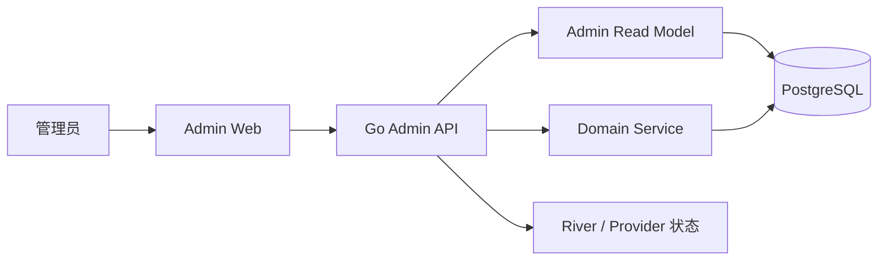

# 后台管理系统开发文档

## 0. 文档信息

| 项目 | 内容 |
|---|---|
| 文档类型 | 管理后台功能与技术设计 |
| 适用范围 | `apps/admin`、Admin OpenAPI、Go Admin API 与 Admin 数据边界 |
| 当前状态 | 开发基线 |
| 更新日期 | 2026-08-29 |

2026-09-08 运营验收与已知限制见 [后台运营验收](reviews/后台运营验收-2026-09-08.md)。下文为目标设计，不能将尚未实现的指标视为正式可用。

当前实现进度统一见 [实现状态](./实现状态.md)。本文件只维护管理后台自己的功能、权限、契约与安全设计。

## 1. 目标与范围

后台用于查看产品运行情况、用户使用情况和 AI 成本，并执行必要的用户管理操作。

当前包含：

- 管理员登录、退出和会话管理。
- 数据总览。
- 用户列表和用户详情。
- 用户活跃、功能使用和关键漏斗。
- AI 调用量、Token、成本、成功率和延迟。
- Operation、Queue 和 Provider 运行状态。
- 暂停／恢复用户、撤销用户会话、设置用户 AI 预算。
- 管理操作审计。

后台管理员名单独立存入 `admin.accounts`，与 App 用户表和用户登录凭据隔离。
当前管理员均拥有完整后台权限，后续通过受控数据库操作增加或停用管理员，不开放自助注册。

---

## 2. 技术方案

### 2.1 前端

```text
React 19
Ant Design Pro v6 精简模板
Ant Design 6
Umi Max 4
@ant-design/pro-components v3
@tanstack/react-query v5
ECharts
TypeScript strict
Vitest + Testing Library
Playwright
```

新增应用：

```text
apps/admin
```

使用仓库现有 pnpm workspace。删除模板中的 Demo、Mock、示例账号和无关插件。网络请求只使用 OpenAPI 生成 Client + TanStack Query。

### 2.2 后端

新增独立 Go 进程：

```text
apps/backend/cmd/admin-api
```

Admin API 与公共 API 使用不同的：

- 进程和端口。
- 域名。
- Cookie。
- 数据库账号。
- OpenAPI 入口。

Admin API 可以复用现有 Domain Service，但不和 Public API 共用 HTTP 路由。

### 2.3 契约

```text
packages/contracts/openapi/admin/openapi.yaml
  → apps/backend/internal/gen/adminapi
  → packages/admin-api-client
```

Admin Web 的 URL、请求参数、DTO、错误码和枚举全部从 Admin OpenAPI 生成。

### 2.4 系统结构



跨用户列表和统计读取 `admin` schema 中的脱敏读模型。单用户详情和管理动作在指定用户的 RLS 事务中执行。

---

## 3. 管理员登录

### 3.1 手机号身份与载体决策（2026-09-08）

后台保持独立内部 Web，不嵌入 App，不新增原生权限或应用商店交付。管理员手机号码
仅用于后台身份验证，复用现有阿里云短信 Provider；登录页明确告知用途并链接现有隐私说明，
发送短信前需主动确认。无需新增第三方 SDK 或改变 App 的手机号登录逻辑。

只有 `admin.accounts` 中启用的手机号可以登录，不从 App 用户身份推导管理员权限。
首次通过后台专用验证码验证后必须设置密码，之后支持密码登录或验证码登录；忘记密码时
使用独立用途的验证码重设，成功后撤销该管理员全部旧会话。新增管理员只添加白名单，
不得替新管理员设置共享默认密码。停用名单中的管理员后，其已有会话也立即失效。

密码采用 Argon2id，长度 12–128 字符；首次设密和重设均在服务端验证，允许密码管理器粘贴。
验证码有效期 5 分钟，每个挑战最多 5 次尝试，同一号码发送间隔至少 60 秒，
最多每小时 5 条、每日 10 条，另按请求来源限制流量。验证码不返回生产响应、不记录日志，
以带服务器密钥的散列保存。验证码和会话与 App 完全分离，登录码不能用于重设密码。
无权限手机号也返回统一发送提示，避免公开查询管理员名单。后续验证码请求会清理超过 7 天的验证码记录。

身份验证、管理员授权、口令和验证码处理均为确定性安全流程，不交给 AI 推断或执行；
按本次用户明确指定的验证流程保留完整手工路径。管理操作审计使用稳定管理员 ID。

以下 Secret 只配置会话密钥、全局凭据版本及超时；旧用户名／口令 Secret 不再提供登录入口。

### 3.2 会话配置

管理员名单由运维数据库维护，会话密钥通过 Secret 配置：

```text
STEWARD_ADMIN_CREDENTIAL_VERSION
STEWARD_ADMIN_SESSION_SECRET
STEWARD_ADMIN_CSRF_SECRET
```

密码散列保存在 `admin.accounts.password_hash`，环境变量不再维护管理员口令。

### 3.3 登录流程

```text
提交手机号及密码／后台专用验证码
  → 校验 Origin、限流与管理员名单
  → 校验密码／消费验证码，首次验证须完成设密
  → 创建随机 Session Token
  → 数据库只保存 Token Hash
  → 浏览器写入 HttpOnly Cookie
```

Cookie 配置：

```text
Secure
HttpOnly
SameSite=Strict
Path=/
```

Session 使用 30 分钟空闲超时和 12 小时绝对超时。`STEWARD_ADMIN_CREDENTIAL_VERSION` 变化后，旧 Session 立即失效。

所有会话写请求同时校验 CSRF Token 和 Origin。公开认证接口按来源和手机号原子计数限流，验证码按管理员账号在数据库内串行消费。

### 3.4 登录接口

| 方法 | Path | 用途 |
|---|---|---|
| POST | `/admin/v1/login` | 登录 |
| POST | `/admin/v1/phone-code` | 请求后台专用登录／重设密码验证码 |
| POST | `/admin/v1/password-reset` | 重设密码并撤销该管理员旧会话 |
| GET | `/admin/v1/session` | 获取当前会话 |
| POST | `/admin/v1/logout` | 退出并撤销会话 |

---

## 4. 页面与功能

### 4.1 导航

```text
总览
用户
使用分析
AI 与成本
运行中心
操作审计
```

### 4.2 总览

筛选：今天、昨天、近 7 天、近 30 天、自定义时间。

首屏展示：

| 模块 | 指标 |
|---|---|
| 用户 | 总用户、新增用户、完成初始化、DAU、WAU、MAU |
| 使用 | Capture 提交／确认、Assistant Turn、Task 完成 |
| AI | 调用量、成功率、P95 延迟、估算成本 |
| 运行 | API 5xx、失败 Operation、Queue Lag、Discarded Job |

每个模块显示 `data_as_of`。数据源部分失败时保留其他模块，并标明失败项。

### 4.3 用户列表

默认列：

| 列 | 说明 |
|---|---|
| 用户 ID | 支持复制 |
| 手机号 | 服务端脱敏 |
| 状态 | active / suspended |
| 初始化 | 已完成 / 未完成 |
| 注册时间 | 按后台报表时区显示 |
| 最近活跃 | 来自用户使用聚合 |
| 30 日活跃天数 | 去重自然日 |
| 30 日 AI 成本 | USD，显示计价状态 |
| 最近错误 | 稳定错误码 |

筛选：

- 用户 ID 精确查询。
- 手机号精确查询。
- 用户状态。
- 初始化状态。
- 注册时间。
- 最近活跃时间。
- 是否使用 AI。
- 是否存在失败 Operation。

列表使用 Cursor Pagination，默认 20 条，最大 100 条。手机号查询参数放在请求体或临时表单状态中，不写入 URL。

### 4.4 用户详情

用户详情分为五个 Tab，每个 Tab 独立请求。

#### 概览

- 用户 ID、脱敏手机号、显示名称、时区。
- 注册时间、初始化状态、最近活跃时间、账号状态。
- 有效 Session 数。
- Task、Event、Project、Note、Capture、Assistant 数量。
- AI 设置和预算摘要。

接口只返回状态、数量和标识，不返回 Note、Message、Memory、OCR、转写或媒体正文。

#### 使用情况

- 近 7／30／90 日活跃趋势。
- Capture 提交、处理成功和确认次数。
- Task 完成次数。
- Assistant Turn 成功、失败次数。
- Proposal 生成和执行次数。
- Review 使用次数。

#### AI 成本

- 按日期、Feature、Provider 和模型分组。
- Input、Cached Input、Output Token。
- 音频、图片和请求次数等非 Token 用量。
- 估算成本、缺失价格数量、失败调用成本。

#### Operation

- Operation ID、类型、状态和时间。
- Request ID、Run ID、Job ID。
- 错误码、重试次数、下一次执行时间。
- 是否可重试。

#### 管理记录

- 暂停和恢复。
- 会话撤销。
- AI 预算修改。
- 操作原因、时间和 Audit ID。

### 4.5 使用分析

展示：

- DAU、WAU、MAU。
- 注册 → 初始化 → 首次正式业务操作。
- Capture 提交 → 处理成功 → 确认。
- Assistant 提交 → 回复成功 → Proposal 生成 → 执行。
- 各核心功能的使用人数和次数。

筛选：时间范围、平台、App 版本、是否新用户。

统计只使用服务端业务事实，不从 Token 刷新、轮询和健康检查计算活跃。

### 4.6 AI 与成本

展示：

- 总调用量、成功率、失败率。
- Input / Cached Input / Output Token。
- 总估算成本和单次成功结果成本。
- 按 Feature、Provider、模型和日期分组。
- P50 / P95 / P99 延迟。
- Provider 429、5xx、timeout 和 Schema Invalid。
- 价格缺失的调用数量。

价格配置包含 Provider、模型、Usage Unit、单位大小、USD 单价和生效时间。修改价格时新增版本，已使用的历史价格不覆盖。

### 4.7 运行中心

#### Operation

筛选：类型、状态、时间、用户 ID 和错误码。

详情显示 Operation、Request、Run、Job 和资源 ID 的关联关系。

#### Queue

- available、scheduled、running、retryable、discarded 数量。
- Queue Lag。
- 按 Job Kind 的失败和重试分布。
- Worker 心跳、版本和并发数。

#### Provider

- AI Provider、对象存储和短信 Provider 状态。
- 成功率、错误率、限流率和延迟。
- 最近一次成功和失败时间。

### 4.8 用户管理

#### 暂停用户

- 只允许从 `active` 变为 `suspended`。
- 必填原因，可填写结束时间。
- 同时撤销用户全部 Session。
- 停止创建新的 AI Operation。
- 返回受影响的 Session 和 Operation 数量。

#### 恢复用户

- 只允许从 `suspended` 变为 `active`。
- 不恢复旧 Session。
- 不自动重放暂停期间失败的任务。

#### 撤销用户会话

- 撤销当前用户全部有效 Session。
- 返回撤销数量和生效时间。

#### AI 预算

- 设置用户每日和每月预算。
- 预算不能高于系统硬上限。
- 支持设置生效时间和结束时间。
- 用户关闭 AI 时，管理员预算不自动开启 AI。

所有管理操作要求：

- `Idempotency-Key`。
- 用户当前 `version`。
- `reason_code` 和 `reason_text`。
- 业务变更与 Audit 在同一事务提交。

### 4.9 通用页面状态

每个页面处理：加载、空数据、请求失败、会话失效、数据延迟和部分数据失败。

错误信息显示稳定错误码和 `request_id`。会话失效后清空 TanStack Query Cache 并跳转登录页。

---

## 5. 指标口径

后台报表时区由 `STEWARD_ADMIN_REPORTING_TIMEZONE` 配置，所有日报按该时区切日。

### 5.1 用户指标

```text
总用户 = 当前存在的 users 数量
新增用户 = 时间窗口内创建的用户数量
初始化率 = 完成初始化用户数 / 注册用户数
DAU = 当日产生至少一个有效业务行为的去重用户数
WAU = 最近 7 个自然日有效业务行为去重用户数
MAU = 最近 30 个自然日有效业务行为去重用户数
```

有效业务行为包括：创建或完成事务、提交或确认 Capture、提交 Assistant、执行 Proposal、生成 Review。

### 5.2 漏斗

每个漏斗返回每一步的：

```text
users
events
conversion_from_previous
conversion_from_start
```

分母为 0 时比例返回 NULL，页面显示“—”。

### 5.3 AI 指标

```text
AI 成功率 = succeeded actions / completed actions
平均延迟 = completed actions latency 总和 / completed actions
P95 延迟 = completed actions latency 的 95 分位
失败成本 = failed actions 的已知成本汇总
单位成功成本 = succeeded actions 成本 / 成功业务结果数
```

### 5.4 成本计算

```text
cost = quantity / unit_size * unit_price_usd
```

金额使用 PostgreSQL `numeric`，Go 使用精确 Decimal 类型，不使用 `float64`。

成本状态：

| 状态 | 含义 |
|---|---|
| calculated | 已匹配价格并计算 |
| pricing_missing | 有用量但没有价格 |
| pending | 调用已结束，成本尚未处理 |
| not_applicable | 不产生费用 |

`pricing_missing` 的金额为 NULL，页面显示“价格缺失”，不显示 0。

---

## 6. Admin API

### 6.1 通用规则

- Base Path：`/admin/v1`。
- JSON 使用 `snake_case`。
- 响应包含 `request_id`。
- 私有响应使用 `Cache-Control: private, no-store`。
- 列表使用 Cursor Pagination。
- 写操作要求 `Idempotency-Key`。
- 修改操作要求 `expected_version`。

### 6.2 接口清单

| 方法 | Path | 用途 |
|---|---|---|
| POST | `/admin/v1/login` | 登录 |
| GET | `/admin/v1/session` | 当前会话 |
| POST | `/admin/v1/logout` | 退出 |
| GET | `/admin/v1/dashboard/summary` | 总览 |
| GET | `/admin/v1/dashboard/trends` | 总览趋势 |
| GET | `/admin/v1/users` | 用户列表 |
| GET | `/admin/v1/users/{user_id}` | 用户概览 |
| GET | `/admin/v1/users/{user_id}/usage` | 用户使用情况 |
| GET | `/admin/v1/users/{user_id}/costs` | 用户 AI 成本 |
| GET | `/admin/v1/users/{user_id}/operations` | 用户 Operation |
| GET | `/admin/v1/users/{user_id}/admin-actions` | 用户管理记录 |
| POST | `/admin/v1/users/{user_id}/suspensions` | 暂停用户 |
| POST | `/admin/v1/users/{user_id}/suspensions/{id}/resolve` | 恢复用户 |
| POST | `/admin/v1/users/{user_id}/session-revocations` | 撤销用户会话 |
| PUT | `/admin/v1/users/{user_id}/ai-budget` | 设置 AI 预算 |
| DELETE | `/admin/v1/users/{user_id}/ai-budget` | 清除 AI 预算 |
| GET | `/admin/v1/usage/overview` | 使用概览 |
| GET | `/admin/v1/usage/funnels/{funnel}` | 漏斗 |
| GET | `/admin/v1/ai-costs/summary` | AI 成本汇总 |
| GET | `/admin/v1/ai-costs/breakdown` | AI 成本分组 |
| GET | `/admin/v1/ai-prices` | AI 价格列表 |
| POST | `/admin/v1/ai-prices` | 新增价格版本 |
| POST | `/admin/v1/ai-prices/{id}/retire` | 停用价格版本 |
| GET | `/admin/v1/operations` | Operation 列表 |
| GET | `/admin/v1/operations/{id}` | Operation 详情 |
| GET | `/admin/v1/queues` | Queue 状态 |
| GET | `/admin/v1/providers` | Provider 状态 |
| GET | `/admin/v1/audit-logs` | 操作审计 |

### 6.3 用户列表响应

```json
{
  "data": [
    {
      "id": "usr_123",
      "masked_phone": "138****8000",
      "account_status": "active",
      "initialized": true,
      "created_at": "2026-08-01T03:00:00Z",
      "last_active_at": "2026-08-20T07:58:00Z",
      "active_days_30d": 12,
      "ai_cost_30d": {
        "amount": "2.381245",
        "currency": "USD",
        "status": "calculated"
      },
      "latest_error_code": null,
      "version": 3
    }
  ],
  "page": {
    "next_cursor": null
  },
  "request_id": "req_123"
}
```

### 6.4 管理操作请求

```json
{
  "expected_version": 3,
  "reason_code": "abuse_prevention",
  "reason_text": "检测到持续自动化滥用。",
  "expires_at": "2026-08-27T08:00:00Z"
}
```

### 6.5 错误码

```text
ADMIN_AUTH_REQUIRED
ADMIN_LOGIN_INVALID
ADMIN_SESSION_EXPIRED
ADMIN_CSRF_INVALID
ADMIN_RATE_LIMITED
ADMIN_IDEMPOTENCY_KEY_REQUIRED
ADMIN_IDEMPOTENCY_KEY_REUSED
ADMIN_VERSION_CONFLICT
ADMIN_REASON_REQUIRED
ADMIN_USER_NOT_FOUND
ADMIN_USER_STATUS_CONFLICT
ADMIN_PRICING_MISSING
ADMIN_AUDIT_WRITE_FAILED
```

---

## 7. 数据库设计

新增 `admin` schema，用于管理员会话、审计和后台读模型。数据库变更使用新的 Goose Migration。

### 7.1 `admin.sessions`

```text
id                  text PRIMARY KEY
session_token_hash  bytea UNIQUE NOT NULL
csrf_secret_hash    bytea NOT NULL
credential_version  text NOT NULL
last_seen_at        timestamptz NOT NULL
expires_at          timestamptz NOT NULL
absolute_expires_at timestamptz NOT NULL
revoked_at          timestamptz NULL
created_at          timestamptz NOT NULL
```

### 7.2 `admin.audit_logs`

```text
id              text PRIMARY KEY
occurred_at     timestamptz NOT NULL
action          text NOT NULL
outcome         succeeded / failed
target_type     text NULL
target_id       text NULL
reason_code     text NULL
reason_text     text NULL
request_id      text NOT NULL
before_summary  jsonb NULL
after_summary   jsonb NULL
created_at      timestamptz NOT NULL
```

Admin API 对该表只有 INSERT 和 SELECT 权限。摘要字段只保存状态、数量和 ID。

### 7.3 `admin.user_index`

```text
user_id                     text PRIMARY KEY
masked_phone                text NOT NULL
phone_lookup_hash           bytea NULL
display_name                text NOT NULL
account_status              active / suspended
initialized                 boolean NOT NULL
timezone                    text NOT NULL
created_at                  timestamptz NOT NULL
last_active_at              timestamptz NULL
active_days_30d             integer NOT NULL
ai_cost_30d                 numeric NULL
ai_cost_status              calculated / partial / pricing_missing / no_usage
latest_error_code           text NULL
source_version              integer NOT NULL
updated_at                  timestamptz NOT NULL
```

手机号精确查询使用版本化 HMAC，接口只返回 `masked_phone`。

### 7.4 `admin.user_daily_usage`

```text
user_id                 text NOT NULL
report_date             date NOT NULL
active                  boolean NOT NULL
capture_submitted       integer NOT NULL
capture_confirmed       integer NOT NULL
task_completed          integer NOT NULL
assistant_turns         integer NOT NULL
proposal_executed       integer NOT NULL
review_generated        integer NOT NULL
ai_input_tokens         bigint NOT NULL
ai_cached_input_tokens  bigint NOT NULL
ai_output_tokens        bigint NOT NULL
ai_cost                 numeric NULL
ai_cost_status          calculated / partial / pricing_missing / no_usage
updated_at              timestamptz NOT NULL
PRIMARY KEY (user_id, report_date)
```

### 7.5 `ai_model_prices`

```text
id              text PRIMARY KEY
provider        text NOT NULL
model           text NOT NULL
usage_unit      input_token / cached_input_token / output_token /
                audio_second / image / request
unit_size       numeric NOT NULL
unit_price_usd  numeric NOT NULL
effective_from  timestamptz NOT NULL
effective_until timestamptz NULL
created_at      timestamptz NOT NULL
```

同一 Provider、模型和 Usage Unit 的生效区间不能重叠。

### 7.6 `ai_action_cost_items`

```text
id              text PRIMARY KEY
ai_action_id    text NOT NULL
price_id        text NULL
usage_unit      text NOT NULL
quantity        numeric NOT NULL
unit_size       numeric NULL
unit_price_usd  numeric NULL
amount_usd      numeric NULL
cost_status     calculated / pricing_missing / pending / not_applicable
created_at      timestamptz NOT NULL
```

同时调整现有 `ai_actions`：

```text
cached_input_tokens  integer NOT NULL DEFAULT 0
estimated_cost       numeric(20, 8) NULL
cost_status          calculated / pricing_missing / pending / not_applicable
cost_calculated_at   timestamptz NULL
```

现有默认 0 成本不能直接视为真实成本。迁移后通过 Backfill 重新计算，无法匹配价格的记录设为 `pricing_missing`。

### 7.7 用户状态

给 `users` 增加：

```text
account_status        active / suspended
status_version        integer NOT NULL
suspended_at          timestamptz NULL
suspension_expires_at timestamptz NULL
```

新增 `user_account_actions`：

```text
id              text PRIMARY KEY
user_id         text NOT NULL
action          suspend / resume / sessions_revoke / budget_update
reason_code     text NOT NULL
reason_text     text NOT NULL
effective_from  timestamptz NOT NULL
effective_until timestamptz NULL
audit_log_id    text NOT NULL
created_at      timestamptz NOT NULL
```

### 7.8 聚合任务

- 每小时按报表时区重算昨天及今天的 User Usage、AI Cost 和 Dashboard 数据，补齐午夜前最后一小时；单个用户失败也必须标记本轮失败，不执行缺失用户清扫。
- 每天按报表时区生成稳定日报。
- 聚合任务幂等，同一日期可安全重跑。
- 响应返回 `data_as_of` 和 `aggregation_status`。

必要索引：

```text
admin.user_index(created_at DESC, user_id DESC)
admin.user_index(phone_lookup_hash)
admin.user_index(account_status, last_active_at DESC)
admin.user_daily_usage(report_date, active)
ai_actions(created_at, provider, feature)
ai_action_cost_items(ai_action_id)
async_operations(status, created_at)
admin.audit_logs(occurred_at DESC, id DESC)
```

---

## 8. 后端实现

### 8.1 目录

```text
apps/backend/
├── cmd/admin-api/
├── internal/adminbootstrap/
├── internal/modules/admin/
│   ├── auth/
│   ├── dashboard/
│   ├── users/
│   ├── usage/
│   ├── costs/
│   ├── operations/
│   └── audit/
└── internal/gen/adminapi/
```

### 8.2 请求流程

只读请求：

```text
Session 校验
  → 参数校验
  → Read Model 或单用户 RLS Query
  → DTO 映射
  → 响应
```

写请求：

```text
Session + CSRF 校验
  → Idempotency-Key 校验
  → version 和 reason 校验
  → Domain Command
  → 业务事实与 Audit 原子提交
  → 响应
```

### 8.3 数据库权限

Admin API 数据库连接账号：

```text
NOSUPERUSER
NOCREATEDB
NOCREATEROLE
NOBYPASSRLS
```

该连接账号可以：

- 读取 `admin.user_index` 和聚合表。
- 插入／读取 `admin.sessions` 和 `admin.audit_logs`。
- 在 `WithAdminUserTx(user_id)` 中调用白名单用户 Query 和 Domain Command。

`WithAdminUserTx` 设置事务级 `app.current_user_id`，一次事务只能绑定一个用户。

### 8.4 管理操作

- 状态变化使用 `SELECT ... FOR UPDATE` 或等价版本锁。
- 同一 `Idempotency-Key` 和请求体返回相同结果。
- 同一 Key 搭配不同请求体返回冲突。
- Audit 写入失败时业务操作回滚。
- Admin Handler 不直接执行任意业务表 UPDATE。

### 8.5 成本落账

```text
AI Provider 返回 Usage
  → 规范化 Usage Unit
  → 按调用时间匹配 Price
  → 写 Cost Item
  → 更新 ai_actions 成本缓存
  → 更新日聚合
```

成本落账失败进入可靠补偿 Job，并产生告警。

---

## 9. 前端实现

### 9.1 目录

```text
apps/admin/
├── config/routes.ts
├── src/app.tsx
├── src/pages/
│   ├── login/
│   ├── dashboard/
│   ├── users/
│   ├── usage/
│   ├── ai-costs/
│   ├── operations/
│   └── audit/
├── src/api/
│   ├── client.ts
│   ├── query-keys.ts
│   └── errors.ts
├── src/components/
├── src/charts/
└── src/test/
```

### 9.2 数据请求

- Query Key 集中定义并包含全部筛选条件。
- 表格使用服务端分页、排序和筛选。
- Command 成功后只失效相关 Query。
- 用户详情按 Tab 懒加载。
- 不持久化 TanStack Query Cache。
- Session 失效时清空全部缓存。

### 9.3 表格和表单

- 手机号由服务端脱敏。
- 金额显示 USD 和成本状态。
- 时间显示报表时区。
- ID、错误码和模型名支持单项复制。
- 管理操作使用独立确认框，展示目标、影响、原因和当前版本。
- 版本冲突后刷新数据并要求重新确认。

### 9.4 页面布局

- 桌面优先，最低支持 1280px。
- 左侧导航，顶部显示环境、数据更新时间和退出入口。
- production 以外环境显示常驻环境标识。
- 图表提供相同口径的数据表或摘要。
- 状态同时使用文字和颜色表达。

---

## 10. 测试

### 10.1 后端

- 未登录访问返回 401。
- 错误密码和暴力尝试触发限流。
- Session 空闲、绝对过期和凭证版本变化正确失效。
- CSRF 和 Origin 校验有效。
- Admin 数据库连接账号没有 `BYPASSRLS`。
- 单用户事务不能读取其他用户数据。
- 用户列表、筛选和 Cursor Pagination 正确。
- 暂停／恢复并发时只有一个状态转换成功。
- Idempotency-Key 重放结果一致。
- 管理操作和 Audit 原子提交。
- 缺失价格时金额为 NULL。
- Token 和成本使用精确数值计算。

### 10.2 前端

- 登录、退出和会话过期。
- Dashboard 正常、空、错误和数据延迟状态。
- 用户 ID 与手机号精确查询。
- 用户详情五个 Tab 独立加载。
- AI 成本分组和价格缺失状态。
- 暂停、恢复、撤销会话和预算修改。
- 版本冲突后重新确认。
- 1280px 页面无关键内容遮挡。

### 10.3 性能目标

| 接口 | p95 |
|---|---:|
| 登录和 Session | < 300ms |
| 用户列表 | < 800ms |
| 用户详情 | < 800ms |
| Dashboard | < 1s |
| 30 日成本分组 | < 1.5s |
| 管理操作 | < 1s |

---

## 11. 开发顺序

### 步骤 1：工程和登录

- 创建 Admin OpenAPI 和生成链路。
- 创建 `apps/admin` 和 `cmd/admin-api`。
- 实现管理员登录、Session、CSRF 和退出。
- 创建 `admin.sessions` 和 `admin.audit_logs`。

### 步骤 2：成本和读模型

- 创建 AI Price、Cost Item 和成本 Backfill。
- 创建 User Index 和 User Daily Usage。
- 实现小时聚合、日报和数据新鲜度。

### 步骤 3：只读页面

- Dashboard。
- 用户列表和详情。
- 使用分析。
- AI 与成本。
- Operation、Queue 和 Provider。
- Audit。

### 步骤 4：用户管理

- 用户状态字段和 Account Action。
- 暂停、恢复和会话撤销。
- 用户 AI 预算。
- 幂等、版本冲突和原子审计测试。

### 步骤 5：验收

- 契约生成无漂移。
- Go 和 TypeScript 检查通过。
- 数据抽样与源事实一致。
- 登录、用户查询、成本和用户管理 E2E 通过。
- Staging 完成部署和回滚验证。

---

## 12. 完成标准

- 管理员可以登录并安全退出。
- Dashboard 能看到用户、使用、AI 成本和运行状态。
- 可以通过用户 ID 或手机号定位用户。
- 用户详情能看到使用、成本、Operation 和管理记录。
- AI 成本有明确价格版本，缺价不显示为 0。
- 可以暂停／恢复用户、撤销会话和修改 AI 预算。
- 所有管理操作都有原因、幂等、版本校验和 Audit。
- Admin API 使用独立数据库账号且不能绕过 RLS。
- 页面覆盖加载、空数据、失败、会话失效和数据延迟。
- `make check`、数据库集成测试和后台 E2E 全部通过。
