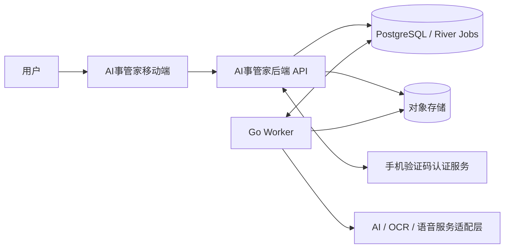
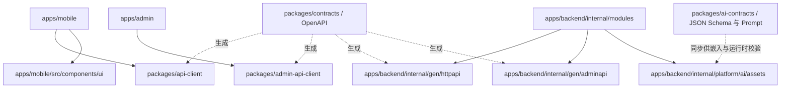
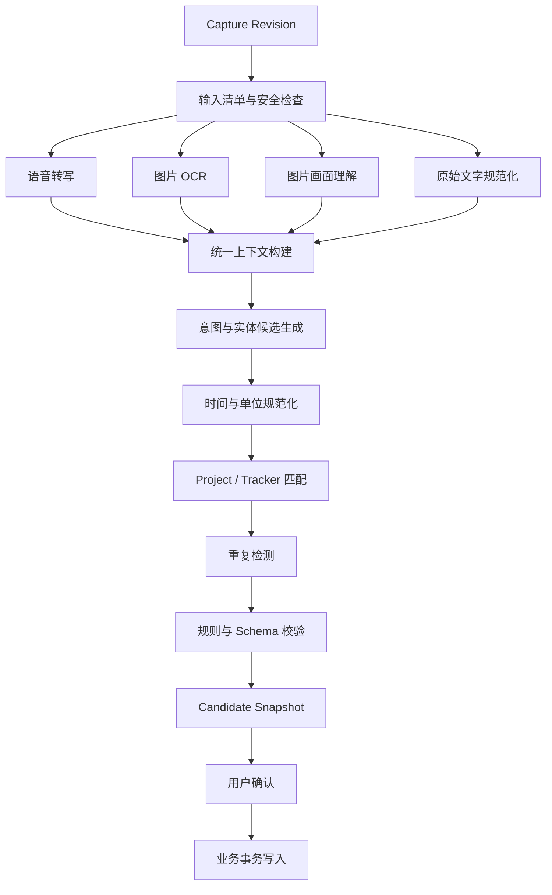
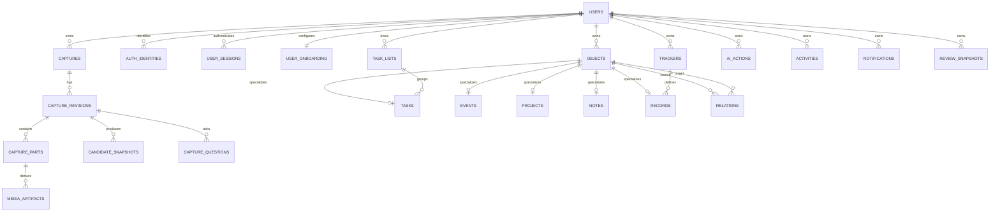
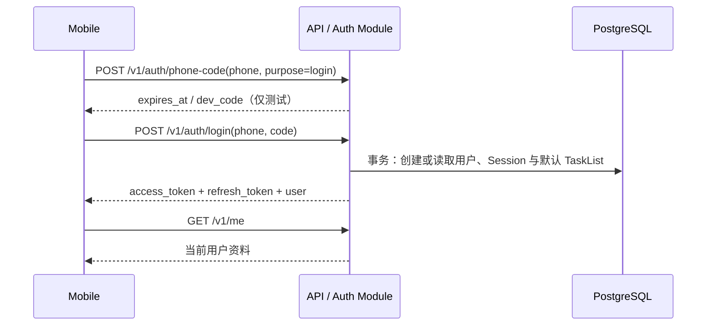
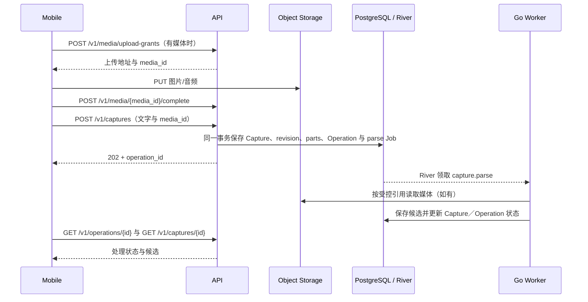
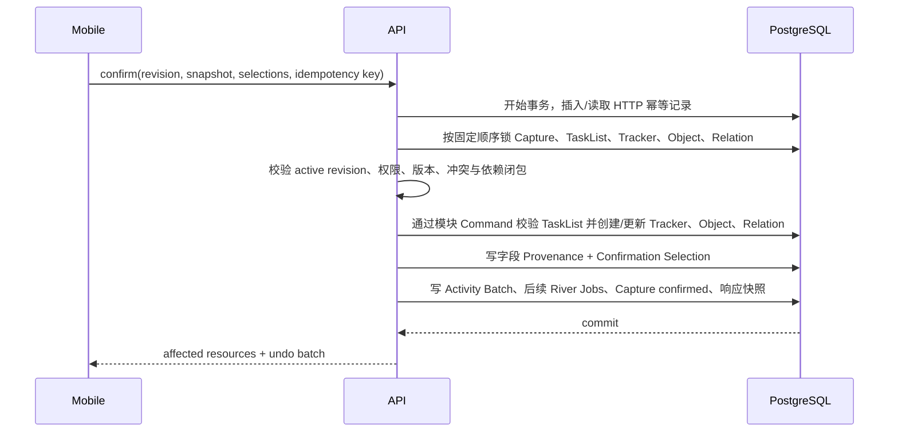

# 整体架构设计

## 0. 文档信息

| 项目 | 内容 |
|---|---|
| 文档类型 | 产品与技术整体架构设计 |
| 需求依据 | `功能规格说明.md` |
| 设计依据 | `产品设计说明.md` |
| 工程形态 | Go + TypeScript Polyglot Monorepo |
| 后端语言 | Go |
| 覆盖范围 | 移动端、Go HTTP API、Go Worker、AI、数据、存储、通知、部署与测试 |
| 目标读者 | 架构、客户端、服务端、AI、测试、运维及编码 Agent |
| 当前状态 | 开发基线（目标态与当前实现分别标注） |
| 文档定位 | 模块、契约、数据流和安全边界的权威基线 |
| 更新日期 | 2026-08-31 |

本文定义“整个产品如何放在一个大项目中，并以机器可校验的契约保持前后端一致”。功能规格决定业务行为，产品设计说明决定页面与交互，本文决定代码边界、数据流、接口、依赖和运行方式。

Go 后端、可替换 AI Runtime、Assistant、意图识别、受控工具调用和用户长期记忆的落地细节见 `后端与AI开发指南.md`。该指南不得覆盖本文的模块边界、契约治理、事务、用户隔离和“AI 不直接写库”规则。

本文同时包含已经落地的约束和仍需演进的目标结构。未明确标注为“当前实现”的目录、组件包或技术选型不能仅凭本文视为已安装；代码核对后的现状统一见 [实现状态](./实现状态.md)，文档导航与维护方式见 [项目文档入口](./README.md)。

---

# 1. 架构结论

## 1.1 核心决策

1. 使用一个 Git 仓库承载移动端、后端、共享契约、基础设施和文档。
2. 根目录使用 `Makefile` 统一编排；TypeScript 子图由 `pnpm workspace` 和各包脚本管理，Go 后端由 `go.mod` 管理并纳入根 `go.work`。当前未引入 Turborepo。
3. 移动端使用 `Expo + React Native + TypeScript + Expo Router`。
4. 后端使用 `Go + net/http + chi`，按模块化单体组织；公共 HTTP 骨架从 OpenAPI 生成。
5. Public API、Admin API 与后台 Worker 使用同一个 Go module、独立 `cmd` 入口；生产由独立进程运行，API 只在本地开发可显式启用 embedded Worker。
6. PostgreSQL 同时承载业务事实和 River Job；当前使用 River 默认 schema 和单一 Worker 进程，业务写入与任务入队复用同一个 `pgx.Tx`。Redis 仅可用于流式事件传输，不作为 Job Queue 或事实源。
7. 图片和音频通过 Storage Adapter 存入本地目录或阿里云 OSS，数据库只保存受控引用和元数据。
8. `packages/contracts/openapi` 中的 OpenAPI 3.0.3 是前后端网络契约唯一来源；生成 Go strict server，以及 TypeScript Client、Query Hooks 与 Zod Schema。当前 Zod 产物尚未在通用 fetcher 中逐响应执行，完成接线前不能声称所有网络响应已运行时校验。
9. `packages/ai-contracts` 中的 JSON Schema 2020-12 是 AI 结构化输出唯一来源；当前通过同步脚本嵌入后端，真实 Provider 的原始 JSON 必须运行时校验。仓库尚未生成统一的 AI Go 类型包。
10. AI 永远不能直接写数据库；所有写入必须经过业务服务、权限检查、状态机、幂等与事务。
11. 购物清单复用 TaskList / Task 存储，但以 `list_kind=shopping` 形成独立读模型；数据库保证每个用户最多一份活动购物清单，计划与复盘查询只读取 `list_kind=tasks`。
12. Today 排序、状态转换、重复检测、时间换算等确定性规则由代码执行，不能交给模型自由判断。
13. Candidate Snapshot 与未确认 Capture 属于临时输入域；所有正式内容查询在数据库和 Repository 层只读取已确认写入的 Task、Event、Project、Note、Tracker 和 Record。
14. MVP 作为一个完整范围验收；实现可以按依赖顺序推进，但不形成对外缺功能版本。

## 1.2 为什么选择单仓库

本项目同时包含移动端、API、异步媒体处理、AI Schema 和大量共享状态。如果拆成多个仓库，最容易出现：

- App 使用旧字段，后端已经改名。
- AI 返回的候选结构与确认页不一致。
- Today 排序和状态文案在前后端各实现一份。
- 接口变更缺少跨仓库原子提交。
- 编码 Agent 只能看到一侧上下文，产生重复类型和隐式假设。

单仓库允许一次变更同时包含：功能文档、共享 Schema、后端实现、移动端适配和测试夹具，并由同一条 CI 验证。

## 1.3 架构质量目标

| 目标 | 可验证要求 |
|---|---|
| 一致性 | 共享契约变更后，移动端、后端和契约测试在同一 CI 中通过 |
| 可追溯 | AI 字段可追到实际 Capture／Object／AI Action，并定位到具体字段或 input part |
| 安全写入 | AI 输出不直接写库；确认事务幂等且可撤销 |
| 可恢复 | 媒体单项失败可重试，任务处理可安全重复执行 |
| 可解释 | 总结和搜索答案携带实际来源 ID |
| 可演进 | 模块边界清楚，MVP 先保持模块化单体，不提前拆微服务 |
| 隐私 | 原始媒体有明确授权、保留、删除和导出路径 |
| 可观测 | 一个 Capture 可通过 trace ID 串联 App、API、Worker、AI 和数据库操作 |

---

# 2. 系统上下文

## 2.1 上下文图



## 2.2 容器职责

| 容器 | 职责 | 不负责 |
|---|---|---|
| Mobile App | 输入、展示、表单校验、草稿、来源查看、用户确认 | 权威业务规则、直接访问数据库、持有 AI 密钥 |
| Go HTTP API | 鉴权、OpenAPI 契约校验、同步业务操作、查询、生成上传授权、事务内插入 River Job | 长耗时模型解析与 Review |
| Go Worker | 消费 River Job，执行 Capture 解析、Assistant 回复、Review 生成和归档清理 | 面向客户端提供公共 HTTP |
| Go Admin API | 管理员鉴权与脱敏聚合读写 | 直接读取用户正文或绕过 admin schema 边界 |
| PostgreSQL | 业务实体、状态、审计、候选结果、River Job、提醒消除状态和幂等结果 | 原始大文件 |
| Object Storage | 原始图片、录音等受控媒体 | 业务关系和权限判断 |
| AI Provider Adapter | 调用模型、语音和图片识别能力 | 自主保存或修改用户数据 |

## 2.3 信任边界

- 移动端输入、媒体内容、AI 输出和第三方回调全部视为不可信输入。
- HTTP API 是客户端进入业务系统的唯一入口。
- Worker 使用服务身份访问内部资源，不暴露公网管理接口。
- 对象存储资产默认私有，只通过短期签名 URL 上传或查看。
- 数据库权限按 API、Worker、迁移工具分离；Go 运行时账号不能修改 Schema。

---

# 3. 单仓库结构

## 3.1 当前目录与演进边界

```text
steward/
├── apps/
│   ├── mobile/                    # Expo / React Native 应用
│   │   ├── src/app/               # Expo Router 路由
│   │   ├── src/features/          # 按业务场景组织的 UI 与数据层
│   │   ├── src/components/ui/     # 当前 App 共享组件与第三方适配层
│   │   ├── src/theme/             # 当前 App Token
│   │   └── src/api/               # Client 配置、会话与启动状态
│   ├── admin/                     # React 管理台
│   └── backend/                   # Go 模块化单体
│       ├── cmd/
│       │   ├── api/main.go        # HTTP 进程入口
│       │   ├── worker/main.go     # River Worker 入口
│       │   ├── admin-api/main.go  # 管理 API 入口
│       │   └── migrate/main.go    # Goose 迁移入口
│       ├── internal/
│       │   ├── bootstrap/         # 配置与依赖组装
│       │   ├── modules/           # 业务模块，只在当前 Go module 内可见
│       │   ├── platform/          # DB、Jobs、Storage、Auth、AI 等基础设施
│       │   └── gen/
│       │       ├── httpapi/       # Public OpenAPI 生成；禁止手工修改
│       │       ├── adminapi/      # Admin OpenAPI 生成；禁止手工修改
│       │       └── dbgen/         # sqlc 生成；禁止手工修改
│       ├── db/
│       │   └── migrations/        # Goose SQL Migration，也是 sqlc Schema 来源
│       ├── oapi-codegen.yaml
│       ├── sqlc.yaml
│       ├── go.mod
│       └── go.sum
├── packages/
│   ├── contracts/                 # Public／Admin OpenAPI 与生成 bundle
│   ├── api-client/                # Public API 的 TS Client／Query Hooks／Zod
│   ├── admin-api-client/          # Admin API 的 TS Client
│   ├── ai-contracts/              # 服务端 AI 输入输出 JSON Schema
│   └── ...
├── docs/
│   ├── README.md
│   ├── 实现状态.md
│   ├── 功能规格说明.md
│   ├── 产品设计说明.md
│   ├── 整体架构设计.md
│   └── 后端与AI开发指南.md
├── infra/
│   └── docker/                    # 镜像 Dockerfile
├── scripts/                       # 仓库级脚本
├── tools/                         # 菜谱导入、地图等运维工具
├── .github/workflows/             # CI/CD
├── Makefile                        # Go 与 TypeScript 的统一入口
├── go.work                         # 根 Go workspace
├── package.json
├── pnpm-workspace.yaml
├── tsconfig.base.json
├── .env.example
└── pnpm-lock.yaml
```

`packages/ui`、`packages/config`、`packages/testkit`、`docs/adr`、`infra/deploy`、`infra/observability` 与 `turbo.json` 均不是当前目录。未来只有在出现跨 App 复用、统一构建缓存或独立运维资产等明确需求时才创建，并在同一变更中迁移调用方、补测试、更新本节和 [实现状态](./实现状态.md)；不能预建空包或让文档先于代码声称已经存在。

## 3.2 工作区规则

- 根 `package.json` 必须设置 `private: true`。
- TypeScript 内部包通过 `workspace:*` 引用；Go 依赖由 `apps/backend/go.mod` 和 `go.sum` 固定，禁止用本地 `replace` 进入主分支。
- `go.work` 只登记 `./apps/backend`；根目录可以执行 Go 命令，生产构建仍以该 module 的 `go.mod/go.sum` 为可复现依赖来源。
- 仓库同时提交一个 `pnpm-lock.yaml` 和后端 `go.sum`。跨语言依赖升级仍以单个 PR 完成，但不能宣称只有一份锁文件。
- TypeScript 全局开启 `strict`；根 `make check` 当前执行 gofmt 校验、`go vet`、Go／移动端／管理台测试及 TypeScript 检查，核心并发路径另运行 `make test-race`。新增静态检查工具时必须先接入根命令与 CI，再把它写成已执行门禁。
- 禁止 TypeScript workspace 循环依赖和 Go package import cycle；CI 同时检查。
- React、React Native、Expo 和所有 Native Module 在仓库中只能存在一套兼容版本。
- Expo 依赖使用官方支持的 monorepo 配置，不手写过时的 Metro 路径覆盖。
- 根 `Makefile` 至少提供 `generate`、`format`、`lint`、`test`、`check`、`build`；其中 `make check` 同时执行 Go 与 TypeScript 全套检查。
- 版本号在创建工程时锁定当前稳定兼容组合，并由 lockfile、`go.mod` 与 Renovate/Dependabot 类工具管理；文档不硬编码易过期版本号。

Expo 官方支持 workspace 形式的 monorepo；pnpm 的 `workspace:` 协议可保证 TypeScript 内部依赖不会误装为公开包；Go 官方 workspace 允许根目录同时开发一个或多个本地 module。参考：[Expo Monorepo](https://docs.expo.dev/guides/monorepos/)、[pnpm Workspace](https://pnpm.io/workspaces)、[Go Workspaces](https://go.dev/doc/tutorial/workspaces)。

## 3.3 应用与包的依赖方向



强制规则：

- TypeScript `packages/*` 不得导入 `apps/*`。
- Mobile 不得导入后端、数据库或 `ai-contracts`。
- `contracts` 和 `ai-contracts` 是语言无关的 Schema 资产，不依赖 UI、数据库、Go 实现或环境变量。
- Go 后端不能导入 TypeScript 包；只导入由 OpenAPI／JSON Schema 生成到自身 module 内的 Go package。
- 权威状态机、Today 收录、重复检测、时间语义和事务规则只在 Go Domain 实现。移动端若需要离线预览，只能使用标明“非权威”的展示逻辑，服务端响应最终有效。
- 跨语言不共享可执行 Domain 代码，而共享 OpenAPI、错误码、枚举、Contract Fixture 和 JSON 规则测试向量；Go 与 TypeScript 测试必须消费同一批向量。
- `api-client` 全部由 OpenAPI 生成或薄封装，不重复声明 DTO、URL、Zod Schema 和 TanStack Query key。
- `ui` 不包含业务数据请求。
- 后端平台适配器依赖业务模块定义的接口，业务模块不直接依赖具体 AI、对象存储或推送厂商。

### 3.3.1 移动端导航壳层

- `apps/mobile` 的底部壳层只承载四个一级路由：`today`、`lists`、`notes`、`data`；内部领域名和路由保持稳定，用户可见名称统一为“首页、计划、笔记、打卡”。
- 底栏中心保留独立 `capture/new` 主操作。它在布局上占据中间槽位，但不进入 Tab 路由集合、不拥有选中态，也不保存独立滚动栈。移动端以当前一级页上方的底部聊天输入面板呈现该逻辑路由；关闭面板后仍停留在原页面。
- `projects/[id]` 由清单详情的具体 Project 胶囊长按进入；Project 是跨 Task、Event、Note、Record 的归属容器，不与待办、日程 Tab 平级，也不在计划首屏常驻。清单详情由 `features/projects` 维护 Project scope，单个 Project 的状态和字段仍由后端 Object Domain 与对应 Contracts 权威维护。
- `calendar` 是从计划页右上角进入的独立二级路由，不是底部 Tab、模态弹窗或新的 Object Domain。月历请求 42 天并渲染固定 6 周月格，日期格只显示第一条内容的前 4 个字，不显示剩余数量；周历按选中日期请求周日至周六 7 天，并以日期条联动选中日安排。“月历／周历”切换只改变请求范围与客户端展示，不创建新的领域状态。页面按日期聚合已确认 Task、Event、重要日期与 Project 日期节点，复用计划详情层的 Project scope、时区和实体详情路由；返回时保留计划页滚动与选择状态。
- Project 管理页不调用直接创建接口；“告诉 AI 一个新目标”和 Project 详情的“新增内容”都打开 `capture/new`，分别携带 `origin=project_manager` 或可见的 `suggested_project_id` 上下文。上下文只影响候选建议，不授权客户端跳过确认或强制 AI 创建某种类型。
- “我的”只由首页左上角头像进入独立 Stack，不占 Tab；Search、Notification 的深链可以直接打开任一正式实体，返回时回到原来源。
- `today` 路由内部使用 `features/home/home-top-tabs` 承载“今天／时光／心情／亲友”顶部标签。标签选择只是 React 本地展示状态，不增加底部 Tab、路由栈、网络字段或 Domain 状态；页面每次获得焦点都默认重置为 `today`，App Shell 保活不保留上一次标签。二级流程需要回到日记日期或亲友列表时可以携带一次性 `homeTab/date` 展示参数，首页在本次聚焦消费后立即清理，后续进入仍回到 `today`。标签栏自身允许横向滚动并随纵向内容吸顶，但内容不接入页级 Pager，避免与照片和人物筛选的横向或连续手势冲突。
- 当前“今天”连接正式 Today Query，“心情”连接正式心情日记 API，“时光”使用生成的 Memory Moments Query；`memories/calendar`、`memories/new` 与 `memories/[id]` 分别承载日历查找、发布和只读详情。“亲友”使用生成的 People Query 和原生 `people/*` 路由；Go `relationships` 模块拥有 Person、`event_people` 与 `task_people` 关联，人物事件和人物任务继续由 Objects 模块创建正式 Event／Task。关联表与实体表均启用 RLS，复合外键携带同一 `user_id`，阻止跨账号关联；Task 的 `list_id`、状态机、Today 收录与提醒不因人物关联变化。人物删除级联关联但不删除 Event／Task。早期 `PersonInteraction` 表与接口只服务已发布旧版兼容，新客户端不再读取或写入；兼容窗口结束后以向前迁移删除。首版不读取联系人，也不向 AI Provider 发送人物资料。音乐不进入当前首页导航，也没有现行移动端领域或 Provider 链路。
- 时光复用 `expo-image-picker` 触发系统照片选择器，限制 1～9 张图片；首页或月历的明确用户点击只通过 `memories/new` 的纯展示路由参数携带“立即选图”，发布页只消费该参数一次，不把它保存为领域状态。发布页以三列九宫格预览照片，允许移除和继续追加，不提供可见序号或重排操作；请求中的照片顺序固定采用系统选择与后续追加顺序。发布请求只提交照片顺序与可选描述，Go Service 读取账号时区并以服务端接收时刻派生 `occurred_on`；客户端不提交或推断发布日期。图库选择不在页面打开时预申请权限，不读取未选择媒体或 EXIF。发布先复用 Media 上传授权、直传和完成确认，再以稳定幂等键调用 `POST /v1/memory-moments`；列表和详情只保存短期读取 URL 的查询结果，不持久化签名地址。Android Activity 被系统回收后的选图恢复和时光独立的持久离线上传队列尚未实现，页面不得把进程内表单描述为可恢复草稿。
- 正式照片时光由 `memory_moments` 和 `memory_moment_photos` 所有，经 OpenAPI、生成 Client、Go `memorymoments` Service、PostgreSQL RLS 与私有媒体引用形成权威链路。正文只保留单一 `description`；迁移会把存量标题与故事按原顺序合并，避免丢失历史内容。发布后没有 Update Command 或 `PATCH/PUT` 路由；详情只允许幂等整段删除，删除事务先让时光与媒体不可读，并在 Retention 队列登记可重试的对象存储清理。该领域不使用 `MemoriesPrototypeProvider`、运行时 Fixture 或本地假 AI Candidate，也不得与 AI 长期记忆 `memory_items` 混用。第三方图片 AI 的单独同意、Provider 清单、Schema、审计和 Eval 完成前，手工发布是唯一写入路径。
- 心情日记正式实现仍挂在 `today` 路由的 `mood` 页内视图，列表、日历和花园由 `features/mood-journal` 维护；新建、详情、搜索、日历和回望使用 `mood-journal/*` 二级路由，并在书写、应用锁和 AI 授权流程中隐藏通用 AI 悬浮入口。它不增加第五个底部 Tab，也不接入页级 Pager；本地 Store 只保存当前日期、滚动位置、未同步草稿引用和锁定展示状态，日记正文与权威时间均来自正式 Query 或加密本地草稿。
- 首页不再定义 `features/inspiration`、灵感专属草稿 Store、`surface=inspiration` 或独立全屏 Assistant 分支。主动提问、自由思考和内容整理统一进入全局 `AIAssistantFab` 与 `/ai`；Note 继续由笔记模块和正式 Notes Query 管理，移除入口不删除或迁移任何用户数据。
- App Shell 在首页、计划、笔记、打卡和设置 Stack 上方挂载同一个 `AIAssistantFab`，点击后进入正式 Assistant 或待答问题页。入口只聚合当前用户的 open Capture Question 与 pending Assistant Proposal 数量，不复制问题正文到全局 Store；中央 `capture/new` 不读取待答数量，也不显示角标。`AIAssistantFab` 的停靠侧与归一化纵向位置属于纯展示会话状态，由轻量 Store 跨页面共享，不进入 API、Capture Query 或业务状态机；Web 静态预览可以将同样的非业务值保存到本地偏好，原生端不因此新增存储依赖。拖动范围由页面布局计算并始终限制在安全区。Capture 编辑／确认页改用自身内联状态并隐藏悬浮入口。没有待答问题或待确认 Proposal 时不渲染入口。
- AI 对话输入中的纯文字继续走 Assistant Turn；一旦包含图片，移动端复用 `useImagePicker`、媒体上传授权与 `POST /captures`，以 `origin=assistant` 创建多模态 Capture 后进入处理／确认路由。该分支不扩展 `CreateTurnRequest`，也不复制上传、解析或确认状态机。
- 首页的 4×2 生活场景入口由 `today` 页面编排，场景页面归属 `features/[slug]` 二级路由，不增加第五个一级模块。运动、番茄钟与记账组合内置 Tracker / Record 作为统一数据底座，但由各自场景展示和录入，不投影到打卡首页；食谱与购物组合 Note / TaskList / Task，重要日投影 Event 与日期字段，复盘读取 Review。行程使用 `trips`、`trips/new`、`trips/new-item` 与 `trips/[id]`，作为 Project 及其关联 Event、Task、Note 和媒体引用的聚合读模型。`capture-parse@v3` 同时支持创建行程 Project Candidate，以及向既有行程生成交通／住宿／活动 Event Candidate。它不新增 Trip 领域、DTO 或平行数据表；场景页不得让 AI 直接写库。
- `features/workouts` 使用 Expo Location 进行仅前台的 GPS 采集，使用 MapLibre React Native 加载 CDN 上的 PMTiles 地图样式。客户端先以精度不差于 30 米的有效坐标建立首次 GPS fix，fix 前不启动计时和轨迹累计；开始后再确定性过滤低精度、漂移、瞬移和断档坐标，按路线段计算距离、平均配速或平均速度。暂停、确认退出和页面卸载时停止订阅。语音节点和播报文本由客户端确定性生成，首版使用 `expo-speech` 的设备 TTS，避免运动中依赖网络；未来品牌音色可由服务端调用语音模型生成并缓存到对象存储，但不得把模型密钥放进 App。原始坐标只存在于当前会话，不上传、不持久化；总结页经用户确认后仅将时长、距离等结果通过既有 Tracker / Record 契约保存。当前不提供后台定位、会话恢复或计步器能力，健走不展示或保存没有可靠来源的步数。
- 食谱使用静态优先的 `features/recipes/*` 嵌套路由承载本周菜单、发现、问卷、菜谱详情、烹饪和购物确认，`features/recipes` 模块只保存非权威的前端菜谱模型和场景状态。发现分类由服务端查询；客户端仅在无搜索词时使用会话种子对每个分类做稳定展示洗牌，下拉刷新更换种子，搜索继续使用服务端相关性顺序，随机展示不改变服务端数据和权威排序。单道替换不得从发现页前 100 条内容中本地轮播，而是复用服务端确定性菜单建议取得已完成过敏原、忌口、餐次、菜品角色与营养筛选的候选；确认面板通过整周菜单接口原子保存，不增加逐格写入接口。时令食材的自然上市月份由离线模型调用生成并经 Schema 校验，再由确定性代码归并成春、夏、秋、冬四季。菜谱打标、来源餐次到平台 `meal_slots` 的校正和当前季节过滤均由确定性代码完成；来源分类保留在 `tags` 供审计，服务端按中国时区自动切季，线上请求不调用模型。本周菜单中的营养数值属于计划估算，只有用户确认进食记录后才能通过正式 Tracker / Record 契约形成实际摄入；两种口径不得复用同一状态字段。外部菜谱必须记录来源、作者、图片权利、授权范围和内容版本。个人收藏或补充说明继续复用 Note，确认后的采购需求继续复用 TaskList / Task；菜单采用、加入某餐和生成购物清单均由确定性服务校验并经用户确认。
- 专注场景使用稳定路由 `focus`。计时、暂停、休息和会话内想法由客户端确定性状态驱动，不安装后台任务或通知依赖；Today Task 引用来自正式 Query，用户保存后通过内置 `focus` Tracker 写入正式 Record。Task 完成与专注 Record 是两个 Command，当前页面的“标记任务完成”选择尚未调用 Task 更新接口，不能把本地选择当作已完成。后台恢复与跨设备计时仍未实现，本地 `FocusRecord` 只是视图模型。
- 记账场景由 `features/[slug]` 路由承载。手工账单、月度统计和用户确认后的结果复用内置 `ledger` Tracker／Record；拍照／相册入口进入统一 Capture 媒体、OCR／解析与可编辑确认链路，用户确认后再由 Go Domain 写入。月报只在客户端对正式 Record 做确定性当月、按周和分类聚合；预算或跨月比较没有权威事实时不渲染。账单图片不得写入日志、埋点或普通测试快照，本地 `LedgerEntry` 只是视图模型。
- 重要日场景由 `features/[slug]` 路由承载，列表和新增均使用生成 Client。生日、纪念日、到期日和其他映射到正式 `important_date_kind`，不创建新的 Object Domain；所有内容保存为 `event_kind=important_date` 的全天 Event，并由 Go Domain 处理年度重复、2 月 29 日、当地 09:00 提醒、日历投影与列表排序。读模型先返回今天和未来条目，再返回已过期的一次性条目；移动端保留组内顺序，只将两类数据分开展示。当前不申请通知、联系人或系统日历权限，服务端 Reminder 不等于设备推送已接入。
- 购物场景由 `features/[slug]` 路由承载，路由层统一提供新增入口，场景组件复用同一底部面板处理新增与编辑。正式数据使用唯一活动 `list_kind=shopping` TaskList 与 Task，数量／规格、品类、备注和食谱来源分别来自契约字段或来源引用；客户端不维护品类关键词或食材合并规则。本地 `ShoppingListItem`／`ShoppingDraft` 只是视图模型，场景页不得绕过 Lists／Objects Command 直接写库。
- 导航层级变化只影响 App Shell 和路由归属，不合并业务边界。`features/notes`、`features/trackers`、`features/records` 以及对应后端模块和 Contracts 继续独立维护。
- 四个一级路由各自保存滚动位置和查询缓存。计划页的时间范围与具体清单属于页内临时视图：用户从计划点击其他一级 Tab 时由 App Shell 发出纯前端重置信号，再次进入计划落到首页；打开任务详情、日历或 Capture 等二级路由不会触发该信号，返回时继续保留原计划上下文。打开 Capture、确认页或详情页时隐藏中央主操作，防止重复主操作和安全区遮挡。

## 3.4 文件与命名

- 包名使用 `@steward/*`，例如 `@steward/contracts`。
- TypeScript 文件和目录使用小写连字符或项目统一的英文命名。
- Go package 使用简短小写英文名；导出标识符遵循 Go 命名习惯，生成代码统一放在 `internal/gen`。
- 代码注释、提交信息、用户文案和团队文档统一使用中文。
- Go 导出标识符需要注释时，以标识符开头并使用中文解释，例如 `// CaptureService 负责……`。
- API、数据库和领域类型使用稳定英文名；中文术语在文档词汇表中映射。
- 每个业务模块必须有 `README.md`，说明职责、入口、公开接口、事件和禁止依赖。

---

# 4. 事实来源与契约治理

## 4.1 事实来源优先级

| 层级 | 来源 | 决定内容 |
|---:|---|---|
| 1 | 功能规格 | 业务规则、状态、边界和验收 |
| 2 | 产品设计说明 | 页面、交互、视觉与用户文案 |
| 3 | 整体架构设计与 ADR | 系统边界、技术实现和依赖原则 |
| 4 | `packages/contracts` | 实际网络字段、枚举、错误码和 API 版本 |
| 5 | `packages/ai-contracts` | AI 结构化输入输出格式 |
| 6 | 数据库迁移 | 已部署的数据结构历史 |

冲突处理：

- 代码与文档冲突时，不允许私自选择一边；PR 必须同时修正文档或代码。
- 功能行为变更先更新功能规格，再更新设计、契约、实现和测试。
- 纯实现变更不改变产品行为时，更新架构或 ADR，不修改功能规格。
- 契约和数据库迁移必须兼容已经发布的 App，不能假设所有用户立即升级。

## 4.2 API 契约唯一来源

`packages/contracts` 必须包含：

```text
packages/contracts/
├── openapi/
│   ├── openapi.yaml          # OpenAPI 3.0.3 根文件
│   ├── paths/                # 按业务模块拆分的 Path Item
│   └── components/
│       ├── schemas/          # DTO、枚举、错误和来源结构
│       ├── parameters/
│       ├── responses/
│       └── security/
├── fixtures/                 # 成功、失败与兼容响应样例
├── test-vectors/             # 状态机、时间、判重等跨语言用例
├── dist/openapi.bundle.yaml  # 生成产物，供两端代码生成
└── package.json              # lint、bundle、breaking-check 脚本
```

每个接口同时定义：

- Path、方法和权限。
- Path Params、Query、Headers 和 Body Schema。
- 成功响应 Schema。
- 业务错误码。
- 幂等要求。
- 最低兼容 API 版本。

构建产物（所有生成器只读取 lint、bundle 通过后的 `dist/openapi.bundle.yaml`，不分别解析拆分源文件）：

- `apps/backend/internal/gen/httpapi`：Go DTO、Chi Server Interface 和 Strict Server 包装层。
- `packages/api-client/src/generated`：TypeScript DTO、Fetch Client、TanStack Query Hooks、Zod 运行时校验器和 MSW Mock。
- `packages/contracts/dist/openapi.bundle.yaml`：可发布、可比较的单文件契约快照。

OpenAPI 文件是源码，Go Handler 注解或 TypeScript interface 都不能反向成为事实来源。当前固定 OpenAPI 3.0.3，是因为选定的 `oapi-codegen v2` 稳定支持 OpenAPI 3.0；在生成器正式支持并完成兼容评估前，不使用实验性的 3.1 路径。

后端使用 `oapi-codegen` 的 `chi-server + strict-server` 生成请求绑定、DTO 和类型化响应接口；鉴权、资源归属和业务校验仍由明确 Middleware／Application Service 执行，不能误以为代码生成自动完成授权。移动端以两个 Orval project 读取同一 bundle：一个生成 Fetch／TanStack Query／MSW，一个生成 Zod Schema；公共 Fetch mutator 在返回业务数据前运行对应响应 Schema。参考：[oapi-codegen](https://github.com/oapi-codegen/oapi-codegen)、[Orval](https://orval.dev/docs/)、[Orval Client with Zod](https://orval.dev/docs/guides/client-with-zod/)。

Handler 只能返回生成的响应类型，禁止直接写任意 `map[string]any`。请求入口执行 OpenAPI 校验；响应通过生成类型、`additionalProperties: false` 和 Contract Fixture 校验限制字段。CI 运行 `make generate` 后要求工作区无差异，防止 Go Server 与 TypeScript Client 漂移。

## 4.3 契约变更规则

| 变更 | 规则 |
|---|---|
| 新增可选字段 | 可在当前 API 主版本增加 |
| 新增封闭状态枚举值 | 视为破坏性变更；必须先通过 capabilities／最低 App 版本建立兼容路径 |
| 新增可扩展展示枚举值 | 仅当 Schema 从一开始声明为 string-compatible 且 App 映射 unknown fallback 时允许；仍需兼容性测试 |
| 字段改名／删除 | 先新增替代字段并双读，至少跨一个 App 最低支持周期后删除 |
| 改变字段语义 | 新字段或新 API 主版本，禁止原地改变 |
| 错误码新增 | 客户端 unknown fallback 显示通用错误和 trace ID |
| 日期改为时间 | 视为破坏性变更，例如 `due_date` 不能直接变成 `due_at` |

CI 必须执行：

1. OpenAPI lint 与 bundle。
2. 生成 Go Server、Go DTO、TypeScript Client、Zod Schema 和 MSW Mock。
3. OpenAPI 破坏性差异检查。
4. Go 与 Mobile Contract Fixture 测试。
5. 生成后工作区无未提交差异。

## 4.4 AI 契约

`packages/ai-contracts/schemas/*.json` 使用 JSON Schema 2020-12，与公共 API 契约分离，原因是：

- App 不需要知道 Prompt、模型或中间推理结构。
- AI Schema 迭代速度高于公共 API。
- 模型输出不应直接等于数据库写入对象。

每个 AI Schema 必须包含：

- `schema_version`。
- 输入引用，不复制不必要的原始隐私内容。
- 严格枚举和字段约束。
- 字段置信度、`source_refs` 和 `inference_type`。
- 冲突、警告和 unresolved questions。
- 禁止额外未知字段。

生成与验证链路：

1. JSON Schema 是唯一源码，`go-jsonschema` 生成 `internal/gen/aicontracts` 的 Go 类型。
2. `make generate` 同时把规范化 Schema 复制到 `internal/gen/aicontracts/schemas`，生成包含 schema name、version、SHA-256 的 registry，并用 `//go:embed schemas/*.json` 编进 API／Worker 二进制；运行时不依赖仓库路径或容器外置文件。
3. 每个 Job／Use Case 从受版本控制的 Prompt 配置取得“期望 schema name + version”，registry 启动时编译并缓存对应 `jsonschema/v6` validator；禁止先信任模型返回的 `schema_version` 再选择校验器。
4. Provider 返回值先作为原始 JSON 按期望 Schema 验证，再确认载荷内 `schema_version` 与期望版本一致；验证通过后反序列化到生成类型，并经过来源、权限、时间和领域规则校验。
5. Registry 缺失、重复版本、摘要不匹配或 Schema 编译失败都使进程启动失败；任何运行时校验失败都不能进入确认快照，更不能写正式实体。
6. Canonical Schema、嵌入副本、registry、生成工具版本和 Prompt 版本都提交到仓库；生成 Go 文件和嵌入副本禁止手改，CI 重生成后要求无差异。

参考：[go-jsonschema](https://github.com/omissis/go-jsonschema)、[jsonschema/v6](https://github.com/santhosh-tekuri/jsonschema)。

## 4.5 前后端对齐矩阵

功能名必须沿 App Feature、Backend Module、Contracts 目录、测试目录和可观测标签保持一致。Backend 列路径相对于 `apps/backend/internal`：

| 能力 | App | Backend | Contracts | 异步职责 |
|---|---|---|---|---|
| Auth / Onboarding | `features/auth` | `modules/auth`、`modules/users` | `auth`、`users` | 无；OTP Provider 为同步适配器 |
| Capture | `features/capture` | `modules/captures`、`media` | `captures`、`provenance` | `media`、`ai` Queue |
| Today | `features/today` | `modules/today` | `today` | Daily Brief 由 `ai` Queue 生成 |
| 清单 | `features/lists`、`tasks`、`events`、`projects` | `modules/lists`、`objects` | `lists`、`objects`、`reminders` | 提醒重建走 `notification` Queue |
| 笔记 | `features/notes` | `modules/objects` | `objects` | Search Index 异步更新 |
| 心情日记 | `features/mood-journal` | `modules/objects`、`modules/moodjournal` | `objects`、`mood-journal` | 回望生成走 `ai` Queue；独立 Search Index 异步更新 |
| 亲友 | `features/relationships`、`app/people` | `modules/relationships`、`modules/objects` | `people`、`events`、`tasks` | 首版无异步任务；AI 人物访问默认关闭 |
| Project | `features/projects` | `modules/objects`、`reviews` | `objects`、`reviews` | Project Summary 走 `ai` Queue |
| Data（用户可见“打卡”） | `features/trackers`、`records` | `modules/trackers`、`objects` | `trackers`、`objects` | Data Summary / Search Index |
| Search | `features/search` | `modules/search` | `search`、`operations` | `search`、`ai` Queue |
| Activity / Undo | `features/activity` | `modules/activity` | `activity` | 事务内按需插入 River Job |
| 通知 | `features/notifications` | `modules/notifications` | `reminders`、`notifications` | DB Scheduler + `notification` Queue |
| 隐私／导出／删除 | `features/settings` | `modules/exports`、`retention`、`auth` | `settings`、`exports`、`retention` | 用户作业走 `export/retention`；跨用户扫描走 `system` |

模块 README 必须用这张矩阵中的名称，并列出：功能规格章节、页面 ID、公开 API `operationId`、表所有权、River Job kind 和验收场景 ID。测试名称可附 `AT-xxx`，使编码 Agent 能从一个失败测试回到业务规则；不得依赖仅存在于任务对话中的别名。

### 4.5.1 心情日记领域与存储边界

心情日记不新增与 Note 平行的通用正文实体，也不把富文本、心情数组塞进 `tags` 或不透明字符串。正式实现复用 Note 的 ID、用户隔离、来源、版本、软删除、Activity 和导出基础设施，但把现有 `content text` 升级为版本化文档模型，并增加一张一对一的日记结构扩展表。

Note 的正文契约改为判别联合 `NoteContent`，每篇 Note 只允许一个权威分支：

```text
NoteContent
  ├─ PlainTextContent { format: "plain_text", text }
  └─ BlockDocumentContent { format: "blocks_v1", blocks }
```

- 现有普通 Note 迁移为 `plain_text` 分支，不要求当前普通笔记编辑器同时升级；心情日记创建时固定使用 `blocks_v1`。`format` 不能通过普通 PATCH 在两个分支间隐式转换，需要显式迁移 Command、预览和用户确认。
- `blocks_v1` 的块联合只包含 `paragraph`、`heading`（level 2 或 3）、`bulleted_list`、`ordered_list`、`quote` 和 `divider`；可输入块由带稳定 ID 的 Text Span 组成，Span Marks 只允许 `bold`、`italic`、`strikethrough` 和规范化后的 `http/https` link。列表第一版不嵌套，所有对象 `additionalProperties: false`。
- 图片、音频和文件不进入 `blocks_v1`。后续媒体块必须增加新的文档 Schema 版本，并只引用归属当前用户的私有 Asset ID；禁止在 JSON 中保存 HTML、CSS、脚本、Base64、设备路径或长期签名 URL。旧客户端遇到高于自身能力的版本必须使用服务端纯文本投影只读，不能反序列化未知块后再保存。
- `blocks_v1` 固定上限为 500 个块、50,000 个可见 Unicode 字符；普通段落和引用单块最多 10,000 字符，标题最多 200 字符，单个列表最多 200 项且每项最多 2,000 字符，链接 URL 最多 2,048 字符。服务端在写事务内用期望版本 Schema 再验证，并规范化空 Span、连续等价 Span 和 URL；客户端编辑模型不能代替服务端校验。

最小网络形状如下；实际以 `packages/contracts/openapi` 为唯一来源：

```json
{
  "format": "blocks_v1",
  "blocks": [
    {
      "id": "blk_01...",
      "type": "paragraph",
      "spans": [
        {"text": "今天下班后散了会儿步，", "marks": []},
        {"text": "心里轻松了一些。", "marks": ["bold"]}
      ]
    }
  ]
}
```

Block ID 由客户端在离线草稿创建时生成，在单篇文档内唯一且保存后稳定；它不是可单独查询或授权的资源 ID。`link` Mark 使用带 `href` 的判别对象而不是任意字符串 Mark；同一 Span 不允许重复 Mark，冲突组合由 Schema 拒绝。

数据库使用 `notes.content_document jsonb` 和 `notes.content_plaintext text`：`content_document` 内的版本化 `format` 判别字段是正文格式的唯一权威来源，数据库不再维护另一列可写 `content_format`。`content_plaintext` 由 Go Domain 在创建或修改正文的同一事务中确定性派生并写入，只用于摘要、全文检索、无障碍降级、导出降级和经过授权的 AI 输入。派生时段落、标题和引用保留可见文字与换行，列表保留顺序和项目边界，分隔线变为空行，Marks 被移除，链接只保留可见文字而不附加 URL。API 写请求不接受 `content_plaintext`；响应可以返回它作为只读投影。不得依赖数据库 Trigger、客户端或异步 Worker 延迟生成投影，以免权威正文与搜索／AI 读取版本不一致。

现有 `notes.content text` 通过 Goose 向前迁移包装为 `PlainTextContent`，同时填充 `content_plaintext`；迁移完成并验证行数、内容摘要和索引后再删除旧列，不改写已执行迁移。搜索索引从旧 `content` 改为 `content_plaintext`。所有 Note 更新继续携带 `If-Match`／version；块 ID 只用于稳定编辑、差异定位和来源，不提供多人 CRDT 语义。

日记专属字段保持一对一扩展：

- `notes.note_kind` 使用稳定枚举 `general | mood_journal`。现有 Note 创建接口只能创建 `general`；心情日记接口在同一事务中创建 `mood_journal` Note，客户端不能通过普通 Note PATCH 改变 kind。
- `mood_journal_entries` 以 `(note_id, user_id)` 为主外键，保存 `occurred_at`、可空 `mood_level`、可空 `energy_level`、受控 `emotion_words`、受控 `context_words`、`exclude_from_ai`、`include_in_memories` 和版本。标题、正文、来源、创建时间与删除时间不在扩展表复制。
- `mood_level` 固定为 `very_low | low | neutral | good | very_good`，`energy_level` 固定为 `low | medium | high`；服务端限制感受词最多三个、场景词最多五个，并根据用户时区确定日历日期。抽象情绪节点由 `note_id`、版本化规则和结构字段确定性生成视觉种子，不保存节点图片或第二份心情事实；客户端只用局部冰川蓝与中性色解释明度、密度和有限形态。
- 普通 `GET /notes` 默认只返回 `note_kind=general`，Project 聚合拒绝关联 `mood_journal` Note；心情列表、日历和搜索只通过 `mood-journal` Contracts 读取。全局 Search 默认不召回心情正文，避免在普通工作流意外暴露；只有用户已解锁心情分区并主动进入日记内搜索时才查询独立索引。
- 创建、修改和删除由 `modules/moodjournal` 校验日记特有字段，再调用 `modules/objects` 的公开 Note Command，在同一用户事务中同步写入 Note、扩展表、Provenance、Activity 和索引 Job。删除立即让 Note、扩展行、花园投影、AI 选材和搜索不可见；物理清理继续由 Retention Job 执行。

文档校验失败使用稳定错误码：结构或上限不合法返回 `NOTE_DOCUMENT_INVALID`，客户端不支持响应中的文档格式版本时进入只读降级而不是向服务端提交；写请求声明未知版本化 `format` 时返回 `NOTE_DOCUMENT_VERSION_UNSUPPORTED`，试图通过普通 PATCH 改变格式时返回 `NOTE_CONTENT_FORMAT_IMMUTABLE`。错误响应不能回显完整私人正文。

日记草稿只为中断恢复服务，不是正式事实。当前移动端使用 `expo-secure-store` 保存按用户与目标日记隔离的小型草稿，正式保存后删除；登出与账号删除仍须按统一清理策略覆盖。若正文规模或跨草稿恢复需求超过 Secure Store 的适用边界，再设计加密的通用本地草稿仓库，不能直接把未加密正文落入 SQLite。生物识别／设备凭据只负责解锁本地页面和草稿，不能替代服务端会话、RLS 或 API 授权；App 进入后台时必须遮挡任务切换预览中的正文。

AI 回望使用 `packages/ai-contracts/schemas/mood-journal` 的独立版本化 Schema。Context Builder 从权威块文档确定性提取 `content_plaintext`，不把块 JSON、Marks、链接 URL 或内部 Block ID 发送给模型。模型输出固定为 `summary`、带 `source_entry_ids` 的 `observations`、`reflection_questions` 和 `gentle_suggestions`，原始 JSON 先按期望版本运行时校验，再由 Domain 校验来源均属于当前用户、当前选择范围且未排除。生成请求创建 AI Operation 和不含正文的 AI Action 审计；只有用户点击“保存回望”后才把结构化结果写入 `mood_journal_reflections`。该表只保存确认结果和来源引用，不复制日记全文，也不创建 Memory；来源删除后保留 tombstone，不恢复原正文。

Provider 调用前必须同时满足全局 AI 开关、心情日记正文分析单独同意、Provider `approved_sensitivity` 和逐篇排除规则。Context Builder 只读取本次明确选择的日记正文与必要日期；禁止使用全量 Note Search、长期 Memory、位置、媒体或其他 Object 扩写上下文。确定性周／月统计始终由 Go 查询计算，在 AI 关闭、离线或生成失败时仍可使用。

---

# 5. 技术栈

## 5.1 仓库与语言

| 层 | 选择 | 说明 |
|---|---|---|
| 语言 | TypeScript（Mobile）+ Go（Backend） | 通过语言无关契约对齐，不复制 DTO |
| 依赖管理 | pnpm workspace + Go Modules | TypeScript 和 Go 各自使用原生依赖系统 |
| 根任务编排 | Makefile | 统一 `generate/check/build`，直接调用 pnpm workspace 脚本与 Go 工具链 |
| TypeScript 任务 | pnpm package scripts | 当前没有 Turborepo；移动端和管理台分别维护 lint、test、typecheck |
| 代码质量 | ESLint、TypeScript、gofmt、go vet | `make check` 是当前实际入口；新增工具先接入命令和 CI |
| 测试 | Node Test Runner、Go `testing`、Python 规则测试 | 集成测试与 race 检查按目标模块运行；完整移动端 E2E 仍是演进项 |

## 5.2 移动端

| 能力 | 当前实现 | 演进约束 |
|---|---|---|
| 框架与路由 | Expo + React Native + Expo Router | 路由文件只放导航组装，业务逻辑下沉到 Feature |
| UI 组件与 Token | React Native `StyleSheet`、`src/components/ui`、`src/theme/tokens.ts` | 当前未安装 Tamagui，也没有 `packages/ui`；若未来抽包必须先有跨 App 复用需求 |
| 标准输入 | Expo UI 与 `@react-native-community/slider` 经 `selection-controls` 适配 | Feature 不直接导入底层控件 |
| 图标 | Hugeicons Free Stroke Rounded 经 `src/components/ui/icon.tsx` 语义映射 | 第三方图标名称不进入业务数据或网络契约 |
| 服务端状态 | TanStack Query | 不把服务端实体复制到全局 Store |
| 本地 UI／表单状态 | React `useState`、Reducer、Context 与 Feature Hook | 当前未安装 Zustand 或 React Hook Form；引入前需说明解决的问题和迁移范围 |
| 网络契约 | Orval 生成 Client、Query Hooks 与 Zod Schema | 当前 Fetch 统一处理鉴权、幂等和错误，但尚未对所有请求／响应调用生成 Zod；完成运行时校验前不得声称已经全量启用 |
| 安全凭证与小型草稿 | `expo-secure-store` | 不保存未加密的长期令牌或敏感正文；当前没有通用 SQLite 草稿层 |
| 媒体上传 | Image Picker／Audio 与服务端上传授权 | 当前没有通用后台恢复队列；需要恢复能力时先定义本地状态与幂等边界 |
| 设备推送 | 未接入 | 当前未安装 Expo Notifications，也没有设备 Token 契约；服务端待提醒读模型不等于设备推送 |

Expo Router 的文件路由、TanStack Query 的服务端缓存、项目 UI 适配层和生成 Client 是当前稳定边界。页面不得写裸网络 URL、直接导入第三方图标或在多个 Feature 复制标准输入控件。参考：[Expo Router](https://docs.expo.dev/router/introduction/)、[TanStack Query React Native](https://tanstack.com/query/latest/docs/framework/react/react-native)、[Expo UI](https://docs.expo.dev/versions/latest/sdk/ui/)、[React Native Community Slider](https://docs.expo.dev/versions/latest/sdk/slider/)、[Hugeicons React Native](https://hugeicons.com/docs)。

## 5.3 后端与基础设施

| 能力 | 选择 |
|---|---|
| 语言与并发 | Go；所有 I/O 接收并传播 `context.Context` |
| HTTP | 标准库 `net/http` + chi |
| API 生成 | OpenAPI 3.0.3 + oapi-codegen strict Chi server |
| 数据库 | PostgreSQL |
| 驱动与连接池 | pgx/v5 |
| 数据访问 | 手写 SQL + sqlc 生成类型安全查询 |
| Migration | Goose SQL Migration |
| 后台任务 | River（PostgreSQL Job Queue） |
| 文件 | S3 兼容对象存储 |
| 搜索 | PostgreSQL Full Text + 向量扩展的混合检索 |
| 可观测 | OpenTelemetry + 标准库 `log/slog` JSON 日志 + Error Tracking |
| 本地环境 | Docker Compose 提供 PostgreSQL 和 S3 兼容对象存储替代服务 |

实现时所有具体版本写入根依赖目录和 lockfile；架构文档只固定能力与边界，避免文档版本落后于工程。

Chi 保持标准 `net/http` 兼容；sqlc 从 SQL 生成 Go 查询代码并可绑定 `pgx.Tx`；Goose 管理增量 SQL 迁移；River 可与业务数据在同一个 PostgreSQL 事务中插入 Job。参考：[chi](https://github.com/go-chi/chi)、[sqlc](https://docs.sqlc.dev/en/stable/)、[sqlc 事务](https://docs.sqlc.dev/en/latest/howto/transactions.html)、[Goose](https://pressly.github.io/goose/)、[River](https://github.com/riverqueue/river)。

River 仍按至少一次执行设计：Worker 崩溃、超时或人工重试都可能让 Handler 再次运行。所有外部副作用和业务结果仍须使用稳定幂等键，不能因为 Job 与业务写入同库就假设 Handler 绝对只执行一次。

---

# 6. 移动端架构

## 6.1 分层

```text
Route / Screen
    ↓
Feature UI + Form
    ↓
Feature Hook / Use Case
    ↓
Generated API Client / Feature Data Layer
    ↓
HTTP / Secure Storage / Native Capability
```

职责：

- Route 只负责导航参数、页面级加载和错误边界。
- Feature UI 只负责展示、输入和交互组合。
- Feature Hook 负责编排请求、缓存失效、乐观更新和用户反馈。
- API Client 处理鉴权、trace ID、错误映射、重试和契约解析。
- Native Capability 封装已经引入的麦克风、相机、相册、定位与语音；推送和通用后台上传恢复在正式接入后再进入这一层。

## 6.2 路由结构

```text
apps/mobile/src/app/
├── _layout.tsx
├── (auth)/
│   └── login.tsx
├── (tabs)/
│   ├── _layout.tsx
│   ├── today.tsx
│   ├── lists.tsx
│   ├── notes.tsx
│   ├── data.tsx
│   └── create.tsx
├── capture/
│   ├── new.tsx
│   ├── processing.tsx
│   └── confirm.tsx
├── ai.tsx
├── assistant/threads.tsx
├── calendar.tsx
├── tasks/[id].tsx
├── notes/[id].tsx
├── lists/manage.tsx
├── projects/[id].tsx
├── trackers/
│   ├── new.tsx
│   ├── manage.tsx
│   └── [id].tsx
├── features/
│   ├── [slug].tsx
│   ├── exercise/...
│   └── recipes/...
├── trips/...
├── mood-journal/...
├── memories/...
├── focus.tsx
├── me.tsx
└── settings/
    ├── preferences.tsx
    ├── ai.tsx
    ├── memories.tsx
    └── phone.tsx
```

该树只展示当前主要入口，以仓库文件为准。全局搜索、Activity 历史、数据导出和“最近删除”当前没有对应移动端路由；其中数据导出和“最近删除”不属于本版范围。公开法律与支持入口已收纳在 `/me`，账号删除由 App 与 Web 共用的 `/account-deletion` 执行，`/legal/account-deletion` 保持为免登录说明页。不得把产品设计中的目标路由清单写成已经存在的文件。

`/me` 是设置聚合一级页；显示名称使用该页内底部面板编辑，不创建 `/settings/profile`。脱敏手机号与退出登录也直接位于 `/me`，只有双验证码换绑等独立安全流程进入 `/settings/phone`。系统时区由 Mobile 在登录、启动和回到前台时通过现有 `PATCH /v1/me` 自动同步，不暴露普通设置入口。

运营商一键登录属于 Native Capability，不能由 Route 直接依赖供应商 SDK。未来接入时必须由 Expo Module 封装 iOS／Android SDK，由 Auth Adapter 在服务端使用一次性 Token 换号，OpenAPI 定义中立请求、capability 与稳定错误码；短信验证码路径始终保留。当前契约没有该能力，Mobile 不显示入口。

### 6.2.1 公开 H5

公开 H5 已按以下结构落地。法律文本、信息清单和帮助内容复用 `apps/mobile` 的 Expo 静态 Web 输出，不新增 WebView 或独立部署服务。纯内容页面位于 `apps/mobile/public/legal/*/index.html` 与 `apps/mobile/public/support/index.html`，导出时原样复制到 `dist`；它们不进入 App Root Provider，不读取 SecureStore，不复用用户 Query Cache，也不调用用户 API。`/legal/*` 与 `/support` 免登录、关闭 JavaScript 后仍可读；App 使用 `expo-web-browser` 或系统浏览器打开当前环境的 HTTPS URL，不能用 App 私有深链冒充应用商店可访问 URL。当前文字仍含明确的生产阻塞标记，只用于结构验证，不代表法律内容已经确认。

```text
apps/mobile/public/
├── legal/
│   ├── index.html
│   ├── privacy/index.html
│   ├── terms/index.html
│   ├── personal-information/index.html
│   ├── third-parties/index.html
│   └── account-deletion/index.html
└── support/index.html
```

账号删除说明使用静态 `/legal/account-deletion`，实际 Web 删除请求由 Expo Web 的 `/account-deletion` 承载，并复用生成 Client、中立 OpenAPI、Auth／Retention Domain。静态说明页不放表单、不调用用户 API；功能路由使用手机号验证码与单用途 reauth，完成幂等受理、会话撤销和删除状态查询。H5 不得手写平行 DTO 或直接调用内部管理接口。完整载体矩阵、固定 URL、版本规则和开发提醒见《H5 与公开页面边界》。

### 6.2.2 功能型 H5 与远程更新

当前决策范围只允许已落地的公开静态 H5，不包含登录态 Web 容器。移动端已按 `ADR-028` 集成 `expo-updates`，但本地无凭证时默认关闭；正式 APK 构建要求显式注入 Expo Project ID、验签证书，并通过生产 H5 门禁，任一条件缺失都直接失败。新增功能仍先按《H5 与公开页面边界》记录载体决策：只有读为主、轻交互、在线可用且不依赖原生权限或核心敏感写入的模块进入功能型 H5 候选。

出现真实的登录态功能型 H5 需求时，优先建设隔离的 `apps/public-web`，继续使用 OpenAPI 生成 Client 和 Zod 校验。公开只读页面使用浏览器打开；必须嵌入时只能提供单一受审计容器，并通过一次原生发版交付。容器限定 HTTPS origin 白名单，以短时单用途交换码建立会话，不在 URL、日志或页面脚本暴露长期 Token；原生桥接默认关闭，新增每项桥接都要单独完成权限、隐私和商店审核。

`expo-updates` 使用 App 版本作为 runtime version，测试／生产 APK 分别固定请求 `steward-test`、`steward-production` 频道。启动时后台检查，立即使用现有缓存或内置版本，新包下载后在下次冷启动生效，不在用户编辑或计时过程中强制重载。发布只允许通过 `.github/workflows/mobile-update.yml`：输入目标原生包提交和更新提交，拒绝依赖、App Config、普通原生资源等不安全变化，使用端到端签名，测试后再按比例灰度到生产。OTA 只承载与已安装原生 runtime 兼容的 JavaScript、样式与专用资源；原生 SDK、依赖、权限、后台能力和容器变化重新构建并走应用商店发布。H5、OTA 与 Feature Flag 均不能绕过审核或改变服务端权威状态机。

路由参数必须使用 `packages/api-client` 中由 OpenAPI 生成的 ID／query Zod Schema 解析，禁止让 Mobile 直接导入语言无关源码目录或直接信任字符串。

## 6.3 Feature 目录

Feature 目录按场景组织，规模不足时不强制预建 `api/components/hooks/model/screens/utils/test` 空目录。当前常见形态为页面组件、展示模型、数据 Hook、确定性测试和可选 README 并列；复杂 Feature 再下沉 `components`。数据 Hook 只调用生成 Client，展示模型不得提升为网络 DTO。

后端领域边界和移动端场景不要求一一同名。例如购物、专注、记账和运动是移动端场景，但分别复用 TaskList／Task 或内置 Tracker／Record；行程复用 Project／Event／Task。只有存在正式领域所有权时才新增后端模块。

## 6.4 状态管理

| 状态类型 | 存放位置 | 示例 |
|---|---|---|
| 服务端事实 | TanStack Query Cache | Today、Project、Capture 状态、Open AI Question |
| 页面表单与交互 | React `useState`／Reducer | Task 编辑、确认页字段、面板开合 |
| 跨页面临时状态 | React Context 或最小一次性 Store | Assistant 首轮上下文、设备会话状态 |
| 小型可恢复草稿 | Secure Store | 当前心情日记草稿 |
| 凭证 | Secure Store | Access / Refresh Token |

规则：

- 不复制服务端实体到全局 Store；React Context 也不能成为第二份服务端事实源。
- Query Key 只使用 Orval 生成的 key factory；Feature 可以在自己的 API adapter 中组合失效范围，但不得重新手写 URL 数组或第二套 key 常量。
- 写入成功后按契约返回的 `affected_resources` 精确失效缓存。
- 乐观更新只用于可逆、确定的简单操作，例如 Task 完成；Capture 确认、删除 Project 等事务不乐观写入。
- App 重新进入前台时刷新 Today、当前清单／笔记／数据查询和正在处理的 Capture；未确认 Capture 只刷新“最近输入”计数，不并入正式内容 Query Key。
- 通用 Assistant 路由使用正式 Thread／Message／Proposal Query；页面传入的一次性首轮上下文不得写入 URL 或长期全局状态。中央 Capture 与 Assistant 图片输入都复用正式 Capture 流程，不能在 Assistant Store 中复制媒体或 Candidate。

## 6.5 Capture 本地模型

Capture 可恢复草稿已按下列本地模型落地：

```text
local_draft_id
server_capture_id?
active_revision?
input_mode
text?
audio_local_uri?
audio_duration?
images[] { local_id, uri, sequence, quality_warning? }
upload_state
updated_at
```

- 文字与音频互斥由本地 reducer 和共享测试保证。
- 图片最大数量、格式和大小先在客户端检查，后端再次验证。
- 提交后生成服务器 revision；修改输入不覆盖旧 revision。
- 离线草稿不自动上传；恢复网络后让用户确认。
- 用户登出时，本地未提交草稿要求保留到该账号或删除，不得进入其他账号。

原生端用账号 ID 的 SHA-256 摘要选择独立 SQLCipher 数据库，32 字节随机密钥保存在 `SecureStore` 且仅限本设备；结构化草稿、队列状态、稳定幂等键与 `media_id` 在加密数据库中，图片和录音先复制到系统沙箱保护的应用 Documents 目录。短期上传签名不持久化。Web 端只用页面生命周期内存，不把私有 Capture 草稿写入浏览器存储。用户登出时明确选择保留当前账号草稿或连同本地媒体删除，账号切换不会读取其他账号分库。

## 6.6 API Client

Client 统一处理：

- API Base URL 与环境。
- Access Token 注入和一次安全刷新。
- `Idempotency-Key` 生成与复用。
- `If-Match` / entity version。
- `X-Request-ID` 和客户端版本。
- 超时、网络失败、业务错误映射。
- 响应 Schema 校验；服务端返回不合约时进入可观测错误，不把未知结构渲染到页面。

Orval 的 HTTP Client 与 Zod project 必须读取同一个 OpenAPI bundle。公共 Fetch mutator 对状态码选择对应响应 Schema，校验成功后才返回给 TanStack Query；校验失败记录 request ID、operationId 和 Schema issue，不记录完整敏感响应。表单可复用生成的请求 Zod Schema，并在 Feature 层叠加只影响本地交互的规则，但不得复制或放宽网络字段约束。

禁止 Feature 直接调用 `fetch`。

## 6.7 上传流程

1. App 创建 Capture draft / revision manifest。
2. API 返回每个媒体 part 的短期上传授权和 asset key。
3. App 直接上传到对象存储，显示逐项进度。
4. App 告知 API 某 part 上传完成，携带大小、类型和内容哈希。
5. API 校验对象元数据后将 part 置为 uploaded。
6. 所有保留 part 就绪后，App 提交 revision。

上传规则：

- 支持单项重试，复用 part ID。
- 同一内容哈希和 revision 不重复创建资产。
- 签名 URL 过期时向 API 重新申请，不创建新 part。
- App 只能上传到服务器分配的用户隔离路径。
- 后端不信任客户端上报 MIME、文件扩展名和大小，异步执行实际类型检查。

## 6.8 离线与缓存

- 已缓存页面只读可用，统一显示数据时间。
- 只有 Capture 草稿支持离线写入。
- 业务实体修改、确认保存、AI 和搜索要求联网。
- 网络恢复后刷新用户正在看的实体版本；有冲突时进入版本比较，不自动覆盖。

---

# 7. 后端总体结构

## 7.1 模块化单体

MVP 不拆微服务。所有业务模块在一个后端工程中，以明确接口和数据库所有权隔离；HTTP API 与 Worker 是两个进程入口。

优势：

- Capture 确认可以使用单数据库事务。
- OpenAPI、规则测试向量和验收口径统一；权威 Domain 只在 Go 实现。
- 部署和本地开发成本可控。
- 后续只有在性能、团队或隔离要求真实出现时再拆服务。

## 7.2 后端目录

```text
apps/backend/
├── cmd/
│   ├── api/main.go
│   ├── worker/main.go
│   ├── admin-api/main.go
│   └── migrate/main.go
├── internal/
│   ├── bootstrap/           # Public API 与 Worker 组装
│   ├── adminbootstrap/      # Admin API 组装
│   ├── domain/              # 跨模块稳定领域类型
│   ├── gen/
│   │   ├── httpapi/         # Public OpenAPI 生成
│   │   ├── adminapi/        # Admin OpenAPI 生成
│   │   └── dbgen/           # sqlc 生成
│   ├── modules/
│   │   ├── auth/
│   │   ├── users/
│   │   ├── assistant/
│   │   ├── memory/
│   │   ├── captures/
│   │   ├── media/
│   │   ├── objects/
│   │   ├── trackers/
│   │   ├── lists/
│   │   ├── moodjournal/
│   │   ├── recipes/
│   │   ├── views/
│   │   ├── activity/
│   │   └── admin/
│   └── platform/
│       ├── database/        # pgxpool、事务和 RLS 上下文
│       ├── jobs/            # River Client、迁移与 Worker
│       ├── storage/
│       ├── auth/
│       ├── ai/
│       ├── sms/
│       ├── streams/
│       └── timeutil/
├── db/
│   ├── migrations/          # Goose SQL，也是 sqlc Schema 来源
│   └── queries/             # sqlc 查询源码
├── oapi-codegen.yaml
├── oapi-codegen-admin.yaml
├── sqlc.yaml
├── go.mod
└── go.sum
```

这是当前目录快照。`notifications`、`exports`、`retention`、独立 `relations` 等目标模块尚未建立；出现明确业务边界后再拆分，不能先用文档中的目录名假定代码已经存在。

## 7.3 模块内部演进模板

当前模块大多采用同一目录内的 `handler/service/repository/mapper` 平铺结构，sqlc 查询统一位于 `db/queries`，生成到 `internal/gen/dbgen`。下面是复杂模块需要进一步拆层时的目标模板，不是现有目录快照；简单模块不为满足模板而机械拆目录。

```text
internal/modules/captures/
├── domain/              # 纯实体、值对象、状态机和领域错误
├── application/         # Use Case / Transaction Script
├── ports/               # Repository、Storage、AI 等最小接口
├── repository/
│   ├── queries/         # 本模块 sqlc SQL 源码
│   ├── dbgen/           # 本模块 sqlc 产物；禁止手改
│   └── postgres.go      # Repository 实现
├── httpapi/             # 生成 HTTP DTO 与 Application 的映射
├── jobs/                # River JobArgs 和 Worker
├── module.go            # 显式组装与公开服务
└── *_test.go
```

依赖方向：`httpapi` 和 River Worker 调用 Application；Application 调用 Domain 与 Ports；Repository／Provider Adapter 实现 Ports。Domain 不导入 chi、pgx、sqlc 生成包、River、OpenAPI DTO 或模型 SDK。

- `internal` 保证仓库外代码不能导入后端实现；模块间依赖当前通过 Go import、代码审查和测试约束。若引入 depguard，必须先纳入根命令与 CI。
- HTTP DTO、Domain Entity 和数据库 Row 是三种不同类型，只在边界显式映射；禁止把生成 DTO 当数据库模型。
- 当前 sqlc 查询集中在 `db/queries` 并生成单一 `internal/gen/dbgen` package；模块只调用归属自己的查询。未来若按模块拆生成包，必须一次迁移查询、生成配置和依赖检查，仍以 `db/migrations` 为唯一 Schema 历史。
- 所有阻塞 I/O 都接收 `context.Context`；不得在 Handler 或 Worker 中创建脱离生命周期、无法取消的 goroutine。

## 7.4 模块所有权

| 当前模块 | 主要所有权与能力 |
|---|---|
| Auth | 手机验证码、Session、Token 刷新与当前 Session 注销 |
| Users | 用户资料、显式偏好、AI 设置与手机号换绑 |
| Assistant | Thread、Message、Turn、Action Proposal 与受控确认／拒绝 |
| Memory | Learned Memory、Evidence 与 Relearn Block |
| Captures | Capture、Revision、Part、Candidate、追问与确认编排 |
| Media | 媒体元数据、上传授权、完成校验与受控读取 |
| MemoryMoments | 私人照片时光、照片顺序、只读发布状态与整段删除 |
| Objects | Task、Event、Project、Note、Relation、Provenance 与通用状态规则 |
| Lists | TaskList、默认清单、购物清单约束与归档恢复 |
| Trackers | Tracker、内置 Tracker、Record 与字段校验 |
| Moodjournal | 心情日记的 Note 文档、日历和确定性统计 |
| Recipes | 菜谱、收藏、做过、饮食档案、周食谱与购物草稿 |
| Views | Today、Calendar、Project 行程、重要日、待提醒、周复盘与 Search 读模型 |
| Activity | Activity Batch 与即时 Undo |
| Admin | 管理员鉴权、脱敏聚合与受控管理写入 |

独立 Notifications、Scheduler、Exports 与自然语言 Search Answer 模块当前不存在；Retention 已拥有账号删除受理、无身份状态镜像和 River 清理 Worker。不能据此假定通知投递或导出已经落地。新增模块时必须同时补目录、数据所有权、契约、迁移、测试和本节。

模块不得直接查询其他模块私有表。跨模块同步读取优先调用公开 Service／Command；复杂 Views 读模型允许使用明确登记的只读查询。

Assistant 的默认对话连续性由服务端确定：Application 通过 Users 公开的时区能力计算当地自然日边界，再在 Assistant 自有 Message 表中按最近用户消息选择 active Thread。客户端只调用 `GET /v1/assistant/threads/current`，不根据设备时钟或 Assistant 回复时间猜测“今天”。`POST /v1/assistant/threads` 在无标题且未要求 `force_new` 时复用同一选择结果；显式新建仍创建独立 Thread。

## 7.5 API 与 Worker 入口

### API 入口

- 解析环境配置并做启动校验。
- 建立 `pgxpool`、River Client、对象存储、流式传输和 Provider Adapter；生产 API 默认只入队，不消费 Job。
- 组装 `oapi-codegen` Strict Server 实现，并挂载到 chi Router。
- 当前中间件负责 Request ID、Recovery、CORS、Access Token 与请求日志；公开 Auth 路径由明确白名单跳过 bearer 验证，业务资源仍在 Handler／Service 重验用户归属。
- 提供 `/healthz`，Admin API 独立提供其健康检查并由 Nginx 暴露为 `/admin-healthz`。
- `http.Server` 设置 Header、Read、Write、Idle 超时；优雅停止时不再接收新请求，并等待进行中的短事务结束。

### Worker 入口

- 连接同一 PostgreSQL，注册 River Worker 和各命名 Queue 的并发数。
- 当前单一 Worker 注册 Capture Parse、Assistant Reply、Review Generate、TaskList／Tracker 归档清理与 Admin Aggregate 等 Job；队列与并发数见 `internal/platform/jobs/river.go`。
- 每个 Worker 使用明确的 Go `JobArgs` 类型，声明稳定 kind、重试次数和队列。
- 优雅停止时停止领取新任务，并完成或安全释放当前任务。
- 同一 Job 可以重复投递，但业务结果必须保持一次。

独立 user／maintenance profile、双 River schema 与更细数据库角色属于未来隔离方案，当前未实现；不得把相应环境变量、迁移顺序或权限断言写入部署操作。

## 7.6 跨模块事务边界

模块化单体共享一个 PostgreSQL，但禁止编排服务直接操作其他模块私表。跨模块写入通过公开 Command Handler 完成；Handler 接收同一个 `pgx.Tx` 绑定的 `TransactionContext`，不得自行提交事务。

Capture Confirmation 的唯一事务编排者是 Captures 模块中的 `CaptureConfirmationService`。它依次调用 Lists、Trackers、Objects、Relations、Activity 和 Job Port 的公开命令。即时撤销的唯一编排者是 Activity 模块中的 `UndoOrchestrator`，它通过相同命令边界执行恢复或软删除。

OTP 校验成功后的登录／建号由 Auth 的 `AuthVerificationService` 编排：先锁 challenge，在 Auth 自有的 `auth_identities` 中按 `lookup_hash` 查找身份；新身份先生成 user ID，再经 Users 的公开命令创建账号，最后由 Auth 建立 Identity 和 Session。账号删除接受事务由 Retention 的 `AccountDeletionService` 编排 Users、Auth、Notifications、Exports 和 Job Port。以上编排者都遵守同一 `TransactionContext`，不得直接写其他模块私表。

统一 Unit of Work 规则：

1. `TxManager` 暴露五个窄入口：`WithUserTx(ctx, userID, fn)` 立即设置事务级 RLS；`WithAuthTx(ctx, fn)` 只允许 Auth Repository 在未绑定用户时访问认证表，并允许验证成功后通过 `BindUser(userID)` 恰好一次设置 RLS；`WithMaintenanceTx` 只允许调用 10.1 的白名单扫描函数；`WithDeletionStatusTx` 只允许读取 10.9 的无用户内容状态镜像；`WithDeletionReplayTx` 只允许调用删除接受精确重放函数。HTTP 层不直接操作事务。
2. `BindUser` 之前，TransactionContext 不能取得 Users／业务模块 Repository；绑定后不能更换或清空 user ID。普通业务接口和用户级 Worker 一律使用 `WithUserTx`。
3. 所有模块 Repository 使用 `sqlc.Queries.WithTx(tx)` 或等价模块封装绑定同一个事务；不同 scope 暴露不同的最小 Repository 集合，不能只靠开发者约定。
4. 需要 HTTP 幂等时先锁幂等记录；之后采用编排者固定顺序：Confirmation 为 Capture/Revision → TaskList ID 升序 → Tracker ID 升序 → Object ID 升序 → Relation ID 升序；Undo 为 Activity Batch → Tracker → Object → Relation；Auth Verification 为 Challenge → Identity → User → Session Family；Account Deletion 为 User → Session Family → Deletion Request。创建实体无需预锁，既有实体按各组内 ID 升序 `FOR UPDATE`。
5. 业务数据、字段来源、确认选择、Activity、HTTP 幂等结果和 River Job 必须在同一事务提交。
6. 任一 Command Handler 失败即返回领域错误，由最外层回滚；模块不得吞掉错误后留下部分结果。

这种边界只用于必须原子完成的短事务。AI、媒体、导出和推送通过事务内插入的 River Job 异步执行，禁止在数据库事务内调用外部服务。

---

# 8. 异步任务与一致性

## 8.1 为什么需要异步

当前进入 Worker 的任务包括 Capture 解析、Assistant 回复、周复盘叙述生成、TaskList／Tracker 归档到期清理、账号删除与 Admin 聚合。音频转写、独立 OCR 流水线、Search Embedding、推送和导出尚未接入；这些目标能力在实现前必须补正式 JobArgs、队列、状态、重试和验收。

普通 Task/Event CRUD、Today 查询、Capture 确认事务仍由同步 API 完成。

## 8.2 队列划分

当前 River Runtime 配置以下 Queue：

| Queue | 当前 Job | 当前并发 |
|---|---|---|
| `ai` | `capture.parse`、`assistant.respond`、`review.generate` | 4 |
| `search` | 已预留，当前没有已注册 Worker | 2 |
| `retention` | TaskList／Tracker 归档清理、Admin 聚合 | 1 |

当前所有 Queue 位于 River 默认 schema，由单一 Worker 进程消费。未来新增媒体、通知、导出或跨用户维护 Job 时，先根据真实吞吐和权限需求决定是否拆队列、进程或数据库 schema，不能把规划配置当成已部署安全边界。

## 8.3 PostgreSQL 事务内入队

数据库状态变化与 Job 插入不能分别提交，否则会出现“数据保存了但后台工作没有建立”或相反情况。River 与业务数据共享 PostgreSQL，因此有业务前置状态的 Job 必须使用 `InsertTx` 或封装后的 Job Port 在同一事务入队。

1. Application Service 开启 `pgx.Tx` 并写入业务状态。
2. 在同一个事务中插入一个或多个 River Job；Job 在提交前对 Worker 不可见。
3. 事务提交后，Worker 从 PostgreSQL 领取 Job；事务回滚时业务数据和 Job 一起消失。
4. Worker 写入结果时复用领域幂等键与状态检查；能原子完成的业务结果与后续 Job 放入同一 `pgx.Tx`。
5. Worker 崩溃或租约过期由 River 重新领取；达到最大尝试次数进入 discarded 状态并映射成产品可处理错误。

一个 Job kind 只承担一个可观测效果。一次业务变化需要刷新 Search 并重建 Notification 时，原事务直接插入两个 Job；禁止使用不可观察的内部广播让完成条件变得含糊。没有业务前置状态的周期维护任务可以直接插入，但必须有稳定唯一参数和重复执行策略。

外部 Provider 调用无法与 PostgreSQL 组成原子事务：调用前读取稳定业务幂等键，Provider 支持时透传；调用后再写 Delivery／Artifact 和 `processed_jobs`。如果调用成功后 Worker 在落库前崩溃，重试必须使用同一个 Provider 幂等键；Provider 不支持幂等时，使用本地 effect state、结果查询或人工对账，不能宣称 exactly-once。

River Job kind 示例：

```text
media.inspect
media.transcribe
media.ocr
media.vision
capture.parse
search.reindex
search.answer
review.generate
review.reconcile_user
project.risk_reconcile
notification.reschedule
notification.reconcile_user
notification.fire
notification.push
export.generate
retention.purge
system.notification_scan
system.retention_scan
system.review_due_scan
system.project_risk_scan
```

Job kind 使用“Worker 要执行的动作”命名，不把领域事件名直接当任务名。领域变化需要多个后续效果时，在原业务事务中分别插入多个动作 Job；每个 kind 对应一个明确的 Handler、Args Schema、Queue、超时和幂等口径。

## 8.4 Revision 处理屏障

多张图片和音频会并行预处理，不能由“最后一个碰巧完成的 Worker”直接、无条件触发 Parse。每个 revision 建立一条 `revision_stage_runs`：

```text
capture_id
revision
stage                  media / parse
expected_part_count
terminal_part_count
succeeded_part_count
ignored_part_count
failed_part_count
status                 pending / running / blocked / succeeded / failed
next_job_id
version
updated_at
```

协调规则：

1. Revision submit 事务冻结输入 manifest，创建 media stage；纯文字输入直接插入唯一 `capture.parse` River Job，并把 Job ID 写入 stage。
2. 每个 Part Handler 保存 Artifact 后，在同一事务锁定 stage row、把该 Part 从非终态改为唯一终态，并重算计数。
3. 存在失败项时，Capture 进入 `partially_failed` 或 `failed`，不触发 Parse；重试把对应 Part 恢复为 processing，原样重试不新建 revision。
4. 用户明确忽略失败项后，该 Part 记为 `ignored`；全部保留项成功且所有项已终态时，Coordinator 才能进入 Parse。
5. Coordinator 锁定 stage；只有 `next_job_id is null` 时才用 `InsertTx` 插入 Parse Job，并在同一事务写回 `next_job_id`。并发完成的 Part 只有一个事务可以建立后续 Job。
6. 新 revision 创建后，旧 revision 的 Job 即使晚到也只会标记 `superseded`，不得修改 active revision 状态或候选。
7. Parse 成功后在同一事务保存 Candidate Snapshot 和归一化 Capture Questions；有阻塞问题时主状态为 `awaiting_instruction`，否则为 `needs_confirmation`。失败写稳定错误码和可重试目标阶段。

`captures.status` 是 active revision 当前状态的查询投影；每次 revision 状态变化必须在同一事务更新主状态。`confirmed`、`discarded`、`expired` 是 Capture 终态，不再由 revision 的迟到 Job 覆盖。

## 8.5 Job 标准结构

```json
{
  "schema_version": 1,
  "user_id": "usr_...",
  "resource_id": "cap_...",
  "resource_version": 3,
  "idempotency_key": "capture:cap_...:revision:3:parse",
  "trace_id": "...",
  "requested_at": "2026-08-12T12:00:00Z"
}
```

River 元数据另行保存数据库 Job ID、kind=`capture.parse`、queue、attempt、max_attempts、scheduled_at 和状态；业务 `JobArgs` 不重复伪造这些队列字段。

规则：

- 每个 `JobArgs` 是具名 Go struct，必须实现稳定 `Kind()`；字段变化通过 `schema_version` 向后兼容，不能原地改变旧 Job 语义。
- Args 只包含标识和最小必要参数，不在 River 表复制原始媒体或完整用户正文。
- Worker 开始时重新从数据库读取权威状态，并把传入 `context.Context` 继续传给 pgx 和 Provider。
- `resource_version` 已过期时，旧 Job 标记 superseded，不覆盖新 revision。
- 指数退避只用于可重试的网络、限流和服务暂时错误。
- Schema 错误、权限错误、内容不支持等永久错误不盲目重试。
- 外部 Provider 调用使用业务幂等键（Provider 支持时透传），结果写入以 `(job_kind, idempotency_key)` 唯一。
- 达到最大尝试次数后 River Job 进入 discarded 状态，同时写入用户可处理的稳定失败原因和运维告警。

## 8.6 建议重试口径

| Job | 超时 | 自动重试 | 最终失败处理 |
|---|---:|---:|---|
| 媒体类型与安全检查 | 30 秒 | 2 次 | Part failed |
| 音频转写 | 10 分钟 | 3 次 | Part failed，可人工重试 |
| 单图 OCR / 画面理解 | 2 分钟 | 3 次 | Part failed，可替换或忽略 |
| Capture Parse | 2 分钟 | 2 次 | Capture failed，可重试 |
| Embedding | 1 分钟 | 3 次 | 延迟进入语义搜索，不影响基础搜索 |
| Review | 5 分钟 | 2 次 | 保留确定性统计，AI 文案可重试 |
| Push | 30 秒 | 3 次 | 标记 delivery failed |
| Export | 30 分钟 | 2 次 | Export failed，可重新申请 |

具体值进入配置并接受压测调整，但不能让不同 Handler 自行无上限重试。

---

# 9. AI 系统架构

## 9.1 AI 边界

AI 可以：

- 转写、OCR 和理解图片。
- 从输入生成候选 Tracker / Object / Relation。
- 提出时间安排候选。
- 基于结构化事实生成摘要和自然语言回答。

AI 不可以：

- 直接访问数据库连接。
- 直接创建、修改或删除业务实体。
- 绕过用户权限读取其他用户内容。
- 用模型自由文本替代业务状态机。
- 将图片中的指令当成系统指令。
- 在没有来源的情况下生成用户事实。

## 9.2 Capture AI Pipeline



每一阶段输入输出必须持久化状态和版本；中间产物可以按隐私保留策略清理，但不能只存在某个进程内存中。

## 9.3 输入规范化

### 文字

- 保留原文。
- 只做 Unicode、换行和空白规范化，不改写语义。
- 用户说明与待处理内容不强制分栏，由模型识别后在候选中标注来源。

### 语音

- 保存原始转写和用户修订稿。
- 转写段落带 `start_ms/end_ms`。
- 听不清部分显式标记，不自动猜测。
- 用户修订稿优先用于解析，原始转写用于来源审计。

### 图片

- OCR 结果包含文字、区域坐标、页内顺序和置信度。
- 画面理解只输出受控的事实类型和证据区域。
- EXIF 中非必要定位信息在进入模型前移除。
- 图片内容始终包裹为“用户提供的资料”，不允许改变 Prompt 规则。

## 9.4 统一上下文

统一上下文不是一段无法追踪来源的大文本，而是：

```json
{
  "capture_id": "cap_...",
  "revision": 3,
  "input_mode": "image_audio",
  "parts": [
    {
      "part_id": "part_audio",
      "kind": "audio_transcript",
      "content": "第一张是去程……",
      "segments": []
    },
    {
      "part_id": "part_img_1",
      "kind": "image",
      "ocr_blocks": [],
      "visual_facts": []
    }
  ],
  "explicit_constraints": ["第一张是去程", "第二张是返程"],
  "ignored_parts": []
}
```

- 每个事实带 `source_ref`。
- 用户限制条件单独提取，但仍保留原始来源。
- 多输入冲突不在此阶段静默解决。
- 明确纠正语义形成 override，并同时保存被覆盖值。

## 9.5 Candidate Builder

模型返回 `packages/ai-contracts` 中的 Candidate Schema：

```text
CaptureParseResult
├── trackers[]
├── objects[]
├── relations[]
├── unresolved_questions[]
├── conflicts[]
└── warnings[]
```

模型响应依次通过：

1. JSON 解析。
2. 严格 Schema 校验。
3. 枚举与字段组合校验。
4. 时间、金额、单位和百分比规范化。
5. Domain 状态规则校验。
6. 来源引用有效性校验。
7. 用户边界和安全策略校验。

失败时允许模型执行一次“只修复结构”的重试；仍失败则 Capture 进入 failed，不使用不完整结果猜测保存。

Candidate Builder 不让模型猜测 TaskList ID。Task Candidate 未携带用户明确选择的清单时，由 Go Application 在构建确认快照时读取唯一默认 TaskList 并作为可编辑预选值；不存在可用默认清单时返回稳定 `LIST_DEFAULT_MISSING`，不得创建无归属 Task。`unresolved_questions`、低置信度必填字段或未解决冲突只驱动 Capture 继续追问／确认，不写正式业务表。

Parse Result 中的 `unresolved_questions` 先由 Go Question Builder 归一化并写入 `capture_questions`，模型不能自行发送推送或决定跨页面优先级。阻塞问题写入后 revision 进入 `awaiting_instruction`；非阻塞问题与 Candidate Snapshot 同事务落地，revision 可以进入 `needs_confirmation`。App 回答 Question 后由 Answer Command 创建新 revision，旧 Snapshot 和旧 Question 一并失效，再从相应 preprocessing／parsing 阶段继续；禁止直接在旧 Snapshot 上打补丁。整理完成只生成新的 Snapshot 和 Operation 结果引用，必须再次经过 Confirmation 事务。

## 9.6 AI Prompt 管理

Prompt 存放在仓库中并版本化：

```text
packages/ai-contracts/
├── schemas/
├── prompts/
│   ├── capture-parse/
│   │   ├── system.v1.md
│   │   ├── examples.v1.jsonl
│   │   └── policy.v1.md
│   ├── daily-brief/
│   ├── weekly-review/
│   └── search-answer/
└── evals/
```

每次 AI Action 记录：

- Provider 和模型标识。
- Prompt version。
- Schema version。
- 输入引用和输入哈希。
- 输出结果或错误分类。
- Token、成本、延迟。
- 是否经过用户确认、修正或拒绝。

日志不得记录完整原始媒体、Access Token 或未经脱敏的敏感正文。

## 9.7 模型适配器

业务层只依赖接口：

```text
TranscriptionProvider
VisionProvider
StructuredGenerationProvider
EmbeddingProvider
```

- Provider SDK 只能出现在 `platform/ai`。
- Provider 切换不改变公共 API 或 Candidate Schema。
- 每类能力有超时、限流、熔断和成本上限。
- 不同 Provider 返回的置信度先映射到内部统一语义；无法可靠映射时标记 unavailable，不伪造数值。

## 9.8 Scheduler

Scheduler 分为两层：

1. 确定性 Slot Engine：根据 Event、已计划 Task、工作时间、预计耗时和截止条件生成可用时段。
2. Explanation Generator：AI 只把排序依据转成简短理由。

模型不能生成不在 Slot Engine 候选集合中的时间。用户确认后由 Task Application Service 以实体 version 更新计划时间。

## 9.9 Review 与 Search

### Review

- SQL / Domain 先计算指标和证据集合。
- AI 只总结证据，不重新计算数字。
- 输出的每一条观察保存 source Object / Record ID。
- 模型输出无来源或引用越权时整条丢弃。

### Search

- Query Parser 提取时间范围、Object 类型、状态、Project 和聚合意图。
- Retriever 执行用户隔离的结构化过滤、全文检索和向量检索。
- Aggregator 在数据库中计算最高、最低、计数等结果。
- Answer Generator 只基于检索结果和聚合结果表达答案。
- 无证据时返回“没有足够数据”，不调用常识补齐用户事实。

## 9.10 AI 评估

仓库维护脱敏、可复现的 Eval Dataset：

- 五种 Capture 输入模式。
- 相对时间、否定、模糊表达和跨输入冲突。
- 图片清单、海报、票据、表格、模糊和裁切。
- Prompt Injection 图片。
- 同名 Project、重复对象和 Tracker 歧义。
- 中文数字、金额、百分比和单位。

每次 Prompt、模型、Schema 或解析逻辑变化必须运行：

- Schema valid rate。
- Object type precision / recall。
- 字段准确率。
- 来源定位准确率。
- 不该推断字段的 hallucination rate。
- 冲突发现率。
- 用户修正样例回归。

---

# 10. 数据架构

本章描述领域数据约束，并保留部分未落地的目标表设计。`apps/backend/db/migrations` 与 `db/queries` 是当前数据库事实来源；下文出现但迁移中不存在的表、角色、字段或索引一律视为目标态，不能据此编写查询或部署操作。全局完成度见 [实现状态](./实现状态.md)。

## 10.1 数据原则

- PostgreSQL 是权威事实来源。
- 所有用户数据表包含 `user_id` 或可通过不可变外键确定用户。
- ID 使用应用生成的不可猜测 ID；客户端不得自定义服务端实体 ID。
- 所有可修改实体包含 `version` 供乐观并发控制。
- 时间点使用 UTC timestamp，同时保存原始时区语义；纯日期使用 `date`。
- 软删除不等于匿名化或永久删除；Retention Job 负责最终清理。
- JSONB 只用于动态 Schema、媒体 Artifact 和快照，不把可查询核心字段全部塞入 JSON。
- Candidate Snapshot、Capture Revision 和处理状态不得被正式内容 Repository 当作实体读取；只有确认事务实际写入的业务表记录才进入 Today、Lists、Notes、Data、Project 和 Search 读模型。
- 用户业务表之间的外键一律携带同一 `user_id`，目标表为 `(id, user_id)` 或等价业务键建立唯一约束；禁止只用可猜测／可误传的资源 ID 形成跨租户关联。Task→TaskList、Task/Event/Note/Record→Project、Record→Tracker、Relation 两端、Reminder/Schedule→Object 都遵守该规则。

用户业务表启用数据库 Row-Level Security 作为纵深防护。API 和 Worker 在用户事务中设置当前用户上下文，应用层 user scope 仍然必须保留，不能把 RLS 当作省略授权代码的理由。

数据库角色和 pgx 规则：

- 测试与生产分别使用环境专属 App、Admin 和 Migrate 账号；API 与 Worker 当前共用 App 运行账号，Admin API 使用 Admin 账号，迁移服务使用 Migrate 账号。
- App 运行账号不能执行 DDL；Admin 账号只访问 `admin` schema 的脱敏读模型和受控写函数；迁移凭证不注入 API／Worker 容器。
- `WithUserTx` 执行参数化 `SELECT set_config('app.current_user_id', $1, true)`；Repository 查询仍显式带 `user_id`，形成应用层与 RLS 双重隔离。
- 禁止在事务外执行需要用户上下文的 sqlc 查询；pgx 连接回池前不得残留 session 级用户变量。
- 未来若拆独立 Maintenance 角色和 Worker，必须以迁移、白名单函数、启动校验与集成测试形成真实安全边界；当前不存在该 profile。

## 10.2 核心关系图



## 10.3 账户、会话与初始化

### `users`

```text
id
status                  active / deletion_pending / deleted
created_at
updated_at
deleted_at
```

`users` 不保存手机号或 Provider 身份字段，只表达产品账号生命周期；手机号不进入普通日志、Analytics 或业务表。

### `auth_identities`

```text
id
user_id
identity_type           phone
lookup_hash             用于唯一查询，不可逆
identifier_ciphertext   需要展示时解密，使用独立密钥
created_at
verified_at
deleted_at
```

活跃身份唯一约束为 `(identity_type, lookup_hash)`。`lookup_hash` 使用带服务端 pepper 的规范化号码摘要；密文和哈希的密钥分离。该表只允许 Auth Repository 访问，不启用依赖“当前用户已知”的普通业务 RLS；普通 API Repository 没有其查询权限，认证前访问也必须经 `WithAuthTx`。账号删除时密文与 lookup hash 均进入清理范围。

### `auth_challenges`

```text
id
purpose                 login / account_delete_reauth
phone_lookup_hash
provider_request_id
status                  sending / pending / verifying / verified / expired / blocked / failed / indeterminate
attempt_count
resend_available_at
expires_at
verified_at
created_at
```

数据库不保存验证码明文或可逆验证码。Provider 校验结果、尝试次数和限流决定保存在挑战记录中。`sending/verifying` 是外部调用前已提交的可恢复中间态；调用结果未知时进入 `indeterminate`，不能回退成“尚未调用”并自动重复发送。

### `auth_rate_limits`

```text
scope_type              phone_hash / ip_prefix / device
scope_hash              规范化后不可逆摘要
action                  otp_send / otp_verify / reauth
window_seconds          同一 action 可同时有分钟／小时／天窗口
window_started_at
attempt_count
blocked_until
updated_at
```

唯一键为 `(scope_type, scope_hash, action, window_seconds, window_started_at)`。Auth Service 在发送或校验 Provider 请求前，通过同一数据库事务锁定或原子 upsert 当前窗口；手机号、IP 网段、设备和 challenge 自身的阈值分别计算，任一维度被阻断都返回同一类外部响应，避免账号枚举。过期窗口按安全保留策略清理，`scope_hash` 不得反推出手机号、完整 IP 或设备标识。进程内 token bucket 只能在数据库判断之前减载，不能替代该权威记录。

### `auth_request_records`

```text
id
operation               otp_request / otp_verify / token_refresh / reauth_request / reauth_verify
scope_hash              手机号／challenge／session family 的用途隔离摘要
idempotency_key
request_hash
secret_fingerprint      code／refresh token 的带密钥 HMAC；不保存原值或普通哈希
secret_fingerprint_key_version
status                  processing / completed / indeterminate
challenge_id
response_status
response_body_json      只保存无敏感信息的可重放响应
encrypted_response_ciphertext   仅 OTP verify／token refresh 的短期 Token 响应
encrypted_response_nonce
encryption_key_version
sensitive_response_expires_at
provider_idempotency_key
created_at
completed_at
expires_at
```

唯一键为 `(operation, scope_hash, idempotency_key)`。公共 Auth 写接口也要求 App 按一次用户意图复用 Idempotency-Key，但使用该 Auth 自有表，不进入依赖 `user_id` 的普通 HTTP 幂等表。`request_hash` 排除验证码和 Token 原值；需要判断“同 key 是否换了秘密字段”时只比较用途隔离、定期轮换密钥生成的 `secret_fingerprint`。发送或校验验证码先在短事务中写入 `processing` 记录、限流计数和 Challenge 中间态并提交；随后以稳定 `provider_idempotency_key` 调用 Provider，最后用第二个短事务写结果。Provider 支持幂等时必须透传。若 Provider 结果未知或不支持查询／幂等，记录与 Challenge 转为 `indeterminate` 并要求等待或重新开始，不能静默再次发送；验证码正文、用户提交的 code 和 Token 原值永不进入普通哈希、日志或无敏感信息的响应快照。

OTP verification 和 token refresh 的成功响应是例外的敏感幂等结果：Session 创建／轮换事务在提交前生成 Token pair，以 13.6 的短期 AEAD key ring 本地加密完整响应，并与 Session、`completed` 记录原子保存；事务内不调用 KMS。AAD 固定包含环境、operation、scope hash、Idempotency-Key 和 request hash；密文最长保留 10 分钟，明文只存在于受控内存并禁止日志、Trace 和错误上下文。相同 key、相同 request hash 和相同 `secret_fingerprint + key_version` 在期限内解密并返回完全相同的 Token pair；读取不会再次轮换 Session。过期清理必须删除密文与 nonce，只保留无敏感审计元数据；对应短期密钥超过全局最大重放窗口后销毁，使备份中的旧密文也无法继续解密。

Refresh 请求的判定顺序固定为：先按 `(operation, scope_hash, idempotency_key)` 查找已完成记录并恒定时间比较 fingerprint；匹配且密文未过期则重放原响应。没有匹配记录时才检查 Refresh Token 是否已轮换；同一个旧 Token 携带不同 key，或原记录敏感响应已过期后再次使用，均按重放攻击撤销 family 并要求登录。App 必须把一次 refresh 意图的 key 持久化到成功解包并安全保存新 Token 为止，不得在网络重试中换 key。

### `user_sessions`

```text
id
user_id
refresh_family_id
refresh_token_hash
device_id
issued_at
expires_at
rotated_at
revoked_at
replaced_by_session_id
```

Refresh Token 每次使用后轮换；旧 Token 再次出现时撤销整个 family 并要求重新登录。Access Token 短期有效，不持久化明文。

### `user_onboarding`

```text
user_id
status                  not_started / in_progress / completed
primary_uses_json       最多 3 项
workday_start_local
workday_end_local
weekend_work_enabled
default_event_reminder_json
example_capture_id
completed_at
updated_at
version
```

该 Onboarding 表是目标设计，当前迁移与 Public OpenAPI 均未实现；现有首次登录直接初始化用户和默认 TaskList。重新引入前必须先更新产品状态与正式契约。

### `user_consents`

```text
id
user_id
consent_type            ai_media_processing
policy_version
status                  granted / revoked
granted_at
revoked_at
entrypoint
```

首次媒体提交前，API 既校验请求中的同意动作，也持久化当时的政策版本；没有有效同意时不签发媒体上传 URL。撤回同意后不影响纯文字 Capture，但禁止新的图片／音频上传，既有资产按用户删除选择处理。

## 10.4 Capture 表组

### `captures`

```text
id
user_id
status
active_revision
created_at
updated_at
confirmed_at
discarded_at
expired_at
```

### `capture_revisions`

```text
capture_id
revision
status
input_mode             text / audio / image / image_text / image_audio
created_at
submitted_at
superseded_at
```

主键为 `(capture_id, revision)`；只有 `active_revision` 可以确认。`input_mode` 属于 revision，因为用户修改输入后模式可能变化。`captures.status` 必须与 active revision 的非终态同步；Capture 终态优先，迟到 Job 不得回写。

### `capture_parts`

```text
id
capture_id
revision
type                 text / audio / image
sequence
processing_status
asset_key
content_hash
mime_type
size_bytes
normalized_text
error_code
ignored_at
created_at
```

`normalized_text` 只保存用户直接输入的文字 Part；语音转写、OCR 和画面理解只保存在版本化 `media_artifacts`，避免两套可编辑文本互相漂移。用户修订转写时创建新 revision，并把修订文本作为该 revision 的受控文本 Artifact。

### `media_artifacts`

```text
id
capture_part_id
artifact_type        transcript / ocr / vision / quality
schema_version
content_json
provider_metadata_json
created_at
deleted_at
```

### `candidate_snapshots`

```text
id
capture_id
revision
schema_version
result_json
input_hash
created_at
invalidated_at
```

Candidate Snapshot 是待确认快照，不是正式 Object。

### `capture_questions`

```text
id
user_id
capture_id
revision
question_key
prompt_text
context_summary
options_json
allowed_answer_modes_json   quick / text / audio / image
blocking
priority
status                      open / answered / skipped / superseded / expired
answer_json
answered_revision
created_at
answered_at
expires_at
```

- `(capture_id, revision, question_key)` 唯一，Worker 重试不得重复生成同一问题。
- `context_summary` 只保存产品内入口所需的最小摘要，不复制完整 Capture、转写、OCR 或图片内容。
- 回答 Command 必须锁定 Question 和 Capture；只接受 active revision 的 `open` 问题。接受回答、把旧问题置为 `answered`、创建新 revision 与入队下一阶段 Job 在同一事务完成。
- `blocking=true` 时 active Capture 投影为 `awaiting_instruction`；非阻塞问题可以与 `needs_confirmation` 并存。回答“暂不确定”写入显式空答案，不允许模型自行补值。
- 新 revision 产生后，同 Capture 旧 revision 的其他 open questions 在同一事务置为 `superseded`。终态 Capture 不再返回 open question。
- 表受用户 RLS 约束；列表接口只返回问题 ID、最小摘要、快捷答案、回答方式、阻塞标记和状态，不返回 Candidate Snapshot。

### `revision_stage_runs`

字段遵循 8.4 的处理屏障模型，唯一键为 `(capture_id, revision, stage)`。Stage 计数与 Part 状态必须在同一事务更新；`next_job_id` 与 River Job 在同一个 `pgx.Tx` 中写入，共同防止重复触发 Parse。`next_job_id` 只保存 River 返回的不透明 ID，不对 River 内部表建立外键。

## 10.5 Object 表组

采用基表加类型表，确保通用查询和类型约束同时存在。

### `task_lists`

TaskList 是 Lists 模块拥有的轻量分类实体，不继承 Object：

```text
id
user_id
name
color_token
icon_name
position
is_default
version
created_at
updated_at
archived_at
deleted_at
```

- 唯一约束保证每个用户至多一个未删除默认清单，并由初始化事务确保恰好存在一个。
- 同一用户下未归档、未删除 TaskList 名称唯一。
- 默认清单只承担未指定 `list_id` 时的内部落点，不形成客户端特殊样式或特殊操作；归档当前默认清单时在同一事务把默认标记转给另一个活动任务清单。
- 至少保留一个活动任务清单。归档时在同一事务登记 `task_list.archive_cleanup`；可恢复期由 `STEWARD_TASK_LIST_ARCHIVE_RETENTION` 配置并通过 TaskList 契约下发。到期 Worker 把 Task 迁入届时的默认清单后软删除原清单，恢复、手动删除或重新归档会让旧任务幂等空跑；用户提前删除已归档任务清单时复用同一迁移语义，不由客户端选择目标清单。

### `objects`

```text
id
user_id
type
title
created_by
version
created_at
updated_at
deleted_at
```

`objects` 增加唯一键 `(id, user_id)`。所有类型表都重复保存 `user_id`，以 `(object_id, user_id)` 作为主键或唯一键，并用复合外键指向 `objects(id, user_id)`；这是为 RLS、用户前缀索引和分区裁剪保留的受约束冗余，不能由客户端或 DTO 分别赋值。创建类型 Object 的 Repository 必须在同一事务、同一 Command 中写基表和类型表；数据库复合外键保证两处用户永不漂移。各类型表的 `project_id` 与自身 `user_id` 共同外键到 `projects(object_id, user_id)`；Record 的 `(tracker_id, user_id)` 同样外键到 Tracker，防止跨用户挂接。

### `tasks`

```text
object_id
user_id
description
status
priority
due_date
due_at
due_timezone
scheduled_start_at
scheduled_end_at
scheduled_timezone
estimated_minutes
focus_date
list_id
project_id
completed_at
```

数据库约束：

- `due_date` 与 `due_at` 最多一个非空。
- 计划开始和结束成对出现。
- 计划结束晚于计划开始。
- `completed_at` 与 done 状态保持一致。
- `status` 只允许 `todo/doing/done/cancelled`；时间字段更新不触发状态派生。
- `(list_id, user_id)` 必须指向未删除 TaskList；归档清单中的既有 Task 可读取和迁移，但不接收新 Task。

### `events`

```text
object_id
user_id
event_kind             schedule / important_date
all_day
start_at
end_at
start_date
end_date
timezone
location
participants_json
project_id
note
recurrence             none / yearly
```

数据库约束：

- 定时 Event 只允许时间字段；全天 Event 只允许日期字段。
- 定时 Event 必须有 `start_at`。
- 全天 Event 必须有 `start_date`。
- 结束时间／日期不得早于开始值。
- `event_kind=important_date` 必须是全天 Event；只有该类型允许 `recurrence=yearly`。普通 Event 与 Task 的重复规则仍不在 MVP。
- `yearly` 以 `start_date` 的月日为权威；2 月 29 日在非闰年的日历投影为 2 月 28 日，但数据库不改写原始日期。

### `projects`

```text
object_id
user_id
description
status
status_before_archived
start_date
target_date
```

`progress` 查询时根据 Task 计算，不作为可写事实字段。

Project 状态转换由 Go `internal/modules/objects/domain` 的单一状态机实现：`active` 与 `paused` 可以互转或归档；客户端请求 `completed` 时先按未完成 Task 数要求确认，确认后直接写成 `archived`，不形成长期“已完成”分组；`archived` 恢复到 `status_before_archived`，历史 `completed` 恢复为 `active`。完成或归档不修改关联 Task。相同 JSON 测试向量由 Go 领域测试和 Mobile 展示测试共同消费。

### `notes`

```text
object_id
user_id
note_kind
content_document
content_plaintext        # 只读派生投影
attachments_json
tags_json
pinned_at
project_id
```

### `records`

```text
object_id
user_id
tracker_id
tracker_schema_version
timestamp
timezone
values_json
note
project_id
```

新建 Record 使用 Tracker 当前 Schema version 校验并记录 `tracker_schema_version`。编辑既有 Record 时，原有字段按该 Record 写入时的 Schema version 展示和校验；当前 Schema 新增的可选字段可以补录，已 hidden 的历史字段仍可查看和修改。若字段类型已发生不兼容变化则阻止保存并返回具体字段错误，禁止悄悄按当前 Schema 重解释历史值。

## 10.6 Tracker

```text
trackers
├── id
├── user_id
├── name
├── schema_json
├── schema_version
├── schedule_json
├── builtin_key
├── status
├── archived_at
├── created_by
├── version
├── created_at
├── updated_at
└── deleted_at
```

- Tracker 独立于 Object，不作为 Relation 端点。
- `schedule_json` 为空表示不定期，否则只保存每天或每周指定星期；`due_today` 由服务端按用户时区与当天 Record 动态计算，不作为数据库事实保存。
- `builtin_key` 标识运动、专注和记账内置 Tracker；它们可供统计与复盘读取，但不进入打卡首页读模型。
- 自定义 Tracker 从 `active` 进入 `archived` 时写入 `archived_at`，并在同一事务登记 30 天后的 Retention Job；恢复时清空该时间。任务只清理 `archived_at` 与本次归档匹配的 Tracker 及其 Record，因此恢复后再次归档不会被旧任务误删。列表读取会在当前用户的 RLS 事务内补偿清理到期项，覆盖迁移前数据和任务长期失败的情况。内置 Tracker 不自动删除。
- Schema 变更每次增加 `schema_version`。
- Record 保留写入时版本。
- 删除已有数据字段使用 hidden 标记，不物理删除历史值。

## 10.7 Relation 与 Provenance

### `relations`

```text
id
user_id
source_object_id
target_object_id
type                 requires / related_to
created_by
version
created_at
deleted_at
```

唯一约束覆盖 `(user_id, source_object_id, target_object_id, type, deleted_at is null)`；`(source_object_id, user_id)` 与 `(target_object_id, user_id)` 分别复合外键到 Objects，不能把其他用户的 Object 作为 Relation 端点。

### `provenance_links`

```text
id
user_id
target_type          object / tracker / relation
target_id
target_version        该来源开始生效的实体版本
invalidated_by_target_version  字段后来被改写时置值
target_field_path    JSON Pointer；实体级来源使用 /$entity
source_type          capture / object / ai_action
source_id
source_revision
source_locator_json  文字区间 / 音频时间段 / 图片区域 / Object 字段版本
evidence_value_json  确认时实际采用的来源值
interpretation       explicit / inferred / corrected / supporting
action               created_from / derived_from / updated_from
candidate_snapshot_id   完整 Capture 删除后可空
confirmation_selection_id
created_at
source_asset_deleted_at
source_deleted_at
```

定位结构由 `packages/contracts` 使用判别联合定义：

- 文字：`part_id + start_utf16 + end_utf16`。
- 语音：`part_id + artifact_id + start_ms + end_ms`。
- 图片：`part_id + artifact_id + normalized_rect{x,y,width,height}`。
- Object：`object_id + object_version + field_path`。
- AI Action：`ai_action_id + output_item_id`，并继续链接到该 Action 的输入来源。

`target_field_path`、版本区间和 `evidence_value_json` 让 SourceViewer 能回答“这个字段当前为什么是这个值”。同一字段可有多个 supporting 来源；用户明确修正时同时记录 corrected 来源和被覆盖证据，但采用值只指向修正后的实体版本。字段后来被用户或新来源改写时，旧链接写 `invalidated_by_target_version`，不删除历史；未改字段的链接继续有效，不需要每个实体版本复制一遍。当前字段由用户手工改写且没有外部来源时，SourceViewer 显示“用户修改”，具体差异链接到 Activity，而不是伪造 provenance。后续 Capture 更新已有实体时只追加 `updated_from`，不覆盖首次来源。

只删除原始图片／音频时将 `source_asset_deleted_at` 置值，允许 locator 继续指向被保留的转写／OCR Artifact，界面显示“原始资产已删除”。删除完整 Capture 时将 `source_deleted_at` 置值并清除会泄露原内容的 locator 载荷；只保留来源类型、发生时间和不可逆标识，界面显示“原始内容已删除”。

### `confirmation_selections`

```text
id
activity_batch_id
candidate_snapshot_id
candidate_key
operation              create / update / reuse / drop
target_type
target_id
target_version
effective_fields_json  用户最终确认的字段值与冲突选择
dependency_choice_json
created_at
```

该表保存不可变的确认映射，用于审计、字段来源重建和撤销；不得用已失效 Candidate Snapshot 临时推断用户当时的选择。`candidate_snapshot_id` 采用可空引用，完整 Capture 删除时置空；`effective_fields_json` 只保留已经写入实体的确认值，不保留未保存候选或原始输入。

## 10.8 Activity 与 Undo

### `activity_batches`

一次 Capture 确认或 AI 建议确认形成一个 batch：

```text
id
user_id
source_type
source_id
undo_expires_at
undone_at
version
created_at
```

### `activities`

```text
id
batch_id
user_id
actor_type
action_type
target_type
target_id
before_json
after_json
entrypoint
created_at
```

- 10 秒是用户界面即时撤销窗口，不代表审计数据 10 秒后删除。
- Undo Service 在事务中锁定 batch 影响实体，检查后续版本，再恢复或软删除。
- `source_type/source_id` 允许为空；用户手工操作没有来源实体时，`actor_type=user` 且界面显示“用户手动操作”。
- 存在后续修改时返回 `UNDO_CONFLICT`，同时创建短期 `undo_attempts` 记录，保存本次冲突实体版本摘要和一次性 `conflict_token_hash`。
- App 二次确认时提交 token 和最新 batch version；事务再次锁定并比对所有版本。版本未变化才按 `before_json` 原子恢复，任何一个资源再次变化都返回新的冲突，禁止部分撤销。
- 强制撤销成功后，新建 Tracker、Object、Relation 一并软删除，已有资源恢复并增加 version；Capture 保持 `confirmed`，但其结果批次标记“已撤销”，不能重复确认。

## 10.9 提醒、通知与异步操作

### `reminders`

```text
id
user_id
object_id
object_type             task / event
trigger_mode            relative_instant / local_date_time
offset_minutes          相对 due_at 或 start_at；通常为负数
date_offset_days        日期语义相对天数
local_time              due_date / 全天 Event 的明确当地时刻
timezone
push_enabled            产品内通知始终创建；该字段只控制系统推送
enabled
version
created_at
updated_at
deleted_at
```

- Task `due_at` 和定时 Event 使用 `relative_instant`；Task `due_date` 和全天 Event 使用 `local_date_time`。
- `local_date_time` 必须同时有明确 `local_time` 和对象语义时区，禁止把纯日期偷偷换成 23:59。
- 没有 `due_date/due_at` 的 Task 不能创建 Reminder。

### `reminder_schedules`

```text
id
user_id
reminder_id
object_id
object_version
scheduled_at            计算后的 UTC 时刻
river_job_id            对应 River Job；建立前可空
status                  pending / claimed / sent / cancelled / superseded / failed
claim_until
sent_at
cancelled_at
created_at
updated_at
```

唯一键覆盖 `(reminder_id, object_version, scheduled_at)`。Schedule 是业务权威调度；对应 River Job 只是执行载体。创建 Schedule 的同一事务插入带 `ScheduledAt` 的 River Job 并回写 `river_job_id`。对象时间、时区、状态或 Reminder 变化时，旧 Schedule 置为 `superseded/cancelled`，再按最新 object version 创建新 Schedule；迟到 Worker 必须复查 Schedule 和 Object version 后退出。`river_job_id` 只作诊断和对账用的不透明值，不对 River 内部表建立外键，也不通过业务 SQL 修改 Job。

### `notifications` 与 `notification_deliveries`

`notifications` 是产品内可读消息，包含用户、类型、来源 Object／Review、`trigger_key`、结构化文案参数、创建和已读时间。唯一键为 `(user_id, type, trigger_key)`；不同类型的 trigger key 固定为：Event／Task=`schedule_id`，Daily Brief=`local_date`，Weekly Review=`period_start`，Project Risk=`project_id:risk_type:risk_fingerprint:activation_seq`。`source_version_hash` 另存用于审计，不直接决定 Daily／Weekly 是否重复通知。

`notification_deliveries` 记录 channel、目标设备、状态、尝试次数、Provider message ID 和错误码。发送前必须再次检查对应 Object／Review 仍可见、触发条件仍成立、通知偏好和设备 token 有效；产品内 Notification 已存在但系统推送权限关闭时不创建 Push Delivery。

### Review Due 与 Project Risk

```text
review_due_schedules
├── user_id
├── review_type           daily / weekly
├── timezone
├── local_due_time        默认取 onboarding.workday_start_local
├── next_due_at
├── enabled
├── version
└── updated_at

project_risk_states
├── user_id
├── project_id
├── risk_type
├── risk_fingerprint
├── activation_seq        同一风险每次 resolved→active 递增
├── source_version_hash
├── status                active / resolved
├── first_seen_at
├── resolved_at
└── updated_at
```

用户完成初始化、修改时区／工作开始时间或 AI／通知设置时，在同一用户事务重算 `review_due_schedules` 并插入必要的 `review.reconcile_user`。Daily 以当地 `local_date` 去重，并在 `workday_start_local` 到期；Weekly 在当地周一同一时刻处理上一自然周。Project／Task／Event 的相关字段变化事务插入 `project.risk_reconcile`；风险只使用功能规格列出的确定性条件。新 fingerprint 或同一 fingerprint 从 resolved 再次进入 active 时递增 `activation_seq` 并通知；同一 active episode 内的数据刷新和后台重试复用原序号。风险消失时把状态置为 resolved。

目标态的 `system.review_due_scan` 与 `system.project_risk_scan` 只能读取最小到期元数据，再分派用户级任务由 RLS 事务重读事实；当前尚无这些 Job、调度表或独立 system queue。

Daily／Weekly Snapshot 成功后，Reviews 通过公开 Notification Command 在同一完成事务创建产品内通知并按需插入 Push Job；没有有效 Brief、不足以形成 Review、对应 AI 设置关闭或同 trigger key 已通知时不发送。App 首次打开 Today 仍可以按 11.5 触发 Daily generation，和后台路径由相同 generation 唯一键合并。

### 其他异步与派生表

```text
async_operations        App 可轮询的 AI、Review、Export、删除操作
review_snapshots
review_sources
review_generation_requests
search_documents
search_embeddings
export_jobs
user_preferences
ai_actions
```

`async_operations` 至少包含 `id/user_id/type/resource_id/status/progress/result_ref/error_code/created_at/updated_at/completed_at`；状态固定为 `queued/running/succeeded/failed/cancelled`。Search Answer、建议生成、Review 重生成、Export 和账号删除都使用该公共状态语义；账号删除接受后因正常 Session 已撤销，App 改读下文无用户内容的状态镜像，而不是绕过 RLS 读取 `async_operations`。

- `review_snapshots` 保存统计周期、指标快照、结构化 AI 标题／摘要／重点和 source IDs；客户端不解析模型 Markdown 或 HTML。
- `review_generation_requests` 以 `(user_id, review_type, scope_key, source_version_hash, prompt_version)` 唯一，关联一个 Operation；相同数据版本的重复 generation 请求返回原 Operation 或 Snapshot，源数据变化后才产生新 key。
- `search_documents` 是业务实体的派生读模型，可重建，不是权威事实。
- Export Artifact 使用短期对象存储链接，过期后清理。

### River Job 与 HTTP 幂等

```text
processed_jobs
system_job_runs
http_idempotency_records
```

River 当前在默认 schema 管理 `river_job` 等队列表，不由业务 sqlc 查询直接改写；业务表若保存 Job ID，只把它视为不透明引用，禁止对 River 内部表建立外键。`migrate up` 在 Goose 业务迁移后执行一次官方 River Migrator。

当前 `processed_jobs` 以业务幂等键记录已处理结果，普通 HTTP 幂等使用迁移中已有的 `idempotency_keys`，并以 PostgreSQL advisory transaction lock 串行化同一用户／端点／键的并发请求。下面的通用 `system_job_runs`、`http_idempotency_records` 仍属于未来统一中间件目标；账号删除已经采用专用表和更窄的确定性凭证方案，不保存 Token 明文。

`http_idempotency_records` 字段：

```text
id
user_id
operation
idempotency_key
request_hash
secret_fingerprint      reauth token 等秘密字段的用途隔离 HMAC；普通 hash 排除原值
secret_fingerprint_key_version
principal_session_id     首次接受请求所用 Session；仅高影响重放校验使用
status                  processing / completed
response_status
response_body_json
encrypted_response_ciphertext   仅账号删除接受响应等短期高敏结果
encrypted_response_nonce
encryption_key_version
sensitive_response_expires_at
resource_ref_json
created_at
completed_at
expires_at
```

唯一键为 `(user_id, operation, idempotency_key)`。中间件对规范化 method、path、非秘密 body 字段和关键版本头计算 `request_hash`；reauth token 等秘密原值只形成用途与环境隔离、可轮换密钥的 `secret_fingerprint`，不进入普通哈希：

1. 首次请求在业务事务内插入记录；业务写入和最终响应快照也在该事务内完成。
2. 相同 key 和相同 hash 已完成时返回保存的第一次状态码与响应体。
3. key 相同但 hash 不同返回 `IDEMPOTENCY_KEY_REUSED`。
4. 并发请求依赖 PostgreSQL 唯一键和行锁等待首个事务；若等待超过短上限返回 `IDEMPOTENCY_IN_PROGRESS` 和 `Retry-After`，不依赖 Redis 锁。
5. 事务回滚时幂等记录一起回滚，网络断开但事务已提交时，重试从完成记录恢复响应。
6. Confirm、Undo 和账号删除的记录至少保留到相关批次／请求永久清理；普通操作按 contracts 中的明确期限保留，App 不得在期限后复用旧 key。

普通 `response_body_json` 禁止包含 Access／Refresh／Reauth／DeletionStatus Token 或签名 URL。账号删除没有保存完整敏感响应：reauth token 由服务端密钥、用户 ID 和幂等键按用途隔离 HMAC 稳定派生，数据库只保存摘要、请求摘要和有效期；`status_token` 由服务端密钥与不可反查身份的 deletion request ID 稳定派生，状态镜像也只保存摘要。相同用户、键和请求体可重放完全相同的凭证，不同请求体返回 `IDEMPOTENCY_KEY_REUSED`。

账号进入 `deletion_pending` 后，普通受保护接口通过实时账号状态检查立即拒绝。唯一例外是精确的 `POST /v1/me/account-deletion`：它仍要求签名有效的旧 Access Token，只跳过 active 状态检查，使响应丢失时能够以同一 key、同一 reauth token 和同一请求体命中已存在的删除请求；不同键或请求体稳定拒绝。App／Web 在 reauth 有效期内把该待提交凭证保存在设备安全存储或当前浏览器会话，取得正式状态凭证后立即清除。此例外不能访问其他 API。公开状态 GET 只接受 request ID 与独立状态凭证，不形成普通用户 principal。

### 删除请求

```text
resource_deletion_jobs  单个媒体、Capture、Object、导出包的清理状态
account_deletion_requests
account_deletion_status_records
capture_tombstones
```

`resource_deletion_jobs` 按资源记录数据库、对象存储、搜索、缓存和派生产物各步骤状态。用户 RLS 下的 `account_deletion_requests` 保存内部步骤、用户 ID 和审计关联；接受删除的同一事务创建一个无 `user_id`、无手机号、无资源 ID、无业务内容的只读状态镜像：

```text
account_deletion_status_records
├── request_id
├── status_token_hash       高熵 status token 的带密钥 HMAC
├── status                  accepted / revoking_sessions / purging_primary / purging_assets / purging_derivatives / completed / failed
├── public_error_code       仅可安全公开的稳定错误码
├── backup_expires_at
├── updated_at
└── expires_at
```

Deletion Worker 在推进内部请求的同一事务更新镜像；镜像不能反查用户或被用于任何写操作。`WithDeletionStatusTx` 只暴露按 `request_id + status_token_hash` 查询上述白名单列的 Repository，不能取得其他表；Token 采用恒定时间比较、用途和环境隔离，不写 URL、日志或 Analytics。`capture_tombstones` 只保留来源类型、不可逆 ID、原创建时间和删除时间，不保留文字、转写、OCR、图片或音频。

## 10.10 索引

至少建立：

- 所有业务表 `(user_id, id)` 或 `user_id` 前缀索引。
- TaskList：`(user_id, position)`、未删除默认清单的部分唯一索引、未归档名称的部分唯一索引。
- Task：`(user_id, list_id, status)`、`(user_id, status, due_date)`、`(user_id, status, due_at)`、`(user_id, focus_date)`。
- Event：`(user_id, start_at)`、`(user_id, start_date)`、`(user_id, event_kind, recurrence)`。
- Project：`(user_id, status, target_date)`。
- Note：`(user_id, pinned_at desc, updated_at desc)`；标签和服务端派生的 `content_plaintext` 使用受控 GIN／全文索引，权威 `content_document` 不建立依赖 JSON 形状的业务检索索引。
- Capture：`(user_id, status, updated_at desc)`。
- Capture Question：open 状态部分索引 `(user_id, blocking desc, priority desc, expires_at, created_at)`，以及唯一 `(capture_id, revision, question_key)`。
- Record：`(tracker_id, timestamp desc)`。
- Notification：`(user_id, read_at, created_at desc)`。
- Reminder Schedule：`(status, scheduled_at)` 和 `(object_id, object_version)`。
- `processed_jobs`：唯一 `(user_id, job_kind, idempotency_key)`；`system_job_runs`：唯一 `(job_kind, run_key)`；River 自有索引由其迁移维护，不手工覆盖。
- HTTP Idempotency：唯一 `(user_id, operation, idempotency_key)` 和 `expires_at`。
- 敏感业务响应：账号删除接受响应按 `sensitive_response_expires_at` 清理密文，普通 JSON 快照不得含 Token。
- Auth Rate Limit：唯一 `(scope_type, scope_hash, action, window_seconds, window_started_at)` 和 `blocked_until`。
- Auth Request：唯一 `(operation, scope_hash, idempotency_key)` 和 `expires_at`；Challenge 按 `status/expires_at` 扫描未知与过期请求。
- 敏感 Auth Response：按 `sensitive_response_expires_at` 高频清理密文；清理延迟告警，备份和日志不得导出可解密 Token 明文。
- Account Deletion Status：主键 `request_id`，并按 `expires_at` 清理过期状态凭证。
- Revision Stage：唯一 `(capture_id, revision, stage)`。
- 全文搜索与向量列使用数据库相应索引，并始终叠加 user scope。

---

# 11. API 设计

## 11.1 通用约定

- `packages/contracts/openapi/openapi.yaml` 及其引用文件是接口路径、请求体、响应、错误码和安全声明的唯一事实来源。本章只保留跨接口的架构约束，不再复制完整端点清单。
- Base Path：`/v1`。
- JSON 字段使用 `snake_case`，TypeScript 通过生成 Client 保持同名，避免双向转换隐患。
- 时间点使用 RFC 3339 UTC 字符串，另外传语义时区。
- 日期使用 `YYYY-MM-DD`。
- 列表使用 cursor pagination。
- 成功响应使用 `{data, meta}`，集合额外使用顶层 `page`；错误响应使用 `{error, meta}`。
- `meta.request_id` 是统一追踪 ID；错误同时包含稳定的 `error.code`。
- 每个 OpenAPI Operation 必须有唯一、稳定的 lowerCamelCase `operationId`；Go 方法、TypeScript Client、埋点和 Contract Fixture 都由它映射。
- 当前契约全局使用 `bearerAuth`；公开的验证码、登录和 Token 刷新接口显式写空 `security`。Handler 只做资源级授权，不能把未声明接口自行解释为公开。
- 用户资源必须按当前用户过滤。未来若新增再次验证、删除状态或其他专用凭证，必须先进入 OpenAPI security scheme 和跨端契约，不能只写在实现或设计文档中。
- 需要幂等的 Operation 在 OpenAPI 中声明 `Idempotency-Key`；并发更新按契约携带 `If-Match`。客户端对一次用户意图的重试必须复用同一 Key。

成功响应：

```json
{
  "data": {},
  "meta": {
    "request_id": "req_..."
  }
}
```

错误响应：

```json
{
  "error": {
    "code": "CAPTURE_REVISION_STALE",
    "message": "这次输入已经更新，请加载最新版本。",
    "retryable": false,
    "reload_target": true
  },
  "meta": {
    "request_id": "req_..."
  }
}
```

App 依据 `code` 决定交互，不能解析 `message` 做逻辑。

### 分页

```json
{
  "data": [],
  "page": {
    "has_more": false,
    "next_cursor": null
  },
  "meta": {
    "request_id": "req_..."
  }
}
```

- Cursor 是不透明字符串，App 不解析内部字段。
- 同一查询的排序必须稳定，使用业务排序字段加唯一 ID 作为 tie-breaker。
- Cursor 绑定当前用户、筛选和排序，不能跨查询复用。
- 默认页大小 20，最大 100；具体接口可在契约中降低上限。

### 缓存与版本

- 私有业务响应默认 `Cache-Control: private, no-store`；App 使用 Query Cache 管理本地缓存。
- 实体 DTO 使用 `version`；并发编辑场景通过 `If-Match` 提交期望版本，冲突返回 `VERSION_CONFLICT`。
- 当前没有 `/v1/capabilities`。客户端只能使用已发布契约内的能力；若需要服务端能力协商，先补正式 OpenAPI、生成代码和兼容策略。

### HTTP 幂等

- 需要幂等的请求由 `packages/contracts` 明确标注；缺少 `Idempotency-Key` 返回 `IDEMPOTENCY_KEY_REQUIRED`。
- Key 由 App 为一次用户意图生成并持久化到请求完成，网络重试不得生成新 Key。
- 后端按 10.9 持久化幂等结果，不能只依赖进程内缓存、临时互斥锁或业务表碰巧存在的唯一字段。
- 业务响应先形成可序列化 DTO，再与业务数据原子写入幂等记录；事务提交后才发送 HTTP 响应。

## 11.2 Auth、会话与初始化 API

当前 Auth 契约见 `packages/contracts/openapi/paths/auth.yaml`，用户资料、换绑与账号删除契约见 `packages/contracts/openapi/paths/users.yaml` 和 `packages/contracts/openapi/paths/account-deletion.yaml`：

- `/v1/auth/phone-code` 与 `/v1/auth/login` 完成手机号验证码登录；首次登录由服务端初始化用户并创建默认 TaskList。
- `/v1/auth/refresh` 刷新 Access Token，`/v1/auth/logout` 注销当前 Refresh Token。
- `/v1/me`、`/v1/me/preferences` 与 `/v1/me/ai-settings` 维护用户资料、显式偏好和 AI 开关。
- `/v1/me/phone/code` 与 `/v1/me/phone` 完成当前手机号和新手机号的双验证码换绑。
- `/v1/me/account-deletion/code` 与 `/v1/me/account-deletion/reauth` 使用独立验证码用途签发 10 分钟单用途凭证；`POST /v1/me/account-deletion` 完成幂等受理。

当前没有 `/me/bootstrap`、Onboarding 草稿或 `logout-all`；除账号删除外的高影响操作也没有通用 reauth API。相关能力不能在 App 中以本地状态或手写请求代替。需要新增时，先完成产品状态、OpenAPI、生成代码、服务端行为和跨端测试。

验证码发送接口无论号码是否已有账号都应使用一致的外部响应形状，防止账号枚举。Provider 失败、限流、验证码错误和过期分别返回稳定错误码。

测试环境使用固定验证码 Provider，不调用外部短信，并在响应中返回 `dev_code` 供测试 App 自动填入；生产环境启动时禁止该 Provider，且响应不得包含验证码。

当前正式登录只包含短信验证码。平台电话／验证码 Autofill 只负责减少输入，不形成认证事实；服务端仍必须校验验证码。运营商一键登录接入前必须新增中立 OpenAPI、服务端 Adapter、能力协商、隐私授权和三网真机测试，不能复用短信 `code` 字段伪装运营商 Token。

## 11.3 Capture API

当前契约见 `packages/contracts/openapi/paths/captures.yaml` 和 `packages/contracts/openapi/paths/media.yaml`：

- `POST /v1/captures` 提交一次输入并返回 `202 + operation_id`；`GET /v1/captures/{capture_id}` 读取处理状态、当前 revision 与候选。
- `POST /v1/captures/{capture_id}/confirm` 确认当前 revision；`DELETE /v1/captures/{capture_id}` 放弃未确认输入。
- `GET /v1/capture-questions` 读取待答问题，`POST /v1/capture-questions/{question_id}/answer` 推进新 revision 并重新解析。
- 媒体先通过 `/v1/media/upload-grants`、`/v1/media/{media_id}` 与 `/v1/media/{media_id}/complete` 完成受控上传，再由 Capture 引用。

当前 Public OpenAPI 没有 revision 独立 CRUD、单 Part 重试／忽略／删除或 deletion job 查询接口。若产品需要这些资源级操作，必须先补正式契约、权限撤销与保留策略，不能根据旧设计路径手写 Client。

确认请求必须包含：

- Capture ID 与当前 revision。
- 用户选择并可编辑后的候选项。
- `Idempotency-Key`。

后端必须拒绝非当前 revision、越权来源和依赖不闭合的请求；一次确认中的实体与 Relation 变更必须事务化。

Question Answer 使用结构化 `answer` 与 Idempotency-Key。回答不会修改旧候选，而是推进 revision 并重新解析；已解决或已过期的问题返回稳定错误，不能创建第二份并行事实。

`origin=project_manager` 与 `suggested_project_id` 属于 Capture UI Context。创建新行程时，入口上下文不能代替用户素材中的 Project Candidate；向既有行程添加安排时，`suggested_project_id` 只限定候选的目标 Project，不补造票面事实。确认事务解析 `project_ref`，再由 Object Command 校验 Project 归属与 `project_kind=trip`。入口上下文始终不能代替候选内容校验或用户确认。

## 11.4 业务实体 API

实体 CRUD 的完整路径分别定义在 `packages/contracts/openapi/paths/` 下的 `task-lists.yaml`、`tasks.yaml`、`events.yaml`、`projects.yaml`、`notes.yaml`、`mood-journal.yaml`、`trackers.yaml` 与 `recipes.yaml`，本章不再维护容易漂移的第二份接口表。

当前契约通过实体 `PATCH` 提交 Task、Project 与 Tracker 的状态变化，由 Go Domain 校验允许的来源状态、目标状态、副作用和版本；不存在独立 `/transition` 接口。Task 的 `todo/doing/done/cancelled`、Project 的 `active/paused/completed/archived` 与 Tracker 的 `active/archived` 仍是权威状态机，客户端不能只改本地缓存或绕过 Domain。TaskList 的归档与恢复同样通过正式更新契约完成。

提醒随 Task／Event 请求与响应传递，来源引用通过实体的 `provenance_refs` 返回；当前 Public OpenAPI 没有独立 Reminder CRUD、Relation CRUD 或 Provenance 查询接口。需要更细粒度的能力时必须先扩展正式契约。

“随时可做”不新增表、Object 类型或状态。移动端使用 `GET /tasks?unscheduled=true&list_kind=tasks` 读取跨 TaskList 的只读聚合，并继续用正式 Task PATCH 执行 `focus_date` 或 `due_date` 更新；服务端按当前用户隔离、版本条件和确定性时间语义重新计算查询归属。Assistant 查询复用同一 `TaskFilter.Unscheduled`，写入只生成包含 `expected_version` 的 `task_update` Proposal，确认后再调用同一个 Objects Command。

创建 Task 时 `list_id` 可以省略，由服务端选择当前用户的默认 TaskList；显式传入时必须重验归属、删除和归档状态。Capture Confirmation 同样只能使用候选中已展示并在确认时重新校验的清单归属，不能接受跨用户或失效清单。

移动端手动新建 Task 继续使用生成 Client 的 `POST /tasks`，不新增 DTO 或旁路接口。全局手动入口、具体 TaskList 和“随时可做”等入口只把 `focus_date`、`list_id` 作为表单中可见且可修改的预选值；日期型截止提醒继续映射到既有 `absolute_local` Reminder，用户选择的 `local_time` 不得补写为 `due_at`。保存时仍由现有 Go Domain 重验用户隔离、清单可用性和时间语义。AI 路径继续生成 Candidate／Proposal，经用户确认后调用同一 Object Command。

`POST /notes/polish` 是不落业务库的同步单次结构化生成：当前只接受 `NoteContent.format=plain_text` 的普通 Note 草稿，先校验 AI 建议开关与长度，再在事务外调用 Provider，并用项目 JSON Schema 校验原始结果；传入 `blocks_v1` 或 `note_kind=mood_journal` 时返回稳定的不支持错误，避免润色把富文本结构压平成字符串。已有标题由 Go 确定性覆盖回原值；结果返回编辑器，不直接创建或更新 Note。成功调用写入不含正文的 AI Action 审计并返回其 ID；用户最终创建 Note 时回传该 ID，服务端校验当前用户、功能策略和成功状态后写入 `provenance_refs`。未来支持富文本润色时必须新增能够保留 Block ID、块类型和 Marks 的 AI Schema、预览与 Eval，不复用当前纯文本结果。

Project 与 Tracker 状态虽然经 `PATCH` 传输，服务端内部仍使用类型化 Command 执行 10.5 的状态机；归档不等于软删除，恢复归档也不等于恢复已删除数据。其他实体若没有状态机，不为形式统一创建空洞 action API。

Provenance 当前作为实体内的判别联合引用返回。媒体仍存在时，查看地址必须短期有效；来源已删除时只保留允许的引用或 tombstone，不把删除前正文嵌回响应。Record 更新通过 `If-Match` 校验实体版本，并按 Tracker 当前字段定义验证 values；未来若需要独立 `tracker_schema_version`，必须先进入 OpenAPI，而不能只由后端私自要求。

## 11.5 聚合与 AI API

当前聚合读模型定义在 `packages/contracts/openapi/paths/views.yaml`：Today、日期范围 Calendar、Project 行程、重要日、待提醒、周复盘与关键词搜索。Assistant、Memory、Operation 与 Activity 分别定义在对应 path 文件中。菜谱、饮食档案、周食谱和购物草稿属于正式业务资源，不在本节重复列出。

当前没有列表总览专用接口、最近 Capture 列表、自然语言搜索答案、Task 拆分／排期建议、Tracker Schema 建议、情绪追问／回望、Daily Brief、Project Summary 或 Data Summary API。它们仍可作为目标能力保留在功能和产品设计中，但实现前必须先补 AI Schema、OpenAPI、确认路径、Eval 和失败降级；不得按本章旧路径手写调用。

`GET /v1/calendar` 接受 `from`、`to` 与可选 `project_id`，日期跨度上限为 100 天；响应按日期桶返回正式 Event 与 Task。日期归属、时区换算和排序由 Go 确定性代码完成，App 只分组和渲染，不能自行把 Record timestamp、Project 目标日期或 `created_at/updated_at` 混入日历。该接口只查询本产品业务表，不读取设备或第三方系统日历。

AI 接口的同步或异步方式以 OpenAPI 为准：Capture 解析、Assistant Turn 和周复盘生成返回 `202 + operation_id`，Note 润色是同步建议。Assistant 写操作只生成 Proposal，用户确认后再执行正式 Command；任何 AI 结果都不能绕过版本、权限、来源和用户确认。App 复用 Operation 的 `queued/running/succeeded/failed/cancelled` 状态，不为单个页面发明另一套后台任务语义。

## 11.6 设置、通知与数据 API

| 模块 | 当前状态 | 主要接口或边界 |
|---|---|---|
| Preferences | 已实现 | `GET/PATCH /v1/me/preferences` |
| AI Settings／Memory | 已实现 | `GET/PATCH /v1/me/ai-settings`、`/v1/me/memories` 与 relearn block 接口 |
| Consents | 未进入 Public OpenAPI | 媒体或敏感正文单独同意必须先形成正式契约，不能只存客户端开关 |
| Reminders | 部分实现 | `GET /v1/reminders/pending` 提供服务端待提醒读模型；设备 Token 注册、推送投递和通知设置尚未接入 |
| Activity | 服务端已实现 | `GET /v1/activities`、`POST /v1/activities/{batch_id}/undo`；移动端尚无独立历史页 |
| Account deletion | 技术闭环 | Public OpenAPI、App／Web 页面、专用 reauth、幂等受理、会话撤销、Retention Worker 和独立状态凭证已实现；生产限流、法务文字和备份口径仍是发布门禁 |

数据导出和“最近删除”不属于本版范围，不预留空路由或伪接口。数据库内部使用 `deleted_at` 不等于对用户提供 30 天回收站；当前可恢复语义只来自明确的 Activity 即时撤销、TaskList 归档恢复和 Tracker 归档恢复。

账号删除提交未过期、用途为 `account_delete_reauth` 的 `reauth_token`、明确确认字段和 `Idempotency-Key`。成功返回 `202`、`deletion_request_id` 与高熵 `status_token`，立即把账号置为 `deletion_pending`、撤销全部 Refresh Token 并让所有普通 Access 请求失效；App 把状态凭证放入安全存储，Web 仅保留当前会话并提示用户复制保存。状态 GET 使用独立 `Deletion-Status-Token` 请求头，只返回无用户内容镜像，该 token 不被普通 API 接受。生产入口仍必须按 request ID、账号和 IP 配置限流。

即时撤销请求体包含 `batch_version` 和可选 `conflict_token`。第一次发现后续修改返回 `409 UNDO_CONFLICT`、字段差异和一次性 token；二次提交仍必须原子重验，成功或 token 过期后不可复用。

## 11.7 业务错误码

`packages/contracts/openapi/components/schemas/common.yaml#/ErrorCode` 是错误码的唯一枚举来源，当前覆盖通用、账户、领域、Capture／AI、Assistant Proposal 与长期记忆错误。文档不复制完整列表，避免新增契约后出现第二份旧枚举。

新增错误码必须同时定义默认中文文案、`retryable`、必要的 `reload_target`／字段级 `details`，并补生成代码和 App 分支测试。App 只能依赖 `error.code`，不能解析 `message`；未进入 OpenAPI 的规划错误码不能提前写进客户端。

---

# 12. 核心数据流

## 12.1 登录与初始化



- App 只调用 Steward API，不直连 OTP Provider。
- 验证码错误、过期、限流和 Provider 不可用使用 OpenAPI 中的稳定错误码；生产响应不得包含 `dev_code`。
- Access Token 过期后调用 `/v1/auth/refresh`；注销当前 Refresh Token 使用 `/v1/auth/logout`。
- 当前没有独立 Onboarding／Bootstrap API；首次登录的默认数据初始化由服务端事务完成。

## 12.2 多模态 Capture



App 在处理页按退避轮询 Operation 与 Capture，离开页面后不持续高频轮询。回答 `/v1/capture-questions/{question_id}/answer` 会推进 revision 并再次返回 Operation。当前没有独立 Part 重试／忽略、最近输入接口或设备推送提示；River 重试依赖 revision 与幂等键避免迟到结果覆盖新结果。正式内容 Query 不订阅 Capture 状态，候选在用户确认前不能出现在主业务页面。

## 12.3 Capture 确认事务



任一实体写入失败时 HTTP 幂等记录也随事务回滚。提交成功但响应丢失时，相同 Idempotency-Key 和请求 hash 返回第一次响应；同 key 不同请求返回冲突。未选候选不校验自身必填字段，但所选集合必须形成完整依赖闭包。事务禁止调用 AI、对象存储或推送服务。

正式内容可见性以业务表写入为唯一判据，不在 Candidate 行上增加“看起来已确认”的查询捷径。Confirm 事务提交前，Lists、Notes、Data、Project、Today 和 Search Repository 对本次候选均返回不可见；事务提交后通过同一 affected resources 失效对应缓存。回滚时不得留下可搜索文档、计数或列表投影。

## 12.4 即时撤销

1. `POST /activity-batches/{id}/undo` 以 batch version 和 Idempotency-Key 开始事务。
2. `UndoOrchestrator` 按 7.6 的顺序锁 batch 和全部受影响资源，并对比 Activity 中保存的 after version。
3. 没有后续修改时：新建资源软删除，更新资源恢复 `before_json`，Relation 和字段 Provenance 同步失效，写撤销 Activity 和必要的 River Job 后原子提交。
4. 存在后续修改时：回滚本次事务，返回 `UNDO_CONFLICT`、用户可读差异和一次性 `conflict_token`，不执行任何更改。
5. 用户确认“仍然撤销”后带 token 再次请求；服务端重锁并校验 token 中的资源版本摘要。任何版本变化都会返回新的冲突；完全一致才原子执行强制恢复。
6. 撤销后 Capture 仍是已确认记录，结果批次显示“已撤销”；不得重新提交同一 revision。

## 12.5 Today 查询

Today Service：

1. 解析用户请求日期和当前展示时区。
2. 查询满足日期条件的全天与定时 Event。
3. 查询 `focus_date`、计划时间、`due_date`、`due_at` 命中的未完成 Task；`due_date` 是否已到／逾期按其 `due_timezone` 的当地日期与日界线计算，不能按当前旅行时区改写事实语义。
4. 使用 Go `internal/modules/today` 的确定性分组与排序，并以 `contracts/test-vectors` 回归。
5. 读取当天 Daily Brief Snapshot 和活跃 Tracker 记录状态。
6. 返回一个聚合 DTO 和每个分组的解释字段。

App 不重新实现权威收录逻辑；本地只展示服务端返回的 `inclusion_reason` 和排序。离线预览不得改变服务端事实，服务端结果最终有效。

## 12.6 Entity 修改、Reminder 与通知

Task/Event 与 Reminder 更新事务插入专用 `notification.reschedule` River Job。Notification Module 处理后：

- 把旧 object version 的未发送 Schedule 标记为 superseded/cancelled。
- 根据最新对象日期／时间、语义时区和 Reminder version 计算 UTC `scheduled_at`，以唯一键写新 Schedule。
- 创建 Schedule 的事务同时插入按 `scheduled_at` 延时执行的 `notification.fire` River Job，并记录 `river_job_id`。
- `notification.fire` Worker 在事务中再次检查实体仍未删除、Task 未完成／取消、Schedule 与最新 object version 匹配；随后创建产品内 Notification，并在启用 push 时插入 `notification.push` Job。系统通知权限被拒绝时仍保留产品内 Notification。
- Push Worker 调 Provider 前再次校验 Delivery 幂等键和设备 token 状态。
- Delivery 使用 `(schedule_id, channel, target_device)` 幂等；成功或失败状态写入数据库。
- `maintenance` profile 的周期 River Job 只扫描跨用户的最小调度元数据，并按用户插入 `notification.reconcile_user` Job；普通 `notification` Worker 在该用户的 RLS 事务中补建缺少 `river_job_id` 的执行任务并修复超时 Delivery。所有调度与 Job 都在 PostgreSQL，任一 Worker 重启都不会丢掉未来提醒。
- Review／Project Risk 的周期修复分别使用 `system.review_due_scan` 和 `system.project_risk_scan`，按 10.9 的最小列分派用户级 Job；Maintenance 不读取 Brief 内容、项目标题、Task 正文或风险结论。

## 12.7 Search

当前 `GET /v1/search` 直接在正式 Task、Event、Project、Note 与 Record 上执行按用户隔离的关键词查询；处理中或待确认 Capture 不进入结果。当前没有 Search Document／Embedding Worker 或自然语言 Answer API。

未来引入向量检索或回答生成时，派生索引必须可重建、查询必须先叠加用户隔离、删除后必须重新校验正式实体可见性；Answer 只能基于带来源的最小证据集合，并先进入 OpenAPI 与 AI Schema。

---

# 13. 安全与隐私

## 13.1 身份与会话

- 手机验证码由后端认证适配器调用 Provider 发送和校验；Mobile 不持有 Provider 密钥，也不接受客户端自报的“已验证”身份。
- 短期 Access Token，Refresh Token 轮换并存放在平台安全存储。
- 验证码 challenge 绑定 purpose、过期时间、尝试次数和限流维度；数据库不保存验证码明文。
- Access Token 声明用户、session 和过期时间；Refresh Token 只以哈希持久化，检测旧 token 重放时撤销整个 family。
- 当前受保护请求验证 Access Token，并实时确认账号仍为 active；`/v1/auth/logout` 撤销当前用户全部 Refresh Token。账号删除重新认证与受理已经进入 Public OpenAPI，受理后账号状态使既有 Access Token 无法访问普通接口；只有删除受理同键重放保留窄例外。
- Token 不写普通日志、Analytics 或崩溃上下文。
- 当前没有设备推送 Token；未来接入推送或账号删除时必须把设备解绑与会话撤销纳入同一正式流程。
- 服务端每次查询按 `user_id` 授权，不只依赖客户端传参。

限流分两层：入口网关处理连接级与明显攻击流量；Go API 执行业务级限流。OTP 的手机号哈希、IP 网段、设备和 challenge 尝试次数使用 PostgreSQL 持久记录并在事务中更新，保证多 API 实例口径一致。进程内 token bucket 只能作为减载优化，不能成为登录、再次验证或账号删除的唯一安全控制。

## 13.2 媒体安全

- 上传使用短期签名 URL 和用户隔离 key。
- 服务端验证实际 MIME、大小、文件头和图像可解码性。
- 拒绝可执行文件、伪装媒体和超限内容。
- 对象存储默认私有、服务端加密、禁止公共 bucket。
- Source Viewer 使用短期读取 URL，不把永久地址放入 DTO。
- 删除接口在业务事务中插入可重试的 Retention River Job，数据库记录逐步状态和完成时间。

## 13.3 数据最小化

- AI Job 只读取当前任务必要的 Capture parts 或结构化事实。
- Review 默认不读取全部原始 Capture。
- Search Answer 只接收 Retriever 返回的最小证据集合。
- Analytics 不上传完整文字、转写、OCR、图片、音频或 Note 正文。
- Provider 请求日志关闭正文采集，或在适配层执行脱敏。

## 13.4 Prompt Injection 防护

- 图片、OCR、网页截图和二维码中的指令放在明确的“用户资料”数据区。
- System Policy 与用户资料使用不同消息和结构边界。
- 模型不可调用数据库或任意网络工具。
- 外部链接不自动打开。
- 模型结果仍需 Schema、来源、权限和业务规则验证。
- 安全 Eval 必须包含“忽略规则、删除内容、泄露其他用户”等对抗样例。

## 13.5 删除与保留

用户可见删除语义以功能规格 18.3 和 20.5 为准：本版不提供“最近删除”回收站。数据库使用 `deleted_at` 只是立即隐藏与后续物理清理的内部实现，不能被页面解释为 30 天可恢复。

| 数据 | 规则 | 当前落地状态 |
|---|---|---|
| Object／Record 删除 | 立即从正式查询消失；只在 Activity 即时撤销窗口内按冲突规则恢复 | 已实现软删除与 Activity Undo；无回收站 API／页面 |
| TaskList 归档 | 默认 72 小时内可恢复；到期迁移 Task 并软删除清单 | 已实现，可由 `STEWARD_TASK_LIST_ARCHIVE_RETENTION` 配置 |
| 自定义 Tracker 归档 | 30 天内可恢复；到期软删除 Tracker 与 Record | 已实现；内置 Tracker 不参与自动删除 |
| Memory 删除 | 立即退出检索；高敏 Memory 不提供恢复 | 已实现 |
| 时光删除 | 整段时光和其媒体引用立即不可读；对象存储副本由 Retention Job 幂等清理 | 已实现；发布后不提供编辑或单图删除 |
| Draft／Failed／Awaiting Capture 原始媒体 | 目标策略为最后更新后 30 天清理、提前 3 天提示 | 尚未形成完整用户闭环与清理配置，不得声称已自动执行 |
| confirmed／discarded 媒体和派生转写／OCR | 依据用户设置、来源审计与对象存储生命周期清理 | 仍需补齐完整 Retention 状态机与端到端验证 |
| 导出包 | 未来若实现，仅提供短期下载并过期删除 | 数据导出不属于本版范围，当前无接口 |
| Activity／安全审计 | 采用独立最小必要保留策略，不包含完整媒体 | Activity 已实现；正式保留期限仍需运营／合规确认 |

删除语义矩阵：

| 操作 | 可恢复 | 必须清理 | 必须保留 |
|---|---:|---|---|
| 删除单个原始图片／音频 | 否 | 对象存储全部版本、残留分片、读取 URL 和缓存 | 已生成且允许保留的转写／OCR、来源类型、“原始资产已删除”标记 |
| 自动删除 confirmed／discarded 原始媒体 | 否 | 对应原图／录音及缓存 | 用户确认的文字、转写、OCR、实体和字段来源元数据 |
| 删除完整 Capture | 否 | 原文字、原媒体、转写、OCR、vision、候选快照和搜索派生内容 | 最小 Capture tombstone、已确认实体、Activity 与无原文的确认摘要 |
| 删除照片时光 | 否 | 时光正常查询、每张服务端照片对象、读取地址和缓存 | 不含正文或图片地址的最小 Activity；系统相册原文件不受影响 |
| 删除 Object／Record | 仅限 Activity 即时撤销窗口 | 正常查询、提醒调度和搜索可见性立即取消 | 最小 tombstone、来源与 Activity；不提供 30 天回收站 |
| 归档 TaskList | 72 小时内 | 到期后迁移 Task 并软删除清单 | 恢复期内的清单元数据 |
| 归档自定义 Tracker | 30 天内 | 到期后软删除 Tracker 及其 Record | 恢复期内的 Tracker 与 Record；内置 Tracker 不参与 |
| 删除账号 | 否 | 当前在线主库中的全部用户级业务数据、媒体对象、派生数据、会话与未完成异步操作 | 不含身份和业务内容的删除状态镜像与备份最晚自然过期边界；未来新增 Provider／缓存必须接入清理清单 |

完整资源清理的目标流程如下。当前只在已实现模块中落地了其中一部分；新增资源类型必须明确标注实际接入到哪一步，不能用本节声称全链路已经存在：

1. 接口事务先把资源标记为不可见／不可读取，创建 `resource_deletion_job` 并插入 Retention River Job；用户不会在对象存储实际清理前继续访问原文件。
2. Retention Worker 按数据库 → 搜索／向量 → 缓存 → 对象存储全部版本与 multipart → 导出包／临时文件的清单执行，并逐步写状态。
3. 单步失败保持 `failed_retryable` 和稳定错误码，reconciliation 继续处理；只有所有适用步骤完成才标记 `completed`。
4. 来源端点在清理开始后立即返回 tombstone，禁止从 Candidate Snapshot、日志或缓存绕回已删除内容。

账号删除技术流程已经落地；正式发布仍必须按 [H5 与公开页面边界](./H5与公开页面边界.md) 完成法务与商店门禁：

1. 用户通过单用途 reauth token 和二次确认创建 deletion request；接受事务把用户置为 `deletion_pending`、撤销全部 Session、取消 Reminder、Export 和未完成 AI Operation。
2. 状态按 `revoking_sessions → purging_assets → purging_derivatives → purging_primary → completed/failed` 前进；River 重试和各清理步骤可重复执行。
3. `completed` 表示当前仓库可枚举的在线主库用户数据与对象存储媒体已清理。不可逐条修改的加密备份在状态响应中给出 `backup_expires_at`；正式环境的确切保留期与恢复 tombstone 流程由运维／法务确认前不能对外承诺。
4. 主用户记录删除后，仅保留不含 `user_id`、手机号、对象键或业务内容的状态镜像；其中用途隔离的账号 HMAC 指纹、幂等键摘要和请求摘要只用于恢复首次受理响应，请求时间、完成时间和公开失败说明由独立状态凭证查询。

未完成 Capture 的目标清理策略以 `updated_at` 为基准，在 30 天到期前 3 天生成产品内提示；该自动清理与提示当前尚未形成完整闭环。首次把音频或图片发给 AI 前，App 必须取得版本化隐私同意；相关 Consent 契约未落地前，不得把界面开关当作已经满足单独同意。

## 13.6 Secrets

- 仓库只提交 `.env.example`，不提交真实密钥。
- 本地、测试、预发布、生产使用独立凭证。
- AI、对象存储、数据库和推送密钥由 Secrets Manager 注入。
- 敏感幂等响应使用与业务密钥分离、用途隔离的短期 AEAD key ring。Key manager 只在进程启动和定时轮换阶段向 KMS 解封当前／仍在重放窗口内的 key，事务中只做本地 AEAD 加解密；key version 随密文保存，旧 key 在所有对应窗口结束后销毁。进程无法取得所需版本时拒绝生成或重放敏感响应并告警，不能降级为明文。
- Secret fingerprint 使用另一组可轮换 HMAC key；记录保存 key version，比较时按该版本计算。HMAC 和 AEAD key 不能复用。
- PR 环境不得使用生产数据或生产密钥。

---

# 14. 可观测性

## 14.1 Trace

一次 Capture 从 App 到确认写入共用 trace：

```text
client_request_id
request_id
trace_id
capture_id
revision
job_id
ai_action_id
activity_batch_id
```

所有 ID 只记录标识，不在普通日志附带完整内容。

## 14.2 日志

结构化日志至少包含：

- 时间、级别、服务、环境。
- request / trace / job ID。
- user pseudonymous ID。
- module、operation、duration。
- error code 和 retryable。
- AI provider、model、prompt version、schema version、token 和 cost。

禁止记录：Token、验证码、签名 URL、图片、音频、完整 Capture、完整转写、OCR 全文、AI 问题正文和用户回答正文。Question 日志只记录 `question_id`、answer mode、状态、耗时和错误码。

## 14.3 指标

### 产品指标

- Capture 提交、解析成功、确认和修正率。
- 五种输入模式占比与成功率。
- 图片／音频单项失败率。
- Today 使用和行动率。
- AI 建议接受、拒绝和撤销率。

### 技术指标

- API p50 / p95 / p99 延迟与错误率。
- River 各 Queue 的 available／scheduled／running 数量、等待时长、执行时长、重试和 discarded 数量。
- AI latency、Schema valid rate、成本和 Provider 错误率。
- 上传成功率与平均大小。
- DB 连接、慢查询、锁等待和存储增长。
- Push 成功率。

## 14.4 告警

高优先告警：

- API ready 失败或 5xx 持续超阈值。
- Capture Parse 失败率明显升高。
- Queue lag 超过用户可接受等待时间。
- Confirm 事务错误或幂等冲突异常增加。
- 数据库连接耗尽、迁移失败或 River Queue 持续堆积。
- 永久删除任务持续失败。
- AI 成本或 token 使用异常突增。

告警必须包含 Runbook 链接，不能只发一条无上下文错误信息。

---

# 15. 测试架构

本章是测试覆盖目标，不代表每一层已经接入 CI。当前自动化范围以根 `Makefile` 与 `.github/workflows` 为准；现有缺口已在 17.4 和 [实现状态](./实现状态.md) 标明。

## 15.1 测试金字塔

| 层 | 目标 | 示例 |
|---|---|---|
| Go Domain Unit | 纯业务规则快速回归 | Task 状态、Today 排序、时间语义、判重 |
| Cross-language Contract | 前后端字段和错误码一致 | OpenAPI fixture、breaking diff、Go/TS 生成产物 |
| Go Backend Integration | 数据库、事务和任务边界 | Capture confirm、Undo、River、RLS 权限隔离 |
| Component | 页面组件状态 | ConfidenceField、ObjectCard、SourceViewer |
| Mobile Integration | Feature Hook + Mock API | Capture 编辑和确认依赖联动 |
| E2E | 真正用户路径 | 五种 Capture、Today、计划、笔记、数据、Project、搜索 |
| AI Eval | 模型与解析质量 | 多模态、冲突、来源和幻觉回归 |

## 15.2 Domain 必测项

- Task 所有状态转换。
- Task PATCH 中 `status` 的全部合法与非法转换；时间字段变化只影响“随时可做”等查询筛选，不隐式改变状态。
- TaskList 默认清单唯一性、归档默认清单时的自动转移、归档后禁止新建 Task、到期任务迁移与幂等清理。
- `due_date` 与 `due_at` 互斥和跨时区规则。
- 全天 / 定时 Event 字段互斥。
- `important_date` 年度投影、2 月 29 日非闰年策略，以及普通 Event 禁止 recurrence。
- Calendar 在最长 100 天范围内按日期桶返回正式 Task 与 Event；无日期 Task、Record timestamp 与 Project 目标日期不进入当前响应。
- Project 进度和状态恢复。
- Candidate 依赖闭包。
- 五类实体重复候选规则。
- Today 收录、分组和稳定排序。
- Notification 取消与重建。
- Tracker Schema version 和 Record 校验。
- `needs_confirmation/failed/awaiting_instruction` Capture 不出现在 Today、计划、笔记、数据、Project 和 Search；Confirm 事务提交后才原子可见。

## 15.3 Backend Integration

集成测试使用由环境变量指定的隔离 PostgreSQL，不 Mock pgx 事务、RLS、sqlc 查询或 River；CI 通过临时 PostgreSQL Service 执行。对象存储、OTP、AI 等外部依赖使用本地实现或 Fake，不访问真实生产 Provider。若未来采用 Testcontainers 或 S3 兼容测试服务，必须先落到测试代码和 CI。

必须验证：

- OTP 发送失败、限流、错误、过期、尝试次数上限，以及 Provider 调用前后崩溃、相同 Auth Idempotency-Key 重放和 `indeterminate` 恢复；Token 轮换、旧 Refresh Token 重放、注销和初始化路由守卫。
- OTP verification／refresh 在 Session 提交后响应断线时，相同 key 返回完全相同的加密保存 Token pair且不再次轮换；不同 key 使用旧 Refresh 撤销 family；敏感响应过期后无法解密并按契约要求重新登录。
- OpenAPI 中公开 Auth Operation 与 bearerAuth Operation 分别只接受允许的访问方式；安全声明与中间件白名单必须保持一致。
- 登录、Refresh、当前 Session Logout、失效 Token、账号删除 reauth／受理／状态／Worker 清理与响应丢失重放路径；未来全设备注销和其他高影响操作 reauth 在契约落地后再加入同层测试。
- 相同 Idempotency-Key 的并发请求只产生一次结果；提交后断线可恢复第一次响应；同 key 不同 request hash 被拒绝。
- 账号删除接受事务提交后断线时，已撤销 Session 的旧 Access 只能在 DeletionAcceptanceReplay 中以相同 user/session/key/hash 返回完全相同的 status token，且幂等重放先于 reauth 已消费检查；它访问其他 operation 仍立即 401。不同 key 复用 reauth 被拒绝，普通响应快照／日志／备份无 Token 明文。
- DeletionAcceptanceReplay 只读取不含 `user_id`、手机号和业务内容的状态镜像，以用途隔离账号 HMAC、幂等键摘要和请求摘要精确匹配；数据库不保存 reauth 或 status token 明文。主用户记录物理删除后，同键重放与独立状态查询仍可返回首次结果。
- Confirm 任一写入失败全部回滚。
- Confirm 同时写 Tracker、Object、Relation、字段 Provenance、确认选择、Activity、River Job 和幂等响应；任一点故障均无部分结果。
- 两个用户无法通过猜 ID 互相读取。
- Worker Job 重试和用户隔离；未来若拆 profile，再补 profile、数据库角色和 Queue allowlist 不匹配的启动失败测试。
- 从空 PostgreSQL 执行 Goose → River Migrator 可一次成功；重复执行无漂移，环境专属 App／Admin／Migrate 账号权限符合迁移定义。
- 旧 revision 和旧 entity version 无法覆盖新数据。
- 并行 Part 乱序完成只触发一次 Parse；部分失败、忽略、重试和新 revision 迟到 Job 均符合状态机。
- Capture Question 生成重试不重复；同一 open question 回答只创建一个新 revision 和 Operation，旧 revision／已回答／已 supersede 问题返回 `CAPTURE_QUESTION_STALE`。
- Open Question 查询受 RLS 约束且只返回最小摘要；问题和回答正文不进入日志、通知 payload、正式内容缓存或搜索索引。
- 业务事务提交后 River Job 必然存在，回滚后必然不存在；Worker 在领取、外部调用前后崩溃时可重试且业务效果不重复。
- Job 重复消费结果不重复。
- Undo 恢复创建和更新，覆盖 Tracker/Object/Relation/Provenance；冲突 token 二次确认前不改数据，版本再次变化时重新冲突。
- 字段来源能定位文字区间、音频时间段、图片区域和 Object 字段版本；删除来源后只能得到 tombstone。
- Reminder 对 due_at、due_date、定时／全天 Event 的时区计算正确；改期、完成、取消、删除和 Worker 重启后不会错发或漏发。
- 单媒体删除、完整 Capture 删除、Object 软删除与恢复、账号全量删除按矩阵执行；删除后搜索、缓存、导出、来源和通知不再暴露不应保留内容。

## 15.4 Contract Fixture

每个接口在 `packages/contracts/fixtures/{operationId}` 保存：

- 最小成功响应。
- 完整成功响应。
- 每个稳定业务错误。
- Unknown enum fallback。
- 向后兼容旧响应。

移动端用相同 Fixture 做页面测试，Go 后端把 Fixture 反序列化为生成响应类型并按 OpenAPI 校验；Fixture 文件禁止复制到两端目录。状态机、时间、判重和排序使用 `packages/contracts/test-vectors` 的语言无关 JSON，由 Go 与 TypeScript 测试共同读取。

Go 测试规则：

- 纯 Domain 测试使用标准 `testing`，不得依赖数据库或真实时钟；时钟和 ID 通过接口注入。
- Repository 和事务测试使用真实 PostgreSQL，并在测试结束回滚或销毁容器。
- `go test ./...`、核心 package 的 `go test -race` 和生成代码编译必须进入 CI。
- sqlc 查询至少覆盖“有结果、无结果、唯一约束、RLS 越权、并发版本冲突”。

## 15.5 Mobile E2E

至少覆盖：

1. 登录与初始化。
2. 文字 Capture → 确认 → Today。
3. 语音 Capture → 修订转写 → 确认。
4. 图片 Capture → 待说明。
5. 图片＋文字限制处理范围。
6. 图片＋语音和多图顺序。
7. 部分失败重试与明确忽略。
8. 冲突选择和重复内容更新。
9. Task 完成、延期、安排和撤销。
10. Project、Tracker、Record、Search、Review、导出和删除。
11. 通知权限拒绝后仍收到产品内提醒；跨时区改期不会产生旧提醒。
12. 删除单个媒体、完整 Capture、账号再次验证与删除状态查询。

## 15.6 测试数据

- 所有 Fixture 使用虚构中文姓名、项目和媒体。
- 不把生产 Capture 复制到测试环境。
- 图片 Fixture 记录预期 OCR 区域和字段来源。
- AI Eval 中的真实问题必须先脱敏、获得允许，并转换成不可回溯样例。

---

# 16. 性能与可靠性目标

## 16.1 用户侧目标

| 操作 | 目标 |
|---|---|
| 已缓存一级页打开 | 300 ms 内出现可用内容 |
| 普通 API 查询 | p95 < 500 ms，不含弱网 |
| 普通实体写入 | p95 < 800 ms |
| Capture 提交响应 | p95 < 1 秒，媒体上传另计 |
| 文字 Capture 候选 | 正常情况下 10 秒内 |
| 单图／短语音 Capture | 正常情况下 30 秒内 |
| 多图／长语音 | 展示逐项进度，可离开等待 |
| Confirm 事务 | p95 < 1 秒 |

这些是产品目标，不是模型供应商承诺；上线前根据真实压测和 Provider 数据校准。

## 16.2 超时与降级

- AI 不可用：手动 CRUD、Today 已有数据和基础搜索继续可用。
- Embedding 不可用：退化为结构化与全文搜索。
- Review AI 不可用：保留确定性数据概览。
- Push 不可用：产品内通知和对象提醒状态保留。
- Worker 全部不可用：同步 CRUD 和查询继续可用；River Job 保留在 PostgreSQL，Operation 显示排队中，Worker 恢复后继续执行。
- PostgreSQL 不可用：已缓存页面只读降级；服务端查询、写入和后台任务都不可用，禁止把内存缓存冒充已保存结果。
- 对象存储不可用：禁止新媒体提交但允许纯文字 Capture。

## 16.3 数据恢复

- PostgreSQL 自动备份和时间点恢复。
- 对象存储开启版本／生命周期策略时必须与隐私删除要求兼容。
- 恢复演练验证业务表、River Job、`processed_jobs`、Provenance 和资产引用一致性。
- PostgreSQL 时间点恢复后先停止 Worker，运行迁移与一致性扫描；复用原业务幂等键，再恢复 Worker，防止已执行外部副作用因历史 Job 回放而重复。
- River Job 与业务事实共用数据库既减少分布式提交，也形成共同故障域；连接池必须为 API、Worker 和迁移分别设置总预算，Worker 队列堆积不得耗尽 API 连接。

---

# 17. 环境与部署

## 17.1 环境

| 环境 | 当前用途 | 数据边界 |
|---|---|---|
| local | 单机开发与 Emulator 调试 | 本地 PostgreSQL／Redis／对象目录，不使用生产数据 |
| CI | 代码生成、空库迁移和测试 | 每次 Job 的临时服务，完成后销毁 |
| test | `test-steward.qhzhiyin.com` 与 Android 测试包 | 独立数据库、账号、Redis DB 和 OSS 前缀 |
| production | `steward.qhzhiyin.com` 与 Android 正式包 | 独立数据库、账号、Redis DB 和 OSS 前缀；严格权限、审计和备份 |

当前没有独立 PR Preview 或 Staging 后端。EAS 的 `preview` 只用于测试 APK／测试 OTA 的公开变量配置，不代表另一个服务端环境。若新增预览或预发布环境，必须先补域名、数据隔离、Secret、清理策略和发布流程。

## 17.2 部署单元

- `steward-backend` 镜像：包含 `api`、`worker`、`admin-api` 和 `migrate` 四个 Go 二进制；Compose 以独立服务启动。
- `steward-mobile-web`、`steward-admin-web`：移动 Web 和管理台静态站点镜像。
- `nginx`：统一暴露 `/`、`/v1/`、`/admin/`、`/admin/v1/` 与健康检查。
- Android 测试 APK 与生产 APK：由独立 GitHub Actions 手工工作流构建；OTA 由受控工作流发布。
- PostgreSQL、Redis 与 OSS：使用独立环境账号、逻辑边界和前缀。

生产 API 默认只处理请求和入队，Worker 由独立进程消费 River Job；`STEWARD_EMBEDDED_WORKER=true` 只用于本地单进程开发。当前没有 iOS 构建工作流，也没有独立 `maintenance` Worker profile；跨用户后台能力只读取 `admin` schema 的脱敏聚合。新增部署单元前必须先落到可执行入口、配置与流水线。

## 17.3 数据库迁移

- 迁移只向前执行，文件不可在部署后改写。
- `migrate up` 先通过 Goose 应用 `apps/backend/db/migrations` 中的业务迁移，再通过 River 官方 Migrator 更新队列表结构。
- CI 在临时空库运行 `make migrate-test`；Compose 的 `api`、`worker` 与 `admin-api` 只有在单次 `migrate` 服务成功后才启动。
- 破坏性变更采用 expand → migrate → contract。
- 新 App 依赖新字段前，后端必须先部署兼容版本。
- 迁移任务成功后才启动需要新 Schema 的进程。
- 生产迁移必须包含预计锁时间、前滚／恢复方案和验证查询。当前流水线可以回滚镜像，不能自动回滚数据库。

## 17.4 CI Pipeline

当前测试与生产部署工作流的合并门禁为：安装 pnpm／Go 依赖 → `make generate` 并确认无 diff → 在临时 PostgreSQL 运行 `make migrate-test` → `make check`。`make check` 当前覆盖 gofmt、Go vet／test、移动端 lint／test／typecheck、后台 typecheck／test和菜谱工具测试。

验证通过后，服务器工作流构建后端、移动 Web 与管理台三个镜像并部署；Android 测试／正式包工作流单独执行移动端 lint 与 typecheck；OTA 工作流额外校验 runtime 配置、变更范围、签名和灰度参数。完整触发方式与 Secret 见 `docs/部署说明.md`。

当前 CI 尚未独立执行 `go test -race`、`golangci-lint`、OpenAPI breaking change、端到端测试或 iOS 构建。它们是后续增强项，不能在验收说明中声称已存在。`make generate` 的产物必须提交，流水线通过差异检查防止漂移。

## 17.5 发布兼容

- API 至少支持商店中规定的最低 App 版本。
- 当前没有 server capabilities 接口。功能只能在正式 OpenAPI、兼容后端和对应 App 版本都就绪后启用；需要运行时协商时先设计并实现正式契约。
- 功能设计和发布记录必须标明使用 H5、OTA 还是原生版本；服务端开关只能决定已安装客户端是否启用已有能力，不能补齐旧二进制缺少的原生桥接、权限或 runtime。
- 只有 Expo Project／签名 Secret、包含验签证书的原生包、测试频道验证、生产灰度和回滚演练全部完成后，才能把 OTA 写入可用能力或用户承诺。
- 紧急禁用 AI Provider、图片上传或某类通知使用服务端 Feature Flag；不改变已保存数据语义。
- Feature Flag 必须有默认值、负责人和删除日期，避免永久分叉。

---

# 18. AI 编码协作规范

## 18.1 Agent 开始任务前

编码 Agent 必须依次读取：

1. 根 `AGENTS.md`。
2. 对应功能规格章节。
3. 对应产品设计章节。
4. 本架构文档的模块和契约章节。
5. 涉及 Go 后端、AI、Assistant、意图识别、工具编排或用户记忆时，阅读 `后端与AI开发指南.md` 中对应章节。
6. 目标模块 `README.md`。
7. 当前 OpenAPI／AI JSON Schema、生成配置和测试 Fixture；生成文件只读。

不得只根据页面截图或单个接口猜业务规则。

## 18.2 跨端变更最小闭环

涉及网络字段或状态的变更必须在同一变更集中包含：

```text
功能/设计文档（行为改变时）
    +
contracts Schema
    +
OpenAPI bundle / generated Go server / generated TypeScript client
    +
Go handler/application/repository
    +
mobile adapter/UI
    +
contract fixture
    +
integration/E2E test
```

缺少其中一项时，PR 模板必须明确说明为什么不需要。

## 18.3 Agent 禁止行为

- 在 App 或后端局部重新声明共享枚举。
- 手工修改 `internal/gen`、`packages/api-client/src/generated` 或 sqlc `dbgen` 产物。
- 从数据库类型直接生成移动端 DTO。
- 在页面组件中实现权威业务状态机。
- 绕过生成 Client 手写 API URL。
- 在 Worker 中直接拼接不受 Schema 约束的模型 JSON。
- 在 Go Domain 中导入 chi、pgx、River、OpenAPI DTO 或 Provider SDK。
- 绕过 `TxManager` 跨模块写表，或从一个模块的 Repository 查询其他模块私表。
- 启动不受 `context.Context` 管理的后台 goroutine。
- 修改已执行迁移文件。
- 为通过测试放宽用户隔离或 Schema 校验。
- 在日志或测试快照中提交用户原始内容和密钥。

## 18.4 任务说明模板

每个跨端开发任务至少写明：

```text
目标功能：F-xx / 页面 ID
涉及领域：capture / task / ...
契约变更：是/否
数据库迁移：是/否
AI Schema/Prompt：是/否
移动端状态：normal/loading/empty/error/offline
错误码：...
埋点：...
验收用例：AT-xxx
```

## 18.5 PR 检查

- 中文标题和变更说明。
- 列出影响的 App 页面、API、Job、表和文档。
- 附契约差异。
- 附数据库迁移说明。
- 附正常、空、错误和边界状态证据。
- AI 变更附 Eval 结果。
- 安全或隐私变化附数据流说明。

---

# 19. 实现依赖顺序

以下只是工程依赖顺序，不改变完整 MVP 的产品范围：

1. 建立 monorepo、根配置、CI 和本地基础设施。
2. 建立 OpenAPI 3.0.3、Go/TypeScript 生成链路、错误码、Fixture 和跨语言测试向量。
3. 建立 Go module、chi/oapi-codegen 壳层、pgx/sqlc/goose/River 基础设施，再建立 Auth、User、Preferences 和移动端壳层。
4. 建立 Object / Tracker / Relation / Provenance / Activity 数据模型与 Domain 规则。
5. 建立 TaskList、手动 CRUD、Today、计划、笔记、数据和基础 Search，先验证无 AI 时系统可管理。
6. 建立 Capture draft、revision、媒体上传和状态机。
7. 建立 River Worker、事务内入队、媒体预处理和 AI Candidate Pipeline。
8. 建立 Confirmation、依赖闭包、重复检测、事务保存和 Undo。
9. 建立 Scheduler、Review、自然语言 Search 和来源回答。
10. 建立通知、导出、Retention、隐私删除和恢复。
11. 完成五种 Capture E2E、AI Eval、性能、安全和恢复测试。

每一步都在同一仓库完成契约、后端、移动端和测试；不建立长期存在的“前端先写假字段、后端以后适配”分支。

---

# 20. ADR 清单

以下是架构设计过程中使用的决策编号登记。仓库当前只有 ADR-028 形成独立文件；ADR-001～027 的规则仍以内嵌在本文的对应章节为准，不能把表中编号引用成不存在的文件。后续只有需要独立记录背景、备选方案、后果和替换条件时才提取 ADR，并同步本表与 `docs/README.md`，不为补齐目录批量创建空文档。

| ADR | 决策 |
|---|---|
| ADR-001 | 使用 Go + TypeScript Polyglot Monorepo、Makefile 根编排 |
| ADR-002 | Expo Router 移动端路由 |
| ADR-003 | Go chi 模块化单体与 API / Worker 双入口 |
| ADR-004 | OpenAPI 3.0.3 单一契约及 Go/TypeScript 双向生成 |
| ADR-005 | PostgreSQL 基表＋类型表 Object 模型 |
| ADR-006 | River PostgreSQL Queue 与业务事务内入队 |
| ADR-007 | 私有对象存储与直接上传 |
| ADR-008 | AI Provider Adapter 和严格输出 Schema |
| ADR-009 | Hybrid Search 与来源约束 |
| ADR-010 | Activity Batch 与即时 Undo |
| ADR-011 | PostgreSQL 持久化 HTTP 幂等 |
| ADR-012 | 数据库权威 Reminder Schedule |
| ADR-013 | 字段级 Provenance 与不可变确认映射 |
| ADR-014 | 资源和账号删除状态机 |
| ADR-015 | App UI 适配层与 Hugeicons 单一图标语义映射；共享包按真实复用需求再抽取 |
| ADR-016 | 首页／计划／笔记／数据一级信息架构、TaskList 与未确认 Capture 隔离 |
| ADR-017 | 计划列表／日历双布局、重要日期与 Project 日期投影 |
| ADR-018 | 全局 AI 待答问题、revision 失效与最小上下文边界 |
| ADR-019 | 官方 Provider SDK、自建 DirectEngine 与中立 OrchestrationEngine |
| ADR-020 | 自由对话与受控事务分轨，模型只生成 Action Proposal |
| ADR-021 | Assistant Thread／Message／Turn 使用项目自有 PostgreSQL 状态 |
| ADR-022 | 用户长期记忆使用 PostgreSQL 结构化存储，Markdown 仅作派生输出 |
| ADR-023 | 显式设置、长期记忆、领域事实与派生摘要分层 |
| ADR-024 | Capability Registry 只开放只读与 Proposal 能力 |
| ADR-025 | Eino 作为可选 OrchestrationEngine，Checkpoint 非权威 |
| ADR-026 | 逻辑 Model Policy 路由，业务代码不绑定具体模型 ID |
| ADR-027 | 公开法律与帮助 H5 复用 Expo 静态 Web，核心状态操作保持原生并走正式契约 |
| ADR-028 | `expo-updates` 使用版本运行时、隔离频道、端到端签名和受控灰度发布 |

ADR 必须记录背景、选择、备选方案、后果和替换条件，不重复整份架构文档。

---

# 21. 架构验收清单

## 21.1 仓库

- [ ] `apps/mobile` 与 `apps/backend` 在同一 Git 仓库；pnpm workspace 与根 go.work 各自有效。
- [ ] TypeScript 内部包使用 `workspace:*`；Go 使用 module/import 规则，两边均不存在循环依赖。
- [ ] Native 依赖没有重复版本。
- [ ] 根命令可以一次执行 lint、typecheck、test 和 build。
- [ ] docs、contracts、migration 和代码可在同一个 PR 更新。

## 21.2 契约

- [ ] App 不手写 API DTO、URL、Zod 网络 Schema 或错误码。
- [ ] Backend 请求和响应都经过 Schema。
- [ ] OpenAPI、生成 Go Server 和生成 TypeScript Client 无漂移。
- [ ] 所有枚举有 unknown fallback 或明确兼容策略。
- [ ] 破坏性变更检查进入 CI。
- [ ] Auth、bootstrap、Operation、Provenance、Reminder 和删除状态均有共享契约。

## 21.3 App

- [ ] Tab 路由只包含 `today/lists/notes/data`，中央 Capture 无选中态，“我的”从头像进入。
- [ ] 计划详情列表与独立 Calendar 二级页复用 Project scope 与生成 Query；Calendar 渲染不在 App 自行推断日期归属。
- [ ] 全局 `AIAssistantFab + AIConversationSheet` 只读取 Open Question Query，中央 Capture 按钮无 AI 角标；Capture 页面内联展示，问题正文不复制到全局 Store。
- [ ] `AIAssistantFab` 拖动限制在安全区，松手贴边吸附，位置只作为展示会话状态跨页面共享。
- [ ] 五种 Capture 本地状态互斥规则一致。
- [ ] Feature 只使用 `apps/mobile/src/components/ui` 与 `src/theme/tokens.ts` 提供的品牌组件、Token 和语义图标，不直接导入 Expo UI／底层图标库或写裸色值；未来抽取共享包后再同步路径。
- [ ] 草稿、上传进度和 revision 可恢复。
- [ ] 页面覆盖加载、空、错误、离线和版本冲突。
- [ ] Token 只存安全存储。
- [ ] 所有深链先鉴权再验证资源归属。
- [ ] Session 失效时账号隔离草稿不丢失，重新登录后按 bootstrap 正确分流。
- [ ] `/legal/*` 与 `/support` 免登录、无占位、关闭 JavaScript 后正文可读；App 通过外部浏览器打开，不嵌入任意 WebView。

## 21.4 Backend

- [ ] 模块化单体边界和表所有权清楚。
- [ ] Lists 模块拥有 TaskList 和清单读模型；不存在承载未确认内容的正式聚合模块或接口。
- [ ] 未确认 Capture 不能进入任何正式内容 Repository、搜索索引或缓存投影。
- [ ] Go Domain 不依赖 HTTP、数据库、River 或 Provider SDK；跨模块 import 符合 depguard。
- [ ] OTP、Session 轮换、bootstrap 和 Onboarding 状态机可独立集成测试。
- [ ] AI 不直接访问数据库写接口。
- [ ] Confirm、Undo 和依赖保存使用共享 Unit of Work 与固定锁顺序。
- [ ] HTTP 幂等记录与业务结果原子提交。
- [ ] Revision 处理屏障只触发一次 Parse，迟到 Job 不覆盖新版本。
- [ ] Question Answer 与新 revision、旧问题 supersede 和下一阶段 Job 原子提交；相同幂等键可安全重放。
- [ ] 业务数据与 River Job 原子提交；Worker 崩溃、超时和重复执行均不产生重复业务效果。
- [ ] Reminder Schedule 以数据库为权威并可重建。
- [ ] 所有查询按用户隔离。
- [ ] 普通 Worker 与 Maintenance 的数据库凭证、Queue allowlist 和部署实例分离，启动校验可阻止错配。
- [ ] 单媒体、Capture 和 Object 均有状态 API，通知和搜索派生数据可最终收敛；账号删除已有独立状态 API 与清理 Worker。

## 21.5 AI

- [ ] Prompt、Schema 和 Eval 全部版本化。
- [ ] 字段置信度和字段级来源定位通过校验。
- [ ] 图片指令不能改变系统规则。
- [ ] Scheduler 候选由确定性引擎产生。
- [ ] Review 和 Search 无来源结论被拒绝。
- [ ] Provider SDK 和 Eino 类型不进入 Domain、OpenAPI 或业务表公共字段。
- [ ] Assistant 只获得登记过的只读与 Proposal Capability，所有正式写入重新确认并通过 Domain Command。
- [ ] 用户长期记忆以 PostgreSQL 结构化记录为事实源，支持来源、修改、删除和禁止重新学习；OSS Markdown 只用于导出。

## 21.6 运维与隐私

- [ ] 日志不包含 Token、原始媒体或完整正文。
- [ ] 资产上传和查看使用短期授权。
- [ ] 已承诺的 TaskList 72 小时归档恢复、Tracker 30 天归档恢复和 Activity 即时撤销可端到端验证；Capture 自动清理或未来导出只有在正式实现后才能加入验收声明。账号删除技术链路已有真实数据库集成测试，但生产备份自然过期与恢复演练仍须由运维／法务确认。
- [ ] PostgreSQL 恢复、River Job 恢复和外部副作用防重经过演练。
- [ ] 告警包含 Runbook 和 trace 上下文。
- [ ] 隐私政策、用户协议、个人信息／第三方清单、商店隐私申报与实际 Provider、权限和保留策略一致。
- [ ] 允许创建账号时同时提供 App 内删除入口和可公开访问的 Web 删除请求资源。
