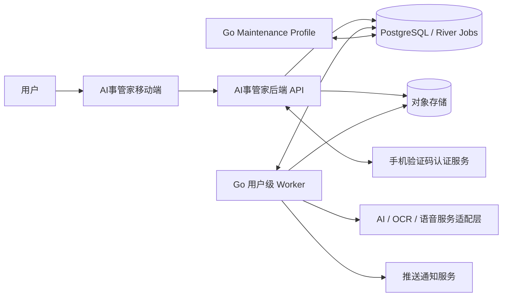
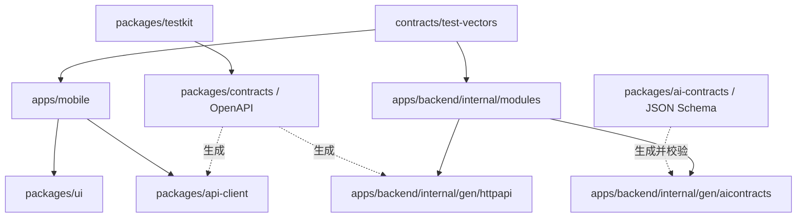
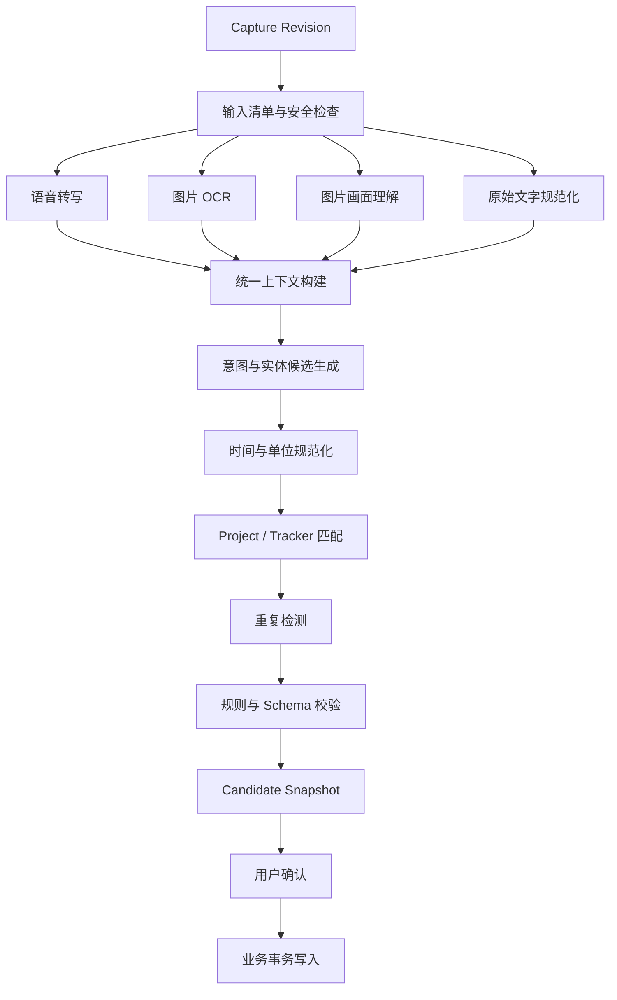
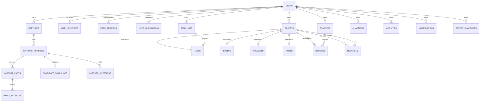
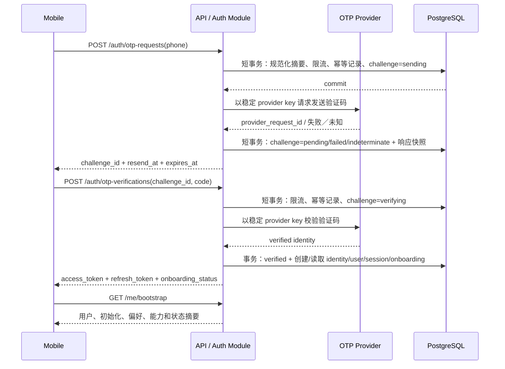
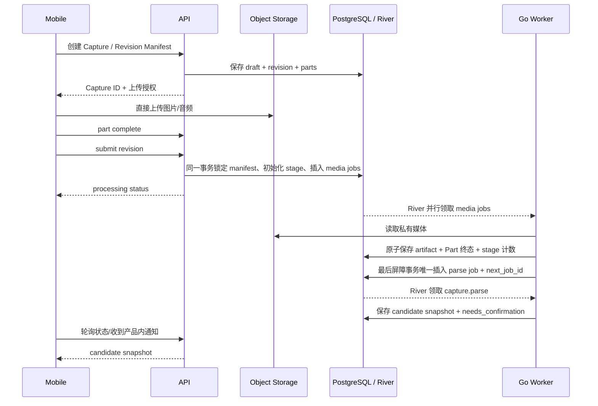
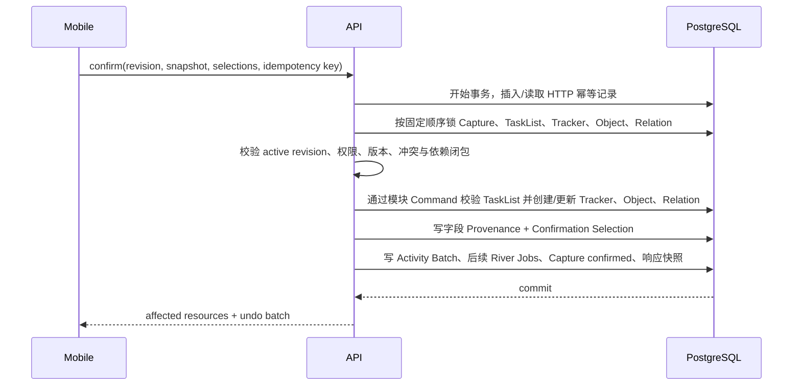

# 整体架构设计

## 0. 文档信息

| 项目 | 内容 |
|---|---|
| 文档类型 | 产品与技术整体架构设计 |
| 需求依据 | `功能规格说明.md` |
| 设计依据 | `产品设计说明.md` |
| 工程形态 | Go + TypeScript Polyglot Monorepo |
| 后端语言 | Go |
| 覆盖范围 | 移动端、Go HTTP API、Go Worker、AI、数据、存储、通知、部署与测试 |
| 目标读者 | 架构、客户端、服务端、AI、测试、运维及编码 Agent |
| 当前状态 | 评审稿 |
| 更新日期 | 2026-08-19 |

本文定义“整个产品如何放在一个大项目中，并以机器可校验的契约保持前后端一致”。功能规格决定业务行为，产品设计说明决定页面与交互，本文决定代码边界、数据流、接口、依赖和运行方式。

Go 后端、可替换 AI Runtime、Assistant、意图识别、受控工具调用和用户长期记忆的落地细节见 `后端与AI开发指南.md`。该指南不得覆盖本文的模块边界、契约治理、事务、用户隔离和“AI 不直接写库”规则。

---

# 1. 架构结论

## 1.1 核心决策

1. 使用一个 Git 仓库承载移动端、后端、共享契约、基础设施和文档。
2. 根目录使用 `Makefile` 统一编排；TypeScript 子图由 `pnpm workspace + Turborepo` 管理，Go 后端由 `go.mod` 管理并纳入根 `go.work`。
3. 移动端使用 `Expo + React Native + TypeScript + Expo Router`。
4. 后端使用 `Go + net/http + chi`，按模块化单体组织；公共 HTTP 骨架从 OpenAPI 生成。
5. HTTP API 和后台 Worker 使用同一个 Go module、两个独立 `cmd` 入口；Worker 同一二进制以普通与维护两个部署 profile 运行，数据库凭证和队列权限分离。
6. PostgreSQL 同时承载业务事实和 River Job；River 使用 `river_user`／`river_system` 两个数据库 schema 隔离用户作业与跨用户扫描，业务写入与任务入队仍用同一个 `pgx.Tx` 原子提交。MVP 不引入 Redis 队列或额外 Outbox Publisher。
7. 图片和音频存入 S3 兼容对象存储，数据库只保存受控引用和元数据。
8. `packages/contracts/openapi` 中的 OpenAPI 3.0.3 是前后端网络契约唯一来源；生成 Go 服务端接口，以及 TypeScript Client、Query Hooks、Zod 运行时校验器和 Mock，禁止两端手写同名 DTO。
9. `packages/ai-contracts` 中的 JSON Schema 2020-12 是 AI 结构化输出唯一来源；生成 Go 类型并在运行时再次验证。
10. AI 永远不能直接写数据库；所有写入必须经过业务服务、权限检查、状态机、幂等与事务。
11. Today 排序、状态转换、重复检测、时间换算等确定性规则由代码执行，不能交给模型自由判断。
12. Candidate Snapshot 与未确认 Capture 属于临时输入域；所有正式内容查询在数据库和 Repository 层只读取已确认写入的 Task、Event、Project、Note、Tracker 和 Record。
13. MVP 作为一个完整范围验收；实现可以按依赖顺序推进，但不形成对外缺功能版本。

## 1.2 为什么选择单仓库

本项目同时包含移动端、API、异步媒体处理、AI Schema 和大量共享状态。如果拆成多个仓库，最容易出现：

- App 使用旧字段，后端已经改名。
- AI 返回的候选结构与确认页不一致。
- Today 排序和状态文案在前后端各实现一份。
- 接口变更缺少跨仓库原子提交。
- 编码 Agent 只能看到一侧上下文，产生重复类型和隐式假设。

单仓库允许一次变更同时包含：功能文档、共享 Schema、后端实现、移动端适配和测试夹具，并由同一条 CI 验证。

## 1.3 架构质量目标

| 目标 | 可验证要求 |
|---|---|
| 一致性 | 共享契约变更后，移动端、后端和契约测试在同一 CI 中通过 |
| 可追溯 | AI 字段可追到实际 Capture／Object／AI Action，并定位到具体字段或 input part |
| 安全写入 | AI 输出不直接写库；确认事务幂等且可撤销 |
| 可恢复 | 媒体单项失败可重试，任务处理可安全重复执行 |
| 可解释 | 总结和搜索答案携带实际来源 ID |
| 可演进 | 模块边界清楚，MVP 先保持模块化单体，不提前拆微服务 |
| 隐私 | 原始媒体有明确授权、保留、删除和导出路径 |
| 可观测 | 一个 Capture 可通过 trace ID 串联 App、API、Worker、AI 和数据库操作 |

---

# 2. 系统上下文

## 2.1 上下文图



## 2.2 容器职责

| 容器 | 职责 | 不负责 |
|---|---|---|
| Mobile App | 输入、展示、表单校验、草稿、来源查看、用户确认 | 权威业务规则、直接访问数据库、持有 AI 密钥 |
| Go HTTP API | 鉴权、OpenAPI 契约校验、同步业务操作、查询、生成上传授权、事务内插入 River Job | 长耗时 OCR、模型解析、周期 Review |
| Go User Worker | 在用户 RLS 上下文中消费 River Job，执行转写、OCR、视觉理解、AI 解析、Review、通知、导出和用户级清理 | 面向客户端提供公共 HTTP、跨用户扫描 |
| Go Maintenance Profile | 使用独立受审计角色扫描跨用户最小元数据，并分派用户级修复／清理 Job | 媒体解析、用户 AI Job、持有普通 Worker 凭证 |
| PostgreSQL | 业务实体、状态、审计、候选结果、River Job、Reminder Schedule 和幂等结果 | 原始大文件 |
| Object Storage | 原始图片、录音、导出包 | 业务关系和权限判断 |
| AI Provider Adapter | 调用模型、语音和图片识别能力 | 自主保存或修改用户数据 |

## 2.3 信任边界

- 移动端输入、媒体内容、AI 输出和第三方回调全部视为不可信输入。
- HTTP API 是客户端进入业务系统的唯一入口。
- Worker 使用服务身份访问内部资源，不暴露公网管理接口。
- 对象存储资产默认私有，只通过短期签名 URL 上传或查看。
- 数据库权限按 API、Worker、迁移工具分离；Go 运行时账号不能修改 Schema。

---

# 3. 单仓库结构

## 3.1 目标目录

```text
steward/
├── apps/
│   ├── mobile/                    # Expo / React Native 应用
│   │   ├── app/                   # Expo Router 路由
│   │   ├── src/
│   │   │   ├── features/          # 按业务模块组织页面与状态
│   │   │   ├── components/        # App 内部组件
│   │   │   ├── infrastructure/    # API、缓存、权限、上传、通知
│   │   │   └── test/
│   │   ├── app.config.ts
│   │   └── eas.json
│   └── backend/                   # Go 模块化单体
│       ├── cmd/
│       │   ├── api/main.go        # HTTP 进程入口
│       │   ├── worker/main.go     # River Worker 入口
│       │   └── migrate/main.go    # Goose 迁移入口
│       ├── internal/
│       │   ├── bootstrap/         # 配置与依赖组装
│       │   ├── modules/           # 业务模块，只在当前 Go module 内可见
│       │   ├── platform/          # DB、Jobs、Storage、Auth、AI、Push
│       │   └── gen/
│       │       ├── httpapi/       # OpenAPI 生成；禁止手工修改
│       │       └── aicontracts/   # JSON Schema 生成；禁止手工修改
│       ├── db/
│       │   ├── bootstrap/         # River schema 前置 SQL；仅 migrate 入口执行
│       │   └── migrations/        # Goose SQL Migration，也是 sqlc Schema 来源
│       ├── integrationtest/
│       ├── oapi-codegen.yaml
│       ├── sqlc.yaml
│       ├── go.mod
│       ├── go.sum
│       └── Dockerfile
├── packages/
│   ├── contracts/                 # OpenAPI、公共 Schema、Fixture 与规则测试向量
│   ├── api-client/                # Orval 生成的 TS Client/Query Hooks/Zod/MSW
│   ├── ai-contracts/              # 服务端 AI 输入输出 JSON Schema
│   ├── ui/                        # 设计 Token 和跨功能基础组件
│   ├── config/                    # TypeScript、Lint、测试共享配置
│   └── testkit/                   # Fixture、工厂、契约测试工具
├── docs/
│   ├── README.md
│   ├── 功能规格说明.md
│   ├── 产品设计说明.md
│   ├── 整体架构设计.md
│   ├── 后端与AI开发指南.md
│   └── adr/                       # 架构决策记录
├── infra/
│   ├── docker/                    # 本地依赖与镜像
│   ├── deploy/                    # 环境部署描述
│   └── observability/             # Dashboard 与告警定义
├── scripts/                       # 仓库级脚本
├── .github/workflows/             # CI/CD
├── Makefile                        # Go 与 TypeScript 的统一入口
├── go.work                         # 根 Go workspace
├── go.work.sum
├── package.json
├── pnpm-workspace.yaml
├── turbo.json
├── tsconfig.base.json
├── .env.example
└── pnpm-lock.yaml
```

## 3.2 工作区规则

- 根 `package.json` 必须设置 `private: true`。
- TypeScript 内部包通过 `workspace:*` 引用；Go 依赖由 `apps/backend/go.mod` 和 `go.sum` 固定，禁止用本地 `replace` 进入主分支。
- `go.work` 只登记 `./apps/backend`；根目录可以执行 Go 命令，生产构建仍以该 module 的 `go.mod/go.sum` 为可复现依赖来源。
- 仓库同时提交一个 `pnpm-lock.yaml` 和后端 `go.sum`。跨语言依赖升级仍以单个 PR 完成，但不能宣称只有一份锁文件。
- TypeScript 全局开启 `strict`；Go 代码必须通过 `gofmt`、`go vet`、`golangci-lint` 和 `go test -race` 的适用检查。
- 禁止 TypeScript workspace 循环依赖和 Go package import cycle；CI 同时检查。
- React、React Native、Expo 和所有 Native Module 在仓库中只能存在一套兼容版本。
- Expo 依赖使用官方支持的 monorepo 配置，不手写过时的 Metro 路径覆盖。
- 根 `Makefile` 至少提供 `generate`、`format`、`lint`、`test`、`check`、`build`；其中 `make check` 同时执行 Go 与 TypeScript 全套检查。
- 版本号在创建工程时锁定当前稳定兼容组合，并由 lockfile、`go.mod` 与 Renovate/Dependabot 类工具管理；文档不硬编码易过期版本号。

Expo 官方支持 workspace 形式的 monorepo；pnpm 的 `workspace:` 协议可保证 TypeScript 内部依赖不会误装为公开包；Go 官方 workspace 允许根目录同时开发一个或多个本地 module。参考：[Expo Monorepo](https://docs.expo.dev/guides/monorepos/)、[pnpm Workspace](https://pnpm.io/workspaces)、[Go Workspaces](https://go.dev/doc/tutorial/workspaces)。

## 3.3 应用与包的依赖方向



强制规则：

- TypeScript `packages/*` 不得导入 `apps/*`。
- Mobile 不得导入后端、数据库或 `ai-contracts`。
- `contracts` 和 `ai-contracts` 是语言无关的 Schema 资产，不依赖 UI、数据库、Go 实现或环境变量。
- Go 后端不能导入 TypeScript 包；只导入由 OpenAPI／JSON Schema 生成到自身 module 内的 Go package。
- 权威状态机、Today 收录、重复检测、时间语义和事务规则只在 Go Domain 实现。移动端若需要离线预览，只能使用标明“非权威”的展示逻辑，服务端响应最终有效。
- 跨语言不共享可执行 Domain 代码，而共享 OpenAPI、错误码、枚举、Contract Fixture 和 JSON 规则测试向量；Go 与 TypeScript 测试必须消费同一批向量。
- `api-client` 全部由 OpenAPI 生成或薄封装，不重复声明 DTO、URL、Zod Schema 和 TanStack Query key。
- `ui` 不包含业务数据请求。
- 后端平台适配器依赖业务模块定义的接口，业务模块不直接依赖具体 AI、对象存储或推送厂商。

### 3.3.1 移动端导航壳层

- `apps/mobile` 的底部壳层只承载四个一级路由：`today`、`lists`、`notes`、`data`；内部领域名和路由保持稳定，用户可见名称统一为“首页、计划、笔记、打卡”。
- 底栏中心保留独立 `capture/new` 主操作。它在布局上占据中间槽位，但不进入 Tab 路由集合、不拥有选中态，也不保存独立滚动栈。移动端以当前一级页上方的底部聊天输入面板呈现该逻辑路由；关闭面板后仍停留在原页面。
- `projects` 是 `lists` 下由“清单详情 → 项目筛选 → 管理项目”进入的二级路由；Project 是跨 Task、Event、Note、Record 的归属容器，不与待办、日程 Tab 平级，也不在计划首屏常驻。清单详情与项目选择器复用同一 Project scope 状态，管理页继续由 `features/projects`、后端 Object Domain 和对应 Contracts 独立维护。
- `calendar` 是从计划页右上角进入的独立二级路由，不是底部 Tab、模态弹窗或新的 Object Domain。它按日期范围聚合已确认 Task、Event、重要日期与 Project 日期节点，复用计划详情层的 Project scope、时区和实体详情路由；返回时保留计划页滚动与选择状态。
- Project 管理页不调用直接创建接口；“告诉 AI 一个新目标”和 Project 详情的“新增内容”都打开 `capture/new`，分别携带 `origin=project_manager` 或可见的 `suggested_project_id` 上下文。上下文只影响候选建议，不授权客户端跳过确认或强制 AI 创建某种类型。
- 账户与设置只由首页左上角头像进入独立 Stack，不占 Tab；Search、Notification 的深链可以直接打开任一正式实体，返回时回到原来源。
- App Shell 在首页、计划、笔记、打卡和设置 Stack 上方挂载同一个 `AIAssistantFab`，点击后展示 `AIConversationSheet`。两者读取 Capture Questions Query，不复制问题正文到全局 Store；中央 `capture/new` 不读取待答数量，也不显示角标。`AIAssistantFab` 的停靠侧与归一化纵向位置属于纯展示会话状态，由轻量 Store 跨页面共享，不进入 API、Capture Query 或业务状态机；Web 静态预览可以将同样的非业务值保存到本地偏好，原生端不因此新增存储依赖。拖动范围由页面布局计算并始终限制在安全区。Capture 编辑／确认页改用自身内联状态并隐藏悬浮入口。无 open question、processing 或 ready question 时不渲染入口。
- 首页的 4×2 生活场景入口由 `today` 页面编排，场景页面归属 `features/[slug]` 二级路由，不增加第五个一级模块。运动使用静态优先的 `features/exercise/*` 嵌套路由承载首页、准备、进行中、总结和历史页面，其余轻量场景仍可使用 `features/[slug]`；静态路由只细化页面流程，不改变一级导航或领域所有权。运动、番茄钟与记账组合 Tracker / Record，食谱与购物组合 Note / TaskList / Task，重要日投影 Event 与日期字段，复盘读取 Review，“更多”只聚合二级导航。行程使用静态优先的 `trips` 与 `trips/[id]` 路由承载总览和详情，作为 Project 及其关联 Event、Task、Note、附件和 Relation 的聚合读模型；它不复用 `calendar` 的呈现层，也不新增 Trip 领域或平行数据表。原型阶段可以使用本地状态验收交互；接入后端后，所有正式创建／更新必须通过生成的 API Client、既有领域服务和确认流程，场景页不得手写重复 DTO 或让 AI 直接写库。
- `features/workouts` 使用 Expo Location 进行仅前台的 GPS 采集，使用 MapLibre React Native 加载 CDN 上的 PMTiles 地图样式。客户端确定性过滤低精度、漂移、瞬移和断档坐标，按路线段计算距离、平均配速或平均速度；暂停、确认退出和页面卸载时停止订阅。原始坐标只存在于当前会话，不上传、不持久化；总结页经用户确认后仅将时长、距离等结果通过既有 Tracker / Record 契约保存。当前不提供后台定位、会话恢复或计步器能力。
- 食谱使用静态优先的 `features/recipes/*` 嵌套路由承载本周菜单、发现、问卷、菜谱详情、烹饪和购物确认，`features/recipes` 模块只保存非权威的前端菜谱模型和场景状态。发现分类由服务端查询；时令食材的自然上市月份由离线模型调用生成并经 Schema 校验，再由确定性代码归并成春、夏、秋、冬四季。菜谱打标和当前季节过滤均由确定性代码完成，服务端按中国时区自动切季，线上请求不调用模型。本周菜单中的营养数值属于计划估算，只有用户确认进食记录后才能通过正式 Tracker / Record 契约形成实际摄入；两种口径不得复用同一状态字段。外部菜谱必须记录来源、作者、图片权利、授权范围和内容版本。个人收藏或补充说明继续复用 Note，确认后的采购需求继续复用 TaskList / Task；菜单采用、加入某餐和生成购物清单均由确定性服务校验并经用户确认。
- 专注场景使用稳定路由 `focus`，`features/focus` 只保存非权威的前端计时模型、Today Task 展示引用、会话内想法和本地预览记录；路由根部 Provider 只用于原型期间跨页面保留状态，不承担正式持久化。计时、暂停、休息和完成流当前由客户端确定性状态驱动，不安装后台任务或通知依赖，也不构成跨端权威状态机。正式接入时，Task 完成与专注 Record 必须分别调用既有领域接口并保留用户确认；后台恢复、跨设备同步、Tracker Schema、Record 字段和时间语义需要先完成契约设计，本地 `FocusRecord` 不得直接提升为网络 DTO。
- 记账场景仍由 `features/[slug]` 路由承载，`features/ledger` 只保存非权威的前端账单 Fixture、月度展示统计与图片识别交互状态。当前拍照／相册入口只模拟来源选择和识别候选，不申请真实媒体权限、不上传图片，也不构成 OCR 或账单导入实现。正式接入时，原始媒体先进入统一 Capture 媒体链路，OCR／AI 只生成可编辑候选；用户确认后由 Go Domain 执行金额、时间、单位、重复检测和 Record 投影。账单图片不得写入日志、埋点或普通测试快照，本地 `LedgerEntry` 不得直接提升为网络 DTO。
- 重要日场景仍由 `features/[slug]` 路由承载，`features/important-dates` 只保存非权威的前端 Fixture、新增草稿、日期选择与展示排序状态。生日、纪念日、到期日和其他只属于前端交互预设，不创建新的 Object Domain；正式保存统一通过生成的 API Client 写入 `event_kind=important_date` 的全天 Event，并由 Go Domain 处理年度重复、2 月 29 日、当地 09:00 提醒与日历投影。当前原型不申请通知、联系人或系统日历权限，本地 `ImportantDateKind` 不得直接提升为网络字段。
- 购物场景仍由 `features/[slug]` 路由承载，`features/shopping` 只保存非权威的前端商品 Fixture、新增／编辑草稿、品类展示和完成折叠状态。路由层统一提供右上角新增入口，场景组件复用同一底部面板处理新增与编辑；表单只提交名称、数量／规格和可选备注，不在客户端维护独立单位或权威品类。正式购物清单继续由 Lists 模块的 TaskList / Task 承载，品类由服务端确定性逻辑或经用户确认的 AI 候选返回并允许重新归类；本地关键词只模拟返回结果。当前 `ShoppingItem`、数量／规格、品类、备注和来源不是网络 DTO；需要持久化时必须先扩展 Contracts、生成代码和跨端测试，场景页不得绕过 Lists Command 直接写库。
- 导航层级变化只影响 App Shell 和路由归属，不合并业务边界。`features/notes`、`features/trackers`、`features/records` 以及对应后端模块和 Contracts 继续独立维护。
- 四个一级路由各自保存滚动位置和查询缓存。打开 Capture、确认页或详情页时隐藏中央主操作，防止重复主操作和安全区遮挡。

## 3.4 文件与命名

- 包名使用 `@steward/*`，例如 `@steward/contracts`。
- TypeScript 文件和目录使用小写连字符或项目统一的英文命名。
- Go package 使用简短小写英文名；导出标识符遵循 Go 命名习惯，生成代码统一放在 `internal/gen`。
- 代码注释、提交信息、用户文案和团队文档统一使用中文。
- Go 导出标识符需要注释时，以标识符开头并使用中文解释，例如 `// CaptureService 负责……`。
- API、数据库和领域类型使用稳定英文名；中文术语在文档词汇表中映射。
- 每个业务模块必须有 `README.md`，说明职责、入口、公开接口、事件和禁止依赖。

---

# 4. 事实来源与契约治理

## 4.1 事实来源优先级

| 层级 | 来源 | 决定内容 |
|---:|---|---|
| 1 | 功能规格 | 业务规则、状态、边界和验收 |
| 2 | 产品设计说明 | 页面、交互、视觉与用户文案 |
| 3 | 整体架构设计与 ADR | 系统边界、技术实现和依赖原则 |
| 4 | `packages/contracts` | 实际网络字段、枚举、错误码和 API 版本 |
| 5 | `packages/ai-contracts` | AI 结构化输入输出格式 |
| 6 | 数据库迁移 | 已部署的数据结构历史 |

冲突处理：

- 代码与文档冲突时，不允许私自选择一边；PR 必须同时修正文档或代码。
- 功能行为变更先更新功能规格，再更新设计、契约、实现和测试。
- 纯实现变更不改变产品行为时，更新架构或 ADR，不修改功能规格。
- 契约和数据库迁移必须兼容已经发布的 App，不能假设所有用户立即升级。

## 4.2 API 契约唯一来源

`packages/contracts` 必须包含：

```text
packages/contracts/
├── openapi/
│   ├── openapi.yaml          # OpenAPI 3.0.3 根文件
│   ├── paths/                # 按业务模块拆分的 Path Item
│   └── components/
│       ├── schemas/          # DTO、枚举、错误和来源结构
│       ├── parameters/
│       ├── responses/
│       └── security/
├── fixtures/                 # 成功、失败与兼容响应样例
├── test-vectors/             # 状态机、时间、判重等跨语言用例
├── dist/openapi.bundle.yaml  # 生成产物，供两端代码生成
└── package.json              # lint、bundle、breaking-check 脚本
```

每个接口同时定义：

- Path、方法和权限。
- Path Params、Query、Headers 和 Body Schema。
- 成功响应 Schema。
- 业务错误码。
- 幂等要求。
- 最低兼容 API 版本。

构建产物（所有生成器只读取 lint、bundle 通过后的 `dist/openapi.bundle.yaml`，不分别解析拆分源文件）：

- `apps/backend/internal/gen/httpapi`：Go DTO、Chi Server Interface 和 Strict Server 包装层。
- `packages/api-client/src/generated`：TypeScript DTO、Fetch Client、TanStack Query Hooks、Zod 运行时校验器和 MSW Mock。
- `packages/contracts/dist/openapi.bundle.yaml`：可发布、可比较的单文件契约快照。

OpenAPI 文件是源码，Go Handler 注解或 TypeScript interface 都不能反向成为事实来源。当前固定 OpenAPI 3.0.3，是因为选定的 `oapi-codegen v2` 稳定支持 OpenAPI 3.0；在生成器正式支持并完成兼容评估前，不使用实验性的 3.1 路径。

后端使用 `oapi-codegen` 的 `chi-server + strict-server` 生成请求绑定、DTO 和类型化响应接口；鉴权、资源归属和业务校验仍由明确 Middleware／Application Service 执行，不能误以为代码生成自动完成授权。移动端以两个 Orval project 读取同一 bundle：一个生成 Fetch／TanStack Query／MSW，一个生成 Zod Schema；公共 Fetch mutator 在返回业务数据前运行对应响应 Schema。参考：[oapi-codegen](https://github.com/oapi-codegen/oapi-codegen)、[Orval](https://orval.dev/docs/)、[Orval Client with Zod](https://orval.dev/docs/guides/client-with-zod/)。

Handler 只能返回生成的响应类型，禁止直接写任意 `map[string]any`。请求入口执行 OpenAPI 校验；响应通过生成类型、`additionalProperties: false` 和 Contract Fixture 校验限制字段。CI 运行 `make generate` 后要求工作区无差异，防止 Go Server 与 TypeScript Client 漂移。

## 4.3 契约变更规则

| 变更 | 规则 |
|---|---|
| 新增可选字段 | 可在当前 API 主版本增加 |
| 新增封闭状态枚举值 | 视为破坏性变更；必须先通过 capabilities／最低 App 版本建立兼容路径 |
| 新增可扩展展示枚举值 | 仅当 Schema 从一开始声明为 string-compatible 且 App 映射 unknown fallback 时允许；仍需兼容性测试 |
| 字段改名／删除 | 先新增替代字段并双读，至少跨一个 App 最低支持周期后删除 |
| 改变字段语义 | 新字段或新 API 主版本，禁止原地改变 |
| 错误码新增 | 客户端 unknown fallback 显示通用错误和 trace ID |
| 日期改为时间 | 视为破坏性变更，例如 `due_date` 不能直接变成 `due_at` |

CI 必须执行：

1. OpenAPI lint 与 bundle。
2. 生成 Go Server、Go DTO、TypeScript Client、Zod Schema 和 MSW Mock。
3. OpenAPI 破坏性差异检查。
4. Go 与 Mobile Contract Fixture 测试。
5. 生成后工作区无未提交差异。

## 4.4 AI 契约

`packages/ai-contracts/schemas/*.json` 使用 JSON Schema 2020-12，与公共 API 契约分离，原因是：

- App 不需要知道 Prompt、模型或中间推理结构。
- AI Schema 迭代速度高于公共 API。
- 模型输出不应直接等于数据库写入对象。

每个 AI Schema 必须包含：

- `schema_version`。
- 输入引用，不复制不必要的原始隐私内容。
- 严格枚举和字段约束。
- 字段置信度、`source_refs` 和 `inference_type`。
- 冲突、警告和 unresolved questions。
- 禁止额外未知字段。

生成与验证链路：

1. JSON Schema 是唯一源码，`go-jsonschema` 生成 `internal/gen/aicontracts` 的 Go 类型。
2. `make generate` 同时把规范化 Schema 复制到 `internal/gen/aicontracts/schemas`，生成包含 schema name、version、SHA-256 的 registry，并用 `//go:embed schemas/*.json` 编进 API／Worker 二进制；运行时不依赖仓库路径或容器外置文件。
3. 每个 Job／Use Case 从受版本控制的 Prompt 配置取得“期望 schema name + version”，registry 启动时编译并缓存对应 `jsonschema/v6` validator；禁止先信任模型返回的 `schema_version` 再选择校验器。
4. Provider 返回值先作为原始 JSON 按期望 Schema 验证，再确认载荷内 `schema_version` 与期望版本一致；验证通过后反序列化到生成类型，并经过来源、权限、时间和领域规则校验。
5. Registry 缺失、重复版本、摘要不匹配或 Schema 编译失败都使进程启动失败；任何运行时校验失败都不能进入确认快照，更不能写正式实体。
6. Canonical Schema、嵌入副本、registry、生成工具版本和 Prompt 版本都提交到仓库；生成 Go 文件和嵌入副本禁止手改，CI 重生成后要求无差异。

参考：[go-jsonschema](https://github.com/omissis/go-jsonschema)、[jsonschema/v6](https://github.com/santhosh-tekuri/jsonschema)。

## 4.5 前后端对齐矩阵

功能名必须沿 App Feature、Backend Module、Contracts 目录、测试目录和可观测标签保持一致。Backend 列路径相对于 `apps/backend/internal`：

| 能力 | App | Backend | Contracts | 异步职责 |
|---|---|---|---|---|
| Auth / Onboarding | `features/auth` | `modules/auth`、`modules/users` | `auth`、`users` | 无；OTP Provider 为同步适配器 |
| Capture | `features/capture` | `modules/captures`、`media` | `captures`、`provenance` | `media`、`ai` Queue |
| Today | `features/today` | `modules/today` | `today` | Daily Brief 由 `ai` Queue 生成 |
| 清单 | `features/lists`、`tasks`、`events`、`projects` | `modules/lists`、`objects` | `lists`、`objects`、`reminders` | 提醒重建走 `notification` Queue |
| 笔记 | `features/notes` | `modules/objects` | `objects` | Search Index 异步更新 |
| Project | `features/projects` | `modules/objects`、`reviews` | `objects`、`reviews` | Project Summary 走 `ai` Queue |
| Data（用户可见“打卡”） | `features/trackers`、`records` | `modules/trackers`、`objects` | `trackers`、`objects` | Data Summary / Search Index |
| Search | `features/search` | `modules/search` | `search`、`operations` | `search`、`ai` Queue |
| Activity / Undo | `features/activity` | `modules/activity` | `activity` | 事务内按需插入 River Job |
| 通知 | `features/notifications` | `modules/notifications` | `reminders`、`notifications` | DB Scheduler + `notification` Queue |
| 隐私／导出／删除 | `features/settings` | `modules/exports`、`retention`、`auth` | `settings`、`exports`、`retention` | 用户作业走 `export/retention`；跨用户扫描走 `system` |

模块 README 必须用这张矩阵中的名称，并列出：功能规格章节、页面 ID、公开 API `operationId`、表所有权、River Job kind 和验收场景 ID。测试名称可附 `AT-xxx`，使编码 Agent 能从一个失败测试回到业务规则；不得依赖仅存在于任务对话中的别名。

---

# 5. 技术栈

## 5.1 仓库与语言

| 层 | 选择 | 说明 |
|---|---|---|
| 语言 | TypeScript（Mobile）+ Go（Backend） | 通过语言无关契约对齐，不复制 DTO |
| 依赖管理 | pnpm workspace + Go Modules | TypeScript 和 Go 各自使用原生依赖系统 |
| 根任务编排 | Makefile | 统一 `generate/check/build`；内部调用 Turbo 与 Go 工具链 |
| TypeScript 任务 | Turborepo | Mobile、Client、UI 的 build、test、lint、typecheck 缓存 |
| 代码质量 | ESLint + Prettier；gofmt + go vet + golangci-lint | 两套语言各用标准工具，根命令统一结果 |
| 测试 | Vitest + Maestro；Go `testing` + Testcontainers | 单元、契约、集成和移动端端到端 |

## 5.2 移动端

| 能力 | 选择 |
|---|---|
| 框架 | Expo + React Native |
| 路由 | Expo Router |
| UI 基础组件与 Token | Tamagui 负责品牌组件与 Token；Expo UI 提供分段控件等平台原生标准输入，滑杆使用 Expo 官方支持的 `@react-native-community/slider`；统一从 `packages/ui` 二次封装后导出 |
| 图标 | Phosphor React Native 为通用默认；经评审的成熟领域图标库按整组接入；统一从 `packages/ui/Icon` 语义映射后导出 |
| 服务端状态 | TanStack Query |
| 本地 UI 状态 | Zustand；只存跨组件瞬时状态 |
| 表单 | React Hook Form + 共享 Schema 适配 |
| 网络运行时校验 | Orval 从 OpenAPI 生成 Zod；请求提交前与响应解包前校验 |
| 安全凭证 | 平台安全存储封装 |
| 本地草稿 | SQLite 封装；不保存未加密的长期令牌 |
| 上传 | 支持进度、取消和后台恢复的上传适配层 |
| 推送 | Expo Notifications 适配层 |

Expo Router 使用文件路由并支持深链，适合把通知与来源链接稳定映射到页面；TanStack Query 官方提供 React Native 的网络、焦点和在线状态接入方式。Tamagui 负责可主题化基础组件和跨平台 Token；Expo UI 提供分段控件等标准输入，滑杆采用 Expo 官方支持的 `@react-native-community/slider`，两者都必须经 `packages/ui` 品牌适配后使用。Phosphor React Native 提供通用图标语言；默认图标库无法覆盖完整领域语义时，可以整组接入经评审、授权清晰的成熟图标库，例如运动模式使用 Pictogrammers Material Design Icons。所有字形仍由 `packages/ui/Icon` 完成语义映射与光学校准；Feature 只能依赖品牌封装，不直接导入底层 UI 或图标包，也不得在页面中写裸色值或自行维护 SVG。参考：[Expo Router](https://docs.expo.dev/router/introduction/)、[TanStack Query React Native](https://tanstack.com/query/latest/docs/framework/react/react-native)、[Tamagui Expo Guide](https://tamagui.dev/docs/guides/expo)、[Expo UI](https://docs.expo.dev/versions/latest/sdk/ui/)、[React Native Community Slider](https://docs.expo.dev/versions/latest/sdk/slider/)、[Phosphor React Native](https://www.npmjs.com/package/phosphor-react-native)。

## 5.3 后端与基础设施

| 能力 | 选择 |
|---|---|
| 语言与并发 | Go；所有 I/O 接收并传播 `context.Context` |
| HTTP | 标准库 `net/http` + chi |
| API 生成 | OpenAPI 3.0.3 + oapi-codegen strict Chi server |
| 数据库 | PostgreSQL |
| 驱动与连接池 | pgx/v5 |
| 数据访问 | 手写 SQL + sqlc 生成类型安全查询 |
| Migration | Goose SQL Migration |
| 后台任务 | River（PostgreSQL Job Queue） |
| 文件 | S3 兼容对象存储 |
| 搜索 | PostgreSQL Full Text + 向量扩展的混合检索 |
| 可观测 | OpenTelemetry + 标准库 `log/slog` JSON 日志 + Error Tracking |
| 本地环境 | Docker Compose 提供 PostgreSQL 和 S3 兼容对象存储替代服务 |

实现时所有具体版本写入根依赖目录和 lockfile；架构文档只固定能力与边界，避免文档版本落后于工程。

Chi 保持标准 `net/http` 兼容；sqlc 从 SQL 生成 Go 查询代码并可绑定 `pgx.Tx`；Goose 管理增量 SQL 迁移；River 可与业务数据在同一个 PostgreSQL 事务中插入 Job。参考：[chi](https://github.com/go-chi/chi)、[sqlc](https://docs.sqlc.dev/en/stable/)、[sqlc 事务](https://docs.sqlc.dev/en/latest/howto/transactions.html)、[Goose](https://pressly.github.io/goose/)、[River](https://github.com/riverqueue/river)。

River 仍按至少一次执行设计：Worker 崩溃、超时或人工重试都可能让 Handler 再次运行。所有外部副作用和业务结果仍须使用稳定幂等键，不能因为 Job 与业务写入同库就假设 Handler 绝对只执行一次。

---

# 6. 移动端架构

## 6.1 分层

```text
Route / Screen
    ↓
Feature UI + Form
    ↓
Feature Hook / Use Case
    ↓
Generated API Client / Local Draft Repository
    ↓
HTTP / SQLite / Secure Storage / Native Capability
```

职责：

- Route 只负责导航参数、页面级加载和错误边界。
- Feature UI 只负责展示、输入和交互组合。
- Feature Hook 负责编排请求、缓存失效、乐观更新和用户反馈。
- API Client 处理鉴权、trace ID、错误映射、重试和契约解析。
- Native Capability 封装麦克风、相机、相册、推送和后台上传。

## 6.2 路由结构

```text
apps/mobile/app/
├── _layout.tsx
├── (auth)/
│   └── login.tsx
├── onboarding/
│   └── index.tsx
├── (tabs)/
│   ├── _layout.tsx
│   ├── today.tsx
│   ├── lists.tsx
│   ├── notes.tsx
│   ├── data.tsx
├── capture/
│   ├── new.tsx
│   ├── recent.tsx
│   └── [captureId]/
│       ├── processing.tsx
│       └── confirm.tsx
├── tasks/[id].tsx
├── events/[id].tsx
├── notes/[id].tsx
├── lists/
│   ├── [id].tsx
│   └── projects.tsx
├── records/[id].tsx
├── projects/[id].tsx
├── trackers/
│   ├── new.tsx
│   └── [id]/
│       ├── index.tsx
│       └── records/new.tsx
├── search.tsx
├── notifications.tsx
├── reviews/weekly/[period].tsx
├── activity.tsx
└── settings/
    ├── index.tsx
    ├── preferences.tsx
    ├── ai.tsx
    ├── notifications.tsx
    ├── privacy.tsx
    ├── captures/
    │   ├── index.tsx
    │   └── [id].tsx
    ├── deleted.tsx
    ├── export.tsx
    └── account/delete.tsx
```

路由参数必须使用 `packages/api-client` 中由 OpenAPI 生成的 ID／query Zod Schema 解析，禁止让 Mobile 直接导入语言无关源码目录或直接信任字符串。

## 6.3 Feature 目录

```text
src/features/capture/
├── api/               # 只调用生成 client
├── components/
├── hooks/
├── model/             # 编辑器本地状态和 view model
├── screens/
├── utils/
└── test/
```

业务模块与后端同名：`auth`、`capture`、`today`、`lists`、`tasks`、`events`、`projects`、`notes`、`trackers`、`search`、`reviews`、`notifications`、`settings`、`activity`。

## 6.4 状态管理

| 状态类型 | 存放位置 | 示例 |
|---|---|---|
| 服务端事实 | TanStack Query Cache | Today、Project、Capture 状态、Open AI Question |
| 页面表单 | React Hook Form | Task 编辑、确认页字段 |
| 跨页面临时状态 | 轻量 Store | 当前 Capture 草稿引用、全局 Snackbar |
| 可恢复草稿 | SQLite | 未提交文字、媒体本地 URI、图片顺序 |
| 凭证 | Secure Storage | Access / Refresh Token |
| 设计偏好 | Async Settings | 最近筛选、动态字号适配记录，不含敏感正文；不存主题开关 |

规则：

- 不复制服务端实体到全局 Store。
- Query Key 只使用 Orval 生成的 key factory；Feature 可以在自己的 API adapter 中组合失效范围，但不得重新手写 URL 数组或第二套 key 常量。
- 写入成功后按契约返回的 `affected_resources` 精确失效缓存。
- 乐观更新只用于可逆、确定的简单操作，例如 Task 完成；Capture 确认、删除 Project 等事务不乐观写入。
- App 重新进入前台时刷新 Today、当前清单／笔记／数据查询和正在处理的 Capture；未确认 Capture 只刷新“最近输入”计数，不并入正式内容 Query Key。
- 全局 `AIAssistantFab + AIConversationSheet` 使用服务端 `open questions` Query；中央 Capture 按钮不订阅该 Query。轻量 Store 只保存当前展开的 `question_id`、面板开合，以及不含业务数据的悬浮入口停靠侧与归一化纵向位置，不保存问题正文、回答或 Candidate。回答成功后按响应中的 `affected_resources` 失效 open questions、对应 Capture 与 Operation，正式内容 Query 仍保持隔离。

## 6.5 Capture 本地模型

Capture 草稿保留：

```text
local_draft_id
server_capture_id?
active_revision?
input_mode
text?
audio_local_uri?
audio_duration?
images[] { local_id, uri, sequence, quality_warning? }
upload_state
updated_at
```

- 文字与音频互斥由本地 reducer 和共享测试保证。
- 图片最大数量、格式和大小先在客户端检查，后端再次验证。
- 提交后生成服务器 revision；修改输入不覆盖旧 revision。
- 离线草稿不自动上传；恢复网络后让用户确认。
- 用户登出时，本地未提交草稿要求保留到该账号或删除，不得进入其他账号。

## 6.6 API Client

Client 统一处理：

- API Base URL 与环境。
- Access Token 注入和一次安全刷新。
- `Idempotency-Key` 生成与复用。
- `If-Match` / entity version。
- `X-Request-ID` 和客户端版本。
- 超时、网络失败、业务错误映射。
- 响应 Schema 校验；服务端返回不合约时进入可观测错误，不把未知结构渲染到页面。

Orval 的 HTTP Client 与 Zod project 必须读取同一个 OpenAPI bundle。公共 Fetch mutator 对状态码选择对应响应 Schema，校验成功后才返回给 TanStack Query；校验失败记录 request ID、operationId 和 Schema issue，不记录完整敏感响应。表单可复用生成的请求 Zod Schema，并在 Feature 层叠加只影响本地交互的规则，但不得复制或放宽网络字段约束。

禁止 Feature 直接调用 `fetch`。

## 6.7 上传流程

1. App 创建 Capture draft / revision manifest。
2. API 返回每个媒体 part 的短期上传授权和 asset key。
3. App 直接上传到对象存储，显示逐项进度。
4. App 告知 API 某 part 上传完成，携带大小、类型和内容哈希。
5. API 校验对象元数据后将 part 置为 uploaded。
6. 所有保留 part 就绪后，App 提交 revision。

上传规则：

- 支持单项重试，复用 part ID。
- 同一内容哈希和 revision 不重复创建资产。
- 签名 URL 过期时向 API 重新申请，不创建新 part。
- App 只能上传到服务器分配的用户隔离路径。
- 后端不信任客户端上报 MIME、文件扩展名和大小，异步执行实际类型检查。

## 6.8 离线与缓存

- 已缓存页面只读可用，统一显示数据时间。
- 只有 Capture 草稿支持离线写入。
- 业务实体修改、确认保存、AI 和搜索要求联网。
- 网络恢复后刷新用户正在看的实体版本；有冲突时进入版本比较，不自动覆盖。

---

# 7. 后端总体结构

## 7.1 模块化单体

MVP 不拆微服务。所有业务模块在一个后端工程中，以明确接口和数据库所有权隔离；HTTP API 与 Worker 是两个进程入口。

优势：

- Capture 确认可以使用单数据库事务。
- OpenAPI、规则测试向量和验收口径统一；权威 Domain 只在 Go 实现。
- 部署和本地开发成本可控。
- 后续只有在性能、团队或隔离要求真实出现时再拆服务。

## 7.2 后端目录

```text
apps/backend/
├── cmd/
│   ├── api/main.go
│   ├── worker/main.go
│   └── migrate/main.go
├── internal/
│   ├── bootstrap/
│   │   ├── config.go
│   │   ├── api.go
│   │   ├── worker.go
│   │   └── lifecycle.go
│   ├── gen/
│   │   ├── httpapi/          # oapi-codegen 产物
│   │   └── aicontracts/      # go-jsonschema 产物
│   ├── modules/
│   │   ├── auth/
│   │   ├── users/
│   │   ├── assistant/
│   │   ├── memory/
│   │   ├── captures/
│   │   ├── media/
│   │   ├── objects/
│   │   ├── trackers/
│   │   ├── relations/
│   │   ├── lists/
│   │   ├── today/
│   │   ├── search/
│   │   ├── scheduler/
│   │   ├── reviews/
│   │   ├── notifications/
│   │   ├── activity/
│   │   ├── exports/
│   │   └── retention/
│   └── platform/
│       ├── database/         # pgxpool、事务和 RLS 上下文
│       ├── jobs/             # River Client、队列配置和公共 Middleware
│       ├── storage/
│       ├── auth/
│       ├── ai/
│       ├── push/
│       ├── telemetry/
│       └── clock/
├── db/
│   ├── bootstrap/
│   │   └── river_schemas.sql  # 幂等创建／校验 river_user 与 river_system
│   └── migrations/            # sqlc 直接按顺序读取，不维护第二份业务 Schema
├── integrationtest/
├── oapi-codegen.yaml
├── sqlc.yaml
├── go.mod
└── go.sum
```

## 7.3 模块内部模板

```text
internal/modules/captures/
├── domain/              # 纯实体、值对象、状态机和领域错误
├── application/         # Use Case / Transaction Script
├── ports/               # Repository、Storage、AI 等最小接口
├── repository/
│   ├── queries/         # 本模块 sqlc SQL 源码
│   ├── dbgen/           # 本模块 sqlc 产物；禁止手改
│   └── postgres.go      # Repository 实现
├── httpapi/             # 生成 HTTP DTO 与 Application 的映射
├── jobs/                # River JobArgs 和 Worker
├── module.go            # 显式组装与公开服务
└── *_test.go
```

依赖方向：`httpapi` 和 River Worker 调用 Application；Application 调用 Domain 与 Ports；Repository／Provider Adapter 实现 Ports。Domain 不导入 chi、pgx、sqlc 生成包、River、OpenAPI DTO 或模型 SDK。

- `internal` 保证仓库外代码不能导入后端实现；模块间依赖再由 `golangci-lint/depguard` 和架构测试约束。
- HTTP DTO、Domain Entity 和数据库 Row 是三种不同类型，只在边界显式映射；禁止把生成 DTO 当数据库模型。
- 每个模块的 sqlc 查询只放在自己的目录并生成独立 Go package；所有 package 共同读取 `db/migrations` 作为 Schema 历史，禁止维护第二份手写 Schema 快照。模块不得借助通用 db package 查询其他模块私表。
- 所有阻塞 I/O 都接收 `context.Context`；不得在 Handler 或 Worker 中创建脱离生命周期、无法取消的 goroutine。

## 7.4 模块所有权

| 模块 | 拥有数据 | 公开能力 |
|---|---|---|
| Auth | `auth_identities`、`auth_challenges`、`auth_rate_limits`、`auth_request_records`、`user_sessions`、短期再次验证凭证 | 发送／校验验证码、刷新与注销会话、再次验证 |
| Users | `users`、`user_onboarding`、`user_consents`、`user_preferences` | 已验证身份建号、bootstrap、初始化、偏好与同意管理 |
| Assistant | Assistant Thread、Message、Turn、Tool Call、Action Proposal 与跨功能 AI Action 审计 | 提交对话 Turn、读取消息、受控工具编排、确认／拒绝建议 |
| Memory | Learned Memory、Evidence、Revision、Embedding 与 Relearn Block | 提议、确认、修改、检索、删除长期记忆 |
| Captures | Capture、Revision、Part、Candidate | 草稿、提交、状态、确认 |
| Media | 媒体元数据、派生 Artifact | 上传校验、转写、OCR、删除 |
| Objects | Object 基表及 Task/Event/Project/Note/Record | CRUD、状态转换、软删除 |
| Lists | TaskList、默认清单规则和清单读模型 | TaskList 管理、任务／日程／项目聚合查询 |
| Trackers | Tracker 与 Schema | Schema 管理、Record 验证 |
| Relations | Object Relation、Provenance Link | 关联、来源、失效 |
| Today | 当天读模型 | Today 查询和确定性排序 |
| Search | Search Document、Embedding | 关键词和自然语言检索 |
| Scheduler | 无独占事实表 | 空闲时段计算和建议 |
| Reviews | Review Snapshot、Metric | Daily / Weekly / Project / Data Summary |
| Notifications | Reminder、Schedule、Notification、Delivery | 提醒规则、可恢复调度、发送、读取 |
| Activity | Activity、Undo Batch | 审计和即时撤销 |
| Exports | Export Job、Artifact | 数据导出 |
| Retention | 删除请求、资源清理状态和策略状态 | 过期、永久删除、账号清理和完成校验 |

模块不得直接查询其他模块私有表。跨模块同步读取优先调用应用接口；复杂 Today/Search 读模型允许使用明确登记的只读查询，并由拥有模块提供稳定 View。

Assistant 的默认对话连续性由服务端确定：Application 通过 Users 公开的时区能力计算当地自然日边界，再在 Assistant 自有 Message 表中按最近用户消息选择 active Thread。客户端只调用 `GET /v1/assistant/threads/current`，不根据设备时钟或 Assistant 回复时间猜测“今天”。`POST /v1/assistant/threads` 在无标题且未要求 `force_new` 时复用同一选择结果；显式新建仍创建独立 Thread。

## 7.5 API 与 Worker 入口

### API 入口

- 解析环境配置并做启动校验。
- 建立 `pgxpool`、固定到 `river_user` schema 的 River insert-only Client、对象存储和 Provider 连接；API 不能初始化 `river_system` Client。
- 组装 `oapi-codegen` Strict Server 实现，并挂载到 chi Router。
- 按固定顺序注册：可信代理 IP → 请求 ID／Trace → Recovery → 总体超时 → Body 大小 → 凭证解析 → OpenAPI 请求结构与 Security 校验 → 限流 → HTTP 幂等 → Handler／Application 资源授权 → 错误映射。
- 凭证解析只验证格式、签名、issuer、audience 和基础时效，把 Access／Refresh／Reauth／DeletionStatus credential 放入类型化 context，不在这一层形成 principal。kin-openapi request validator 的唯一 `AuthenticationFunc` 按生成的 `operationId + security requirements` 校验 scheme；普通 Access operation 用 token 中的 `session_id + user_id` 查询 Auth／Users 最小状态，确认 Session 未撤销、未被替换、未过期且 User `status=active` 后才形成 Access principal。唯一例外是账号删除 POST 的 DeletionAcceptanceReplay：结构校验通过后，AuthenticationFunc 只可按 10.9 的完整匹配条件形成 replay principal。随后 HTTP 幂等中间件解密并短路响应，Handler 和用户业务事务均不会运行。禁止 Router group 或 Handler 再实现第二套 token 判定；Handler／Application 只做普通 principal 对具体资源的授权。
- 提供 `/health/live` 与 `/health/ready`。
- `http.Server` 设置 Header、Read、Write、Idle 超时；优雅停止时不再接收新请求，并等待进行中的短事务结束。

### Worker 入口

- 连接同一 PostgreSQL，注册 River Worker 和各命名 Queue 的并发数。
- 启动时必须选择且只能选择一个 `WORKER_PROFILE`：`user` profile 使用 `steward_worker`、River schema `river_user` 并处理 `media/ai/search/notification/export/retention`；`maintenance` profile 使用 `steward_maintenance`、River schema `river_system`，只处理 `system` Queue 的跨用户扫描和清理协调任务。
- Profile、数据库实际角色和 Queue allowlist 启动时互相校验；不匹配立即退出。普通 Worker 进程不得加载维护凭证，维护进程不得执行媒体解析或用户 AI Job。
- 每个 Worker 使用明确的 Go `JobArgs` 类型，声明稳定 kind、幂等键、超时、重试分类和可观测属性。
- 优雅停止时停止领取新任务，并完成或安全释放当前任务。
- 同一 Job 可以重复投递，但业务结果必须保持一次。

## 7.6 跨模块事务边界

模块化单体共享一个 PostgreSQL，但禁止编排服务直接操作其他模块私表。跨模块写入通过公开 Command Handler 完成；Handler 接收同一个 `pgx.Tx` 绑定的 `TransactionContext`，不得自行提交事务。

Capture Confirmation 的唯一事务编排者是 Captures 模块中的 `CaptureConfirmationService`。它依次调用 Lists、Trackers、Objects、Relations、Activity 和 Job Port 的公开命令。即时撤销的唯一编排者是 Activity 模块中的 `UndoOrchestrator`，它通过相同命令边界执行恢复或软删除。

OTP 校验成功后的登录／建号由 Auth 的 `AuthVerificationService` 编排：先锁 challenge，在 Auth 自有的 `auth_identities` 中按 `lookup_hash` 查找身份；新身份先生成 user ID，再经 Users 的公开命令创建账号，最后由 Auth 建立 Identity 和 Session。账号删除接受事务由 Retention 的 `AccountDeletionService` 编排 Users、Auth、Notifications、Exports 和 Job Port。以上编排者都遵守同一 `TransactionContext`，不得直接写其他模块私表。

统一 Unit of Work 规则：

1. `TxManager` 暴露五个窄入口：`WithUserTx(ctx, userID, fn)` 立即设置事务级 RLS；`WithAuthTx(ctx, fn)` 只允许 Auth Repository 在未绑定用户时访问认证表，并允许验证成功后通过 `BindUser(userID)` 恰好一次设置 RLS；`WithMaintenanceTx` 只允许调用 10.1 的白名单扫描函数；`WithDeletionStatusTx` 只允许读取 10.9 的无用户内容状态镜像；`WithDeletionReplayTx` 只允许调用删除接受精确重放函数。HTTP 层不直接操作事务。
2. `BindUser` 之前，TransactionContext 不能取得 Users／业务模块 Repository；绑定后不能更换或清空 user ID。普通业务接口和用户级 Worker 一律使用 `WithUserTx`。
3. 所有模块 Repository 使用 `sqlc.Queries.WithTx(tx)` 或等价模块封装绑定同一个事务；不同 scope 暴露不同的最小 Repository 集合，不能只靠开发者约定。
4. 需要 HTTP 幂等时先锁幂等记录；之后采用编排者固定顺序：Confirmation 为 Capture/Revision → TaskList ID 升序 → Tracker ID 升序 → Object ID 升序 → Relation ID 升序；Undo 为 Activity Batch → Tracker → Object → Relation；Auth Verification 为 Challenge → Identity → User → Session Family；Account Deletion 为 User → Session Family → Deletion Request。创建实体无需预锁，既有实体按各组内 ID 升序 `FOR UPDATE`。
5. 业务数据、字段来源、确认选择、Activity、HTTP 幂等结果和 River Job 必须在同一事务提交。
6. 任一 Command Handler 失败即返回领域错误，由最外层回滚；模块不得吞掉错误后留下部分结果。

这种边界只用于必须原子完成的短事务。AI、媒体、导出和推送通过事务内插入的 River Job 异步执行，禁止在数据库事务内调用外部服务。

---

# 8. 异步任务与一致性

## 8.1 为什么需要异步

以下工作可能超过普通 HTTP 请求时限，必须进入 Worker：

- 音频转写。
- 图片安全检查、OCR 和画面理解。
- 多模态 Capture 解析。
- Search Embedding 生成。
- Daily Brief、Weekly Review、Project Summary 和 Data Summary。
- 推送通知发送。
- 数据导出。
- 原始资产和软删除数据清理。

普通 Task/Event CRUD、Today 查询、Capture 确认事务仍由同步 API 完成。

## 8.2 队列划分

使用独立 Queue 控制并发和故障域：

| Queue | Job | 并发约束 |
|---|---|---|
| `media` | 安全检查、转写、OCR、画面理解 | 按 Provider 和单用户限流 |
| `ai` | Capture Parse、Review、Search Answer 后台生成 | 按模型额度、成本和用户公平性限流 |
| `search` | Search Document 和 Embedding | 可延迟，不能阻塞业务写入 |
| `notification` | 调度和推送 | 高时效、独立重试 |
| `export` | 用户数据导出和 Artifact 清理 | 低优先级、限制 I/O 并发 |
| `retention` | 单用户资源／账号删除步骤 | 高可靠、限制对象存储与删除并发 |
| `system` | 跨用户到期扫描、调度对账和修复分派 | 只允许 maintenance profile，Job 内不读取正文 |

不得把所有任务放进一个队列，否则长音频转写会阻塞通知和删除任务。

数据库层再按 profile 分两个 River schema：`river_user` 只包含前六个用户级 Queue，`river_system` 只包含 `system`。Queue allowlist 负责启动自检和调度意图，schema GRANT 才是防止错领的安全边界；同一个 River schema 内的 Queue 只做吞吐隔离，不宣称数据库权限隔离。

## 8.3 PostgreSQL 事务内入队

数据库状态变化与 Job 插入不能分别提交，否则会出现“数据保存了但后台工作没有建立”或相反情况。River 与业务数据共享 PostgreSQL，因此所有有业务前置状态的 Job 必须使用对应 schema Client 的 `InsertTx` 或封装后的 `JobPort.InsertTx`：用户业务只能写 `river_user`，跨用户周期扫描只写 `river_system`。

1. Application Service 开启 `pgx.Tx` 并写入业务状态。
2. 在同一个事务中插入一个或多个 River Job；Job 在提交前对 Worker 不可见。
3. 事务提交后，Worker 从 PostgreSQL 领取 Job；事务回滚时业务数据和 Job 一起消失。
4. Worker 处理数据库结果时使用 River transactional completion：用户 Job 先检查 `processed_jobs`，系统扫描 Job 检查 `system_job_runs`；再把业务结果／分派的用户 Job、幂等记录和对应 River schema 的完成状态放在同一个 `pgx.Tx` 中提交。
5. Worker 崩溃或租约过期由 River 重新领取；达到最大尝试次数进入 discarded 状态并映射成产品可处理错误。

一个 Job kind 只承担一个可观测效果。一次业务变化需要刷新 Search 并重建 Notification 时，原事务直接插入两个 Job；禁止使用不可观察的内部广播让完成条件变得含糊。没有业务前置状态的周期维护任务可以直接插入，但必须有稳定唯一参数和重复执行策略。

外部 Provider 调用无法与 PostgreSQL 组成原子事务：调用前读取稳定业务幂等键，Provider 支持时透传；调用后再写 Delivery／Artifact 和 `processed_jobs`。如果调用成功后 Worker 在落库前崩溃，重试必须使用同一个 Provider 幂等键；Provider 不支持幂等时，使用本地 effect state、结果查询或人工对账，不能宣称 exactly-once。

River Job kind 示例：

```text
media.inspect
media.transcribe
media.ocr
media.vision
capture.parse
search.reindex
search.answer
review.generate
review.reconcile_user
project.risk_reconcile
notification.reschedule
notification.reconcile_user
notification.fire
notification.push
export.generate
retention.purge
system.notification_scan
system.retention_scan
system.review_due_scan
system.project_risk_scan
```

Job kind 使用“Worker 要执行的动作”命名，不把领域事件名直接当任务名。领域变化需要多个后续效果时，在原业务事务中分别插入多个动作 Job；每个 kind 对应一个明确的 Handler、Args Schema、Queue、超时和幂等口径。

## 8.4 Revision 处理屏障

多张图片和音频会并行预处理，不能由“最后一个碰巧完成的 Worker”直接、无条件触发 Parse。每个 revision 建立一条 `revision_stage_runs`：

```text
capture_id
revision
stage                  media / parse
expected_part_count
terminal_part_count
succeeded_part_count
ignored_part_count
failed_part_count
status                 pending / running / blocked / succeeded / failed
next_job_id
version
updated_at
```

协调规则：

1. Revision submit 事务冻结输入 manifest，创建 media stage；纯文字输入直接插入唯一 `capture.parse` River Job，并把 Job ID 写入 stage。
2. 每个 Part Handler 保存 Artifact 后，在同一事务锁定 stage row、把该 Part 从非终态改为唯一终态，并重算计数。
3. 存在失败项时，Capture 进入 `partially_failed` 或 `failed`，不触发 Parse；重试把对应 Part 恢复为 processing，原样重试不新建 revision。
4. 用户明确忽略失败项后，该 Part 记为 `ignored`；全部保留项成功且所有项已终态时，Coordinator 才能进入 Parse。
5. Coordinator 锁定 stage；只有 `next_job_id is null` 时才用 `InsertTx` 插入 Parse Job，并在同一事务写回 `next_job_id`。并发完成的 Part 只有一个事务可以建立后续 Job。
6. 新 revision 创建后，旧 revision 的 Job 即使晚到也只会标记 `superseded`，不得修改 active revision 状态或候选。
7. Parse 成功后在同一事务保存 Candidate Snapshot 和归一化 Capture Questions；有阻塞问题时主状态为 `awaiting_instruction`，否则为 `needs_confirmation`。失败写稳定错误码和可重试目标阶段。

`captures.status` 是 active revision 当前状态的查询投影；每次 revision 状态变化必须在同一事务更新主状态。`confirmed`、`discarded`、`expired` 是 Capture 终态，不再由 revision 的迟到 Job 覆盖。

## 8.5 Job 标准结构

```json
{
  "schema_version": 1,
  "user_id": "usr_...",
  "resource_id": "cap_...",
  "resource_version": 3,
  "idempotency_key": "capture:cap_...:revision:3:parse",
  "trace_id": "...",
  "requested_at": "2026-08-12T12:00:00Z"
}
```

River 元数据另行保存数据库 Job ID、kind=`capture.parse`、queue、attempt、max_attempts、scheduled_at 和状态；业务 `JobArgs` 不重复伪造这些队列字段。

规则：

- 每个 `JobArgs` 是具名 Go struct，必须实现稳定 `Kind()`；字段变化通过 `schema_version` 向后兼容，不能原地改变旧 Job 语义。
- Args 只包含标识和最小必要参数，不在 River 表复制原始媒体或完整用户正文。
- Worker 开始时重新从数据库读取权威状态，并把传入 `context.Context` 继续传给 pgx 和 Provider。
- `resource_version` 已过期时，旧 Job 标记 superseded，不覆盖新 revision。
- 指数退避只用于可重试的网络、限流和服务暂时错误。
- Schema 错误、权限错误、内容不支持等永久错误不盲目重试。
- 外部 Provider 调用使用业务幂等键（Provider 支持时透传），结果写入以 `(job_kind, idempotency_key)` 唯一。
- 达到最大尝试次数后 River Job 进入 discarded 状态，同时写入用户可处理的稳定失败原因和运维告警。

## 8.6 建议重试口径

| Job | 超时 | 自动重试 | 最终失败处理 |
|---|---:|---:|---|
| 媒体类型与安全检查 | 30 秒 | 2 次 | Part failed |
| 音频转写 | 10 分钟 | 3 次 | Part failed，可人工重试 |
| 单图 OCR / 画面理解 | 2 分钟 | 3 次 | Part failed，可替换或忽略 |
| Capture Parse | 2 分钟 | 2 次 | Capture failed，可重试 |
| Embedding | 1 分钟 | 3 次 | 延迟进入语义搜索，不影响基础搜索 |
| Review | 5 分钟 | 2 次 | 保留确定性统计，AI 文案可重试 |
| Push | 30 秒 | 3 次 | 标记 delivery failed |
| Export | 30 分钟 | 2 次 | Export failed，可重新申请 |

具体值进入配置并接受压测调整，但不能让不同 Handler 自行无上限重试。

---

# 9. AI 系统架构

## 9.1 AI 边界

AI 可以：

- 转写、OCR 和理解图片。
- 从输入生成候选 Tracker / Object / Relation。
- 提出时间安排候选。
- 基于结构化事实生成摘要和自然语言回答。

AI 不可以：

- 直接访问数据库连接。
- 直接创建、修改或删除业务实体。
- 绕过用户权限读取其他用户内容。
- 用模型自由文本替代业务状态机。
- 将图片中的指令当成系统指令。
- 在没有来源的情况下生成用户事实。

## 9.2 Capture AI Pipeline



每一阶段输入输出必须持久化状态和版本；中间产物可以按隐私保留策略清理，但不能只存在某个进程内存中。

## 9.3 输入规范化

### 文字

- 保留原文。
- 只做 Unicode、换行和空白规范化，不改写语义。
- 用户说明与待处理内容不强制分栏，由模型识别后在候选中标注来源。

### 语音

- 保存原始转写和用户修订稿。
- 转写段落带 `start_ms/end_ms`。
- 听不清部分显式标记，不自动猜测。
- 用户修订稿优先用于解析，原始转写用于来源审计。

### 图片

- OCR 结果包含文字、区域坐标、页内顺序和置信度。
- 画面理解只输出受控的事实类型和证据区域。
- EXIF 中非必要定位信息在进入模型前移除。
- 图片内容始终包裹为“用户提供的资料”，不允许改变 Prompt 规则。

## 9.4 统一上下文

统一上下文不是一段无法追踪来源的大文本，而是：

```json
{
  "capture_id": "cap_...",
  "revision": 3,
  "input_mode": "image_audio",
  "parts": [
    {
      "part_id": "part_audio",
      "kind": "audio_transcript",
      "content": "第一张是去程……",
      "segments": []
    },
    {
      "part_id": "part_img_1",
      "kind": "image",
      "ocr_blocks": [],
      "visual_facts": []
    }
  ],
  "explicit_constraints": ["第一张是去程", "第二张是返程"],
  "ignored_parts": []
}
```

- 每个事实带 `source_ref`。
- 用户限制条件单独提取，但仍保留原始来源。
- 多输入冲突不在此阶段静默解决。
- 明确纠正语义形成 override，并同时保存被覆盖值。

## 9.5 Candidate Builder

模型返回 `packages/ai-contracts` 中的 Candidate Schema：

```text
CaptureParseResult
├── trackers[]
├── objects[]
├── relations[]
├── unresolved_questions[]
├── conflicts[]
└── warnings[]
```

模型响应依次通过：

1. JSON 解析。
2. 严格 Schema 校验。
3. 枚举与字段组合校验。
4. 时间、金额、单位和百分比规范化。
5. Domain 状态规则校验。
6. 来源引用有效性校验。
7. 用户边界和安全策略校验。

失败时允许模型执行一次“只修复结构”的重试；仍失败则 Capture 进入 failed，不使用不完整结果猜测保存。

Candidate Builder 不让模型猜测 TaskList ID。Task Candidate 未携带用户明确选择的清单时，由 Go Application 在构建确认快照时读取唯一默认 TaskList 并作为可编辑预选值；不存在可用默认清单时返回稳定 `LIST_DEFAULT_MISSING`，不得创建无归属 Task。`unresolved_questions`、低置信度必填字段或未解决冲突只驱动 Capture 继续追问／确认，不写正式业务表。

Parse Result 中的 `unresolved_questions` 先由 Go Question Builder 归一化并写入 `capture_questions`，模型不能自行发送推送或决定跨页面优先级。阻塞问题写入后 revision 进入 `awaiting_instruction`；非阻塞问题与 Candidate Snapshot 同事务落地，revision 可以进入 `needs_confirmation`。App 回答 Question 后由 Answer Command 创建新 revision，旧 Snapshot 和旧 Question 一并失效，再从相应 preprocessing／parsing 阶段继续；禁止直接在旧 Snapshot 上打补丁。整理完成只生成新的 Snapshot 和 Operation 结果引用，必须再次经过 Confirmation 事务。

## 9.6 AI Prompt 管理

Prompt 存放在仓库中并版本化：

```text
packages/ai-contracts/
├── schemas/
├── prompts/
│   ├── capture-parse/
│   │   ├── system.v1.md
│   │   ├── examples.v1.jsonl
│   │   └── policy.v1.md
│   ├── daily-brief/
│   ├── weekly-review/
│   └── search-answer/
└── evals/
```

每次 AI Action 记录：

- Provider 和模型标识。
- Prompt version。
- Schema version。
- 输入引用和输入哈希。
- 输出结果或错误分类。
- Token、成本、延迟。
- 是否经过用户确认、修正或拒绝。

日志不得记录完整原始媒体、Access Token 或未经脱敏的敏感正文。

## 9.7 模型适配器

业务层只依赖接口：

```text
TranscriptionProvider
VisionProvider
StructuredGenerationProvider
EmbeddingProvider
```

- Provider SDK 只能出现在 `platform/ai`。
- Provider 切换不改变公共 API 或 Candidate Schema。
- 每类能力有超时、限流、熔断和成本上限。
- 不同 Provider 返回的置信度先映射到内部统一语义；无法可靠映射时标记 unavailable，不伪造数值。

## 9.8 Scheduler

Scheduler 分为两层：

1. 确定性 Slot Engine：根据 Event、已计划 Task、工作时间、预计耗时和截止条件生成可用时段。
2. Explanation Generator：AI 只把排序依据转成简短理由。

模型不能生成不在 Slot Engine 候选集合中的时间。用户确认后由 Task Application Service 以实体 version 更新计划时间。

## 9.9 Review 与 Search

### Review

- SQL / Domain 先计算指标和证据集合。
- AI 只总结证据，不重新计算数字。
- 输出的每一条观察保存 source Object / Record ID。
- 模型输出无来源或引用越权时整条丢弃。

### Search

- Query Parser 提取时间范围、Object 类型、状态、Project 和聚合意图。
- Retriever 执行用户隔离的结构化过滤、全文检索和向量检索。
- Aggregator 在数据库中计算最高、最低、计数等结果。
- Answer Generator 只基于检索结果和聚合结果表达答案。
- 无证据时返回“没有足够数据”，不调用常识补齐用户事实。

## 9.10 AI 评估

仓库维护脱敏、可复现的 Eval Dataset：

- 五种 Capture 输入模式。
- 相对时间、否定、模糊表达和跨输入冲突。
- 图片清单、海报、票据、表格、模糊和裁切。
- Prompt Injection 图片。
- 同名 Project、重复对象和 Tracker 歧义。
- 中文数字、金额、百分比和单位。

每次 Prompt、模型、Schema 或解析逻辑变化必须运行：

- Schema valid rate。
- Object type precision / recall。
- 字段准确率。
- 来源定位准确率。
- 不该推断字段的 hallucination rate。
- 冲突发现率。
- 用户修正样例回归。

---

# 10. 数据架构

## 10.1 数据原则

- PostgreSQL 是权威事实来源。
- 所有用户数据表包含 `user_id` 或可通过不可变外键确定用户。
- ID 使用应用生成的不可猜测 ID；客户端不得自定义服务端实体 ID。
- 所有可修改实体包含 `version` 供乐观并发控制。
- 时间点使用 UTC timestamp，同时保存原始时区语义；纯日期使用 `date`。
- 软删除不等于匿名化或永久删除；Retention Job 负责最终清理。
- JSONB 只用于动态 Schema、媒体 Artifact 和快照，不把可查询核心字段全部塞入 JSON。
- Candidate Snapshot、Capture Revision 和处理状态不得被正式内容 Repository 当作实体读取；只有确认事务实际写入的业务表记录才进入 Today、Lists、Notes、Data、Project 和 Search 读模型。
- 用户业务表之间的外键一律携带同一 `user_id`，目标表为 `(id, user_id)` 或等价业务键建立唯一约束；禁止只用可猜测／可误传的资源 ID 形成跨租户关联。Task→TaskList、Task/Event/Note/Record→Project、Record→Tracker、Relation 两端、Reminder/Schedule→Object 都遵守该规则。

所有用户业务表启用数据库 Row-Level Security 作为纵深防护。API 和 Worker 在每个事务开始时设置当前用户上下文；跨用户的系统清理任务使用独立受审计角色。应用层 user scope 仍然必须保留，不能把 RLS 当作省略授权代码的理由。

数据库角色和 pgx 规则：

- `steward_api`：业务表受 RLS 约束，对 `river_user` 只有任务插入所需权限；不能领取 Job、访问 `river_system` 或执行 DDL。
- `steward_worker`：只可领取／完成 `river_user` Job，不能访问 `river_system`；访问用户业务表时仍受 RLS 约束，并使用 JobArgs 中的 `user_id` 建立用户事务。
- `steward_maintenance`：不授予全局 `BYPASSRLS`，也不能直接查询用户业务表；只允许执行由 migration 创建、固定 `search_path` 且返回最小 ID／时间列的审计型 `SECURITY DEFINER` 扫描函数，领取／完成 `river_system` Job，并向 `river_user` 插入必要的用户级 Job但不能领取。每次扫描在函数内写安全审计，不向普通 Worker 注入该凭证。
- `steward_migrate`：只供 migration-job，API／Worker 镜像运行态不持有其凭证。
- `WithUserTx` 和 `WithAuthTx.BindUser` 执行参数化 `SELECT set_config('app.current_user_id', $1, true)`；Repository 查询仍显式带 `user_id`，形成应用层与 RLS 双重隔离。匿名 Auth、Maintenance、DeletionStatus 与 DeletionReplay scope 不伪造 user ID，分别受 Repository capability、白名单表或固定函数限制。
- 禁止在事务外执行需要用户上下文的 sqlc 查询；pgx 连接回池前不得残留 session 级用户变量。
- `maintenance` profile 只能经白名单扫描函数取得跨用户最小 ID／时间列并插入带 `user_id` 的后续 Job；实际用户数据修复回到 `steward_worker` 的 RLS 事务执行。扫描函数禁止动态 SQL，必须撤销 `PUBLIC EXECUTE`，并由集成测试验证不能借助 `search_path` 劫持。

## 10.2 核心关系图



## 10.3 账户、会话与初始化

### `users`

```text
id
status                  active / deletion_pending / deleted
created_at
updated_at
deleted_at
```

`users` 不保存手机号或 Provider 身份字段，只表达产品账号生命周期；手机号不进入普通日志、Analytics 或业务表。

### `auth_identities`

```text
id
user_id
identity_type           phone
lookup_hash             用于唯一查询，不可逆
identifier_ciphertext   需要展示时解密，使用独立密钥
created_at
verified_at
deleted_at
```

活跃身份唯一约束为 `(identity_type, lookup_hash)`。`lookup_hash` 使用带服务端 pepper 的规范化号码摘要；密文和哈希的密钥分离。该表只允许 Auth Repository 访问，不启用依赖“当前用户已知”的普通业务 RLS；普通 API Repository 没有其查询权限，认证前访问也必须经 `WithAuthTx`。账号删除时密文与 lookup hash 均进入清理范围。

### `auth_challenges`

```text
id
purpose                 login / account_delete_reauth
phone_lookup_hash
provider_request_id
status                  sending / pending / verifying / verified / expired / blocked / failed / indeterminate
attempt_count
resend_available_at
expires_at
verified_at
created_at
```

数据库不保存验证码明文或可逆验证码。Provider 校验结果、尝试次数和限流决定保存在挑战记录中。`sending/verifying` 是外部调用前已提交的可恢复中间态；调用结果未知时进入 `indeterminate`，不能回退成“尚未调用”并自动重复发送。

### `auth_rate_limits`

```text
scope_type              phone_hash / ip_prefix / device
scope_hash              规范化后不可逆摘要
action                  otp_send / otp_verify / reauth
window_seconds          同一 action 可同时有分钟／小时／天窗口
window_started_at
attempt_count
blocked_until
updated_at
```

唯一键为 `(scope_type, scope_hash, action, window_seconds, window_started_at)`。Auth Service 在发送或校验 Provider 请求前，通过同一数据库事务锁定或原子 upsert 当前窗口；手机号、IP 网段、设备和 challenge 自身的阈值分别计算，任一维度被阻断都返回同一类外部响应，避免账号枚举。过期窗口按安全保留策略清理，`scope_hash` 不得反推出手机号、完整 IP 或设备标识。进程内 token bucket 只能在数据库判断之前减载，不能替代该权威记录。

### `auth_request_records`

```text
id
operation               otp_request / otp_verify / token_refresh / reauth_request / reauth_verify
scope_hash              手机号／challenge／session family 的用途隔离摘要
idempotency_key
request_hash
secret_fingerprint      code／refresh token 的带密钥 HMAC；不保存原值或普通哈希
secret_fingerprint_key_version
status                  processing / completed / indeterminate
challenge_id
response_status
response_body_json      只保存无敏感信息的可重放响应
encrypted_response_ciphertext   仅 OTP verify／token refresh 的短期 Token 响应
encrypted_response_nonce
encryption_key_version
sensitive_response_expires_at
provider_idempotency_key
created_at
completed_at
expires_at
```

唯一键为 `(operation, scope_hash, idempotency_key)`。公共 Auth 写接口也要求 App 按一次用户意图复用 Idempotency-Key，但使用该 Auth 自有表，不进入依赖 `user_id` 的普通 HTTP 幂等表。`request_hash` 排除验证码和 Token 原值；需要判断“同 key 是否换了秘密字段”时只比较用途隔离、定期轮换密钥生成的 `secret_fingerprint`。发送或校验验证码先在短事务中写入 `processing` 记录、限流计数和 Challenge 中间态并提交；随后以稳定 `provider_idempotency_key` 调用 Provider，最后用第二个短事务写结果。Provider 支持幂等时必须透传。若 Provider 结果未知或不支持查询／幂等，记录与 Challenge 转为 `indeterminate` 并要求等待或重新开始，不能静默再次发送；验证码正文、用户提交的 code 和 Token 原值永不进入普通哈希、日志或无敏感信息的响应快照。

OTP verification 和 token refresh 的成功响应是例外的敏感幂等结果：Session 创建／轮换事务在提交前生成 Token pair，以 13.6 的短期 AEAD key ring 本地加密完整响应，并与 Session、`completed` 记录原子保存；事务内不调用 KMS。AAD 固定包含环境、operation、scope hash、Idempotency-Key 和 request hash；密文最长保留 10 分钟，明文只存在于受控内存并禁止日志、Trace 和错误上下文。相同 key、相同 request hash 和相同 `secret_fingerprint + key_version` 在期限内解密并返回完全相同的 Token pair；读取不会再次轮换 Session。过期清理必须删除密文与 nonce，只保留无敏感审计元数据；对应短期密钥超过全局最大重放窗口后销毁，使备份中的旧密文也无法继续解密。

Refresh 请求的判定顺序固定为：先按 `(operation, scope_hash, idempotency_key)` 查找已完成记录并恒定时间比较 fingerprint；匹配且密文未过期则重放原响应。没有匹配记录时才检查 Refresh Token 是否已轮换；同一个旧 Token 携带不同 key，或原记录敏感响应已过期后再次使用，均按重放攻击撤销 family 并要求登录。App 必须把一次 refresh 意图的 key 持久化到成功解包并安全保存新 Token 为止，不得在网络重试中换 key。

### `user_sessions`

```text
id
user_id
refresh_family_id
refresh_token_hash
device_id
issued_at
expires_at
rotated_at
revoked_at
replaced_by_session_id
```

Refresh Token 每次使用后轮换；旧 Token 再次出现时撤销整个 family 并要求重新登录。Access Token 短期有效，不持久化明文。

### `user_onboarding`

```text
user_id
status                  not_started / in_progress / completed
primary_uses_json       最多 3 项
workday_start_local
workday_end_local
weekend_work_enabled
default_event_reminder_json
example_capture_id
completed_at
updated_at
version
```

工作时间是完成初始化的唯一必填设置；跳过示例 Capture 不影响 `completed`。`GET /me/bootstrap` 以该状态决定 App 进入 Onboarding 还是 Today。

### `user_consents`

```text
id
user_id
consent_type            ai_media_processing
policy_version
status                  granted / revoked
granted_at
revoked_at
entrypoint
```

首次媒体提交前，API 既校验请求中的同意动作，也持久化当时的政策版本；没有有效同意时不签发媒体上传 URL。撤回同意后不影响纯文字 Capture，但禁止新的图片／音频上传，既有资产按用户删除选择处理。

## 10.4 Capture 表组

### `captures`

```text
id
user_id
status
active_revision
created_at
updated_at
confirmed_at
discarded_at
expired_at
```

### `capture_revisions`

```text
capture_id
revision
status
input_mode             text / audio / image / image_text / image_audio
created_at
submitted_at
superseded_at
```

主键为 `(capture_id, revision)`；只有 `active_revision` 可以确认。`input_mode` 属于 revision，因为用户修改输入后模式可能变化。`captures.status` 必须与 active revision 的非终态同步；Capture 终态优先，迟到 Job 不得回写。

### `capture_parts`

```text
id
capture_id
revision
type                 text / audio / image
sequence
processing_status
asset_key
content_hash
mime_type
size_bytes
normalized_text
error_code
ignored_at
created_at
```

`normalized_text` 只保存用户直接输入的文字 Part；语音转写、OCR 和画面理解只保存在版本化 `media_artifacts`，避免两套可编辑文本互相漂移。用户修订转写时创建新 revision，并把修订文本作为该 revision 的受控文本 Artifact。

### `media_artifacts`

```text
id
capture_part_id
artifact_type        transcript / ocr / vision / quality
schema_version
content_json
provider_metadata_json
created_at
deleted_at
```

### `candidate_snapshots`

```text
id
capture_id
revision
schema_version
result_json
input_hash
created_at
invalidated_at
```

Candidate Snapshot 是待确认快照，不是正式 Object。

### `capture_questions`

```text
id
user_id
capture_id
revision
question_key
prompt_text
context_summary
options_json
allowed_answer_modes_json   quick / text / audio / image
blocking
priority
status                      open / answered / skipped / superseded / expired
answer_json
answered_revision
created_at
answered_at
expires_at
```

- `(capture_id, revision, question_key)` 唯一，Worker 重试不得重复生成同一问题。
- `context_summary` 只保存产品内入口所需的最小摘要，不复制完整 Capture、转写、OCR 或图片内容。
- 回答 Command 必须锁定 Question 和 Capture；只接受 active revision 的 `open` 问题。接受回答、把旧问题置为 `answered`、创建新 revision 与入队下一阶段 Job 在同一事务完成。
- `blocking=true` 时 active Capture 投影为 `awaiting_instruction`；非阻塞问题可以与 `needs_confirmation` 并存。回答“暂不确定”写入显式空答案，不允许模型自行补值。
- 新 revision 产生后，同 Capture 旧 revision 的其他 open questions 在同一事务置为 `superseded`。终态 Capture 不再返回 open question。
- 表受用户 RLS 约束；列表接口只返回问题 ID、最小摘要、快捷答案、回答方式、阻塞标记和状态，不返回 Candidate Snapshot。

### `revision_stage_runs`

字段遵循 8.4 的处理屏障模型，唯一键为 `(capture_id, revision, stage)`。Stage 计数与 Part 状态必须在同一事务更新；`next_job_id` 与 River Job 在同一个 `pgx.Tx` 中写入，共同防止重复触发 Parse。`next_job_id` 只保存 River 返回的不透明 ID，不对 River 内部表建立外键。

## 10.5 Object 表组

采用基表加类型表，确保通用查询和类型约束同时存在。

### `task_lists`

TaskList 是 Lists 模块拥有的轻量分类实体，不继承 Object：

```text
id
user_id
name
color_token
icon_name
position
is_default
version
created_at
updated_at
archived_at
deleted_at
```

- 唯一约束保证每个用户至多一个未删除默认清单，并由初始化事务确保恰好存在一个。
- 同一用户下未归档、未删除 TaskList 名称唯一。
- 删除非空 TaskList 的 Command 必须携带 `move_tasks_to_list_id`；迁移和删除在同一事务完成。

### `objects`

```text
id
user_id
type
title
created_by
version
created_at
updated_at
deleted_at
```

`objects` 增加唯一键 `(id, user_id)`。所有类型表都重复保存 `user_id`，以 `(object_id, user_id)` 作为主键或唯一键，并用复合外键指向 `objects(id, user_id)`；这是为 RLS、用户前缀索引和分区裁剪保留的受约束冗余，不能由客户端或 DTO 分别赋值。创建类型 Object 的 Repository 必须在同一事务、同一 Command 中写基表和类型表；数据库复合外键保证两处用户永不漂移。各类型表的 `project_id` 与自身 `user_id` 共同外键到 `projects(object_id, user_id)`；Record 的 `(tracker_id, user_id)` 同样外键到 Tracker，防止跨用户挂接。

### `tasks`

```text
object_id
user_id
description
status
priority
due_date
due_at
due_timezone
scheduled_start_at
scheduled_end_at
scheduled_timezone
estimated_minutes
focus_date
list_id
project_id
completed_at
```

数据库约束：

- `due_date` 与 `due_at` 最多一个非空。
- 计划开始和结束成对出现。
- 计划结束晚于计划开始。
- `completed_at` 与 done 状态保持一致。
- `status` 只允许 `todo/doing/done/cancelled`；时间字段更新不触发状态派生。
- `(list_id, user_id)` 必须指向未删除 TaskList；归档清单中的既有 Task 可读取和迁移，但不接收新 Task。

### `events`

```text
object_id
user_id
event_kind             schedule / important_date
all_day
start_at
end_at
start_date
end_date
timezone
location
participants_json
project_id
note
recurrence             none / yearly
```

数据库约束：

- 定时 Event 只允许时间字段；全天 Event 只允许日期字段。
- 定时 Event 必须有 `start_at`。
- 全天 Event 必须有 `start_date`。
- 结束时间／日期不得早于开始值。
- `event_kind=important_date` 必须是全天 Event；只有该类型允许 `recurrence=yearly`。普通 Event 与 Task 的重复规则仍不在 MVP。
- `yearly` 以 `start_date` 的月日为权威；2 月 29 日在非闰年的日历投影为 2 月 28 日，但数据库不改写原始日期。

### `projects`

```text
object_id
user_id
description
status
status_before_archived
start_date
target_date
```

`progress` 查询时根据 Task 计算，不作为可写事实字段。

Project 状态转换由 Go `internal/modules/objects/domain` 的单一状态机实现：`active → paused/completed/archived`；`paused → active/completed/archived`；`completed → active/archived`；`archived` 只能恢复到 `status_before_archived`。从 completed 重开不修改关联 Task；完成或归档前返回未完成 Task 数供 App 确认。相同 JSON 测试向量由 Go 领域测试和 Mobile 展示测试共同消费。

### `notes`

```text
object_id
user_id
content
attachments_json
tags_json
pinned_at
project_id
```

### `records`

```text
object_id
user_id
tracker_id
tracker_schema_version
timestamp
timezone
values_json
note
project_id
```

新建 Record 使用 Tracker 当前 Schema version 校验并记录 `tracker_schema_version`。编辑既有 Record 时，原有字段按该 Record 写入时的 Schema version 展示和校验；当前 Schema 新增的可选字段可以补录，已 hidden 的历史字段仍可查看和修改。若字段类型已发生不兼容变化则阻止保存并返回具体字段错误，禁止悄悄按当前 Schema 重解释历史值。

## 10.6 Tracker

```text
trackers
├── id
├── user_id
├── name
├── schema_json
├── schema_version
├── status
├── created_by
├── version
├── created_at
├── updated_at
└── deleted_at
```

- Tracker 独立于 Object，不作为 Relation 端点。
- Schema 变更每次增加 `schema_version`。
- Record 保留写入时版本。
- 删除已有数据字段使用 hidden 标记，不物理删除历史值。

## 10.7 Relation 与 Provenance

### `relations`

```text
id
user_id
source_object_id
target_object_id
type                 requires / related_to
created_by
version
created_at
deleted_at
```

唯一约束覆盖 `(user_id, source_object_id, target_object_id, type, deleted_at is null)`；`(source_object_id, user_id)` 与 `(target_object_id, user_id)` 分别复合外键到 Objects，不能把其他用户的 Object 作为 Relation 端点。

### `provenance_links`

```text
id
user_id
target_type          object / tracker / relation
target_id
target_version        该来源开始生效的实体版本
invalidated_by_target_version  字段后来被改写时置值
target_field_path    JSON Pointer；实体级来源使用 /$entity
source_type          capture / object / ai_action
source_id
source_revision
source_locator_json  文字区间 / 音频时间段 / 图片区域 / Object 字段版本
evidence_value_json  确认时实际采用的来源值
interpretation       explicit / inferred / corrected / supporting
action               created_from / derived_from / updated_from
candidate_snapshot_id   完整 Capture 删除后可空
confirmation_selection_id
created_at
source_asset_deleted_at
source_deleted_at
```

定位结构由 `packages/contracts` 使用判别联合定义：

- 文字：`part_id + start_utf16 + end_utf16`。
- 语音：`part_id + artifact_id + start_ms + end_ms`。
- 图片：`part_id + artifact_id + normalized_rect{x,y,width,height}`。
- Object：`object_id + object_version + field_path`。
- AI Action：`ai_action_id + output_item_id`，并继续链接到该 Action 的输入来源。

`target_field_path`、版本区间和 `evidence_value_json` 让 SourceViewer 能回答“这个字段当前为什么是这个值”。同一字段可有多个 supporting 来源；用户明确修正时同时记录 corrected 来源和被覆盖证据，但采用值只指向修正后的实体版本。字段后来被用户或新来源改写时，旧链接写 `invalidated_by_target_version`，不删除历史；未改字段的链接继续有效，不需要每个实体版本复制一遍。当前字段由用户手工改写且没有外部来源时，SourceViewer 显示“用户修改”，具体差异链接到 Activity，而不是伪造 provenance。后续 Capture 更新已有实体时只追加 `updated_from`，不覆盖首次来源。

只删除原始图片／音频时将 `source_asset_deleted_at` 置值，允许 locator 继续指向被保留的转写／OCR Artifact，界面显示“原始资产已删除”。删除完整 Capture 时将 `source_deleted_at` 置值并清除会泄露原内容的 locator 载荷；只保留来源类型、发生时间和不可逆标识，界面显示“原始内容已删除”。

### `confirmation_selections`

```text
id
activity_batch_id
candidate_snapshot_id
candidate_key
operation              create / update / reuse / drop
target_type
target_id
target_version
effective_fields_json  用户最终确认的字段值与冲突选择
dependency_choice_json
created_at
```

该表保存不可变的确认映射，用于审计、字段来源重建和撤销；不得用已失效 Candidate Snapshot 临时推断用户当时的选择。`candidate_snapshot_id` 采用可空引用，完整 Capture 删除时置空；`effective_fields_json` 只保留已经写入实体的确认值，不保留未保存候选或原始输入。

## 10.8 Activity 与 Undo

### `activity_batches`

一次 Capture 确认或 AI 建议确认形成一个 batch：

```text
id
user_id
source_type
source_id
undo_expires_at
undone_at
version
created_at
```

### `activities`

```text
id
batch_id
user_id
actor_type
action_type
target_type
target_id
before_json
after_json
entrypoint
created_at
```

- 10 秒是用户界面即时撤销窗口，不代表审计数据 10 秒后删除。
- Undo Service 在事务中锁定 batch 影响实体，检查后续版本，再恢复或软删除。
- `source_type/source_id` 允许为空；用户手工操作没有来源实体时，`actor_type=user` 且界面显示“用户手动操作”。
- 存在后续修改时返回 `UNDO_CONFLICT`，同时创建短期 `undo_attempts` 记录，保存本次冲突实体版本摘要和一次性 `conflict_token_hash`。
- App 二次确认时提交 token 和最新 batch version；事务再次锁定并比对所有版本。版本未变化才按 `before_json` 原子恢复，任何一个资源再次变化都返回新的冲突，禁止部分撤销。
- 强制撤销成功后，新建 Tracker、Object、Relation 一并软删除，已有资源恢复并增加 version；Capture 保持 `confirmed`，但其结果批次标记“已撤销”，不能重复确认。

## 10.9 提醒、通知与异步操作

### `reminders`

```text
id
user_id
object_id
object_type             task / event
trigger_mode            relative_instant / local_date_time
offset_minutes          相对 due_at 或 start_at；通常为负数
date_offset_days        日期语义相对天数
local_time              due_date / 全天 Event 的明确当地时刻
timezone
push_enabled            产品内通知始终创建；该字段只控制系统推送
enabled
version
created_at
updated_at
deleted_at
```

- Task `due_at` 和定时 Event 使用 `relative_instant`；Task `due_date` 和全天 Event 使用 `local_date_time`。
- `local_date_time` 必须同时有明确 `local_time` 和对象语义时区，禁止把纯日期偷偷换成 23:59。
- 没有 `due_date/due_at` 的 Task 不能创建 Reminder。

### `reminder_schedules`

```text
id
user_id
reminder_id
object_id
object_version
scheduled_at            计算后的 UTC 时刻
river_job_id            对应 River Job；建立前可空
status                  pending / claimed / sent / cancelled / superseded / failed
claim_until
sent_at
cancelled_at
created_at
updated_at
```

唯一键覆盖 `(reminder_id, object_version, scheduled_at)`。Schedule 是业务权威调度；对应 River Job 只是执行载体。创建 Schedule 的同一事务插入带 `ScheduledAt` 的 River Job 并回写 `river_job_id`。对象时间、时区、状态或 Reminder 变化时，旧 Schedule 置为 `superseded/cancelled`，再按最新 object version 创建新 Schedule；迟到 Worker 必须复查 Schedule 和 Object version 后退出。`river_job_id` 只作诊断和对账用的不透明值，不对 River 内部表建立外键，也不通过业务 SQL 修改 Job。

### `notifications` 与 `notification_deliveries`

`notifications` 是产品内可读消息，包含用户、类型、来源 Object／Review、`trigger_key`、结构化文案参数、创建和已读时间。唯一键为 `(user_id, type, trigger_key)`；不同类型的 trigger key 固定为：Event／Task=`schedule_id`，Daily Brief=`local_date`，Weekly Review=`period_start`，Project Risk=`project_id:risk_type:risk_fingerprint:activation_seq`。`source_version_hash` 另存用于审计，不直接决定 Daily／Weekly 是否重复通知。

`notification_deliveries` 记录 channel、目标设备、状态、尝试次数、Provider message ID 和错误码。发送前必须再次检查对应 Object／Review 仍可见、触发条件仍成立、通知偏好和设备 token 有效；产品内 Notification 已存在但系统推送权限关闭时不创建 Push Delivery。

### Review Due 与 Project Risk

```text
review_due_schedules
├── user_id
├── review_type           daily / weekly
├── timezone
├── local_due_time        默认取 onboarding.workday_start_local
├── next_due_at
├── enabled
├── version
└── updated_at

project_risk_states
├── user_id
├── project_id
├── risk_type
├── risk_fingerprint
├── activation_seq        同一风险每次 resolved→active 递增
├── source_version_hash
├── status                active / resolved
├── first_seen_at
├── resolved_at
└── updated_at
```

用户完成初始化、修改时区／工作开始时间或 AI／通知设置时，在同一用户事务重算 `review_due_schedules` 并插入必要的 `review.reconcile_user`。Daily 以当地 `local_date` 去重，并在 `workday_start_local` 到期；Weekly 在当地周一同一时刻处理上一自然周。Project／Task／Event 的相关字段变化事务插入 `project.risk_reconcile`；风险只使用功能规格列出的确定性条件。新 fingerprint 或同一 fingerprint 从 resolved 再次进入 active 时递增 `activation_seq` 并通知；同一 active episode 内的数据刷新和后台重试复用原序号。风险消失时把状态置为 resolved。

`system.review_due_scan` 通过白名单函数只读取到期的 `user_id/review_type/timezone/next_due_at/version`，按用户分派 `review.reconcile_user` 到 `river_user` 并原子推进 next due；`system.project_risk_scan` 只读取 `user_id/project_id/version`，作为事务入队之外的低频修复。User Worker 在 RLS 事务中重新读取 AI 设置、通知设置和全部事实，建立或复用 `review_generation_requests`／`project_risk_states`，不能相信 system JobArgs 传来的业务结论。

Daily／Weekly Snapshot 成功后，Reviews 通过公开 Notification Command 在同一完成事务创建产品内通知并按需插入 Push Job；没有有效 Brief、不足以形成 Review、对应 AI 设置关闭或同 trigger key 已通知时不发送。App 首次打开 Today 仍可以按 11.5 触发 Daily generation，和后台路径由相同 generation 唯一键合并。

### 其他异步与派生表

```text
async_operations        App 可轮询的 AI、Review、Export、删除操作
review_snapshots
review_sources
review_generation_requests
search_documents
search_embeddings
export_jobs
user_preferences
ai_actions
```

`async_operations` 至少包含 `id/user_id/type/resource_id/status/progress/result_ref/error_code/created_at/updated_at/completed_at`；状态固定为 `queued/running/succeeded/failed/cancelled`。Search Answer、建议生成、Review 重生成、Export 和账号删除都使用该公共状态语义；账号删除接受后因正常 Session 已撤销，App 改读下文无用户内容的状态镜像，而不是绕过 RLS 读取 `async_operations`。

- `review_snapshots` 保存统计周期、指标快照、AI 文案和 source IDs。
- `review_generation_requests` 以 `(user_id, review_type, scope_key, source_version_hash, prompt_version)` 唯一，关联一个 Operation；相同数据版本的重复 generation 请求返回原 Operation 或 Snapshot，源数据变化后才产生新 key。
- `search_documents` 是业务实体的派生读模型，可重建，不是权威事实。
- Export Artifact 使用短期对象存储链接，过期后清理。

### River Job 与 HTTP 幂等

```text
processed_jobs
system_job_runs
http_idempotency_records
```

River 分别在 `river_user` 与 `river_system` 管理自己的 `river_job` 等队列表，不由业务 sqlc 查询直接改写；两个 schema 的 ID 空间彼此独立。业务表只保存 `river_user` 返回的 Job ID，并视为不透明引用，禁止对 River 内部表建立外键。升级 River 时由 migration-job 对两个 schema 执行相同锁定版本的 River Migration。

`processed_jobs` 属于用户业务表，包含 `user_id/job_kind/idempotency_key/result_summary_json/processed_at`，唯一键为 `(user_id, job_kind, idempotency_key)`，并受用户 RLS 约束。`system_job_runs` 不含用户正文，只记录 `job_kind/run_key/cursor_summary/status/processed_at`，唯一键为 `(job_kind, run_key)`，仅 Maintenance 可写。Worker 在写结果或分派用户 Job 的同一事务创建对应记录；重复执行发现已存在时直接返回先前结果。

`http_idempotency_records` 字段：

```text
id
user_id
operation
idempotency_key
request_hash
secret_fingerprint      reauth token 等秘密字段的用途隔离 HMAC；普通 hash 排除原值
secret_fingerprint_key_version
principal_session_id     首次接受请求所用 Session；仅高影响重放校验使用
status                  processing / completed
response_status
response_body_json
encrypted_response_ciphertext   仅账号删除接受响应等短期高敏结果
encrypted_response_nonce
encryption_key_version
sensitive_response_expires_at
resource_ref_json
created_at
completed_at
expires_at
```

唯一键为 `(user_id, operation, idempotency_key)`。中间件对规范化 method、path、非秘密 body 字段和关键版本头计算 `request_hash`；reauth token 等秘密原值只形成用途与环境隔离、可轮换密钥的 `secret_fingerprint`，不进入普通哈希：

1. 首次请求在业务事务内插入记录；业务写入和最终响应快照也在该事务内完成。
2. 相同 key 和相同 hash 已完成时返回保存的第一次状态码与响应体。
3. key 相同但 hash 不同返回 `IDEMPOTENCY_KEY_REUSED`。
4. 并发请求依赖 PostgreSQL 唯一键和行锁等待首个事务；若等待超过短上限返回 `IDEMPOTENCY_IN_PROGRESS` 和 `Retry-After`，不依赖 Redis 锁。
5. 事务回滚时幂等记录一起回滚，网络断开但事务已提交时，重试从完成记录恢复响应。
6. Confirm、Undo 和账号删除的记录至少保留到相关批次／请求永久清理；普通操作按 contracts 中的明确期限保留，App 不得在期限后复用旧 key。

普通 `response_body_json` 禁止包含 Access／Refresh／Reauth／DeletionStatus Token 或签名 URL。账号删除接受响应包含仅显示一次的 `status_token`，因此接受事务必须像 10.3 的敏感 Auth Response 一样，使用 13.6 的独立用途短期 AEAD key 和 AAD=`environment + user_id + operation + session_id + idempotency_key + request_hash` 本地加密完整 `202` 响应；事务内不调用 KMS。密文重放期限取“10 分钟”和当前 Access Token 剩余有效期的较小值，并按 `sensitive_response_expires_at` 删除；对应短期密钥超过最大窗口后销毁。相同 key／hash／secret fingerprint 在窗口内解密重放完全相同的 request ID、deletion request ID 和 status token，不重复创建删除请求或撤销会话。

账号删除重试有一个窄化的 `DeletionAcceptanceReplay` 分支：OpenAPI 结构校验后，唯一 AuthenticationFunc 从签名仍有效的旧 Access credential 取得 `user_id/session_id`，在普通 Session active 判定之前，通过 `WithDeletionReplayTx` 调用 migration 创建的固定 `SECURITY DEFINER` 函数，以 operation + user + session + Idempotency-Key + request hash + secret fingerprint 精确命中已完成记录。函数固定 `search_path`、禁止动态 SQL、撤销 `PUBLIC EXECUTE`，只返回 response status、密文、nonce、key version 和敏感过期时间，不返回普通 JSON、资源引用或其他用户记录。

命中且密文未过期时只形成携带该加密结果的 replay principal；紧随其后的 HTTP 幂等中间件解密并短路返回，不形成普通 Access principal、不调用 Handler、不建立用户业务事务。该分支只绑定账号删除 POST 的同一 operationId。记录不匹配时继续普通认证，因此已撤销 Session 立即 401；禁止用该分支访问删除状态 GET 或其他 API。每次成功或失败调用只记录不含 user/body/token 的安全计数，不记录查询参数。

命中重放记录的检查早于 reauth token 的“已消费”判定。没有匹配记录时才验证并原子消费一次性 reauth token；不同 key、不同 body、不同 Session 或不同 user 复用已消费 token必须拒绝。密文过期后，同 key 只能返回 `SENSITIVE_IDEMPOTENCY_RESPONSE_EXPIRED`，不能生成新 status token；此时用户只能使用首次已安全保存的 token 查询状态，或走人工支持的最小身份核验流程，不能恢复正常 Session。

账号删除的幂等记录和短期密文属于删除控制面：`purging_primary` 不得在 `sensitive_response_expires_at` 前清理该唯一记录。窗口结束后先删除密文，再把重放函数结果变成 expired；内部删除请求与无用户状态镜像继续按删除状态机保留，用户业务表和其他幂等记录不因此延迟清理。

### 删除请求

```text
resource_deletion_jobs  单个媒体、Capture、Object、导出包的清理状态
account_deletion_requests
account_deletion_status_records
capture_tombstones
```

`resource_deletion_jobs` 按资源记录数据库、对象存储、搜索、缓存和派生产物各步骤状态。用户 RLS 下的 `account_deletion_requests` 保存内部步骤、用户 ID 和审计关联；接受删除的同一事务创建一个无 `user_id`、无手机号、无资源 ID、无业务内容的只读状态镜像：

```text
account_deletion_status_records
├── request_id
├── status_token_hash       高熵 status token 的带密钥 HMAC
├── status                  accepted / revoking_sessions / purging_primary / purging_assets / purging_derivatives / completed / failed
├── public_error_code       仅可安全公开的稳定错误码
├── backup_expires_at
├── updated_at
└── expires_at
```

Deletion Worker 在推进内部请求的同一事务更新镜像；镜像不能反查用户或被用于任何写操作。`WithDeletionStatusTx` 只暴露按 `request_id + status_token_hash` 查询上述白名单列的 Repository，不能取得其他表；Token 采用恒定时间比较、用途和环境隔离，不写 URL、日志或 Analytics。`capture_tombstones` 只保留来源类型、不可逆 ID、原创建时间和删除时间，不保留文字、转写、OCR、图片或音频。

## 10.10 索引

至少建立：

- 所有业务表 `(user_id, id)` 或 `user_id` 前缀索引。
- TaskList：`(user_id, position)`、未删除默认清单的部分唯一索引、未归档名称的部分唯一索引。
- Task：`(user_id, list_id, status)`、`(user_id, status, due_date)`、`(user_id, status, due_at)`、`(user_id, focus_date)`。
- Event：`(user_id, start_at)`、`(user_id, start_date)`、`(user_id, event_kind, recurrence)`。
- Project：`(user_id, status, target_date)`。
- Note：`(user_id, pinned_at desc, updated_at desc)`；标签检索使用受控 GIN 索引。
- Capture：`(user_id, status, updated_at desc)`。
- Capture Question：open 状态部分索引 `(user_id, blocking desc, priority desc, expires_at, created_at)`，以及唯一 `(capture_id, revision, question_key)`。
- Record：`(tracker_id, timestamp desc)`。
- Notification：`(user_id, read_at, created_at desc)`。
- Reminder Schedule：`(status, scheduled_at)` 和 `(object_id, object_version)`。
- `processed_jobs`：唯一 `(user_id, job_kind, idempotency_key)`；`system_job_runs`：唯一 `(job_kind, run_key)`；River 自有索引由其迁移维护，不手工覆盖。
- HTTP Idempotency：唯一 `(user_id, operation, idempotency_key)` 和 `expires_at`。
- 敏感业务响应：账号删除接受响应按 `sensitive_response_expires_at` 清理密文，普通 JSON 快照不得含 Token。
- Auth Rate Limit：唯一 `(scope_type, scope_hash, action, window_seconds, window_started_at)` 和 `blocked_until`。
- Auth Request：唯一 `(operation, scope_hash, idempotency_key)` 和 `expires_at`；Challenge 按 `status/expires_at` 扫描未知与过期请求。
- 敏感 Auth Response：按 `sensitive_response_expires_at` 高频清理密文；清理延迟告警，备份和日志不得导出可解密 Token 明文。
- Account Deletion Status：主键 `request_id`，并按 `expires_at` 清理过期状态凭证。
- Revision Stage：唯一 `(capture_id, revision, stage)`。
- 全文搜索与向量列使用数据库相应索引，并始终叠加 user scope。

---

# 11. API 设计

## 11.1 通用约定

- Base Path：`/v1`。
- JSON 字段使用 `snake_case`，TypeScript 代码可以通过生成 Client 保持同名，避免双向转换隐患。
- 时间点使用 RFC 3339 UTC 字符串，另外传语义时区。
- 日期使用 `YYYY-MM-DD`。
- 列表使用 cursor pagination。
- 所有响应包含 `request_id`；错误同时包含稳定 `code`。
- 每个 OpenAPI Operation 必须有唯一、稳定的 lowerCamelCase `operationId`；Go 方法、TypeScript Client、埋点和 Contract Fixture 都由它映射。
- 每个 Operation 必须显式声明 security：公开接口写空 security；普通业务、Refresh、再次验证和删除状态分别绑定明确 scheme。kin-openapi validator 的唯一 `AuthenticationFunc` 依据生成的 operation metadata 验证 scheme，Handler 内只做资源级授权，不能把“未声明”当“公开”。
- 除 OpenAPI 明确标记的 OTP 请求／校验和 Token refresh 外，所有写请求要求认证；公共 Auth 写接口仍受用途、幂等、限流和防枚举约束。用户资源查询必须按当前用户过滤；账号删除状态 GET 是唯一例外，只能以 DeletionStatusToken 精确读取无用户内容镜像，不能据此查询任何用户资源。
- 创建、确认、撤销、删除、重试、导出和公共 Auth 写请求要求 `Idempotency-Key`；公共 Auth 使用 `auth_request_records`，认证后的业务操作使用 `http_idempotency_records`。
- 更新请求携带 entity `version` 或 `If-Match`。

成功响应：

```json
{
  "data": {},
  "meta": {
    "request_id": "req_..."
  }
}
```

错误响应：

```json
{
  "error": {
    "code": "CAPTURE_REVISION_CONFLICT",
    "message": "这次输入已经更新，请加载最新版本。",
    "details": {},
    "request_id": "req_..."
  }
}
```

App 依据 `code` 决定交互，不能解析 `message` 做逻辑。

### 分页

```json
{
  "data": [],
  "meta": {
    "request_id": "req_...",
    "next_cursor": "opaque-or-null"
  }
}
```

- Cursor 是不透明字符串，App 不解析内部字段。
- 同一查询的排序必须稳定，使用业务排序字段加唯一 ID 作为 tie-breaker。
- Cursor 绑定当前用户、筛选和排序，不能跨查询复用。
- 默认页大小 20，最大 100；具体接口可在契约中降低上限。

### 缓存与版本

- 私有业务响应默认 `Cache-Control: private, no-store`；App 使用 Query Cache 管理本地缓存。
- 单实体响应返回 `ETag` 或等价 `version`。
- PATCH 和动作接口携带 `If-Match` 或 body version；冲突返回 `VERSION_CONFLICT` 与最新资源摘要。
- Server capability 通过 `/v1/capabilities` 返回，不用客户端硬编码猜测服务能力。

### HTTP 幂等

- 需要幂等的请求由 `packages/contracts` 明确标注；缺少 `Idempotency-Key` 返回 `IDEMPOTENCY_KEY_REQUIRED`。
- Key 由 App 为一次用户意图生成并持久化到请求完成，网络重试不得生成新 Key。
- 后端严格执行 10.9 的持久化记录；不能只依赖进程内缓存、临时互斥锁或业务表碰巧存在的唯一字段。
- 业务响应先形成可序列化 DTO，再与业务数据原子写入幂等记录；提交后才发送 HTTP 响应。

## 11.2 Auth、会话与初始化 API

| 方法 | Path | 认证 | 用途 |
|---|---|---:|---|
| POST | `/auth/otp-requests` | 否 | 发送登录验证码，返回 `challenge_id/resend_at/expires_at` |
| POST | `/auth/otp-verifications` | 否 | 校验 challenge 与验证码，创建或登录用户并签发 Token |
| POST | `/auth/token/refresh` | Refresh Token | 轮换 Token；复用旧 Token 时撤销整个 family |
| POST | `/auth/logout` | 是 | 撤销当前 Session 和当前设备 push token |
| POST | `/auth/logout-all` | 是 | 撤销当前用户全部 Session |
| POST | `/auth/reauth/otp-requests` | 是 | 高影响操作再次验证：发送验证码 |
| POST | `/auth/reauth/otp-verifications` | 是 | 返回短期、单用途 `reauth_token` |
| GET | `/me/bootstrap` | 是 | 返回用户、初始化状态、偏好、未提交服务端状态摘要和 capabilities |
| GET/PATCH | `/me/onboarding` | 是 | 读取／保存初始化草稿 |
| POST | `/me/onboarding/complete` | 是 | 校验工作时间并完成初始化 |

验证码发送接口无论号码是否已有账号都使用一致的外部响应形状，防止账号枚举。Provider 失败、限流、验证码错误和过期分别返回稳定错误码。登录成功后，`bootstrap.onboarding.status != completed` 时 App 只能进入初始化和必要设置页面；用户可以跳过示例 Capture，但不能绕过合法工作时间校验。`/me/onboarding/complete` 的同一事务通过 Lists Command 创建或确认唯一默认 TaskList，避免用户进入主界面后出现无法归属 Task 的中间状态。

测试环境使用固定验证码 Provider，不调用外部短信，并在响应中返回 `dev_code` 供测试 App 自动填入；生产环境启动时禁止该 Provider，且响应不得包含验证码。

## 11.3 Capture API

| 方法 | Path | 用途 |
|---|---|---|
| POST | `/captures` | 创建 Capture draft |
| GET | `/captures` | 按状态、输入模式和更新时间分页查看原始 Capture |
| GET | `/captures/{capture_id}` | 获取主状态、active revision 和结果摘要 |
| POST | `/captures/{capture_id}/revisions` | 创建新 revision 和输入 manifest |
| POST | `/captures/{capture_id}/revisions/{revision}/parts/{part_id}/upload-url` | 获取上传授权 |
| POST | `/captures/{capture_id}/revisions/{revision}/parts/{part_id}/complete` | 确认单项上传完成 |
| POST | `/captures/{capture_id}/revisions/{revision}/submit` | 锁定并开始处理 |
| POST | `/captures/{capture_id}/revisions/{revision}/parts/{part_id}/retry` | 重试失败项 |
| POST | `/captures/{capture_id}/revisions/{revision}/parts/{part_id}/ignore` | 明确忽略失败项 |
| GET | `/captures/{capture_id}/revisions/{revision}/candidates` | 获取 Candidate Snapshot |
| GET | `/capture-questions?status=open&limit=20` | 获取全局 AI 待答问题的最小摘要，按阻塞、过期时间和创建时间排序 |
| POST | `/capture-questions/{question_id}/answers` | 提交快捷、文字、语音或显式未知回答；创建新 revision 并返回 `202 + operation_id` |
| POST | `/captures/{capture_id}/revisions/{revision}/confirm` | 事务创建／更新实体 |
| POST | `/captures/{capture_id}/discard` | 放弃 Capture |
| DELETE | `/captures/{capture_id}/revisions/{revision}/parts/{part_id}/asset` | 永久删除单个原始图片／音频，保留允许的派生文本 |
| DELETE | `/captures/{capture_id}` | 删除完整原始 Capture 内容并创建来源 tombstone，不删除确认实体 |
| GET | `/deletion-jobs/{job_id}` | 查询资源删除各阶段状态 |

确认请求必须包含：

- Capture ID 和 revision。
- Candidate Snapshot ID / hash。
- 每个候选项选择、修改值和依赖处理选择。
- 冲突解决结果。
- `Idempotency-Key`。

后端必须拒绝非 active revision、失效 snapshot、越权来源和依赖不闭合的请求。

Question Answer 请求必须携带 `capture_id`、原 `revision`、`answer_mode`、结构化 `answer` 和 Idempotency-Key。API 先锁 HTTP 幂等记录，再锁 Question、Capture 和 active Revision：同 key/hash 重放相同新 revision 与 Operation；不同 key 回答已非 open 的问题返回 `CAPTURE_QUESTION_STALE`，同时返回当前 Capture 状态引用，不创建第二个 revision。音频或图片回答先创建受控 Part manifest 并复用媒体授权流程；纯文字、快捷答案和“暂不确定”直接进入 parse。

`origin=project_manager` 与 `suggested_project_id` 只属于 Capture UI Context，不进入 Project 创建 Command，也不能作为强制类型字段传给模型。AI 仍依据输入事实生成 Task／Event／Project 等 Candidate；只有 active Candidate Snapshot 中被用户选择并确认的 Project Candidate，才由 Capture Confirmation 事务调用 Project Repository 创建。移动端、API Gateway 和 `/projects` 资源均不得提供绕过该事务的 Project 直接创建路径。

单媒体和完整 Capture 删除接口在事务中立即撤销读取权限并返回 `202 + deletion_job_id`；物理清理异步执行。重复请求使用相同 Idempotency-Key 返回同一个 Job。删除整个 Capture 后，`GET /captures/{id}` 只返回 tombstone 和删除状态，不返回任何旧正文或 Artifact。

## 11.4 业务实体 API

| 模块 | 主要接口 |
|---|---|
| TaskLists | `GET/POST /task-lists`、`GET/PATCH /task-lists/{id}`、`POST /task-lists/{id}/archive`、`POST /task-lists/{id}/delete`（非空时必须带迁移目标） |
| Tasks | `GET/POST /tasks`、`GET/PATCH/DELETE /tasks/{id}`、`POST /tasks/{id}/transition`（`start/stop/complete/cancel/reopen`） |
| Events | `GET/POST /events`、`GET/PATCH/DELETE /events/{id}` |
| Projects | `GET /projects`、`GET/PATCH /projects/{id}`、`POST /projects/{id}/transition`、`POST /projects/{id}/delete`（必须带关联 Object 处理策略）；Project 只由 Capture Confirmation 创建，不暴露独立创建接口 |
| Notes | `GET/POST /notes`、`GET/PATCH/DELETE /notes/{id}`、`POST /notes/{id}/convert-to-task` |
| Trackers | `GET/POST /trackers`、`GET/PATCH/DELETE /trackers/{id}`、`POST /trackers/{id}/transition`（`archive/unarchive`）、`GET/POST /trackers/{id}/records`、`GET /trackers/{id}/statistics`（`period=week` 或 `month`） |
| Records | `GET/PATCH/DELETE /records/{id}` |
| Relations | 通过实体详情读取；创建和删除使用 `/relations` |
| Reminders | `GET/POST /tasks/{id}/reminders`、`GET/POST /events/{id}/reminders`、`PATCH/DELETE /reminders/{id}` |
| Provenance | `GET /provenance/{target_type}/{target_id}?field_path=...&target_version=...` |

Task 的 transition 请求固定包含 `action`、当前 `version` 和 Idempotency-Key；Go Domain 按功能规格 2.2 决定目标状态与 `completed_at`，响应返回旧／新状态和 affected resources。`start` 仅从 `todo` 进入 `doing`；`stop` 仅从 `doing` 返回 `todo`；`complete/cancel/reopen` 按 `todo/doing/done/cancelled` 唯一状态机执行。PATCH 不能直接携带 `status`；编辑 due、schedule、focus 字段只改变时间语义和“未安排”查询归属，不派生状态转换。非法 action 或来源状态返回稳定 `TASK_INVALID_TRANSITION`，不得部分修改字段。

创建 Task 和 Note 转 Task 的请求必须携带有效 `list_id`；Capture Confirmation 可以使用快照中已展示的默认 TaskList 预选值，但后端仍在事务内重验归属、删除和归档状态。任何入口都不能创建 `list_id` 为空的 Task。

Project 使用 `/transition` 的同类类型化 Command，action 与 10.5 状态机一致；Tracker 的 active↔archived 只通过 `archive/unarchive` Command，归档不等于软删除，Trash restore 也不等于取消归档。其他实体若没有状态机，不为统一形式创建空洞 transition API。状态转换不得通过任意 PATCH 写入非法状态。

Provenance 响应使用判别联合返回字段级 locator。媒体仍存在时额外返回短期查看 URL；来源已删除时只返回 tombstone，不把删除前内容嵌回响应。Record PATCH 必须同时携带 Record version 和 `tracker_schema_version`，按写入时 Schema 与当前新增字段规则校验。

## 11.5 聚合与 AI API

| 方法 | Path | 用途 |
|---|---|---|
| GET | `/today?date=YYYY-MM-DD&timezone=...` | Today 聚合视图 |
| GET | `/lists/overview?filter=...` | 计划列表布局；按日期混排已确认的 Task、Event、重要日期和 Project 节点 |
| GET | `/lists/calendar?from=YYYY-MM-DD&to=YYYY-MM-DD&timezone=...&project_id=...` | 按日期范围返回周／月格摘要和正式日期事实议程；不访问系统日历 |
| GET | `/captures/recent?status=unfinished` | 新增入口的最近输入与处理状态，不进入正式内容缓存 |
| GET | `/search` | 基础关键词搜索 |
| POST | `/search/answers` | 创建自然语言回答 Operation，返回 `202 + operation_id` |
| POST | `/tasks/{id}/split-suggestions` | AI 拆分候选 |
| POST | `/tasks/{id}/schedule-suggestions` | 智能安排候选 |
| POST | `/trackers/schema-suggestions` | 根据自然语言创建可编辑 Tracker Schema Suggestion Operation |
| POST | `/ai-suggestions/{id}/confirm` | 确认建议写入 |
| GET | `/reviews/daily/{date}` | 只读 Daily Brief Snapshot／missing／stale 状态 |
| POST | `/reviews/daily/{date}/generations` | 幂等创建 Daily Brief Operation |
| GET | `/reviews/weekly/{period}` | 只读 Weekly Review Snapshot／missing／stale 状态 |
| POST | `/reviews/weekly/{period}/generations` | 幂等创建 Weekly Review Operation |
| GET | `/reviews/projects/{project_id}` | 只读 Project Summary Snapshot／missing／stale 状态 |
| POST | `/reviews/projects/{project_id}/generations` | 幂等创建 Project Summary Operation |
| GET | `/reviews/trackers/{tracker_id}` | 只读 Data Summary Snapshot／missing／stale 状态 |
| POST | `/reviews/trackers/{tracker_id}/generations` | 幂等创建 Data Summary Operation |
| POST | `/reviews/{snapshot_id}/regenerations` | 基于当前新数据版本重新生成 |
| GET | `/operations/{operation_id}` | 获取 AI、Review、Export 或删除 Operation 状态与结果引用 |

`GET /lists/calendar` 的 `from/to` 是用户当地日历日期，周视图请求 7 天，月视图单次跨度上限 42 天。响应按日期桶返回 `task_count`、`event_count`、`important_date_count`、`project_target_count` 和判别联合 `items`；每项含 `item_kind`、来源实体 ID、标题、时间语义和可选 `project_id`，打开条目后再复用实体详情接口。

Task 的 `due_date` 按其 `due_timezone` 归入日期，定时 Task 按展示时区换算；全天 Event 保持浮动日期，定时 Event 按请求 `timezone` 换算；`important_date` 的 `yearly` 规则由 Go 投影到请求范围；Project `target_date` 以只读 `project_target` item 返回，不生成 Event 行。相同来源实体与日期只允许出现一个投影项。该规则由 Go Domain 的共享日期投影函数实现，App 只分组和渲染，不能自行推断或把 Record timestamp、`created_at/updated_at` 混入日历。

`project_id` 为空表示全部项目，特殊 `unassigned=true` 表示无项目，两者互斥；Project 目标日期只在选择该 Project 或全部项目时出现，重要日期可以属于无项目。该接口只查询本产品业务表并受 RLS 约束，不读取设备或第三方系统日历。

所有 AI 生成类 POST 要求 Idempotency-Key 并统一返回 `202` 的 Operation；Review GET 永远只读，返回 `snapshot + freshness`，没有结果时返回明确 `missing`，不能在 GET 中隐式入队。App 首次打开或用户刷新时，根据 missing／stale 再调用对应 generation POST。相同源数据版本由 `review_generation_requests` 复用 Operation，避免页面刷新重复产生模型成本。Operation 成功后通过结果引用读取 Answer 或 Suggestion Snapshot。Tracker Schema Suggestion 成功后进入现有 Schema 编辑器，用户修改名称、字段、类型、单位和必填性，再由通用 confirm 创建 Tracker；不会直接写库。Project／Data Summary 使用相同 Review Snapshot 与来源契约，关闭对应 AI 设置时不创建新 Operation，只返回已有 Snapshot 或明确 disabled 状态。所有建议类接口只生成 snapshot；确认接口携带目标实体 version，过期时返回冲突并要求重新生成。App 使用同一 `queued/running/succeeded/failed/cancelled` 状态组件，不为每个 AI 接口猜测超时语义。

## 11.6 设置、通知与数据 API

| 模块 | 主要接口 |
|---|---|
| Preferences | `GET/PATCH /me/preferences` |
| AI Settings | `GET/PATCH /me/ai-settings`、长期偏好逐条删除 |
| Consents | `GET /me/consents`、`POST /me/consents/ai-media`、`DELETE /me/consents/ai-media` |
| Notifications | `GET /notifications`、标记已读、设备 token 注册与注销 |
| Activity | `GET /activity`、`POST /activity-batches/{id}/undo` |
| Trash | `GET /trash`、`POST /trash/{target_type}/{id}/restore`、`DELETE /trash/{target_type}/{id}` 永久删除 |
| Exports | `POST /exports`、`GET /exports/{id}`、获取短期下载 URL |
| Account | `POST /account/deletion-requests`、`GET /account/deletion-requests/{id}/status`（专用 DeletionStatusToken） |

账号删除必须提交未过期、用途为 `account_delete` 的 `reauth_token`、明确确认字段和 `Idempotency-Key`。成功后返回 `202`、`deletion_request_id` 与高熵、仅显示一次的 `status_token`，立即撤销正常 Session；App 把 token 放入安全存储。状态 GET 在 OpenAPI 中使用独立 `DeletionStatusToken` security scheme，经 `WithDeletionStatusTx` 只返回无用户内容镜像；该 token 不被任何普通 API 接受，接口按 request ID、token 摘要和 IP 限流。失败且请求未被接受时不注销。

即时撤销请求体包含 `batch_version` 和可选 `conflict_token`。第一次发现后续修改返回 `409 UNDO_CONFLICT`、字段差异和一次性 token；二次提交仍必须原子重验，成功或 token 过期后不可复用。

## 11.7 业务错误码

错误码按领域分组：

```text
AUTH_*          认证和会话
ONBOARDING_*    首次初始化字段与状态
CAPTURE_*       Capture、revision、part 和 candidate
OBJECT_*        通用实体
TASK_*          Task 状态与时间
LIST_*          TaskList 默认、归档、迁移与名称约束
EVENT_*         Event 字段和冲突
PROJECT_*       Project 状态和依赖
TRACKER_*       Schema 和 Record
RELATION_*      关系完整性
AI_*            AI 不可用、Schema、来源和过期建议
UPLOAD_*        上传、类型、大小和安全检查
VERSION_*       乐观并发冲突
UNDO_*          撤销窗口与后续修改冲突
IDEMPOTENCY_*   缺少、处理中或 key 与请求不一致
REMINDER_*      提醒语义、时区与调度
RETENTION_*     删除、清理与状态查询
RATE_LIMITED    限流
INTERNAL        未分类内部错误
```

每个错误码在 contracts 中定义默认中文文案、是否可重试和 App 推荐动作。

---

# 12. 核心数据流

## 12.1 登录与初始化



- App 只调用 Steward API，不直连 OTP Provider。
- OTP 发送失败的 challenge 不可验证；发送或校验结果未知时返回稳定 `AUTH_PROVIDER_STATUS_UNKNOWN` 与 `Retry-After`，相同 Idempotency-Key 只能查询／恢复原意图，不能重发。验证码错误递增尝试次数，过期和超过次数使用不同稳定错误码。
- Token refresh 以 refresh family 检测重放；Session 失效时 App 保留未提交的账号隔离草稿，重新登录后再恢复。
- Onboarding PATCH 可分步保存；complete 只校验 contracts 规定的最终条件。示例 Capture 或 AI 失败不能阻止跳过进入 Today。

## 12.2 多模态 Capture



App 打开处理页时按退避轮询；离开页面后不持续高频轮询。处理完成由“最近输入”、全局 AI 待答 Query 和可选推送提示，不依赖永久 WebSocket。App 冷启动、回到前台、回答 Operation 完成和收到无正文的 push hint 时刷新 `GET /capture-questions?status=open`；后台不按秒轮询。任一媒体失败时屏障停止在 `partially_failed/failed`；只有用户重试成功或明确忽略后才继续。River Worker 可以重复执行，但 revision、stage、`next_job_id` 和业务幂等键保证迟到结果不能重复触发或覆盖新 revision。正式内容 Query 不订阅 Capture 状态，避免候选数据在确认前出现在主业务页面。

## 12.3 Capture 确认事务



任一实体写入失败时 HTTP 幂等记录也随事务回滚。提交成功但响应丢失时，相同 Idempotency-Key 和请求 hash 返回第一次响应；同 key 不同请求返回冲突。未选候选不校验自身必填字段，但所选集合必须形成完整依赖闭包。事务禁止调用 AI、对象存储或推送服务。

正式内容可见性以业务表写入为唯一判据，不在 Candidate 行上增加“看起来已确认”的查询捷径。Confirm 事务提交前，Lists、Notes、Data、Project、Today 和 Search Repository 对本次候选均返回不可见；事务提交后通过同一 affected resources 失效对应缓存。回滚时不得留下可搜索文档、计数或列表投影。

## 12.4 即时撤销

1. `POST /activity-batches/{id}/undo` 以 batch version 和 Idempotency-Key 开始事务。
2. `UndoOrchestrator` 按 7.6 的顺序锁 batch 和全部受影响资源，并对比 Activity 中保存的 after version。
3. 没有后续修改时：新建资源软删除，更新资源恢复 `before_json`，Relation 和字段 Provenance 同步失效，写撤销 Activity 和必要的 River Job 后原子提交。
4. 存在后续修改时：回滚本次事务，返回 `UNDO_CONFLICT`、用户可读差异和一次性 `conflict_token`，不执行任何更改。
5. 用户确认“仍然撤销”后带 token 再次请求；服务端重锁并校验 token 中的资源版本摘要。任何版本变化都会返回新的冲突；完全一致才原子执行强制恢复。
6. 撤销后 Capture 仍是已确认记录，结果批次显示“已撤销”；不得重新提交同一 revision。

## 12.5 Today 查询

Today Service：

1. 解析用户请求日期和当前展示时区。
2. 查询满足日期条件的全天与定时 Event。
3. 查询 `focus_date`、计划时间、`due_date`、`due_at` 命中的未完成 Task；`due_date` 是否已到／逾期按其 `due_timezone` 的当地日期与日界线计算，不能按当前旅行时区改写事实语义。
4. 使用 Go `internal/modules/today` 的确定性分组与排序，并以 `contracts/test-vectors` 回归。
5. 读取当天 Daily Brief Snapshot 和活跃 Tracker 记录状态。
6. 返回一个聚合 DTO 和每个分组的解释字段。

App 不重新实现权威收录逻辑；本地只展示服务端返回的 `inclusion_reason` 和排序。离线预览不得改变服务端事实，服务端结果最终有效。

## 12.6 Entity 修改、Reminder 与通知

Task/Event 与 Reminder 更新事务插入专用 `notification.reschedule` River Job。Notification Module 处理后：

- 把旧 object version 的未发送 Schedule 标记为 superseded/cancelled。
- 根据最新对象日期／时间、语义时区和 Reminder version 计算 UTC `scheduled_at`，以唯一键写新 Schedule。
- 创建 Schedule 的事务同时插入按 `scheduled_at` 延时执行的 `notification.fire` River Job，并记录 `river_job_id`。
- `notification.fire` Worker 在事务中再次检查实体仍未删除、Task 未完成／取消、Schedule 与最新 object version 匹配；随后创建产品内 Notification，并在启用 push 时插入 `notification.push` Job。系统通知权限被拒绝时仍保留产品内 Notification。
- Push Worker 调 Provider 前再次校验 Delivery 幂等键和设备 token 状态。
- Delivery 使用 `(schedule_id, channel, target_device)` 幂等；成功或失败状态写入数据库。
- `maintenance` profile 的周期 River Job 只扫描跨用户的最小调度元数据，并按用户插入 `notification.reconcile_user` Job；普通 `notification` Worker 在该用户的 RLS 事务中补建缺少 `river_job_id` 的执行任务并修复超时 Delivery。所有调度与 Job 都在 PostgreSQL，任一 Worker 重启都不会丢掉未来提醒。
- Review／Project Risk 的周期修复分别使用 `system.review_due_scan` 和 `system.project_risk_scan`，按 10.9 的最小列分派用户级 Job；Maintenance 不读取 Brief 内容、项目标题、Task 正文或风险结论。

## 12.7 Search 与 Answer

- Object / Tracker / Record 变化的事务插入 `search.reindex` River Job。
- Search Worker 重建对应 Search Document。
- Embedding 失败不影响全文搜索。
- 查询时先强制 `user_id`，再执行全文／向量匹配。
- 删除后立即从业务查询排除，派生索引异步清理；搜索结果再次按业务表校验可见性。
- `POST /search/answers` 在同一事务创建 `async_operation` 和 `search.answer` River Job 后返回 202；Worker 只读取检索到的最小证据集合，生成带 source IDs 的 Answer Snapshot。
- Operation 成功后 App 读取 Answer；任何事实句没有有效来源时 Schema 校验失败，不返回无来源的自由文本答案。

---

# 13. 安全与隐私

## 13.1 身份与会话

- 手机验证码由后端认证适配器调用 Provider 发送和校验；Mobile 不持有 Provider 密钥，也不接受客户端自报的“已验证”身份。
- 短期 Access Token，Refresh Token 轮换并存放在平台安全存储。
- 验证码 challenge 绑定 purpose、过期时间、尝试次数和限流维度；数据库不保存验证码明文。
- Access Token 声明用户、session 和过期时间；Refresh Token 只以哈希持久化，检测旧 token 重放时撤销整个 family。
- Access Token 不是纯离线有效凭证：每个受保护请求都检查 Session 与 User 最小状态。Logout、logout-all 或账号删除接受事务一旦提交，旧 Access 即使 JWT 尚未过期也返回 `401 AUTH_SESSION_REVOKED`，不得进入用户业务事务；唯一例外是 10.9 定义的 DeletionAcceptanceReplay，它只能短路重放同一删除接受响应，不形成 Access principal。
- Token 不写普通日志、Analytics 或崩溃上下文。
- 登出注销设备推送 token；账号删除撤销所有会话。
- 服务端每次查询按 `user_id` 授权，不只依赖客户端传参。

限流分两层：入口网关处理连接级与明显攻击流量；Go API 执行业务级限流。OTP 的手机号哈希、IP 网段、设备和 challenge 尝试次数使用 PostgreSQL 持久记录并在事务中更新，保证多 API 实例口径一致。进程内 token bucket 只能作为减载优化，不能成为登录、再次验证或账号删除的唯一安全控制。

## 13.2 媒体安全

- 上传使用短期签名 URL 和用户隔离 key。
- 服务端验证实际 MIME、大小、文件头和图像可解码性。
- 拒绝可执行文件、伪装媒体和超限内容。
- 对象存储默认私有、服务端加密、禁止公共 bucket。
- Source Viewer 使用短期读取 URL，不把永久地址放入 DTO。
- 删除接口在业务事务中插入可重试的 Retention River Job，数据库记录逐步状态和完成时间。

## 13.3 数据最小化

- AI Job 只读取当前任务必要的 Capture parts 或结构化事实。
- Review 默认不读取全部原始 Capture。
- Search Answer 只接收 Retriever 返回的最小证据集合。
- Analytics 不上传完整文字、转写、OCR、图片、音频或 Note 正文。
- Provider 请求日志关闭正文采集，或在适配层执行脱敏。

## 13.4 Prompt Injection 防护

- 图片、OCR、网页截图和二维码中的指令放在明确的“用户资料”数据区。
- System Policy 与用户资料使用不同消息和结构边界。
- 模型不可调用数据库或任意网络工具。
- 外部链接不自动打开。
- 模型结果仍需 Schema、来源、权限和业务规则验证。
- 安全 Eval 必须包含“忽略规则、删除内容、泄露其他用户”等对抗样例。

## 13.5 删除与保留

| 数据 | 默认保留 |
|---|---|
| Draft / Failed / Awaiting Capture 原始媒体 | 最后更新后 30 天，提前 3 天提示 |
| 开启自动删除的 confirmed / discarded 媒体 | 状态完成后进入删除队列 |
| 派生转写 / OCR | 按用户设置和来源审计策略保留，可随 Capture 删除 |
| 软删除实体 | 最近删除 30 天 |
| 导出包 | 短期有效，过期自动删除 |
| Activity / 安全审计 | 采用独立最小必要保留策略，不包含完整媒体 |

删除语义矩阵：

| 操作 | 可恢复 | 必须清理 | 必须保留 |
|---|---:|---|---|
| 删除单个原始图片／音频 | 否 | 对象存储全部版本、残留分片、读取 URL 和缓存 | 已生成且允许保留的转写／OCR、来源类型、“原始资产已删除”标记 |
| 自动删除 confirmed／discarded 原始媒体 | 否 | 对应原图／录音及缓存 | 用户确认的文字、转写、OCR、实体和字段来源元数据 |
| 删除完整 Capture | 否 | 原文字、原媒体、转写、OCR、vision、候选快照和搜索派生内容 | 最小 Capture tombstone、已确认实体、Activity 与无原文的确认摘要 |
| 删除 Object／Tracker | 30 天内 | 正常查询、提醒调度和搜索可见性立即取消；到期清理实体与派生索引 | 保留期内恢复所需数据；到期后按最小审计策略处理 |
| 删除账号 | 否 | 全部会话、业务数据、媒体、派生产物、提醒、通知、导出包、缓存和 Provider 侧可删除数据 | 不含业务内容的删除请求审计与备份过期边界 |

资源删除流程：

1. 接口事务先把资源标记为不可见／不可读取，创建 `resource_deletion_job` 并插入 Retention River Job；用户不会在对象存储实际清理前继续访问原文件。
2. Retention Worker 按数据库 → 搜索／向量 → 缓存 → 对象存储全部版本与 multipart → 导出包／临时文件的清单执行，并逐步写状态。
3. 单步失败保持 `failed_retryable` 和稳定错误码，reconciliation 继续处理；只有所有适用步骤完成才标记 `completed`。
4. 来源端点在清理开始后立即返回 tombstone，禁止从 Candidate Snapshot、日志或缓存绕回已删除内容。

账号删除流程：

1. 用户通过单用途 reauth token 和二次确认创建 deletion request；接受事务把用户置为 `deletion_pending`、撤销全部 Session、取消 Reminder、Export 和未完成 AI Operation。
2. 状态按 `revoking_sessions → purging_primary → purging_assets → purging_derivatives → completed/failed` 前进，步骤幂等且可恢复。
3. `completed` 表示所有在线主库、对象存储、搜索、缓存和第三方可删除副本已清理，且敏感接受响应窗口已结束、密文已删除、带 user/session 的重放记录已清理或不可逆匿名化；因此完成状态不得早于 `sensitive_response_expires_at`。不可逐条修改的加密备份在状态响应中给出 `backup_expires_at`；备份恢复流程必须在开放流量前重放删除 tombstone，不能让已删除账号复活。
4. 删除请求审计只保留不可逆用户标识、请求时间、完成时间和步骤结果，不保留手机号明文或业务内容。

未完成 Capture 的 30 天清理以 `updated_at` 为基准，提前 3 天生成产品内提示。首次把音频或图片发给 AI 前，App 必须取得版本化隐私同意；拒绝时不申请上传 URL、不上传、不创建媒体处理 Job，回到编辑器并允许仅提交文字。

## 13.6 Secrets

- 仓库只提交 `.env.example`，不提交真实密钥。
- 本地、测试、预发布、生产使用独立凭证。
- AI、对象存储、数据库和推送密钥由 Secrets Manager 注入。
- 敏感幂等响应使用与业务密钥分离、用途隔离的短期 AEAD key ring。Key manager 只在进程启动和定时轮换阶段向 KMS 解封当前／仍在重放窗口内的 key，事务中只做本地 AEAD 加解密；key version 随密文保存，旧 key 在所有对应窗口结束后销毁。进程无法取得所需版本时拒绝生成或重放敏感响应并告警，不能降级为明文。
- Secret fingerprint 使用另一组可轮换 HMAC key；记录保存 key version，比较时按该版本计算。HMAC 和 AEAD key 不能复用。
- PR 环境不得使用生产数据或生产密钥。

---

# 14. 可观测性

## 14.1 Trace

一次 Capture 从 App 到确认写入共用 trace：

```text
client_request_id
request_id
trace_id
capture_id
revision
job_id
ai_action_id
activity_batch_id
```

所有 ID 只记录标识，不在普通日志附带完整内容。

## 14.2 日志

结构化日志至少包含：

- 时间、级别、服务、环境。
- request / trace / job ID。
- user pseudonymous ID。
- module、operation、duration。
- error code 和 retryable。
- AI provider、model、prompt version、schema version、token 和 cost。

禁止记录：Token、验证码、签名 URL、图片、音频、完整 Capture、完整转写、OCR 全文、AI 问题正文和用户回答正文。Question 日志只记录 `question_id`、answer mode、状态、耗时和错误码。

## 14.3 指标

### 产品指标

- Capture 提交、解析成功、确认和修正率。
- 五种输入模式占比与成功率。
- 图片／音频单项失败率。
- Today 使用和行动率。
- AI 建议接受、拒绝和撤销率。

### 技术指标

- API p50 / p95 / p99 延迟与错误率。
- River 各 Queue 的 available／scheduled／running 数量、等待时长、执行时长、重试和 discarded 数量。
- AI latency、Schema valid rate、成本和 Provider 错误率。
- 上传成功率与平均大小。
- DB 连接、慢查询、锁等待和存储增长。
- Push 成功率。

## 14.4 告警

高优先告警：

- API ready 失败或 5xx 持续超阈值。
- Capture Parse 失败率明显升高。
- Queue lag 超过用户可接受等待时间。
- Confirm 事务错误或幂等冲突异常增加。
- 数据库连接耗尽、迁移失败或 River Queue 持续堆积。
- 永久删除任务持续失败。
- AI 成本或 token 使用异常突增。

告警必须包含 Runbook 链接，不能只发一条无上下文错误信息。

---

# 15. 测试架构

## 15.1 测试金字塔

| 层 | 目标 | 示例 |
|---|---|---|
| Go Domain Unit | 纯业务规则快速回归 | Task 状态、Today 排序、时间语义、判重 |
| Cross-language Contract | 前后端字段和错误码一致 | OpenAPI fixture、breaking diff、Go/TS 生成产物 |
| Go Backend Integration | 数据库、事务和任务边界 | Capture confirm、Undo、River、RLS 权限隔离 |
| Component | 页面组件状态 | ConfidenceField、ObjectCard、SourceViewer |
| Mobile Integration | Feature Hook + Mock API | Capture 编辑和确认依赖联动 |
| E2E | 真正用户路径 | 五种 Capture、Today、计划、笔记、数据、Project、搜索 |
| AI Eval | 模型与解析质量 | 多模态、冲突、来源和幻觉回归 |

## 15.2 Domain 必测项

- Task 所有状态转换。
- Task transition API 的 `start/stop/complete/cancel/reopen` 全部合法与非法来源状态；时间字段 PATCH 不改变 `todo/doing/done/cancelled` 状态，只影响“未安排”等查询筛选。
- TaskList 默认清单唯一性、非空删除迁移和归档后禁止新建 Task。
- `due_date` 与 `due_at` 互斥和跨时区规则。
- 全天 / 定时 Event 字段互斥。
- `important_date` 年度投影、2 月 29 日非闰年策略，以及普通 Event 禁止 recurrence。
- Calendar 周／月日期桶包含 Task、Event、重要日期和 Project 节点，且同一来源不重复、无日期 Task 与 Record timestamp 不进入。
- Project 进度和状态恢复。
- Candidate 依赖闭包。
- 五类实体重复候选规则。
- Today 收录、分组和稳定排序。
- Notification 取消与重建。
- Tracker Schema version 和 Record 校验。
- `needs_confirmation/failed/awaiting_instruction` Capture 不出现在 Today、计划、笔记、数据、Project 和 Search；Confirm 事务提交后才原子可见。

## 15.3 Backend Integration

使用 Testcontainers 启动临时 PostgreSQL 和 S3 兼容对象存储实例，不 Mock pgx 事务、RLS、sqlc 查询或 River。外部 OTP、AI、OCR 和 Push 通过本地 HTTP Fake 验证协议与失败分类，不访问真实生产 Provider。

必须验证：

- OTP 发送失败、限流、错误、过期、尝试次数上限，以及 Provider 调用前后崩溃、相同 Auth Idempotency-Key 重放和 `indeterminate` 恢复；Token 轮换、旧 Refresh Token 重放、注销和初始化路由守卫。
- OTP verification／refresh 在 Session 提交后响应断线时，相同 key 返回完全相同的加密保存 Token pair且不再次轮换；不同 key 使用旧 Refresh 撤销 family；敏感响应过期后无法解密并按契约要求重新登录。
- OpenAPI 中 public、AccessToken、RefreshToken、ReauthToken、DeletionStatusToken 五类 operation 分别只接受允许的 principal；security 未声明、声明矛盾或 Handler 绕过中间件时测试失败。
- logout、logout-all、refresh family replay 和账号删除接受提交后，已签发 Access Token 立即 401；禁用／待删除用户不能凭旧 Token 进入任何 RLS 业务查询。
- 相同 Idempotency-Key 的并发请求只产生一次结果；提交后断线可恢复第一次响应；同 key 不同 request hash 被拒绝。
- 账号删除接受事务提交后断线时，已撤销 Session 的旧 Access 只能在 DeletionAcceptanceReplay 中以相同 user/session/key/hash 返回完全相同的 status token，且幂等重放先于 reauth 已消费检查；它访问其他 operation 仍立即 401。不同 key 复用 reauth 被拒绝，普通响应快照／日志／备份无 Token 明文。
- DeletionAcceptanceReplay 只能通过固定函数精确读取密文白名单列；RLS 表不能被该 scope 任意查询。重放窗口结束后密文、短期 key 与 user/session 关联先清理，账号删除才可进入 completed。
- Confirm 任一写入失败全部回滚。
- Confirm 同时写 Tracker、Object、Relation、字段 Provenance、确认选择、Activity、River Job 和幂等响应；任一点故障均无部分结果。
- 两个用户无法通过猜 ID 互相读取。
- Worker profile、数据库实际角色和 Queue allowlist 不匹配时启动失败；普通 Worker 无法读取跨用户数据，Maintenance 无法直接查询业务表、领取媒体或 AI Job，只能调用白名单扫描函数。
- 从全空 PostgreSQL 执行 bootstrap → `river_user` Migrator → `river_system` Migrator → Goose → ACL 校验可一次成功；重复执行无变化，owner／ACL 错配时失败，两个并发 migration-job 由 advisory lock 串行化。
- 旧 revision 和旧 entity version 无法覆盖新数据。
- 并行 Part 乱序完成只触发一次 Parse；部分失败、忽略、重试和新 revision 迟到 Job 均符合状态机。
- Capture Question 生成重试不重复；同一 open question 回答只创建一个新 revision 和 Operation，旧 revision／已回答／已 supersede 问题返回 `CAPTURE_QUESTION_STALE`。
- Open Question 查询受 RLS 约束且只返回最小摘要；问题和回答正文不进入日志、通知 payload、正式内容缓存或搜索索引。
- 业务事务提交后 River Job 必然存在，回滚后必然不存在；Worker 在领取、外部调用前后崩溃时可重试且业务效果不重复。
- Job 重复消费结果不重复。
- Undo 恢复创建和更新，覆盖 Tracker/Object/Relation/Provenance；冲突 token 二次确认前不改数据，版本再次变化时重新冲突。
- 字段来源能定位文字区间、音频时间段、图片区域和 Object 字段版本；删除来源后只能得到 tombstone。
- Reminder 对 due_at、due_date、定时／全天 Event 的时区计算正确；改期、完成、取消、删除和 Worker 重启后不会错发或漏发。
- 单媒体删除、完整 Capture 删除、Object 软删除与恢复、账号全量删除按矩阵执行；删除后搜索、缓存、导出、来源和通知不再暴露不应保留内容。

## 15.4 Contract Fixture

每个接口在 `packages/contracts/fixtures/{operationId}` 保存：

- 最小成功响应。
- 完整成功响应。
- 每个稳定业务错误。
- Unknown enum fallback。
- 向后兼容旧响应。

移动端用相同 Fixture 做页面测试，Go 后端把 Fixture 反序列化为生成响应类型并按 OpenAPI 校验；Fixture 文件禁止复制到两端目录。状态机、时间、判重和排序使用 `packages/contracts/test-vectors` 的语言无关 JSON，由 Go 与 TypeScript 测试共同读取。

Go 测试规则：

- 纯 Domain 测试使用标准 `testing`，不得依赖数据库或真实时钟；时钟和 ID 通过接口注入。
- Repository 和事务测试使用真实 PostgreSQL，并在测试结束回滚或销毁容器。
- `go test ./...`、核心 package 的 `go test -race` 和生成代码编译必须进入 CI。
- sqlc 查询至少覆盖“有结果、无结果、唯一约束、RLS 越权、并发版本冲突”。

## 15.5 Mobile E2E

至少覆盖：

1. 登录与初始化。
2. 文字 Capture → 确认 → Today。
3. 语音 Capture → 修订转写 → 确认。
4. 图片 Capture → 待说明。
5. 图片＋文字限制处理范围。
6. 图片＋语音和多图顺序。
7. 部分失败重试与明确忽略。
8. 冲突选择和重复内容更新。
9. Task 完成、延期、安排和撤销。
10. Project、Tracker、Record、Search、Review、导出和删除。
11. 通知权限拒绝后仍收到产品内提醒；跨时区改期不会产生旧提醒。
12. 删除单个媒体、完整 Capture、账号再次验证与删除状态查询。

## 15.6 测试数据

- 所有 Fixture 使用虚构中文姓名、项目和媒体。
- 不把生产 Capture 复制到测试环境。
- 图片 Fixture 记录预期 OCR 区域和字段来源。
- AI Eval 中的真实问题必须先脱敏、获得允许，并转换成不可回溯样例。

---

# 16. 性能与可靠性目标

## 16.1 用户侧目标

| 操作 | 目标 |
|---|---|
| 已缓存一级页打开 | 300 ms 内出现可用内容 |
| 普通 API 查询 | p95 < 500 ms，不含弱网 |
| 普通实体写入 | p95 < 800 ms |
| Capture 提交响应 | p95 < 1 秒，媒体上传另计 |
| 文字 Capture 候选 | 正常情况下 10 秒内 |
| 单图／短语音 Capture | 正常情况下 30 秒内 |
| 多图／长语音 | 展示逐项进度，可离开等待 |
| Confirm 事务 | p95 < 1 秒 |

这些是产品目标，不是模型供应商承诺；上线前根据真实压测和 Provider 数据校准。

## 16.2 超时与降级

- AI 不可用：手动 CRUD、Today 已有数据和基础搜索继续可用。
- Embedding 不可用：退化为结构化与全文搜索。
- Review AI 不可用：保留确定性数据概览。
- Push 不可用：产品内通知和对象提醒状态保留。
- Worker 全部不可用：同步 CRUD 和查询继续可用；River Job 保留在 PostgreSQL，Operation 显示排队中，Worker 恢复后继续执行。
- PostgreSQL 不可用：已缓存页面只读降级；服务端查询、写入和后台任务都不可用，禁止把内存缓存冒充已保存结果。
- 对象存储不可用：禁止新媒体提交但允许纯文字 Capture。

## 16.3 数据恢复

- PostgreSQL 自动备份和时间点恢复。
- 对象存储开启版本／生命周期策略时必须与隐私删除要求兼容。
- 恢复演练验证业务表、River Job、`processed_jobs`、Provenance 和资产引用一致性。
- PostgreSQL 时间点恢复后先停止 Worker，运行迁移与一致性扫描；复用原业务幂等键，再恢复 Worker，防止已执行外部副作用因历史 Job 回放而重复。
- River Job 与业务事实共用数据库既减少分布式提交，也形成共同故障域；连接池必须为 API、Worker 和迁移分别设置总预算，Worker 队列堆积不得耗尽 API 连接。

---

# 17. 环境与部署

## 17.1 环境

| 环境 | 用途 | 数据 |
|---|---|---|
| local | 单机开发 | Docker Compose 虚构数据 |
| test | CI 自动化 | 每次测试隔离并清理 |
| preview | PR / 分支验收 | 脱敏或合成数据，短期存在 |
| staging | 发布前集成 | 与生产同构，禁止生产用户数据 |
| production | 正式用户 | 严格权限、审计和备份 |

## 17.2 部署单元

- `mobile-ios`：iOS 构建。
- `mobile-android`：Android 构建。
- `backend-api`：HTTP API 容器。
- `backend-worker`：同一 Go 后端镜像，`WORKER_PROFILE=user`，使用 `steward_worker` 处理用户级 River Job。
- `backend-maintenance`：同一 Worker 二进制，`WORKER_PROFILE=maintenance`，使用独立 `steward_maintenance` 凭证，仅运行跨用户扫描和维护协调任务；至少保持一个实例，不与普通 Worker 混部凭证。
- `migration-job`：单次数据库迁移任务。
- PostgreSQL、Object Storage 使用托管或独立基础设施。

Go 多阶段构建生成 API、Worker 和 Migrate 三个静态二进制并放入同一最小运行镜像。API、普通 Worker 和 Maintenance 使用同一镜像、Go toolchain 和 commit SHA，但以不同 profile、凭证和扩缩容策略运行；API 进程不得在后台偷偷启动 Worker goroutine。

## 17.3 数据库迁移

- 迁移只向前执行，文件不可在部署后改写。
- migration-job 使用锁定版本的 River Migrator 与 Goose；两个 River schema 版本必须相同，完整执行顺序和工具版本写入发布记录。
- 整条迁移流水线先获取项目级 PostgreSQL advisory lock，避免两个发布任务交叉执行；失败时保持锁到连接关闭并使发布失败，不能让 API／Worker 带半套 Schema 启动。
- 新库的严格顺序为：①以 `steward_migrate` 执行仓库内 `db/bootstrap/river_schemas.sql`，仅做 `CREATE SCHEMA IF NOT EXISTS river_user/river_system`、owner 校验和 `REVOKE ... FROM PUBLIC`；②分别执行两个 River schema 的官方 Migrator；③执行 Goose 业务 Migration，创建业务表、白名单函数和最终最小 GRANT；④校验 River 版本、Goose 版本、owner 与角色权限矩阵后释放锁。
- Bootstrap SQL 必须幂等；已存在 schema 的 owner 或 ACL 不符合预期时直接失败，不能静默接管。它不是第二份业务 Schema，sqlc 只读取 `db/migrations`。
- 破坏性变更采用 expand → migrate → contract。
- 新 App 依赖新字段前，后端必须先部署兼容版本。
- 迁移任务成功后才启动需要新 Schema 的进程。
- 生产迁移包含预计锁时间、回滚／前滚方案和验证查询。

## 17.4 CI Pipeline

```text
install pnpm + Go dependencies
  ↓
OpenAPI lint/bundle + Go/TS/AI/sqlc generate
  ↓
generated diff must be clean
  ↓
gofmt check + golangci-lint + ESLint/Prettier
  ↓
Go vet/build + TypeScript typecheck
  ↓
contract fixture + breaking check
  ↓
Go unit/race + TypeScript unit tests
  ↓
Go backend integration + mobile component tests
  ↓
build Go api/worker/migrate + mobile bundles
  ↓
selected E2E + AI eval gates
```

路径过滤可以跳过无关构建，但 `contracts`、`ai-contracts`、数据库 Schema／Migration 或根生成配置变化必须触发 App 与 Go 后端全套检查。`make generate` 生成的文件必须提交；CI 重新生成后使用差异检查防漂移。

## 17.5 发布兼容

- API 至少支持商店中规定的最低 App 版本。
- App 启动时获取 server capabilities，不通过版本号猜功能。
- 紧急禁用 AI Provider、图片上传或某类通知使用服务端 Feature Flag；不改变已保存数据语义。
- Feature Flag 必须有默认值、负责人和删除日期，避免永久分叉。

---

# 18. AI 编码协作规范

## 18.1 Agent 开始任务前

编码 Agent 必须依次读取：

1. 根 `AGENTS.md`。
2. 对应功能规格章节。
3. 对应产品设计章节。
4. 本架构文档的模块和契约章节。
5. 涉及 Go 后端、AI、Assistant、意图识别、工具编排或用户记忆时，阅读 `后端与AI开发指南.md` 中对应章节。
6. 目标模块 `README.md`。
7. 当前 OpenAPI／AI JSON Schema、生成配置和测试 Fixture；生成文件只读。

不得只根据页面截图或单个接口猜业务规则。

## 18.2 跨端变更最小闭环

涉及网络字段或状态的变更必须在同一变更集中包含：

```text
功能/设计文档（行为改变时）
    +
contracts Schema
    +
OpenAPI bundle / generated Go server / generated TypeScript client
    +
Go handler/application/repository
    +
mobile adapter/UI
    +
contract fixture
    +
integration/E2E test
```

缺少其中一项时，PR 模板必须明确说明为什么不需要。

## 18.3 Agent 禁止行为

- 在 App 或后端局部重新声明共享枚举。
- 手工修改 `internal/gen`、`packages/api-client/src/generated` 或 sqlc `dbgen` 产物。
- 从数据库类型直接生成移动端 DTO。
- 在页面组件中实现权威业务状态机。
- 绕过生成 Client 手写 API URL。
- 在 Worker 中直接拼接不受 Schema 约束的模型 JSON。
- 在 Go Domain 中导入 chi、pgx、River、OpenAPI DTO 或 Provider SDK。
- 绕过 `TxManager` 跨模块写表，或从一个模块的 Repository 查询其他模块私表。
- 启动不受 `context.Context` 管理的后台 goroutine。
- 修改已执行迁移文件。
- 为通过测试放宽用户隔离或 Schema 校验。
- 在日志或测试快照中提交用户原始内容和密钥。

## 18.4 任务说明模板

每个跨端开发任务至少写明：

```text
目标功能：F-xx / 页面 ID
涉及领域：capture / task / ...
契约变更：是/否
数据库迁移：是/否
AI Schema/Prompt：是/否
移动端状态：normal/loading/empty/error/offline
错误码：...
埋点：...
验收用例：AT-xxx
```

## 18.5 PR 检查

- 中文标题和变更说明。
- 列出影响的 App 页面、API、Job、表和文档。
- 附契约差异。
- 附数据库迁移说明。
- 附正常、空、错误和边界状态证据。
- AI 变更附 Eval 结果。
- 安全或隐私变化附数据流说明。

---

# 19. 实现依赖顺序

以下只是工程依赖顺序，不改变完整 MVP 的产品范围：

1. 建立 monorepo、根配置、CI 和本地基础设施。
2. 建立 OpenAPI 3.0.3、Go/TypeScript 生成链路、错误码、Fixture 和跨语言测试向量。
3. 建立 Go module、chi/oapi-codegen 壳层、pgx/sqlc/goose/River 基础设施，再建立 Auth、User、Preferences 和移动端壳层。
4. 建立 Object / Tracker / Relation / Provenance / Activity 数据模型与 Domain 规则。
5. 建立 TaskList、手动 CRUD、Today、计划、笔记、数据和基础 Search，先验证无 AI 时系统可管理。
6. 建立 Capture draft、revision、媒体上传和状态机。
7. 建立 River Worker、事务内入队、媒体预处理和 AI Candidate Pipeline。
8. 建立 Confirmation、依赖闭包、重复检测、事务保存和 Undo。
9. 建立 Scheduler、Review、自然语言 Search 和来源回答。
10. 建立通知、导出、Retention、隐私删除和恢复。
11. 完成五种 Capture E2E、AI Eval、性能、安全和恢复测试。

每一步都在同一仓库完成契约、后端、移动端和测试；不建立长期存在的“前端先写假字段、后端以后适配”分支。

---

# 20. ADR 清单

工程初始化时创建以下 ADR：

| ADR | 决策 |
|---|---|
| ADR-001 | 使用 Go + TypeScript Polyglot Monorepo、Makefile 根编排 |
| ADR-002 | Expo Router 移动端路由 |
| ADR-003 | Go chi 模块化单体与 API / Worker 双入口 |
| ADR-004 | OpenAPI 3.0.3 单一契约及 Go/TypeScript 双向生成 |
| ADR-005 | PostgreSQL 基表＋类型表 Object 模型 |
| ADR-006 | River PostgreSQL Queue 与业务事务内入队 |
| ADR-007 | 私有对象存储与直接上传 |
| ADR-008 | AI Provider Adapter 和严格输出 Schema |
| ADR-009 | Hybrid Search 与来源约束 |
| ADR-010 | Activity Batch 与即时 Undo |
| ADR-011 | PostgreSQL 持久化 HTTP 幂等 |
| ADR-012 | 数据库权威 Reminder Schedule |
| ADR-013 | 字段级 Provenance 与不可变确认映射 |
| ADR-014 | 资源和账号删除状态机 |
| ADR-015 | Tamagui 品牌组件封装、默认 Phosphor 与成熟领域图标库的语义适配层 |
| ADR-016 | 首页／计划／笔记／数据一级信息架构、TaskList 与未确认 Capture 隔离 |
| ADR-017 | 计划列表／日历双布局、重要日期与 Project 日期投影 |
| ADR-018 | 全局 AI 待答问题、revision 失效与最小上下文边界 |
| ADR-019 | 官方 Provider SDK、自建 DirectEngine 与中立 OrchestrationEngine |
| ADR-020 | 自由对话与受控事务分轨，模型只生成 Action Proposal |
| ADR-021 | Assistant Thread／Message／Turn 使用项目自有 PostgreSQL 状态 |
| ADR-022 | 用户长期记忆使用 PostgreSQL 结构化存储，Markdown 仅作派生输出 |
| ADR-023 | 显式设置、长期记忆、领域事实与派生摘要分层 |
| ADR-024 | Capability Registry 只开放只读与 Proposal 能力 |
| ADR-025 | Eino 作为可选 OrchestrationEngine，Checkpoint 非权威 |
| ADR-026 | 逻辑 Model Policy 路由，业务代码不绑定具体模型 ID |

ADR 必须记录背景、选择、备选方案、后果和替换条件，不重复整份架构文档。

---

# 21. 架构验收清单

## 21.1 仓库

- [ ] `apps/mobile` 与 `apps/backend` 在同一 Git 仓库；pnpm workspace 与根 go.work 各自有效。
- [ ] TypeScript 内部包使用 `workspace:*`；Go 使用 module/import 规则，两边均不存在循环依赖。
- [ ] Native 依赖没有重复版本。
- [ ] 根命令可以一次执行 lint、typecheck、test 和 build。
- [ ] docs、contracts、migration 和代码可在同一个 PR 更新。

## 21.2 契约

- [ ] App 不手写 API DTO、URL、Zod 网络 Schema 或错误码。
- [ ] Backend 请求和响应都经过 Schema。
- [ ] OpenAPI、生成 Go Server 和生成 TypeScript Client 无漂移。
- [ ] 所有枚举有 unknown fallback 或明确兼容策略。
- [ ] 破坏性变更检查进入 CI。
- [ ] Auth、bootstrap、Operation、Provenance、Reminder 和删除状态均有共享契约。

## 21.3 App

- [ ] Tab 路由只包含 `today/lists/notes/data`，中央 Capture 无选中态，账户与设置从头像进入。
- [ ] 计划详情列表与独立 Calendar 二级页复用 Project scope 与生成 Query；Calendar 渲染不在 App 自行推断日期归属。
- [ ] 全局 `AIAssistantFab + AIConversationSheet` 只读取 Open Question Query，中央 Capture 按钮无 AI 角标；Capture 页面内联展示，问题正文不复制到全局 Store。
- [ ] `AIAssistantFab` 拖动限制在安全区，松手贴边吸附，位置只作为展示会话状态跨页面共享。
- [ ] 五种 Capture 本地状态互斥规则一致。
- [ ] Feature 只使用 `packages/ui` 导出的品牌组件、Token 和语义图标，不直接导入 Tamagui／Expo UI／任何底层图标库或写裸色值。
- [ ] 草稿、上传进度和 revision 可恢复。
- [ ] 页面覆盖加载、空、错误、离线和版本冲突。
- [ ] Token 只存安全存储。
- [ ] 所有深链先鉴权再验证资源归属。
- [ ] Session 失效时账号隔离草稿不丢失，重新登录后按 bootstrap 正确分流。

## 21.4 Backend

- [ ] 模块化单体边界和表所有权清楚。
- [ ] Lists 模块拥有 TaskList 和清单读模型；不存在承载未确认内容的正式聚合模块或接口。
- [ ] 未确认 Capture 不能进入任何正式内容 Repository、搜索索引或缓存投影。
- [ ] Go Domain 不依赖 HTTP、数据库、River 或 Provider SDK；跨模块 import 符合 depguard。
- [ ] OTP、Session 轮换、bootstrap 和 Onboarding 状态机可独立集成测试。
- [ ] AI 不直接访问数据库写接口。
- [ ] Confirm、Undo 和依赖保存使用共享 Unit of Work 与固定锁顺序。
- [ ] HTTP 幂等记录与业务结果原子提交。
- [ ] Revision 处理屏障只触发一次 Parse，迟到 Job 不覆盖新版本。
- [ ] Question Answer 与新 revision、旧问题 supersede 和下一阶段 Job 原子提交；相同幂等键可安全重放。
- [ ] 业务数据与 River Job 原子提交；Worker 崩溃、超时和重复执行均不产生重复业务效果。
- [ ] Reminder Schedule 以数据库为权威并可重建。
- [ ] 所有查询按用户隔离。
- [ ] 普通 Worker 与 Maintenance 的数据库凭证、Queue allowlist 和部署实例分离，启动校验可阻止错配。
- [ ] 单媒体、Capture、Object 和账号删除均有状态 API，通知和搜索派生数据可最终收敛。

## 21.5 AI

- [ ] Prompt、Schema 和 Eval 全部版本化。
- [ ] 字段置信度和字段级来源定位通过校验。
- [ ] 图片指令不能改变系统规则。
- [ ] Scheduler 候选由确定性引擎产生。
- [ ] Review 和 Search 无来源结论被拒绝。
- [ ] Provider SDK 和 Eino 类型不进入 Domain、OpenAPI 或业务表公共字段。
- [ ] Assistant 只获得登记过的只读与 Proposal Capability，所有正式写入重新确认并通过 Domain Command。
- [ ] 用户长期记忆以 PostgreSQL 结构化记录为事实源，支持来源、修改、删除和禁止重新学习；OSS Markdown 只用于导出。

## 21.6 运维与隐私

- [ ] 日志不包含 Token、原始媒体或完整正文。
- [ ] 资产上传和查看使用短期授权。
- [ ] 30 天清理、自动删除、永久删除和导出可端到端验证。
- [ ] PostgreSQL 恢复、River Job 恢复和外部副作用防重经过演练。
- [ ] 告警包含 Runbook 和 trace 上下文。
